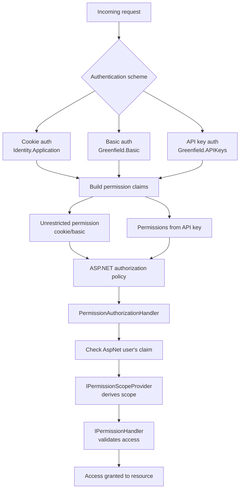

# Extending permissions

**Table of contents**

[[toc]]

## Adding new Policy definitions

A plugin can define custom policies by directly injecting `PolicyDefinition` into `ServiceCollection`.

```csharp
private void AddPolicies(IServiceCollection services)
{
    services.AddPolicyDefinitions(new[]
    {
        new PolicyDefinition(
            SubscriptionsPolicies.CanViewOfferings,
            new PermissionDisplay("View your offerings", "Allows viewing offerings on all your stores."),
            new PermissionDisplay("View your offerings", "Allows viewing offerings on the selected stores.")),
        new PolicyDefinition(
            SubscriptionsPolicies.CanModifyOfferings,
            new PermissionDisplay("Modify your offerings", "Allows modifying offerings on all your stores."),
            new PermissionDisplay("Modify your offerings", "Allows modifying offerings on the selected stores."),
            new[] { SubscriptionsPolicies.CanViewOfferings, SubscriptionsPolicies.CanManageSubscribers, SubscriptionsPolicies.CanCreditSubscribers },
            includedByPermissions: [Policies.CanModifyStoreSettings]),
        new PolicyDefinition(
            SubscriptionsPolicies.CanManageSubscribers,
            new PermissionDisplay("Manage your subscribers", "Allows managing subscribers on all your stores."),
            new PermissionDisplay("Manage your subscribers", "Allows managing subscribers on the selected stores.")),
        new PolicyDefinition(
            SubscriptionsPolicies.CanCreditSubscribers,
            new PermissionDisplay("Credit your subscribers", "Allows crediting subscribers on all your stores."),
            new PermissionDisplay("Credit your subscribers", "Allows crediting subscribers on the selected stores.")),
    });
}
```

### Policy names

1. Every policy name needs to start by `btcpay.`
2. Policies from plugins which have a store as a scope should start by `btcpay.plugin.store`
3. Policies from plugins which scope server settings (server admins only) should start by `btcpay.plugin.server`
4. Policies from plugins which scope the user should start by `btcpay.plugin.user`

User-scoped policies are typically unscoped permissions, unless you provide a custom scope provider and handler for per-user scoping.

If your policy isn't one of those types, you might need to implement your own scope provider and permission handler as explained below.

### Policy tree

It is possible for a policy to automatically include others.

In the example below, a policy `SubscriptionsPolicies.CanModifyOfferings` includes `SubscriptionsPolicies.CanViewOfferings`.

And, through to `includedByPermissions`, the permission `SubscriptionsPolicies.CanModifyOfferings` is included by `Policies.CanModifyStoreSettings`.

So if a user is granted `Policies.CanModifyStoreSettings`, then he will also be granted `SubscriptionsPolicies.CanModifyOfferings` and `SubscriptionsPolicies.CanViewOfferings`.

```csharp
new PolicyDefinition(
            SubscriptionsPolicies.CanModifyOfferings,
            new PermissionDisplay("Modify your offerings", "Allows modifying offerings on all your stores."),
            new PermissionDisplay("Modify your offerings", "Allows modifying offerings on the selected stores."),
            new[] { SubscriptionsPolicies.CanViewOfferings, SubscriptionsPolicies.CanManageSubscribers, SubscriptionsPolicies.CanCreditSubscribers },
            includedByPermissions: [Policies.CanModifyStoreSettings])
```

## BTCPay Server permissions

Permissions in BTCPay Server can be assigned to an API key generated by the user. A permission is composed of:

1. A `BTCPay policy` as defined by the injected `PolicyDefinition`
2. An optional `scope`

For example, `btcpay.store.cancreateinvoice:2wN4XCmJJGXcp5NtPUJN1jn4h4K6` has the BTCPay policy `btcpay.store.cancreateinvoice` and the scope `2wN4XCmJJGXcp5NtPUJN1jn4h4K6`.

- Without scope, `btcpay.store.cancreateinvoice` means the API key can create invoices in all of the user's stores.
- With scope, `btcpay.store.cancreateinvoice:2wN4XCmJJGXcp5NtPUJN1jn4h4K6` means the API key can create invoices only on store `2wN4XCmJJGXcp5NtPUJN1jn4h4K6`.

## AuthenticationHandlers

Authentication to BTCPay Server can happen in three different ways:

1. `Cookie authentication`, used for all UI routes (`Identity.Application`)
2. `Basic authentication`, used with API routes (`Greenfield.Basic`)
3. `ApiKey authentication`, uses API keys associated with a user to access API routes (`Greenfield.APIKeys`)

The two Greenfield schemes are referenced by `AuthenticationSchemes.Greenfield`, and the cookie scheme by `AuthenticationSchemes.Cookie`.

Following authentication, the handler affects permission claims on the user (`GreenfieldConstants.ClaimTypes.Permission`). The role of those claims is to limit the rights of the user making the call.

### APIKeysAuthenticationHandler

This authentication handler authenticates requests based on the `Authorization` header of the HTTP request. (`Authorization: token $API_KEY`)

Here is an example of using this authentication handler (`AuthenticationSchemes.Greenfield`).

```csharp
[Authorize(Policy = Policies.CanViewInvoices,
    AuthenticationSchemes = AuthenticationSchemes.Greenfield)]
[HttpGet("~/api/v1/stores/{storeId}/invoices")]
public async Task<IActionResult> GetInvoices(string storeId, [FromQuery] string[]? orderId = null, [FromQuery] string[]? status = null,
```

BTCPay Server attaches the permission claims associated with the API key to the user.

### BasicAuthenticationHandler

This authentication handler authenticates requests based on the `Authorization` header of the HTTP request. (`Authorization: basic base64(user@example.com:password)`)

This authentication method is rate limited, and is meant to only create an API Key for a new user. Normal operations should use API Keys.

As is the case for `APIKeysAuthenticationHandler`, routes using `AuthenticationSchemes.Greenfield` also support this method.

BTCPay Server injects the `Unrestricted` permission claim into the user. (This means that this handler doesn't limit the user's permissions.)

### CookieAuthenticationHandler

This authentication handler is part of the ASP.NET library and authenticates requests to UI routes using HTTP cookies.

Here is an example of a route using this authentication handler. (`AuthenticationSchemes.Cookie`)

```csharp
[HttpGet("/stores/{storeId}/invoices/{invoiceId}")]
[Authorize(Policy = Policies.CanViewInvoices, AuthenticationSchemes = AuthenticationSchemes.Cookie)]
public async Task<IActionResult> Invoice(string invoiceId)
```

BTCPay Server injects the `Unrestricted` permission claim into the user. (This means that this handler doesn't limit the user's permissions.)

## Authorization policies

Authorization policies define the requirements a user must satisfy to access a service.
For each registered `PolicyDefinition`, BTCPay Server creates two ASP.NET authorization policies (not to be confused with the BTCPay policies above):

- One where an unscoped permission is not required. (e.g. `btcpay.store.canviewstoresettings`)
- One where an unscoped permission is required. (e.g. `btcpay.store.canviewstoresettings:`, note the trailing `:`)

In the following example, `GetStores` can be called with an API key with scoped permission (e.g. `btcpay.store.canviewstoresettings:2wN4XCmJJGXcp5NtPUJN1jn4h4K6`).
The implementation of `GetStores` relies on `HttpContext.GetStoresData`, which is set automatically by the permission handler to all stores the API key has access to (in this case only `2wN4XCmJJGXcp5NtPUJN1jn4h4K6`).

If the API key has an unscoped permission, all stores will be listed.

```csharp
[Authorize(Policy = Policies.CanViewStoreSettings, AuthenticationSchemes = AuthenticationSchemes.Greenfield)]
[HttpGet("~/api/v1/stores")]
public async Task<ActionResult<IEnumerable<Client.Models.StoreData>>> GetStores()
{
    var storesData = HttpContext.GetStoresData();
    var stores = new List<Client.Models.StoreData>();
    foreach (var storeData in storesData)
    {
        stores.Add(await FromModel(storeData));
    }
    return Ok(stores);
}
```

However, in the following example, we use `CanModifyStoreSettingsUnscoped` (`btcpay.store.canmodifystoresettings:`) instead of `Policies.CanViewStoreSettings` (`btcpay.store.canviewstoresettings`).

```csharp
        [HttpPost("~/api/v1/stores")]
        [Authorize(Policy = Policies.CanModifyStoreSettingsUnscoped, AuthenticationSchemes = AuthenticationSchemes.Greenfield)]
        public async Task<IActionResult> CreateStore(CreateStoreRequest request)
```

In this case, the earlier API key with permission `btcpay.store.canmodifystoresettings:2wN4XCmJJGXcp5NtPUJN1jn4h4K6` is unable to create a new store, because the ASP.NET policy requires the permission to be unscoped.

In BTCPay Server, the component in charge of checking the authorization is the `PermissionAuthorizationHandler`.

### PermissionAuthorizationHandler

This class checks whether the current request satisfies the authorization policy for the route.

First, the authorization handler attempts to know which resource is actually accessed.
In BTCPay Server, we call this the `scope`, and plugins can customize how to fetch the scope from the request by implementing an `IPermissionScopeProvider`.

By default, BTCPay Server ships with `BuiltInPermissionScopeProvider` which can extract the scope of store policies from the route's data parameters. (See next section)

Once the scope (if any) has been defined, there are two levels of permission checks before authorizing a request:

1. Do the authenticated user's claims restrict the requested permission?
2. Can the user really access the request? (`IPermissionHandler`)

A plugin can customize whether the user really has access to the resource by implementing `IPermissionHandler`.
However, BTCPay Server already ships a built-in permission handler (`BuiltInPermissionHandler`) that checks server and store policies:

- For store policies, double-checks that the user's store role contains the requested permission.
- For server policies, double-checks that the user has the ASP.NET Server Admin role.



#### BuiltInPermissionScopeProvider

`BuiltInPermissionScopeProvider` is a built-in implementation of `IPermissionScopeProvider`, and it provides extension points to solve a store's scope from route values.

In the example below, if the user calls this API with `storeid=2wN4XCmJJGXcp5NtPUJN1jn4h4K6`, the scope is extracted to be `2wN4XCmJJGXcp5NtPUJN1jn4h4K6` and so `PermissionAuthorizationHandler` will check whether the permission `btcpay.store.canviewstoresettings:2wN4XCmJJGXcp5NtPUJN1jn4h4K6` can be satisfied.

```csharp
[Authorize(Policy = Policies.CanViewStoreSettings, AuthenticationSchemes = AuthenticationSchemes.Greenfield)]
[HttpGet("~/api/v1/stores/{storeId}")]
public async Task<IActionResult> GetStore(string storeId)
```

The scope has been defined from convention by the `BuiltInPermissionScopeProvider`, our default implementation of `IPermissionScopeProvider`.

`BuiltInPermissionScopeProvider` automatically derives scope from route data: `appId`, `invoiceId`, `payReqId`, and `storeId` for any store policies. (e.g. a policy starting by `btcpay.plugin.store` or `btcpay.store`)

Plugins can also provide their own `IPermissionScopeProvider` implementation with a completely different logic.

However, it can also just extend `BuiltInPermissionScopeProvider` to support other eligible route data. (see the section below about `BuiltInPermissionScopeProvider`)

For example, this example below will cause the store's scope to be fetched by any route with value `appId` by running the request `SELECT \"StoreDataId\" FROM \"Apps\" WHERE \"Id\" = @id`.

```csharp
services.AddSingleton(new BuiltInPermissionScopeProvider.RouteValueToStoreIdQuery("appId", "SELECT \"StoreDataId\" FROM \"Apps\" WHERE \"Id\" = @id"));
```

If the app's storeId is `ABC`, a route such as this one will properly evaluate `btcpay.store.canviewstoresettings:ABC`

```csharp
[HttpPost("~/api/v1/apps/{appId}")]
[Authorize(Policy = "btcpay.store.canviewstoresettings", AuthenticationSchemes = AuthenticationSchemes.Greenfield)]
public async Task<IActionResult> GetApp(string appId)
```

BTCPay Server itself is using this extension point to extract the scope (storeId) from `appId`, `payReqId` and `invoiceId`:

```csharp
foreach (var routeDataToStoreId in new BuiltInPermissionScopeProvider.RouteValueToStoreIdQuery[]
            {
                new("appId", "SELECT \"StoreDataId\" FROM \"Apps\" WHERE \"Id\" = @id"),
                new("payReqId", "SELECT \"StoreDataId\" FROM \"PaymentRequests\" WHERE \"Id\" = @id"),
                new("invoiceId", "SELECT \"StoreDataId\" FROM \"Invoices\" WHERE \"Id\" = @id"),
            })
    services.AddSingleton(routeDataToStoreId);
```

Note that `BuiltInPermissionScopeProvider` only applies to store policies. (eg. starting by `btcpay.store` or `btcpay.plugin.store`)

### Store policies helpers

After successful authorization, BTCPay Server will automatically set items in the `HttpContext` that route implementations can use.

- `HttpContext.GetStoreData()` (or `HttpContext.GetStoresData()` if no scope has been found on the route)
- `HttpContext.GetAppData()`
- `HttpContext.GetPaymentRequestData()`
- `HttpContext.GetInvoiceData()`
