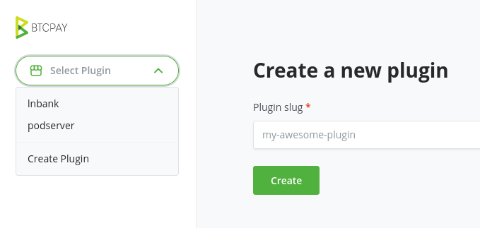
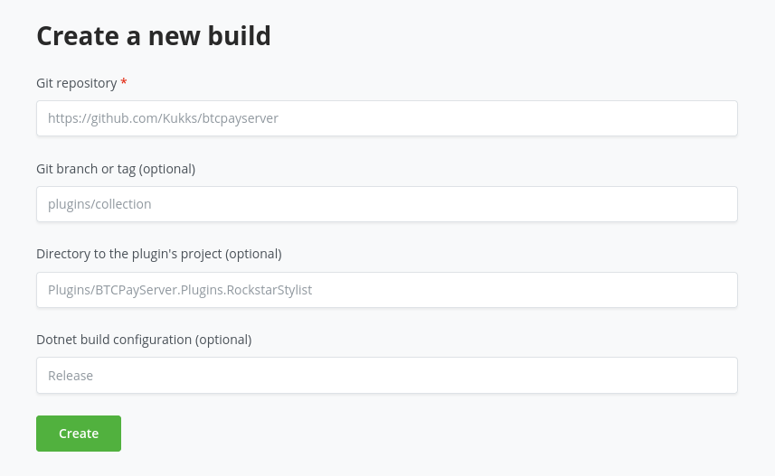

# Plugins

BTCPay Server Plugins are written in C#.
They extend the core functionality and run in the same context as the BTCPay Server code.
As a prerequisite for developing a plugin, you should be familiar with the [local development](./LocalDev.md) process.

[[toc]]

## Setup of a new plugin

You can get started by cloning the [plugin template](https://github.com/btcpayserver/btcpayserver-plugin-template) or taking a look at [existing plugins](#resources).
This tutorial uses the plugin template as an example — substitute the references with your own plugin or simply follow along with the template.

For building and [publishing the plugin](#publishing-the-plugin) you will need BTCPay Server as the context:
Clone the [main repository](https://github.com/btcpayserver/btcpayserver) to your personal GitHub account.
Afterwards you can set up your own plugin inside the [`Plugins` subdirectory](https://github.com/btcpayserver/btcpayserver/tree/master/Plugins/).

### Optional: Consider using submodules

Even though it is possible to have your plugin simply as part of your BTCPay Server fork, you might want to set it up as a [Git submodule](https://git-scm.com/book/en/v2/Git-Tools-Submodules).
This has the following benefits:

- Changes in the main app and your plugin are easier to separate
- Update the main app by simply rebasing your plugins branch with the main master
- Track issues and releases on GitHub per plugin repo if you have more than one plugin

You can add the submodule using this command:

```bash
git submodule add https://github.com/btcpayserver/btcpayserver-plugin-template Plugins/BTCPayServer.Plugins.Template
```

### Plugin reference

Next up, you need to reference your plugin inside the main app, so that it gets included when running BTCPay Server.
You need to [include it in the solution](https://learn.microsoft.com/en-us/dotnet/core/tools/dotnet-sln#add) and [add the project reference](https://learn.microsoft.com/en-us/dotnet/core/tools/dotnet-add-reference):

```bash
# Add your plugin to the solution
dotnet sln add Plugins/BTCPayServer.Plugins.Template -s Plugins

# Add your plugin to the main project
dotnet add BTCPayServer reference Plugins/BTCPayServer.Plugins.Template
```

Your plugin may also reference certain packages from the main app ­— e.g. the plugin template requires the `BTCPayServer.Abstractions` project as a dependency:

```bash
dotnet add Plugins/BTCPayServer.Plugins.Template reference ./BTCPayServer.Abstractions
```

Once that is set up, you should be able to build and run the app.

## Coding a plugin

More information on the following topics will be provided soon.
For now, these are the basics you should know about …

### Assets

In order to reference assets (CSS, JavaScript and images), the plugin project needs to [embed a `Resources` folder](https://github.com/btcpayserver/btcpayserver-plugin-template/blob/master/BTCPayServer.Plugins.Template.csproj#L9) like this:

```xml
<ItemGroup>
  <FrameworkReference Include="Microsoft.AspNetCore.App" />
  <EmbeddedResource Include="Resources\**" />
</ItemGroup>
```

Then you can reference the assets in your views like this:

```html

<script src="/Resources/js/my.js" asp-append-version="true"></script>
<link href="/Resources/css/my.css" asp-append-version="true" rel="stylesheet" />
```

### Database

The main BTCPay Server database tables are part of the public schema.
Plugins have their own database context and schema, named after the plugin:

```csharp
public class PluginDbContextFactory : BaseDbContextFactory<PluginDbContext>
{
    public PluginDbContextFactory(IOptions<DatabaseOptions> options) :
        base(options, "BTCPayServer.Plugins.Template") {}
}
```

Plugins can have their own data models and migrations:

```bash
# Add a new migration once you defined a new model or updates
dotnet ef migrations add MoreData -p BTCPayServer.Plugins.Template -c PluginDbContext -o Data/Migrations

# Update the database
dotnet ef database update -p BTCPayServer.Plugins.Template -c PluginDbContext
```

When inspecting the database (with `psql`), only the tables of the public schema are shown by default.
If you want to also see and select the plugin tables, you need to extend the search path:

```sql
# list plugin schemas
SELECT * FROM pg_catalog.pg_namespace WHERE nspname LIKE 'BTCPayServer.%';

# extend search path
SET search_path TO "BTCPayServer.Plugins.Template", public;

# table list now also shows the template plugin tables
\dt
```

### UI Extension Points

The extension points offer you ways to add your plugin views and partials to the UI.
They get defined in the plugin base class.
The following snippet shows how you can add a link to your plugin to the main navigation:

```csharp
public class Plugin : BaseBTCPayServerPlugin
{
    public override string Identifier { get; } = "BTCPayServer.Plugins.Template";
    public override string Name { get; } = "Plugin Template";
    public override string Description { get; } = "This is the plugin description";

    public override void Execute(IServiceCollection services)
    {
        services.AddSingleton<IUIExtension>(new UIExtension("TemplatePluginHeaderNav", "header-nav"));
    }
}
```

In this case, `header-nav` is the name of the extension point.
You can find the available extension points by searching for the `vc:ui-extension-point` references inside the main app.
For the `header-nav` the reference looks like this:

```csharp
<vc:ui-extension-point location="header-nav" model="@Model" />
```

The views and partials (i.e. `TemplatePluginHeaderNav.cshtml`) need to be located in the `Shared` folder of your `Views` or `Pages` directory, so that the main app can find and include them.

:::tip Missing extension points
If you would like to extend the UI but an extension point is not available yet, feel free to open an issue with a request to add it.
We extend them as we move along, same with [actions and filters](#actions-and-filters) …
:::

### Actions and Filters

In addtion to the extention points which hook into the UI, you can also use the following hooks to modify and extend behaviour:

- [Action](https://github.com/btcpayserver/btcpayserver/blob/master/BTCPayServer.Abstractions/Contracts/IPluginHookAction.cs): Extend the core functionality
- [Filters](https://github.com/btcpayserver/btcpayserver/blob/master/BTCPayServer.Abstractions/Contracts/IPluginHookFilter.cs): Do something and also return data

As with the UI extention points, you can define them within the `Execute` method of the plugin base class:

```csharp
public class Plugin : BaseBTCPayServerPlugin
{
    public override void Execute(IServiceCollection services)
    {
        services.AddSingleton<IPluginHookAction, MyPluginAction>();
        services.AddSingleton<IPluginHookFilter, MyPluginFilter>();
    }
}
```

Find the available hooks by searching for `ApplyAction` and `ApplyFilter` calls inside the main app.

### Authorization and Permissions

You can reuse the `AuthenticationSchemes` and `Policies` of the main app:

```csharp
// Authorize users via their cookie login
[Authorize(AuthenticationSchemes = AuthenticationSchemes.Cookie, Policy = Policies.CanViewProfile)]
public class UIPluginController : Controller
{
    // GET might inherit CanViewProfile
    [HttpGet("")]
    public async Task<IActionResult> Index()
    {
        return View();
    }

    // POST might require CanModifyProfile
    [HttpPost("update")]
    [Authorize(AuthenticationSchemes = AuthenticationSchemes.Cookie, Policy = Policies.CanModifyProfile)]
    public async Task<IActionResult> Modify()
    {
        return RedirectToAction(nameof(Index))
    }
}
```

To show certain parts of the UI depending on the permissions the user has, you can use the `permissions` view tag helper:

```html
<li class="nav-item" permission="@Policies.CanModifyProfile">
```

#### Customing authorization

You can also define your own `AuthenticationSchemes` and `Policies` within the `Execute` method of the plugin base class:

```csharp
public class Plugin : BaseBTCPayServerPlugin
{
    public override void Execute(IServiceCollection services)
    {
        // Add custom authentication scheme
        var builder = new AuthenticationBuilder(services);
        builder.AddScheme<PluginAuthenticationOptions, PluginAuthenticationHandler>(
            PluginAuthenticationSchemes.AccessKey, _ => { });

        // Add custom policies
        services.AddAuthorization(opts =>
        {
            foreach (var policy in PluginPolicies.AllPolicies)
            {
                opts.AddPolicy(policy, policyBuilder => policyBuilder
                    .AddRequirements(new PolicyRequirement(policy)));
            }
        });
    }
}
```

The custom policies might look like this:

```csharp
public class PluginPolicies
{
    public const string CanViewWallet = "btcpay.plugin.template.canviewwallet";
    public const string CanManageWallet = "btcpay.plugin.template.canmanagewallet";

    public static IEnumerable<string> AllPolicies
    {
        get
        {
            yield return CanViewWallet;
            yield return CanManageWallet;
        }
    }
}
```

### API

In case your plugin has an API and you want to add its OpenAPI documentation, add a class inheriting from our `ISwaggerProvider`:

```csharp
public class PluginSwaggerProvider : ISwaggerProvider
{
    private readonly IFileProvider _fileProvider;

    public PluginSwaggerProvider(IWebHostEnvironment webHostEnvironment)
    {
        _fileProvider = webHostEnvironment.WebRootFileProvider;
    }

    public async Task<JObject> Fetch()
    {
        JObject json = new();
        var fi = _fileProvider.GetFileInfo("Resources/swagger/v1/swagger.template.plugin.json");
        await using var stream = fi.CreateReadStream();
        using var reader = new StreamReader(fi.CreateReadStream());
        json.Merge(JObject.Parse(await reader.ReadToEndAsync()));
        return json;
    }
}
```

As you can see it references the Swagger files in `Resources/swagger/v1` — you can add them just like other [assets](#asset).
Once that is done, your plugin API documentation should appear on the instance `/docs` path alongside the [Greenfield API documentation](https://docs.btcpayserver.org/API/Greenfield/v1/).

## Publishing the plugin

The plugins are published via the [plugin builder](https://plugin-builder.btcpayserver.org/).
You can sign up, build and submit new versions of your plugin using this web UI.



Once you have a new version ready, you can create a new build.
To do so, you will need to reference the Git repository of your BTCPay Server fork, as well as the branch and path of your plugin.



::: tip
The plugin builder supports Git submodules, but for the builder the plugin needs the context of the whole app (BTCPay Server and your plugin code) — hence you should reference your BTCPay Server fork and not the individual plugin repository.
:::

The result will be a packaged version of your plugin in "prerelease" state.
Once you mark it as release, it will become available on the BTCPay Server "Manage Plugins" page for everyone to install.

## Resources

For more information check out these repositories with existing plugins:

- [kukks' plugins](https://github.com/Kukks/btcpayserver/tree/plugins/collection/Plugins)
- [LNbank](https://github.com/dennisreimann/btcpayserver-plugin-lnbank)
- [PodServer](https://github.com/dennisreimann/btcpayserver-plugin-podserver)
