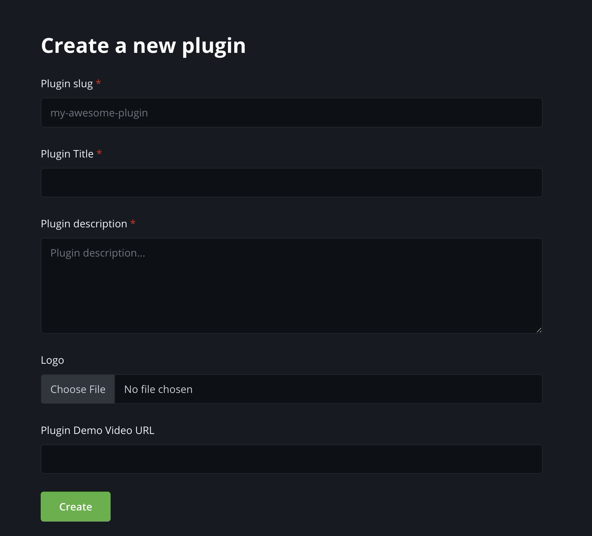
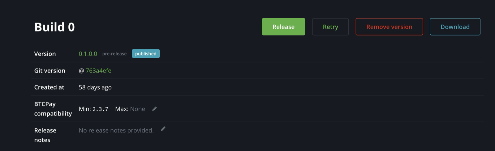
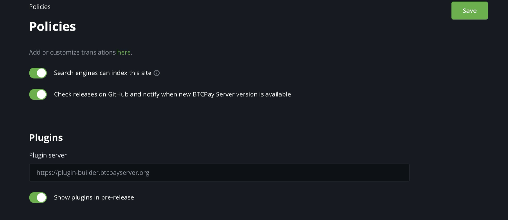
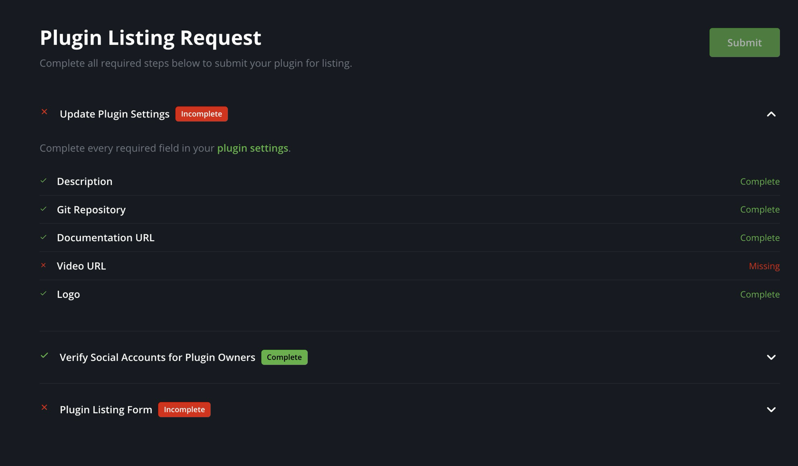

# Plugins

BTCPay Server Plugins are written in C#.
They extend the core functionality and run in the same context as the BTCPay Server code.
As a prerequisite for developing a plugin, you should be familiar with the [local development](./LocalDev.md) process.

[[toc]]

## Setup of a new plugin

Create a folder for the BTCPay Server projects. It will contain at least:

- Your plugin repository
- Your fork of the BTCPay Server repository

You can get started by cloning the [plugin template](https://github.com/btcpayserver/btcpayserver-plugin-template) or taking a look at [existing plugins](#resources).

## Debugging

If you used the [plugin template](https://github.com/btcpayserver/btcpayserver-plugin-template), please [follow those instructions](https://github.com/btcpayserver/btcpayserver-plugin-template/tree/master#debugging-the-plugin).

If you didn't use the plugin template, you will have to manually instruct BTCPay Server to run your plugin whenever you run the app in development mode. To do so, add the file `BTCPayServer/appsettings.dev.json`. It is ignored in the repository and references the local, built version of your plugin for debugging:

```bash
{
  "DEBUG_PLUGINS": "/absolute/path/btcpayserver-plugin-template/src/BTCPayServer.Plugins.Template/bin/Debug/net10.0/BTCPayServer.Plugins.Template.dll"
}
```

You need to reference the built DLL file with the absolute path of the build version of your plugin on your local file system.
If you want to reference multiple plugins, separate them using a semicolon.
Build your plugin before starting BTCPay Server, and rebuild it whenever you want BTCPay Server to load your latest changes.

:::tip Building the whole solution
You might want to setup a pre-build step in the solution, so that your plugins gets rebuild whenever you run the app.
Do so by editing the run/debug configuration and choose the build the whole solution, instead of just the BTCPay Server project.
:::

Then you can follow the [local development](./LocalDev.md) instructions to start BTCPay Server.

## Coding a plugin

More information on the following topics will be provided soon.
For now, these are the basics you should know about …

### Assets

In order to reference assets (CSS, JavaScript and images), the plugin project needs to [embed a `Resources` folder](https://github.com/btcpayserver/btcpayserver-plugin-template/blob/master/BTCPayServer.Plugins.Template/BTCPayServer.Plugins.Template.csproj#L32) like this:

```xml
<ItemGroup>
  <ProjectReference Include="..\btcpayserver\BTCPayServer\BTCPayServer.csproj" />
  <EmbeddedResource Include="Resources\**" />
</ItemGroup>
```

Then you can reference the assets in your views like this:

```html

<script src="~/Resources/js/my.js" asp-append-version="true"></script>
<link href="~/Resources/css/my.css" asp-append-version="true" rel="stylesheet" />
```

A good example of this is the [Bitcoin Whitepaper plugin](https://github.com/Kukks/BTCPayServerPlugins/tree/master/Plugins/BTCPayServer.Plugins.BitcoinWhitepaper) which exposes the bitcoin whitepaper PDF on your BTCPay Server using embedded resources.

### Database

The main BTCPay Server database tables are part of the public schema.
Plugins have their own database context and schema, named after the plugin:

```csharp
public class MyPluginDbContextFactory : BaseDbContextFactory<MyPluginDbContext>
{
    public MyPluginDbContextFactory(IOptions<DatabaseOptions> options) :
        base(options, "BTCPayServer.Plugins.Template") {}
}
```

Plugins can have their own data models and migrations:

```bash
# Add a new migration once you defined a new model or updates
dotnet ef migrations add MoreData -p BTCPayServer.Plugins.Template -c PluginDbContext -o Data/Migrations

# Update the database
dotnet ef database update -p BTCPayServer.Plugins.Template -c PluginDbContext
```

When inspecting the database (with `psql`), only the tables of the public schema are shown by default.
If you want to also see and select the plugin tables, you need to extend the search path:

```sql
# list plugin schemas
SELECT * FROM pg_catalog.pg_namespace WHERE nspname LIKE 'BTCPayServer.%';

# extend search path
SET search_path TO "BTCPayServer.Plugins.Template", public;

# table list now also shows the template plugin tables
\dt
```

### UI Extension Points

The extension points offer you ways to add your plugin views and partials to the UI.
They get defined in the plugin base class.
The following snippet shows how you can add a link to your plugin to the main navigation:

```csharp
public class Plugin : BaseBTCPayServerPlugin
{
    public override void Execute(IServiceCollection services)
    {
        services.AddSingleton<IUIExtension>(new UIExtension("TemplatePluginHeaderNav", "header-nav"));
    }
}
```

In this case, `header-nav` is the name of the extension point.
You can find the available extension points by searching for the `vc:ui-extension-point` references inside the main app.
For the `header-nav` the reference looks like this:

```csharp
<vc:ui-extension-point location="header-nav" model="@Model" />
```

The views and partials (i.e. `TemplatePluginHeaderNav.cshtml`) need to be located in the `Shared` folder of your `Views` or `Pages` directory, so that the main app can find and include them.

:::tip Missing extension points
If you would like to extend the UI but an extension point is not available yet, feel free to open an issue with a request to add it.
We extend them as we move along, same with [actions and filters](#actions-and-filters) …
:::

### Actions and Filters

In addition to the extension points which hook into the UI, you can also use the following hooks to modify and extend behaviour:

- [Action](https://github.com/btcpayserver/btcpayserver/blob/master/BTCPayServer.Abstractions/Contracts/IPluginHookAction.cs): Extend the core functionality
- [Filters](https://github.com/btcpayserver/btcpayserver/blob/master/BTCPayServer.Abstractions/Contracts/IPluginHookFilter.cs): Do something and also return data

As with the UI extension points, you can define them within the `Execute` method of the plugin base class:

```csharp
public class Plugin : BaseBTCPayServerPlugin
{
    public override void Execute(IServiceCollection services)
    {
        services.AddSingleton<IPluginHookAction, MyPluginAction>();
        services.AddSingleton<IPluginHookFilter, MyPluginFilter>();
    }
}
```

Find the available hooks by searching for `ApplyAction` and `ApplyFilter` calls inside the main app.

### Authorization and Permissions

You can reuse the `AuthenticationSchemes` and `Policies` of the main app:

```csharp
// Authorize users via their cookie login
[Authorize(AuthenticationSchemes = AuthenticationSchemes.Cookie, Policy = Policies.CanViewProfile)]
public class UIPluginController : Controller
{
    // GET might inherit CanViewProfile
    [HttpGet("")]
    public async Task<IActionResult> Index()
    {
        return View();
    }

    // POST might require CanModifyProfile
    [HttpPost("update")]
    [Authorize(AuthenticationSchemes = AuthenticationSchemes.Cookie, Policy = Policies.CanModifyProfile)]
    public async Task<IActionResult> Modify()
    {
        return RedirectToAction(nameof(Index))
    }
}
```

To show certain parts of the UI depending on the permissions the user has, you can use the `permissions` view tag helper:

```html
<li class="nav-item" permission="@Policies.CanModifyProfile"></li>
```

For developing plugin-specific permissions, please read [this page](./Plugins-Permissions.md).

### API

In case your plugin has an API and you want to add its OpenAPI documentation, add a class inheriting from our `ISwaggerProvider`:

```csharp
public class PluginSwaggerProvider : ISwaggerProvider
{
    private readonly IFileProvider _fileProvider;

    public PluginSwaggerProvider(IWebHostEnvironment webHostEnvironment)
    {
        _fileProvider = webHostEnvironment.WebRootFileProvider;
    }

    public async Task<JObject> Fetch()
    {
        JObject json = new();
        var fi = _fileProvider.GetFileInfo("Resources/swagger/v1/swagger.template.plugin.json");
        await using var stream = fi.CreateReadStream();
        using var reader = new StreamReader(fi.CreateReadStream());
        json.Merge(JObject.Parse(await reader.ReadToEndAsync()));
        return json;
    }
}
```

As you can see it references the Swagger files in `Resources/swagger/v1` — you can add them just like other [assets](#asset).
Once that is done, your plugin API documentation should appear on the instance `/docs` path alongside the [Greenfield API documentation](https://docs.btcpayserver.org/API/Greenfield/v1/).

## Publishing the plugin

Use the [BTCPay Server Plugin Builder](https://plugin-builder.btcpayserver.org/) to build and publish your plugin.
You can browse approved projects in the [public plugin directory](https://plugin-builder.btcpayserver.org/public/plugins).

### Before you start

Create an account or sign in to the Plugin Builder, then verify your email address and GitHub account before creating a plugin or starting a build.

Your plugin must be hosted in a public GitHub or GitLab repository that the Builder can clone over HTTPS without credentials.
Run your tests before submitting a build: the Builder publishes and packages the plugin, but it does not run your test suite or install the plugin.

### Create the plugin and its first build

1. Select **Create Plugin** and enter a slug, title and description. A logo and demo video are optional at this stage, but required before requesting a public listing.

   

2. Select **Create Build** and enter the HTTPS URL of the Git repository.
3. Optionally specify:
   - A branch or tag. When omitted, the repository's default branch is used.
   - The directory containing the plugin project. When omitted, the repository root is used. The selected directory must contain exactly one `.csproj` file.
   - A .NET build configuration. When omitted, `Release` is used.
4. Submit the build and follow its status and output on the build page.

The Builder clones Git submodules recursively, runs `dotnet publish`, validates the plugin manifest and packages the result.
A successful build is initially published as a pre-release.



### Test a pre-release

Use a non-production BTCPay Server instance that is compatible with the plugin.
Go to **Server Settings > Policies**, enable **Show plugins in pre-release**, and save.



Then open **Plugin Directory** and search for the plugin by its exact name if it is still unlisted.
Install it, restart BTCPay Server when prompted, and test installation, startup, configuration, upgrades and the plugin's main workflows.
After installation, use **Installed Plugins** to manage it.

While a version is a pre-release, you can correct the source and rebuild the same version.
A successful Builder result only confirms that the plugin could be published and packaged; it does not confirm that the plugin works correctly.

### Release and listing

Version state and project visibility are separate concepts:

| Label           | Applies to     | Meaning                                                                      |
| --------------- | -------------- | ---------------------------------------------------------------------------- |
| **Pre-release** | Plugin version | Available to users who enable pre-releases. The same version can be rebuilt. |
| **Released**    | Plugin version | A stable package. It cannot be replaced by another build while released.     |
| **Listed**      | Plugin project | Approved for normal discovery in the public plugin directory.                |

Select **Release** only after testing the pre-release.
For corrections and future versions, update `<Version>` in the plugin's `.csproj`, create another build, test it and then release it.

:::warning Release is not listing
Releasing a version does not add the plugin to the main public directory.
New projects remain **Unlisted** until a listing request is reviewed and approved.
An unlisted plugin still has a public page and can be found by users who search for its exact name.
:::

### Request a public listing

Once the plugin has a version, select **Request Listing** from its navigation.



The **Release Note** in the listing form is required, limited to 200 characters and used as the plugin's social announcement pitch.

Before submitting the request:

- Complete the plugin settings with a clear description, logo, Git repository, documentation URL and demo video.
- Make sure every plugin owner has verified their email, GitHub and Nostr accounts.
- Post a verification message in the [official BTCPay Server Telegram group](https://t.me/btcpayserver) and provide the message URL.
- Provide at least one publicly posted review from a reputable Bitcoiner who tested the plugin.
- Optionally provide a preferred announcement date and time.

The request is reviewed manually.
If it is rejected, address the reason shown in **Listing History** and submit it again.
Once approved, the listing applies to the project, so future versions only need to go through the build, test and release cycle.

Listing approval is not a code or security audit, and does not constitute an endorsement by the BTCPay Server team.

### Troubleshooting and automation

If a build fails, inspect its output and confirm that:

- The repository and its submodules can be cloned without private credentials.
- The branch or tag exists.
- The selected directory contains exactly one `.csproj` file.
- The project builds and its tests pass locally with the selected configuration.
- The plugin identifier belongs to this Plugin Builder project.
- The `<Version>` is not already released.

To automate later builds and releases, see the interactive [Plugin Builder API documentation](https://plugin-builder.btcpayserver.org/docs).

## Important notice about plugins

Plugins are developed by third parties. They need to be updated and maintained regularly, in addition to the BTCPay Server.

**Use at Your Own Risk**: Plugins in this store are developed by independent third parties. These plugins have not undergone review by the BTCPay Server team.

**Disclaimer of Responsibility**: BTCPay Server contributors or Foundation are not liable for any harm, loss, or damage resulting from the installation or use of the plugins. Users assume full responsibility for their installation, use, familiarity with licensing and terms of service and maintenance.

**No Official Endorsement**: Inclusion in the list of BTCPay Server plugins does not constitute an endorsement or guarantee of quality, safety, or compatibility.

**Due Diligence Advised**: We recommend users exercise caution and conduct their own research or consult the community before installing any plugin.

**Feedback and Reporting**: Should you experience issues with a plugin, please provide feedback or report concerns directly to the respective plugin developers.

## Resources

### Plugin directory

Get inspirations and find plugins in the [BTCPay Plugin directory](https://plugin-builder.btcpayserver.org/).

### Rockstardev's BTCPay Plugin vibe code instructions

[](https://www.youtube.com/watch?v=dW9eSgA_dUg)

### Example repositories

For inspirations on how to create plugins, check out the following repositories:

- [kukks's BTCPay Server plugins](https://github.com/Kukks/BTCPayServerPlugins)
- [rockstardev's BTCPay Server plugins](https://github.com/rockstardev/BTCPayServerPlugins.RockstarDev)
- [Boltz BTCPay Server plugin](https://github.com/BoltzExchange/boltz-btcpay-plugin)
