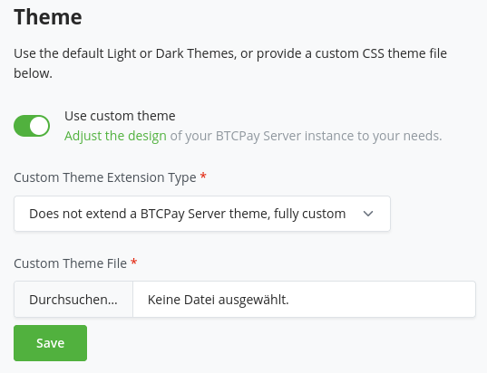
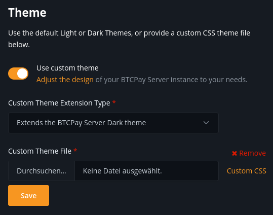

# Customizing themes

BTCPay Server is built on Bootstrap and offers the flexibility to adjust its look to your needs.
Learn more about the [standard design specifications used in BTCPay](https://design.btcpayserver.org/).

## Developing and extending a custom theme

The BTCPay Server user interface is built on a **customized version of Bootstrap** that supports [CSS custom properties](https://developer.mozilla.org/en-US/docs/Web/CSS/--*).
This allows us to change theme related settings like fonts and colors without affecting the [`bootstrap.css`](#notes-on-bootstrap-css).
Also we can provide just the relevant customized parts instead of shipping a whole `bootstrap.css` file for each theme.

Take a look at the [predefined themes](https://github.com/btcpayserver/btcpayserver/blob/master/BTCPayServer/wwwroot/main/themes/) to get an overview of this approach.

### Modifying existing themes

The custom property definitions in the `:root` selector are divided into several sections, that can be seen as a cascade:

- The first section contains general definitions (i.e. for custom brand and neutral colors).
- The second section defines variables for specific purposes.
  Here you can map the general definitions or create additional ones.
- The third section contains definitions for specific parts of the page, sections or components.
  Here you should try to reuse definitions from above as much as possible to provide a consistent look and feel.

The variables defined in a theme file get used in the [`site.css`](https://github.com/btcpayserver/btcpayserver/blob/master/BTCPayServer/wwwroot/main/site.css) file.

#### Overriding Bootstrap selectors

In addition to the variables you can also provide styles by directly **adding CSS selectors** to this file.
This can be seen as a last resort in case there is no variable for something you want to change or some minor tweaking.

#### Adding theme variables

In general it is a good idea to introduce **specific variables** for special purposes (like setting the link colors of a specific section).
This allows us to address individual portions of the styles without affecting other parts which might be tight to a general variable.

For cases in which you want to introduce new variables that are used across all themes, add them to the `site.css` file.
This file contains our modifications of the Bootstrap styles.
Refrain from modifying `bootstrap.css` directly – see the [additional notes](#notes-on-bootstrap-css) for the reasoning behind this.

#### Adding a new theme

You should copy one of our predefined themes and change the variables to fit your needs.

To test and play around with the adjustments, you can also use the developer tools of the browser:
Inspect the `<html>` element and modify the variables in the `:root` section of the styles inspector.

In most cases it should suffice to adapt the primary colors like this:

```css
:root {
  --btcpay-primary-100: #fef3e6;
  --btcpay-primary-200: #fcdcb5;
  --btcpay-primary-300: #fbc584;
  --btcpay-primary-400: #f9ae53;
  --btcpay-primary-500: #f79621;
  --btcpay-primary-600: #de7d08;
  --btcpay-primary-700: #ac6106;
  --btcpay-primary-800: #7b4504;
  --btcpay-primary-900: #4a2a03;

  --btcpay-primary-rgb: 247,150,33;
  --btcpay-primary-accent-rgb: 222, 125, 8;
  --btcpay-primary: rgb(var(--btcpay-primary-rgb));
  --btcpay-primary-accent: rgb(var(--btcpay-primary-accent-rgb));
  --btcpay-primary-shadow: rgba(var(--btcpay-primary-rgb), .5);
}
```

Once you are done adapting, save the CSS as a file and upload it on the `Server Settings > Branding` page:



The theme will be applied on upload.
With the example above, the section looks like this after applying the custom theme:


