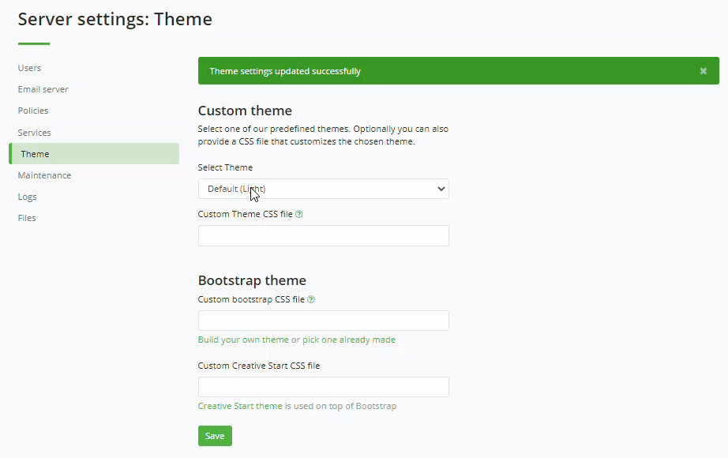
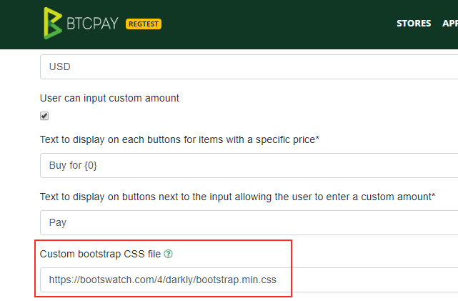
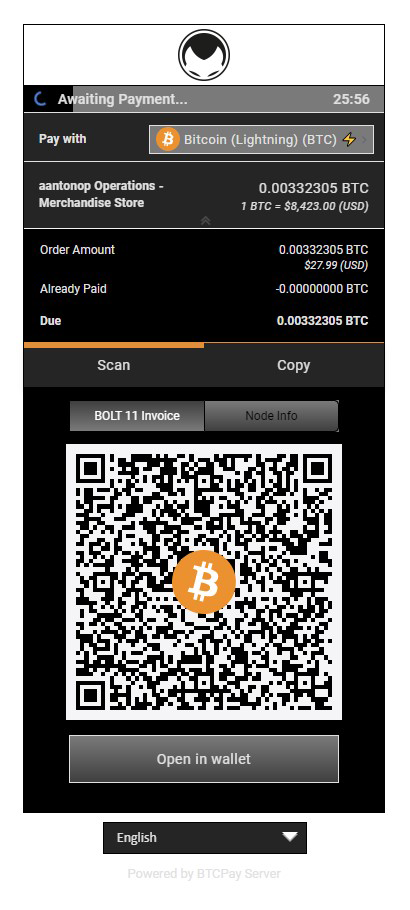
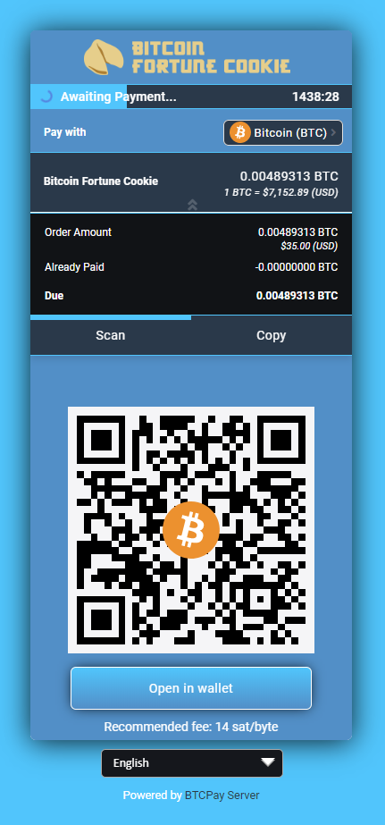
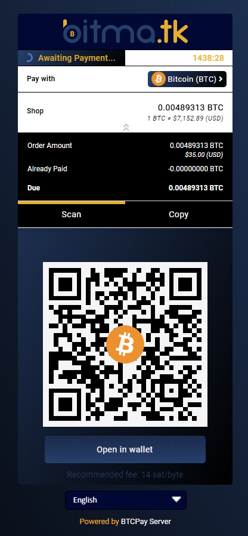
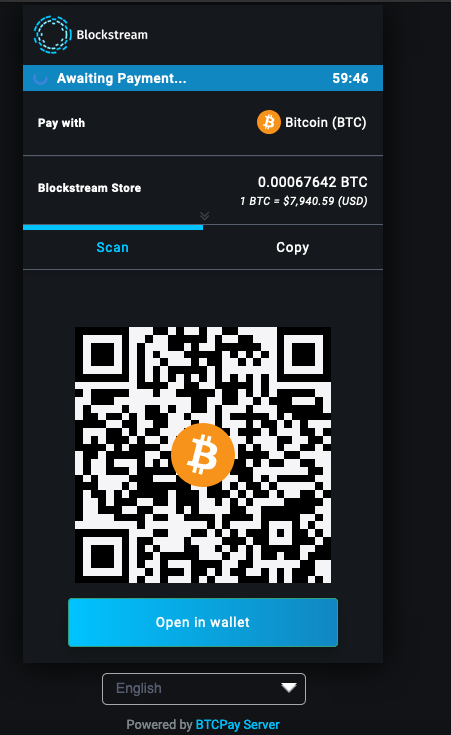
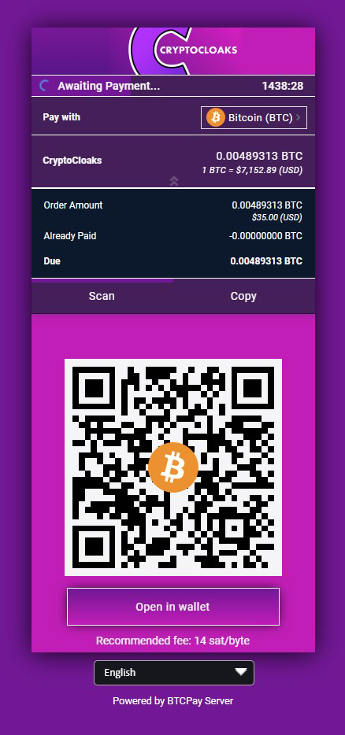
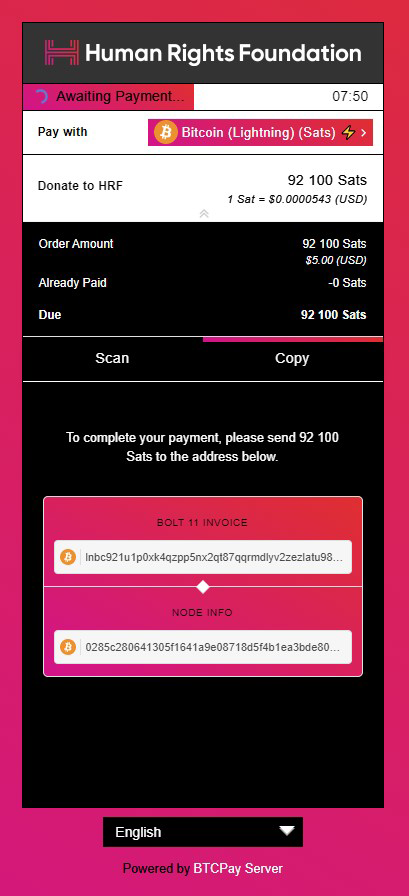

# Customizing themes

BTCPay Server is built on Bootstrap and offers the flexibility to adjust its look to your needs.
Learn more about the [standard design specifications used in BTCPay](https://design.btcpayserver.org/).

## Built-in themes

**BTCPay Server currently has several built-in themes** available for server admins.
Selecting a theme in Server Settings will modify the **appearance** of the entire server (for all users) without having to make any code changes or additional customizations.



There are two other approaches to customizing the theme of your BTCPay Server.

1. [Developing a custom theme](#1-custom-themes) (requires technical skills)
2. [Using a pre-made Bootstrap theme](#2-bootstrap-themes) (does not require technical skills)

## 1. Custom themes

This is the way we are building our own themes, like the [Classic](https://design.btcpayserver.org/styles/btcpayserver-theme-classic.css) or [Casa](https://design.btcpayserver.org/styles/btcpayserver-theme-casa.css) theme.

With this approach you provide a **CSS file containing the variable definitions** ([CSS custom properties](https://developer.mozilla.org/en-US/docs/Web/CSS/--*)) to adjust colors, fonts, etc.

You should copy one of our [predefined themes](https://github.com/btcpayserver/btcpayserver/blob/master/BTCPayServer/wwwroot/main/themes/) and change the variables to fit your needs.
To test and play around with the adjustments, you can also use the developer tools of the browser:
Inspect the `<html>` element and modify the variables in the `:root` section of the styles inspector:


Once you are done with your modifications, you can upload and reference it in the "Custom theme CSS file" field.


### Developing and extending a custom theme

The BTCPay Server user interface is built on a **customized version of Bootstrap** that supports [CSS custom properties](https://developer.mozilla.org/en-US/docs/Web/CSS/--*).
This allows us to change theme related settings like fonts and colors without affecting the [`bootstrap.css`](#notes-on-bootstrap-css).
Also we can provide just the relevant customized parts instead of shipping a whole `bootstrap.css` file for each theme.

Take a look at the [predefined themes](https://github.com/btcpayserver/btcpayserver/blob/master/BTCPayServer/wwwroot/main/themes/) to get an overview of this approach.

#### Modifying existing themes

The custom property definitions in the `:root` selector are divided into several sections, that can be seen as a cascade:

- The first section contains general definitions (i.e. for custom brand and neutral colors).
- The second section defines variables for specific purposes.
  Here you can map the general definitions or create additional ones.
- The third section contains definitions for specific parts of the page, sections or components.
  Here you should try to reuse definitions from above as much as possible to provide a consistent look and feel.

The variables defined in a theme file get used in the [`site.css`](https://github.com/btcpayserver/btcpayserver/blob/master/BTCPayServer/wwwroot/main/site.css) file.

##### Overriding Bootstrap selectors

In addition to the variables you can also provide styles by directly **adding CSS selectors** to this file.
This can be seen as a last resort in case there is no variable for something you want to change or some minor tweaking.

##### Adding theme variables

In general it is a good idea to introduce **specific variables** for special purposes (like setting the link colors of a specific section).
This allows us to address individual portions of the styles without affecting other parts which might be tight to a general variable.

For cases in which you want to introduce new variables that are used across all themes, add them to the `site.css` file.
This file contains our modifications of the Bootstrap styles.
Refrain from modifying `bootstrap.css` directly – see the [additional notes](#notes-on-bootstrap-css) for the reasoning behind this.

#### Adding a new theme

You should copy one of our predefined themes and change the variables to fit your needs.

To test and play around with the adjustments, you can also use the developer tools of the browser:
Inspect the `<html>` element and modify the variables in the `:root` section of the styles inspector.

#### Notes on bootstrap.css

The `bootstrap.css` file itself is generated based on what the original vendor `bootstrap.css` provides.

Right now [Bootstrap](https://getbootstrap.com/docs/4.3/getting-started/theming/) does not use custom properties, but in the future it is likely that they might switch to this approach as well.
Until then we created a build script [in this repo](https://github.com/dennisreimann/btcpayserver-ui-prototype) which generates the `bootstrap.css` file we are using here.

The general approach should be to not modify the `bootstrap.css`, so that we can keep it easily updatable.
The initial modifications of this file were made in order to allow for this themeing approach.
Because bootstrap has colors spread all over the place we'd otherwise have to override mostly everything, that's why these general modifications are in the main `bootstrap.css` file.

The Bootstrap theme options are another approach of providing customizations, let's look at this next.

## 2. Bootstrap themes

[Bootswatch](https://bootswatch.com/) offers lots of custom theme maintained by the Bootstrap community.


Please note that this approach works best when used with the Classic theme described above.

If you want to change this theme, find a theme on [Bootswatch](https://bootswatch.com/) which interest you, for example, [Darkly](https://bootswatch.com/darkly/).

Copy the link of the theme:


Now, go into the settings of your store and paste the link to customize the bootstrap theme:



And enjoy a new theme!


## Checkout page themes

BTCPay Server checkout page can be customized to fit your branding.

Go to your Store Settings > Checkout Experience, and link to a custom CSS stylesheet.

Server admins can upload their .css file to [File Storage](/FAQ/ServerSettings.md#how-to-upload-files-to-btcpay) to create a CSS stylesheet link.

Below are examples of businesses that use custom-made checkout themes.

### [Andreas M. Antonopolous](https://aantonop.com/)

\
_**Made by:** [@artdesignbySF](https://twitter.com/artdesignbySF) / <artdesignbySF@protonmail.com>_
<details>
  <summary>Click to view CSS</summary>

CSS file:
```css
/*  ===========================CREDITS=========================== */
/*  Custom BTCpay Server CSS template made by @artdesignbySF.   */
/*  PLEASE CONSIDER DONATING BITCOIN IF YOU FIND          */
/*  THIS FILE USEFULL: 3LBQbv72rdSrLmFF66p9gMPDuPMcKL7UL1     */
/*  Follow @artdesignbySF on Twitter                */
/*  Contact via: artdesignbySF@protonmail.com           */
/*  =========================END CREDITS========================= */

/*  =========================DISCLAIMER========================== */
/*  Might not be the most efficient or correct way of implementing  */
/*  CSS. I am not responsable for breaking your website if things */
/*  go wrong. PEACE / LOVE / BITCOIN                */
/*  =======================END DISCLAIMER======================== */

/*======BACKGROUND COLOR======*/
html {
    background-color: #fff !important;  /*===BACKGROUND COLOR===*/
}

.modal.page {
    background-color: #fff;   /*===BACKGROUND COLOR===*/
}
/*=============================*/

/*=======OUTLINE SETTINGS=======*/
.modal-content{
  box-shadow: none; /*===OUTSIDE SHADOW===*/
  outline: 1px solid #000000; /*===OUTLINE===*/
  border-radius: 0px;   /*===ROUNDED CORNERS===*/
}
/*=============================*/

/*=======HEADER SETTINGS=======*/
.top-header {
    background-image: linear-gradient(to right, #fff, #fff);  /*===HEADER BACKGROUND GRADIENT, CAN BE CHANGED TO SINGLE COLOR. UPLOAD (TRANSPARANT) PNG WITH HEADER LOGO WITH FOLLOWING DIMENTSIONS 720X120PX ===*/
  color: #e1e1e1;
  border-radius:0px;  /*===ROUNDED CORNER SETTINGS===*/
}

.top-header .timer-row__progress-bar {
  border-top: 1px solid #000000;
    background: #000000;    /*===PROGRESS BAR COLOR===*/
}

.top-header .timer-row {
    border-top: 1px solid #000000;  /*===COLORED LINE ABOVE PROGRESS BAR===*/
  border-bottom: 1px solid #e1e1e1; /*===COLORED LINE ABOVE PROGRESS BAR===*/
  background-image: linear-gradient(to right, #7a7a7a, #7a7a7a);  /*===PROGRESS BAR BACKGROUND COLOR===*/
}

.header__icon__img {
  display: block;
  width:360px;  /*===HEADER DIMENSIONS===*/
  height:60px;  /*===HEADER DIMENSIONS===*/
  margin-left:-10px;  /*===HEADER POSITION CORRECTION===*/
  margin-top:-10px;   /*===HEADER POSITION CORRECTION===*/
}
/*============================*/

/*=====PAY WITH / AMOUNTS=====*/
.line-items {
    background-color: #000000;  /*===BACKGROUND COLOR===*/
    color: #e1e1e1 !important;    /*===TEXT COLOR===*/
  padding-top: 15px;
    padding-bottom: 10px;
}

.buyerTotalLine {
    border-top: 1px solid #e1e1e1;
    background-color: #252525;
    color: #e1e1e1;
  padding-top: 15px;
    padding-bottom: 12px;
}
/*==========================*/

/*=======PAYMENT TABS=======*/
.payment-tabs__slider {
  background: #ec912f;  /*===SLIDER COLOR===*/
}

.payment-tabs {
    background-color: #252525;  /*===BACKGROUND COLOR===*/
    border-top: 1px solid #ec912f;  /*===COLORED LINE ABOVE PAYMENT TABS===*/
}
/*===========================*/

/*===OPEN IN WALLET BUTTON===*/
.action-button {
    color: #e1e1e1 !important;
    background-image: linear-gradient(to top, #3f3f3f, #7a7a7a);    /*===BUTTON BACKGROUND COLOR GRADIENT===*/
  border-color:#e1e1e1;   /*===BUTTON BORDER COLOR===*/
  box-shadow: 0px 0px 0px -3px #000000;   /*===DROP SHADOW SETTINGS===*/
  border-radius: 0px;   /*===ROUNDED CORNER SETTINGS===*/
}

.action-button:hover {
    background-image: linear-gradient(to bottom, #3f3f3f, #000000); /*===HOVER BUTTON BACKGROUND COLOR GRADIENT===*/
  border-color:#e1e1e1; /*===BUTTON BORDER COLOR===*/
}
/*============================*/

/*===BOLT/NODE INFO BUTTONS===*/
.btnGroupLnd {
    box-shadow: 0px 0px 0px 0px #000000;  /*===DROP SHADOW SETTINGS===*/
  background-image: linear-gradient(to top, #7a7a7a, #7a7a7a);  /*===BUTTON BACKGROUND COLOR GRADIENT===*/
  background-color:#000000; /*===BUTTON BACKGROUND COLOR (IF NO GRADIENT IS WANTED DELETE LINE ABOVE THIS)===*/
  border-color:#000000; /*===BUTTON BORDER COLOR===*/
  border-radius: 0px; /*===ROUNDED CORNER SETTINGS===*/
}

.btnGroupLnd button {
  background-image:  linear-gradient(to top, #3f3f3f, #7a7a7a); /*===BUTTON BACKGROUND COLOR GRADIENT===*/
  background-color:#000000; /*===BUTTON BACKGROUND COLOR (IF NO GRADIENT IS WANTED DELETE LINE ABOVE THIS)===*/
  border-color: #000000; /*===BUTTON BORDER COLOR===*/
  border-radius: 0px; /*===ROUNDED CORNER SETTINGS===*/
}

.btnGroupLnd button.active {
  background-image:  linear-gradient(to bottom, #3f3f3f, #7a7a7a);  /*===ACTIVE BUTTON BACKGROUND COLOR GRADIENT===*/
  background-color:#000000; /*===BUTTON BACKGROUND COLOR (IF NO GRADIENT IS WANTED DELETE LINE ABOVE THIS)===*/
  border-color: #000000;    /*===BUTTON BORDER COLOR===*/
  border-radius: 0px;   /*===ROUNDED CORNER SETTINGS===*/
}
/*===========================*/

/*=====CURRENCY DROPDOWN=====*/
.payment__currencies {
  border-radius:0px;  /*===ROUNDED CORNER SETTINGS===*/
}

.currency-selection {
    background-color: #252525;  /*===BACKGROUND COLOR===*/
    border-bottom: 0px solid #e1e1e1;
    color: #e1e1e1; /*===TEXT COLOR===*/
    padding-top: 15px;
    padding-bottom: 10px;
    height: auto;
}

.vex.vex-theme-btcpay .vex-content  {
  padding: 1px;
  border-radius:0px; /*===ROUNDED CORNER SETTINGS===*/
  box-shadow: 0px 0px 0px 0px #000000; /*===DROP SHADOW SETTINGS===*/
}

.vexmenu  {
  background-color:#252525; /*===BACKGROUND COLOR===*/
}

.vexmenuitem:hover {
  background: #7a7a7a;  /*===MENU BACKGROUND COLOR===*/
}

.vexmenuitem > a span {
  color: #e1e1e1; /*===MENU BACKGROUND COLOR===*/
}

.payment__currencies {
  background: #7a7a7a; /*===MENU HOVER HIGHLIGHT COLOR===*/
}

.payment__currencies:hover {
  background: #252525; /*===MENU HOVER HIGHLIGHT COLOR===*/
  border-color: #e1e1e1;
}
/*===========================*/

/*===QR AND QR BACKGROUND===*/
.invoice {
    background-color: #000000;  /*===MENU BACKGROUND COLOR===*/
  border-radius: 0px; /*===ROUNDED CORNER SETTINGS===*/
}

.payment-box {
  height:425px; /*===SIZE IMPORTANT BECAUSE HEIGHT LIGHTNING QR CODE + OUTLINE===*/
}

.payment__scan {
  width:276px;
  height:276px;
  margin-left:auto;
  margin-right:auto;
  margin-bottom:5px;
  margin-top:0px;
  border: 10px solid #f5f5f7; /*===QR CODE BORDER SIZE/COLOR (LEAVE AS IS FOR QUICK SCANNING)===*/
}

.recommended-fee {
  margin-top:10px;
  padding-top:3px;
  height:25px;
  background: #000000;
  color:#e1e1e1;
}

.expired__body {
    color: #000000;
}
/*==========================*/

/*======COLOR OF LINKS======*/
a {
  color: #e1e1e1 !important;  /*===LINK COLOR===*/
}
/*==========================*/

/*==="COLOR OF SOME TEXTS===*/
span {
  color:#e1e1e1; /*===TEXT COLOR===*/
}
/*=========================*/

/*=====LANGUAGE SELECT=====*/
#prettydropdown-DefaultLang ul {
  color: #e1e1e1 !important; /* ===TEXT COLOR=== */
  background-color: #252525 !important;   /*===BACKGROUND COLOR===*/
  border-color: #000000;
  border-radius: 0px;
}

.checked: {
  color:#000000;
}
/*===========================*/

/*====INSTRUCTIONAL TEXTS====*/
.manual__step-one__header {
    color: #e1e1e1; /*===TEXT COLOR===*/
  opacity: 1;
}
.content-faded, .manual__step-one__instructions, .manual__step-two__instructions {
    color: #e1e1e1; /*===TEXT COLOR===*/
  opacity: 1;
}
/*===========================*/

/*====COPY INFO BOX/TEXTS====*/
.copyBox {
  background-color:#252525;
  border-color:#252525;
}

.copyAmountText {
  color: #e1e1e1; /*===TEXT COLOR===*/
}

.copySectionBox label {
  color: #e1e1e1; /*===TEXT COLOR===*/
  opacity: 1;
}

.separatorGem {
  background:#ec912f; /*===GEM ICON COLOR===*/
}
/*===========================*/

/*====PAYMENT SUCCES PAGE====*/
/*
.success-block {
  background-image: linear-gradient(to top, #252525, #f5f5f7); /*===GRADIENT BACKGROUND===*//*
  height:275px;
}
*/
.success-message {
  color: #e1e1e1; /*  ===TEXT COLOR=== */
}
/*===========================*/

/*  ===========================CREDITS=========================== */
/*  Custom BTCpay Server CSS template made by @artdesignbySF.   */
/*  PLEASE CONSIDER DONATING BITCOIN IF YOU FIND          */
/*  THIS FILE USEFULL: 3LBQbv72rdSrLmFF66p9gMPDuPMcKL7UL1     */
/*  Follow @artdesignbySF on Twitter                */
/*  Contact via: artdesignbySF@protonmail.com           */
/*  =========================END CREDITS========================= */

/*  =========================DISCLAIMER========================== */
/*  Might not be the most efficient or correct way of implementing  */
/*  CSS. I am not responsable for breaking your website if things */
/*  go wrong. PEACE / LOVE / BITCOIN                */
/*  =======================END DISCLAIMER======================== */
````
</details>

---

### Bitcoin Fortune Cookie

\
_**Made by:** [@artdesignbySF](https://twitter.com/artdesignbySF) / <artdesignbySF@protonmail.com>_
<details>
  <summary>Click to view CSS</summary>

CSS file:
```css
/*  ===========================CREDITS=========================== */
/*  Custom BTCpay Server CSS template made by @artdesignbySF.   */
/*  PLEASE CONSIDER DONATING BITCOIN IF YOU FIND          */
/*  THIS FILE USEFULL: 3LBQbv72rdSrLmFF66p9gMPDuPMcKL7UL1     */
/*  Follow @artdesignbySF on Twitter                */
/*  Contact via: artdesignbySF@protonmail.com           */
/*  =========================END CREDITS========================= */

/*  =========================DISCLAIMER========================== */
/*  Might not be the most efficient or correct way of implementing  */
/*  CSS. I am not responsable for breaking your website if things */
/*  go wrong. PEACE / LOVE / BITCOIN                */
/*  =======================END DISCLAIMER======================== */

/*======BACKGROUND COLOR======*/
html {
    background-color: #00c3ff !important;   /*===BACKGROUND COLOR===*/
}

.modal.page {
    background-color: #00c3ff;  /*===BACKGROUND COLOR===*/
}
/*=============================*/

/*=======HEADER SETTINGS=======*/
.top-header {
    background-color: #408cca;  /*===HEADER BACKGROUND COLOR===*/
  border-radius:6px;  /*===ROUNDED CORNER SETTINGS===*/
}

.top-header .timer-row__progress-bar {
  border-top: 1px solid #00c3ff;
    border-bottom: 1px solid #00c3ff;
    background: #00c3ff;    /*===PROGRESS BAR COLOR===*/
}

.top-header .timer-row {
    border-top: 1px solid #00c3ff;  /*===COLORED LINE ABOVE PROGRESS BAR===*/
  border-bottom: 1px solid #00c3ff; /*===COLORED LINE ABOVE PROGRESS BAR===*/
    background: #27384b;  /*===PROGRESS BAR BACKGROUND COLOR===*/
}

.header__icon__img {
  display: block;
  width:;   /*===HEADER DIMENSIONS===*/
  height:;  /*===HEADER DIMENSIONS===*/
  margin-left: 50%;   /*===HEADER POSITION CORRECTION===*/
  margin-top: auto;   /*===HEADER POSITION CORRECTION===*/
}
/*============================*/

/*=====PAY WITH / AMOUNTS=====*/
.line-items {
    background-color: #111316;  /*===BACKGROUND COLOR===*/
    color: #fff !important;   /*===TEXT COLOR===*/
  padding-top: 15px;
    padding-bottom: 10px;
    border-top: 1px solid #00c3ff !important;
  border-bottom: 0px solid #00c3ff;
}

.buyerTotalLine {
    border-top: 1px solid #00c3ff;
    background-color: #27384b;
    color: #fff;
  padding-top: 15px;
    padding-bottom: 12px;
}
/*==========================*/

/*=======PAYMENT TABS=======*/
.payment-tabs__slider {
  background: #00c3ff;  /*===SLIDER COLOR===*/
}

.payment-tabs {
    background-color: #27384b;  /*===BACKGROUND COLOR===*/
  color: #fff;
    border-top: 1px solid #00c3ff;  /*===COLORED LINE ABOVE PAYMENT TABS===*/
  border-bottom: 1px solid #00c3ff; /*===COLORED LINE BELOW PAYMENT TABS===*/
}
/*===========================*/

/*===OPEN IN WALLET BUTTON===*/
.action-button {
    color: #fff !important;
    background-image: linear-gradient(to bottom, #00c3ff, #408cca);   /*===BUTTON BACKGROUND COLOR GRADIENT===*/
  border-color:#fff;  /*===BUTTON BORDER COLOR===*/
  box-shadow: 0px 0px 15px -3px #000000;  /*===DROP SHADOW SETTINGS===*/
  border-radius: 6px;   /*===ROUNDED CORNER SETTINGS===*/
}

.action-button:hover {
    background-image: linear-gradient(to top, #00c3ff, #408cca);  /*===HOVER BUTTON BACKGROUND COLOR GRADIENT===*/
  border-color:#fff; /*===BUTTON BORDER COLOR===*/
}
/*============================*/

/*===BOLT/NODE INFO BUTTONS===*/
.btnGroupLnd {
    box-shadow: 0px 0px 15px -3px #000000;  /*===DROP SHADOW SETTINGS===*/
  background-image: linear-gradient(to right, #00c3ff, #408cca);  /*===BUTTON BACKGROUND COLOR GRADIENT===*/
  background-color:#00c3ff; /*===BUTTON BACKGROUND COLOR (IF NO GRADIENT IS WANTED DELETE LINE ABOVE THIS)===*/
  border-color:#fff;  /*===BUTTON BORDER COLOR===*/
  border-radius: 6px; /*===ROUNDED CORNER SETTINGS===*/
}

.btnGroupLnd button {
  background-image: linear-gradient(to right, #00c3ff, #408cca); /*===BUTTON BACKGROUND COLOR GRADIENT===*/
  background-color:#00c3ff; /*===BUTTON BACKGROUND COLOR (IF NO GRADIENT IS WANTED DELETE LINE ABOVE THIS)===*/
  border-color: #fff; /*===BUTTON BORDER COLOR===*/
}

.btnGroupLnd button.active {
  background-image: linear-gradient(to right, #00c3ff, #408cca);  /*===ACTIVE BUTTON BACKGROUND COLOR GRADIENT===*/
  background-color:#00c3ff; /*===BUTTON BACKGROUND COLOR (IF NO GRADIENT IS WANTED DELETE LINE ABOVE THIS)===*/
  border-color: #fff;   /*===BUTTON BORDER COLOR===*/
}
/*===========================*/

/*=====CURRENCY DROPDOWN=====*/
.payment__currencies {
  border-radius:6px;  /*===ROUNDED CORNER SETTINGS===*/
  background-color: #27384b; /*===BACKGROUND COLOR DROPDOWN MENU===*/
}

.payment__currencies:hover {
  background: #00c3ff; /*===MENU HOVER HIGHLIGHT COLOR===*/
}

.currency-selection {
    background-color: #408cca;  /*===BACKGROUND COLOR===*/
    border-bottom: 0px solid #00c3ff;
    color: #fff;  /*===TEXT COLOR===*/
    padding-top: 15px;
    padding-bottom: 10px;
    height: auto;
}

.vex.vex-theme-btcpay .vex-content  {
  padding: 1px;
  border-radius:0px; /*===ROUNDED CORNER SETTINGS===*/
  box-shadow: 0px 0px 15px -3px #000000; /*===DROP SHADOW SETTINGS===*/
}

.vexmenu  {
  background-color:#00c3ff; /*===BACKGROUND COLOR===*/
}

.vexmenuitem:hover {
  background: #fff; /*===MENU BACKGROUND COLOR===*/
}
/*===========================*/

/*===QR AND QR BACKGROUND===*/
.invoice {
    background-color: #408cca;  /*===MENU BACKGROUND COLOR===*/
  border-radius: 6px; /*===ROUNDED CORNER SETTINGS===*/
}

.payment-box {
  height:420px; /*===SIZE IMPORTANT BECAUSE HEIGHT LIGHTNING QR CODE + OUTLINE===*/
}

.payment__scan {
  width:276px;
  height:276px;
  margin-left:auto;
  margin-right:auto;
  margin-bottom:5px;
  margin-top:0px;
  border: 10px solid #f5f5f7; /*===QR CODE BORDER SIZE/COLOR (LEAVE AS IS FOR QUICK SCANNING)===*/
}

.recommended-fee {
  margin-top:15px;
}

.expired__body {
    color: #fff;
}
/*==========================*/

/*======COLOR OF LINKS======*/
a {
  color: #27384b !important;  /*===LINK COLOR===*/
}
/*==========================*/

/*==="COLOR OF SOME TEXTS===*/
span {
  color:#fff; /*===TEXT COLOR===*/
}
/*=========================*/

/*=====LANGUAGE SELECT=====*/
#prettydropdown-DefaultLang ul {
  color: #FFF !important; /*  ===TEXT COLOR=== */
  background-color: #15171c !important;   /*===BACKGROUND COLOR===*/
}
/*===========================*/

/*====INSTRUCTIONAL TEXTS====*/
.manual__step-one__header {
    color: #fff;  /*===TEXT COLOR===*/
  opacity: 1;
}
.content-faded, .manual__step-one__instructions, .manual__step-two__instructions {
    color: #fff;  /*===TEXT COLOR===*/
  opacity: 1;
}
/*===========================*/

/*====COPY INFO BOX/TEXTS====*/
.copyBox {
  background-color:#27384b;
  border-color:#00c3ff;
}

.copyAmountText {
  color: #fff;  /*===TEXT COLOR===*/
}

.copySectionBox label {
  color: #fff;  /*===TEXT COLOR===*/
  opacity: 1;
}

.separatorGem {
  background:#408cca; /*===GEM ICON COLOR===*/
}
/*===========================*/

/*====PAYMENT SUCCES PAGE====*/
/*
.success-block {
  background-image: linear-gradient(to bottom, #fbff0000, #fff700f2); /*===GRADIENT BACKGROUND===*//*
}
*/
.success-message {
  color: #fff; /* ===TEXT COLOR=== */
}
/*===========================*/

/*  ===========================CREDITS=========================== */
/*  Custom BTCpay Server CSS template made by @artdesignbySF.   */
/*  PLEASE CONSIDER DONATING BITCOIN IF YOU FIND          */
/*  THIS FILE USEFULL: 3LBQbv72rdSrLmFF66p9gMPDuPMcKL7UL1     */
/*  Follow @artdesignbySF on Twitter                */
/*  Contact via: artdesignbySF@protonmail.com           */
/*  =========================END CREDITS========================= */

/*  =========================DISCLAIMER========================== */
/*  Might not be the most efficient or correct way of implementing  */
/*  CSS. I am not responsable for breaking your website if things */
/*  go wrong. PEACE / LOVE / BITCOIN                */
/*  =======================END DISCLAIMER======================== */
````
</details>

---

### [Bitma.tk](https://bitma.tk/)

\
_**Made by:** [@artdesignbySF](https://twitter.com/artdesignbySF) / <artdesignbySF@protonmail.com>_

<details>
  <summary>Click to view CSS</summary>

CSS file:
```css
/*  ===========================CREDITS=========================== */
/*  Custom BTCpay Server CSS template made by @artdesignbySF.   */
/*  PLEASE CONSIDER DONATING BITCOIN IF YOU FIND          */
/*  THIS FILE USEFULL: 3LBQbv72rdSrLmFF66p9gMPDuPMcKL7UL1     */
/*  Follow @artdesignbySF on Twitter                */
/*  Contact via: artdesignbySF@protonmail.com           */
/*  =========================END CREDITS========================= */

/*  =========================DISCLAIMER========================== */
/*  Might not be the most efficient or correct way of implementing  */
/*  CSS. I am not responsable for breaking your website if things */
/*  go wrong. PEACE / LOVE / BITCOIN                */
/*  =======================END DISCLAIMER======================== */

/*======BACKGROUND COLOR======*/
html {
    background-color: #000000;
}

.modal.page {
  background-image: linear-gradient(60deg, #000000, #203D6D);
}
/*=============================*/

/*=======OUTLINE SETTINGS=======*/
.modal-content.long{
  border-radius: 5px; /*===ROUNDED CORNERS===*/
  box-shadow: 0px 0px 0px 0px #000000;  /*===OUTSIDE SHADOW===*/
  outline:0px solid #000000;
  background-color:#000000;
}
/*=============================*/

/*=======HEADER SETTINGS=======*/
.top-header {
    background-color: #000535;  /*===HEADER BACKGROUND GRADIENT, CAN BE CHANGED TO SINGLE COLOR. UPLOAD (TRANSPARANT) PNG WITH HEADER LOGO WITH FOLLOWING DIMENTSIONS 720X120PX ===*/
  border-radius: 5px; /*===ROUNDED CORNER SETTINGS===*/
}

.top-header .timer-row__progress-bar {
    background:  linear-gradient(120deg, #203D6D, #000000);   /*===PROGRESS BAR COLOR===*/
  height:26px;
}

.top-header .timer-row {
    border-top: 1px solid #000000;  /*===COLORED LINE ABOVE PROGRESS BAR===*/
  border-bottom: 1px solid #000000; /*===COLORED LINE ABOVE PROGRESS BAR===*/
  background-color: #fff; /*===PROGRESS BAR BACKGROUND COLOR===*/
}

.header__icon__img {
  display: block;
  width:360px;  /*===HEADER DIMENSIONS===*/
  height:60px;  /*===HEADER DIMENSIONS===*/
  margin-left:-10px;  /*===HEADER POSITION CORRECTION===*/
  margin-top:-10px;   /*===HEADER POSITION CORRECTION===*/
  background-color: #fff;
  border-radius: 5px 5px 0px 0px;
}
/*============================*/

/*=====PAY WITH / AMOUNTS=====*/
.line-items {
  background-color: #000000;  /*===BACKGROUND COLOR===*/
    color: #000000 !important;    /*===TEXT COLOR===*/
  padding-top: 15px;
    padding-bottom: 10px;
  border-top: 1px solid #000000;
}

.buyerTotalLine {
    border-top: 1px solid #000000;
  background-color: #fff;
    color: #000000;
  padding-top: 12px;
    padding-bottom: 12px;
}
/*==========================*/

/*=======PAYMENT TABS=======*/
.payment-tabs__slider {
  background-image: linear-gradient(120deg, #EEB21C, #EEB21C);  /*===SLIDER COLOR===*/
  height: 5px;
}

.payment-tabs {
    background: #000000; /*===BACKGROUND COLOR===*/
    border-bottom: 1px solid #fff;  /*===COLORED LINE ABOVE PAYMENT TABS===*/
}

.payment-tabs__tab:hover {
  background-image: linear-gradient(45deg, #16294C, #203D6D); /*===TAB BACKGROUND ON HOVER===*/
}

.payment-tabs__tab:hover > span {
  color:#EEB21C; /*===TEXT BACKGROUND ON HOVER===*/
}
/*===========================*/

/*===OPEN IN WALLET BUTTON===*/
.action-button {
  background-image: linear-gradient(#16294C, #203D6D);    /*===BUTTON BACKGROUND COLOR GRADIENT===*/
  box-shadow: 0px 0px 0px 0px #000000;  /*===DROP SHADOW SETTINGS===*/
  border-radius: 5px;   /*===ROUNDED CORNER SETTINGS===*/
  border: 0px;
}

.action-button:hover {
  background-image: linear-gradient(#203D6D, #16294C);    /*===HOVER BUTTON BACKGROUND COLOR GRADIENT===*/
/*  border-color:#000000; /*===BUTTON BORDER COLOR===*/
  color: #000000;
}

.action-button:hover > span {
  color:#EEB21C;
  }
/*============================*/

/*===BOLT/NODE INFO BUTTONS===*/
.btnGroupLnd {
    box-shadow: 0px 0px 0px 0px #000000;  /*===DROP SHADOW SETTINGS===*/
  background-image: linear-gradient(#203D6D, #16294C);  /*===BUTTON BACKGROUND COLOR GRADIENT===*/
  background-color:#000000; /*===BUTTON BACKGROUND COLOR (IF NO GRADIENT IS WANTED DELETE LINE ABOVE THIS)===*/
  border-color:#eeeeee; /*===BUTTON BORDER COLOR===*/
  border-radius: 0px 0px 0px 0px;/*===ROUNDED CORNER SETTINGS===*/
}

.btnGroupLnd button {
background-image: linear-gradient(#16294C, #203D6D); /*===BUTTON BACKGROUND COLOR GRADIENT===*/
  background-color:#000000; /*===BUTTON BACKGROUND COLOR (IF NO GRADIENT IS WANTED DELETE LINE ABOVE THIS)===*/
  border-color: #eeeeee; /*===BUTTON BORDER COLOR===*/
  border-radius: 0px 0px 0px 0px; /*===ROUNDED CORNER SETTINGS===*/
}

.btnGroupLnd button.active {
background-image: linear-gradient(#16294C, #203D6D);  /*===ACTIVE BUTTON BACKGROUND COLOR GRADIENT===*/
  background-color:#000000; /*===BUTTON BACKGROUND COLOR (IF NO GRADIENT IS WANTED DELETE LINE ABOVE THIS)===*/
  border-color: #eeeeee;    /*===BUTTON BORDER COLOR===*/
  border-radius: 0px 0px 0px 0px; /*===ROUNDED CORNER SETTINGS===*/
}
/*===========================*/

/*=====CURRENCY DROPDOWN=====*/
.payment__currencies {
  border-radius: 5px; /*===ROUNDED CORNER SETTINGS===*/
}

.payment__currencies_noborder {
  margin-left:auto;
  margin-right:15;
  white-space: nowrap;
  color:#fff;
  background-image: linear-gradient(120deg, #203D6D, #000000);
  border-radius: 5px;
  padding-right:15px;
}

.payment__currencies_noborder:hover {
  color:#000000;
  background-image: linear-gradient(120deg, #203D6D, #000000);
}

.currency-selection { /*===NOT THE DROP DOWN MENU===*/
    background: #fff; /*===BACKGROUND COLOR===*/
    border: 0px solid #000000;
    color: #000000; /*===TEXT COLOR===*/
    padding-top: 10px;
    padding-bottom: 10px;
    height: auto;
}

.vex.vex-theme-btcpay .vex-content  {
  background:#000000;
  padding: 0px;
  border-radius: 5px; /*===ROUNDED CORNER SETTINGS===*/
  outline: 1px solid #fff;
  box-shadow: 0px 0px 10px 0px #000000; /*===DROP SHADOW SETTINGS===*/
}

.vexmenuitem  {
  background-color: linear-gradient(120deg, #000000, #203D6D);
}

.vex-content:hover {
  border: 0px;
}

.vexmenuitem:hover {
  color: #fff;  /*===MENU TEXT COLOR===*/
  background-image: linear-gradient(120deg, #000000, #203D6D);  /*===MENU BACKGROUND COLOR===*/
}

.vexmenuitem > a span {
  color: #fff;  /*===MENU TEXT COLOR===*/
  text-shadow: 0px 0px 0px #000000;
}

.vexmenuitem:hover > a span {
  color: #000000; /*===MENU TEXT COLOR===*/
  text-shadow: 0px 0px 0px #000000;
}

.payment__currencies {
  background-image: linear-gradient(120deg, #203D6D, #000000);
  border:0px;
}

.payment__currencies:hover {
  background-image: linear-gradient(120deg, #000000, #203D6D);   /*===MENU HOVER HIGHLIGHT COLOR===*/
  border:0px;
}

.payment__currencies:hover > span {
  color: #EEB21C; /*===TEXT HOVER HIGHLIGHT COLOR===*/
  border:0px;
}
/*===========================*/

/*===QR AND QR BACKGROUND===*/
.content{
  border-radius: 5px; /*===ROUNDED CORNER SETTINGS===*/
  background-color: #000000;
  }

.invoice {
  background-image: linear-gradient(120deg, #203D6D, #000000);  /*===MENU BACKGROUND COLOR===*/
  border-radius: 5px; /*===ROUNDED CORNER SETTINGS===*/
}

.payment-box {
  height:425px; /*===SIZE IMPORTANT BECAUSE HEIGHT LIGHTNING QR CODE + OUTLINE===*/
  outline:10px;
}

.payment__scan {
  width:276px;
  height:276px;
  margin-left:auto;
  margin-right:auto;
  margin-bottom:5px;
  margin-top:0px;
  border: 10px solid #f5f5f7; /*===QR CODE BORDER SIZE/COLOR (LEAVE AS IS FOR QUICK SCANNING)===*/
}

.recommended-fee {
  margin-top:10px;
  padding-top:3px;
  height:25px;
}

.expired__body {
    color: #000000;
}
/*==========================*/

/*======COLOR OF LINKS======*/
a {
  color: #fff !important;   /*===LINK COLOR===*/
  text-shadow: 0px 0px 0px #000000;
}
a:hover {
  color: #EEB21C !important;  /*===LINK COLOR===*/
  text-shadow: 0px 0px 0px #000000;
}
/*==========================*/

/*==="COLOR OF SOME TEXTS===*/
span {
  color:#fff; /*===TEXT COLOR===*/
  text-shadow: 0px 0px 0px #000000;
}

.payment__currencies_noborder > span {
  color:#fff;
}

.payment__currencies > span {
  color: #fff; /*===MENU HOVER HIGHLIGHT COLOR===*/
}

.timer-row__time-left {
  color: #EEB21C;
}

.timer-row__message > span {
  color: #EEB21C;
}

.single-item-order__right__btc-price  > span {
  color:#000000;
}

.single-item-order__right__ex-rate  > span {
  color:#000000;
}

.line-items__item__value {
  color:#fff;
}

.line-items__item__label {
  color:#fff;
}

.line-items__item__label > span {
  color:#fff;
}

.recommended-fee > span {
  color:#203D6D;
}

.copyAmountText.copy-cursor._copySpan {
  color:#fff;
}

.form-text.small.text-muted > span {
  color:#EEB21C;
}
/*=========================*/

/*=====LANGUAGE SELECT=====*/
#prettydropdown-DefaultLang ul {
  color: #fff; /* ===TEXT COLOR=== */
  border-color: #000000;
  background-color: #000535;  /*===BACKGROUND COLOR===*/
  outline: 1px;
  border-radius: 5px;
  box-shadow: 0px 0px 0px 0px #000000;  /*===OUTSIDE SHADOW===*/
}

.checked: {
  color:#000000;
}
/*===========================*/

/*====INSTRUCTIONAL TEXTS====*/
.manual__step-one__header {
    color: #fff;  /*===TEXT COLOR===*/
  opacity: 1;
}
.content-faded, .manual__step-one__instructions, .manual__step-two__instructions {
    color: #fff;  /*===TEXT COLOR===*/
  opacity: 1;
}
/*===========================*/

/*====COPY INFO BOX/TEXTS====*/
.copyBox {
  background-image: linear-gradient(30deg, #000000, #203D6D);
}

.copyAmountText {
  color: #000000; /*===TEXT COLOR===*/
}

.copySectionBox label {
  color: #EEB21C; /*===TEXT COLOR===*/
  opacity: 1;
}

.separatorGem {
  background:#fff;  /*===GEM ICON COLOR===*/
}
/*===========================*/

/*====PAYMENT SUCCES / EXPIRED PAGE====*/
/*
.success-block {
  background-image: linear-gradient(to top, #20a9e0, #f5f5f7); /*===GRADIENT BACKGROUND===*//*
  height:275px;
}
*/
.success-message {
  color: #fff;  /*  ===TEXT COLOR=== */
}

.expired__body {
  color: #fff;  /*  ===TEXT COLOR=== */
}
/*===========================*/

/*====FA ICONS====*/
.fa.fa-angle-double-down{
  Color:#000000;
}
.fa-angle-double-up {
    Color:#000000;
}
/*===========================*/

/*  ===========================CREDITS=========================== */
/*  Custom BTCpay Server CSS template made by @artdesignbySF.   */
/*  PLEASE CONSIDER DONATING BITCOIN IF YOU FIND          */
/*  THIS FILE USEFULL: 3LBQbv72rdSrLmFF66p9gMPDuPMcKL7UL1     */
/*  Follow @artdesignbySF on Twitter                */
/*  Contact via: artdesignbySF@protonmail.com           */
/*  =========================END CREDITS========================= */

/*  =========================DISCLAIMER========================== */
/*  Might not be the most efficient or correct way of implementing  */
/*  CSS. I am not responsable for breaking your website if things */
/*  go wrong. PEACE / LOVE / BITCOIN                */
/*  =======================END DISCLAIMER======================== */
```
</details>

---

### [Blockstream](https://blockstream.com/)



<details>
  <summary>Click to view CSS</summary>

CSS file:
```css
html {
  background-color: #111316 !important;
}

.modal.page {
  background-color: #111316;
}

.top-header {
  background-color: #15181c;
}

.top-header .timer-row__progress-bar {
  background: #00c3ff;
}

.top-header .timer-row {
  background: #1187c1;
}

.payment-tabs__slider {
  background: #00c3ff;
}

.action-button {
  color: #fff !important;
  background-image: linear-gradient(to right, #00c3ff, #1187c1);
}

.action-button:active {
  background-image: linear-gradient(to right, #00c3ff, #1187c1);
}

.invoice {
  background-color: #343f4c;
}

.expired__body {
  color: #fff;
}

.currency-selection {
  background-color: #15181c;
  border-bottom: 1px solid #565d6e;
  color: #fff;
  padding-top: 15px;
  padding-bottom: 15px;
  height: auto;
}

.line-items {
  background-color: #111316;
  color: #565d6e !important;
  border-top: 1px solid #565d6e !important;
}

.buyerTotalLine {
  border-top: 1px solid #202224;
  background-color: #15181c;
  color: #fff;
}

.payment-tabs {
  background-color: #15181c;
  color: #fff;
  border-top: 1px solid #565d6e;
  border-bottom: 1px solid #565d6e;
}

.payment-tabs__tab .active {
  color: #00c3ff;
}

.payment-tabs__tab.active {
  color: #00c3ff;
}

a {
  color: #00c3ff !important;
}

canvas {
  border: 5px solid #fff;
}

#prettydropdown-DefaultLang ul {
  color: #565d6e !important;
  background-color: #111316 !important;
}

.manual__step-one__header {
    color: #ffffff;
}
.manual__step-one__instructions {
    color: #ffffff;
}

.payment__currencies:hover {
    background: rgba(248, 248, 248,0.1);
}

.recommended-fee{
    margin-top: 10px;
}
```
</details>

---

### [Coincards](https://coincards.com/)


<details>
  <summary>Click to view CSS</summary>

CSS file:
```css
.top-header {background-color: #fff;}
.top-header .timer-row__progress-bar {background:#ef8022;}
.top-header .timer-row {background: #ffc313;}
.close-icon {color:#000;}
.payment-tabs__slider {background: #ef8022;     }
.separatorGem {background: #ef8022;}
.action-button {color: #fff; background-color: #ef8022;border-color: #ef8022;}
.action-button:hover {background-color: #ffc313;}
.action-button:focus, .action-button.focus {color: #fff;background-color: #ef8022;
    border-color: #ef8022;}
.action-button:active, .action-button.active, .open>.action-button.dropdown-toggle {    color: #fff;    background-color: #ef8022;    border-color: #ef8022;}
.action-button:active:hover, .action-button:active:focus, .action-button:active.focus, .action-button.active:hover, .action-button.active:focus, .action-button.active.focus, .open>.action-button.dropdown-toggle:hover, .open>.action-button.dropdown-toggle:focus, .open>.action-button.dropdown-toggle.focus {    color: #fff;    background-color: #ef8022;    border-color: #ef8022;}
.btnGroupLnd button {border: solid 1px #ef8022;}
.btnGroupLnd button.active {background-color: #ef8022; border-color: #ef8022;}
.btnGroupLnd button:hover {background-color:#ffc313;}
.btnGroupLnd button.active:hover {background-color:#ef8022;}
```
</details>

---

### [CryptoCloaks](https://www.cryptocloaks.com/)

\
_**Made by:** [@artdesignbySF](https://twitter.com/artdesignbySF) / <artdesignbySF@protonmail.com>_
<details>
  <summary>Click to view CSS</summary>

CSS file:
```css
/*  ===========================CREDITS=========================== */
/*  Custom BTCpay Server CSS template made by @artdesignbySF.   */
/*  PLEASE CONSIDER DONATING BITCOIN IF YOU FIND          */
/*  THIS FILE USEFULL: 3LBQbv72rdSrLmFF66p9gMPDuPMcKL7UL1     */
/*  Follow @artdesignbySF on Twitter                */
/*  Contact via: artdesignbySF@protonmail.com           */
/*  =========================END CREDITS========================= */

/*  =========================DISCLAIMER========================== */
/*  Might not be the most efficient or correct way of implementing  */
/*  CSS. I am not responsable for breaking your website if things */
/*  go wrong. PEACE / LOVE / BITCOIN                */
/*  =======================END DISCLAIMER======================== */

/*======BACKGROUND COLOR======*/
html {
  background-color: #790099 !important;   /*===BACKGROUND COLOR===*/
}

.modal.page {
    background-color: #790099;  /*===BACKGROUND COLOR===*/
}
/*=============================*/

/*=======HEADER SETTINGS=======*/
.top-header {
    background-image: linear-gradient(to right, #790099, #cd00b9);  /*===HEADER BACKGROUND GRADIENT, CAN BE CHANGED TO SINGLE COLOR. UPLOAD (TRANSPARANT) PNG WITH HEADER LOGO WITH FOLLOWING DIMENTSIONS 720X120PX ===*/
  border-radius:0px;  /*===ROUNDED CORNER SETTINGS===*/
}

.top-header .timer-row__progress-bar {
  border-top: 1px solid #790099;
    border-bottom: 1px solid #790099;
    background: #790099;    /*===PROGRESS BAR COLOR===*/
}

.top-header .timer-row {
    border-top: 1px solid #fff;   /*===COLORED LINE ABOVE PROGRESS BAR===*/
  border-bottom: 1px solid #fff;  /*===COLORED LINE ABOVE PROGRESS BAR===*/
    background: #481b5c;  /*===PROGRESS BAR BACKGROUND COLOR===*/
}

.header__icon__img {
  display: block;
  width:360px;  /*===HEADER DIMENSIONS===*/
  height:60px;  /*===HEADER DIMENSIONS===*/
  margin-left:-10px;  /*===HEADER POSITION CORRECTION===*/
  margin-top:-10px;   /*===HEADER POSITION CORRECTION===*/
}
/*============================*/

/*=====PAY WITH / AMOUNTS=====*/
.line-items {
    background-color: #09182e;  /*===BACKGROUND COLOR===*/
    color: #fff !important;   /*===TEXT COLOR===*/
  padding-top: 15px;
    padding-bottom: 10px;
    border-top: 1px solid #fff !important;
  border-bottom: 0px solid #fff;
}

.buyerTotalLine {
    border-top: 1px solid #fff;
    background-color: #481b5c;
    color: #fff;
  padding-top: 15px;
    padding-bottom: 12px;
}
/*==========================*/

/*=======PAYMENT TABS=======*/
.payment-tabs__slider {
  background: #790099;  /*===SLIDER COLOR===*/
}

.payment-tabs {
    background-color: #481b5c;  /*===BACKGROUND COLOR===*/
    border-top: 1px solid #fff; /*===COLORED LINE ABOVE PAYMENT TABS===*/
  border-bottom: 1px solid #09182e; /*===COLORED LINE BELOW PAYMENT TABS===*/
}
/*===========================*/

/*===OPEN IN WALLET BUTTON===*/
.action-button {
    color: #fff !important;
    background-image: linear-gradient(to bottom, #790099, #cd00b9);   /*===BUTTON BACKGROUND COLOR GRADIENT===*/
  border-color:#fff;  /*===BUTTON BORDER COLOR===*/
  box-shadow: 0px 0px 15px -3px #000000;  /*===DROP SHADOW SETTINGS===*/
  border-radius: 0px;   /*===ROUNDED CORNER SETTINGS===*/
}

.action-button:hover {
    background-image: linear-gradient(to top, #790099, #cd00b9);  /*===HOVER BUTTON BACKGROUND COLOR GRADIENT===*/
  border-color:#fff; /*===BUTTON BORDER COLOR===*/
}
/*============================*/

/*===BOLT/NODE INFO BUTTONS===*/
.btnGroupLnd {
    box-shadow: 0px 0px 15px -3px #000000;  /*===DROP SHADOW SETTINGS===*/
  background-image: linear-gradient(to right, #790099, #cd00b9);  /*===BUTTON BACKGROUND COLOR GRADIENT===*/
  background-color:#790099; /*===BUTTON BACKGROUND COLOR (IF NO GRADIENT IS WANTED DELETE LINE ABOVE THIS)===*/
  border-color:#fff;  /*===BUTTON BORDER COLOR===*/
  border-radius: 0px; /*===ROUNDED CORNER SETTINGS===*/
}

.btnGroupLnd button {
  background-image:  linear-gradient(to right, #790099, #cd00b9); /*===BUTTON BACKGROUND COLOR GRADIENT===*/
  background-color:#790099; /*===BUTTON BACKGROUND COLOR (IF NO GRADIENT IS WANTED DELETE LINE ABOVE THIS)===*/
  border-color: #fff; /*===BUTTON BORDER COLOR===*/
  border-radius: 0px; /*===ROUNDED CORNER SETTINGS===*/
}

.btnGroupLnd button.active {
  background-image:  linear-gradient(to left, #790099, #cd00b9);  /*===ACTIVE BUTTON BACKGROUND COLOR GRADIENT===*/
  background-color:#790099; /*===BUTTON BACKGROUND COLOR (IF NO GRADIENT IS WANTED DELETE LINE ABOVE THIS)===*/
  border-color: #fff;   /*===BUTTON BORDER COLOR===*/
  border-radius: 0px;   /*===ROUNDED CORNER SETTINGS===*/
}
/*===========================*/

/*=====CURRENCY DROPDOWN=====*/
.payment__currencies {
  border-radius:0px;  /*===ROUNDED CORNER SETTINGS===*/
}

.currency-selection {
    background-color: #481b5c;  /*===BACKGROUND COLOR===*/
    border-bottom: 0px solid #fff;
    color: #fff;  /*===TEXT COLOR===*/
    padding-top: 15px;
    padding-bottom: 10px;
    height: auto;
}

.vex.vex-theme-btcpay .vex-content  {
  padding: 1px;
  border-radius:0px; /*===ROUNDED CORNER SETTINGS===*/
  box-shadow: 0px 0px 15px -3px #000000; /*===DROP SHADOW SETTINGS===*/
}

.vexmenu  {
  background-color:#15171c; /*===BACKGROUND COLOR===*/
}

.vexmenuitem:hover {
  background: #481b5c;  /*===MENU BACKGROUND COLOR===*/
}

.payment__currencies:hover {
  background: #15171c; /*===MENU HOVER HIGHLIGHT COLOR===*/
}
/*===========================*/

/*===QR AND QR BACKGROUND===*/
.invoice {
    background-color: #cd00b9;  /*===MENU BACKGROUND COLOR===*/
  border-radius: 0px; /*===ROUNDED CORNER SETTINGS===*/
}

.payment-box {
  height:425px; /*===SIZE IMPORTANT BECAUSE HEIGHT LIGHTNING QR CODE + OUTLINE===*/
}

.payment__scan {
  width:276px;
  height:276px;
  margin-left:auto;
  margin-right:auto;
  margin-bottom:5px;
  margin-top:0px;
  border: 10px solid #f5f5f7; /*===QR CODE BORDER SIZE/COLOR (LEAVE AS IS FOR QUICK SCANNING)===*/
}

.recommended-fee {
  margin-top:15px;
}

.expired__body {
    color: #000000;
}
/*==========================*/

/*======COLOR OF LINKS======*/
a {
  color: #fff !important;   /*===LINK COLOR===*/
}
/*==========================*/

/*==="COLOR OF SOME TEXTS===*/
span {
  color:#fff; /*===TEXT COLOR===*/
}
/*=========================*/

/*=====LANGUAGE SELECT=====*/
#prettydropdown-DefaultLang ul {
  color: #FFF !important; /*  ===TEXT COLOR=== */
  background-color: #15171c !important;   /*===BACKGROUND COLOR===*/
}
/*===========================*/

/*====INSTRUCTIONAL TEXTS====*/
.manual__step-one__header {
    color: #fff;  /*===TEXT COLOR===*/
  opacity: 1;
}
.content-faded, .manual__step-one__instructions, .manual__step-two__instructions {
    color: #fff;  /*===TEXT COLOR===*/
  opacity: 1;
}
/*===========================*/

/*====COPY INFO BOX/TEXTS====*/
.copyBox {
  background-color:#481b5c;
  border-color:#481b5c;
}

.copyAmountText {
  color: #fff;  /*===TEXT COLOR===*/
}

.copySectionBox label {
  color: #fff;  /*===TEXT COLOR===*/
  opacity: 1;
}

.separatorGem {
  background:#790099; /*===GEM ICON COLOR===*/
}
/*===========================*/

/*====PAYMENT SUCCES PAGE====*/
/*
.success-block {
  background-image: linear-gradient(to bottom, #fbff0000, #fff700f2); /*===GRADIENT BACKGROUND===*//*
}
*/
.success-message {
  color: #fff; /* ===TEXT COLOR=== */
}
/*===========================*/

/*  ===========================CREDITS=========================== */
/*  Custom BTCpay Server CSS template made by @artdesignbySF.   */
/*  PLEASE CONSIDER DONATING BITCOIN IF YOU FIND          */
/*  THIS FILE USEFULL: 3LBQbv72rdSrLmFF66p9gMPDuPMcKL7UL1     */
/*  Follow @artdesignbySF on Twitter                */
/*  Contact via: artdesignbySF@protonmail.com           */
/*  =========================END CREDITS========================= */

/*  =========================DISCLAIMER========================== */
/*  Might not be the most efficient or correct way of implementing  */
/*  CSS. I am not responsable for breaking your website if things */
/*  go wrong. PEACE / LOVE / BITCOIN                */
/*  =======================END DISCLAIMER======================== */
```
</details>

---

### [Human Rights Foundation](https://hrf.org/)



<details>
  <summary>Click to view CSS</summary>

  CSS file:
```css
/*  ===========================CREDITS=========================== */
/*  Custom BTCpay Server CSS template made by @artdesignbySF.   */
/*  PLEASE CONSIDER DONATING BITCOIN IF YOU FIND          */
/*  THIS FILE USEFULL: 3LBQbv72rdSrLmFF66p9gMPDuPMcKL7UL1     */
/*  Follow @artdesignbySF on Twitter                */
/*  Contact via: artdesignbySF@protonmail.com           */
/*  =========================END CREDITS========================= */

/*  =========================DISCLAIMER========================== */
/*  Might not be the most efficient or correct way of implementing  */
/*  CSS. I am not responsable for breaking your website if things */
/*  go wrong. PEACE / LOVE / BITCOIN                */
/*  =======================END DISCLAIMER======================== */

/*======FONT SETTINGS======*/
@import url('https://fonts.googleapis.com/css?family=Noto+Serif:400,400i,700,700i');
@font-face {font-family: 'Gilroy-Bold';src: url('fonts/38FF13_11_0.eot');src: url('fonts/38FF13_11_0.eot?#iefix') format('embedded-opentype'),url('fonts/38FF13_11_0.woff2') format('woff2'),url('fonts/38FF13_11_0.woff') format('woff'),url('fonts/38FF13_11_0.ttf') format('truetype');}
@font-face {font-family: 'Gilroy-Medium';src: url('fonts/38FF13_9_0.eot');src: url('fonts/38FF13_9_0.eot?#iefix') format('embedded-opentype'),url('fonts/38FF13_9_0.woff2') format('woff2'),url('fonts/38FF13_9_0.woff') format('woff'),url('fonts/38FF13_9_0.ttf') format('truetype');}
@font-face {font-family: 'Gilroy-Regular';src: url('fonts/38FF13_6_0.eot');src: url('fonts/38FF13_6_0.eot?#iefix') format('embedded-opentype'),url('fonts/38FF13_6_0.woff2') format('woff2'),url('fonts/38FF13_6_0.woff') format('woff'),url('fonts/38FF13_6_0.ttf') format('truetype');}

body {
    font-family: 'Gilroy-Bold', sans-serif;
}

/*=============================*/

/*======BACKGROUND COLOR======*/
html {
    background-color: rgba(0,0,0,.8);
}

.modal.page {
  background-image: linear-gradient(30deg, #e0048b, #ee3129);
}
/*=============================*/

/*=======OUTLINE SETTINGS=======*/
.modal-content.long{
  border-radius: 0px; /*===ROUNDED CORNERS===*/
  box-shadow: 0px 0px 0px 0px #000000;  /*===OUTSIDE SHADOW===*/
  outline:1px solid #000000;
}
/*=============================*/

/*=======HEADER SETTINGS=======*/
.top-header {
    background-color: #fff; /*===HEADER BACKGROUND GRADIENT, CAN BE CHANGED TO SINGLE COLOR. UPLOAD (TRANSPARANT) PNG WITH HEADER LOGO WITH FOLLOWING DIMENTSIONS 720X120PX ===*/
  border-radius: 0px; /*===ROUNDED CORNER SETTINGS===*/
}

.top-header .timer-row__progress-bar {
    background:  linear-gradient(30deg, #e0048b, #ee3129);    /*===PROGRESS BAR COLOR===*/
  height:26px;
}

.top-header .timer-row {
    border-top: 1px solid #000000;  /*===COLORED LINE ABOVE PROGRESS BAR===*/
  border-bottom: 1px solid #000000; /*===COLORED LINE ABOVE PROGRESS BAR===*/
  background-color: #fff; /*===PROGRESS BAR BACKGROUND COLOR===*/
}

.top-header .timer-row.expiring-soon {
  background: #e0048b;
}

.header__icon__img {
  display: block;
  width:360px;  /*===HEADER DIMENSIONS===*/
  height:60px;  /*===HEADER DIMENSIONS===*/
  margin-left:-10px;  /*===HEADER POSITION CORRECTION===*/
  margin-top:-10px;   /*===HEADER POSITION CORRECTION===*/
  background-color: rgba(0,0,0,.8);
}
/*============================*/

/*=====PAY WITH / AMOUNTS=====*/
.line-items {
  background-color: #000000;  /*===BACKGROUND COLOR===*/
    color: #000000 !important;    /*===TEXT COLOR===*/
  padding-top: 15px;
    padding-bottom: 10px;
  border-top: 1px solid #000000;
}

.buyerTotalLine {
    border-top: 1px solid #000000;
  background-color: #fff;
    color: #000000;
  padding-top: 12px;
    padding-bottom: 12px;
}
/*==========================*/

/*=======PAYMENT TABS=======*/
.payment-tabs__slider {
  background-image: linear-gradient(30deg, #e0048b, #ee3129); /*===SLIDER COLOR===*/
  height: 5px;
}

.payment-tabs {
    background: #000000; /*===BACKGROUND COLOR===*/
    border-bottom: 1px solid #fff;  /*===COLORED LINE ABOVE PAYMENT TABS===*/
}

.payment-tabs__tab:hover {
  background-color: #fff; /*===TAB BACKGROUND ON HOVER===*/
}

.payment-tabs__tab:hover > span {
  color:#000000; /*===TEXT BACKGROUND ON HOVER===*/
}
/*===========================*/

/*===OPEN IN WALLET BUTTON===*/
.action-button {
  background-image: linear-gradient(30deg, #e0048b, #ee3129);   /*===BUTTON BACKGROUND COLOR GRADIENT===*/
  box-shadow: 0px 0px 0px 0px #000000;  /*===DROP SHADOW SETTINGS===*/
  border-radius: 0px;   /*===ROUNDED CORNER SETTINGS===*/
  border: 0px;
}

.action-button:hover {
  background-image: linear-gradient(30deg, #ee3129, #e0048b);   /*===HOVER BUTTON BACKGROUND COLOR GRADIENT===*/
/*  border-color:#000000; /*===BUTTON BORDER COLOR===*/
  color: #000000;
}

.action-button:hover > span {
  color:#000000;
  }
/*============================*/

/*===BOLT/NODE INFO BUTTONS===*/
.btnGroupLnd {
    box-shadow: 0px 0px 0px 0px #000000;  /*===DROP SHADOW SETTINGS===*/
  background-image: linear-gradient(30deg, #ee3129, #e0048b); /*===BUTTON BACKGROUND COLOR GRADIENT===*/
  background-color:#000000; /*===BUTTON BACKGROUND COLOR (IF NO GRADIENT IS WANTED DELETE LINE ABOVE THIS)===*/
  border-color:#000000; /*===BUTTON BORDER COLOR===*/
  border-radius:0px;  /*===ROUNDED CORNER SETTINGS===*/
}

.btnGroupLnd button {
  background-image: linear-gradient(30deg, #e0048b, #ee3129); /*===BUTTON BACKGROUND COLOR GRADIENT===*/
  background-color:#000000; /*===BUTTON BACKGROUND COLOR (IF NO GRADIENT IS WANTED DELETE LINE ABOVE THIS)===*/
  border-color: #000000;
  border-radius:0px;  /*===BUTTON BORDER COLOR===*/
 /*===ROUNDED CORNER SETTINGS===*/
}

.btnGroupLnd button:hover {
  background-image: linear-gradient(30deg, #e0048b, #ee3129); /*===BUTTON BACKGROUND COLOR GRADIENT===*/
  background-color:#000000; /*===BUTTON BACKGROUND COLOR (IF NO GRADIENT IS WANTED DELETE LINE ABOVE THIS)===*/
  border-color: #000000;
  color:#fff;
  border-radius:0px;  /*===BUTTON BORDER COLOR===*/
 /*===ROUNDED CORNER SETTINGS===*/
}

.btnGroupLnd button.active {
  background-image:  linear-gradient(30deg, #ee3129, #e0048b);  /*===ACTIVE BUTTON BACKGROUND COLOR GRADIENT===*/
  background-color:#000000; /*===BUTTON BACKGROUND COLOR (IF NO GRADIENT IS WANTED DELETE LINE ABOVE THIS)===*/
  border-color: #000000;
  border-radius:0px;  /*===BUTTON BORDER COLOR===*/
    /*===ROUNDED CORNER SETTINGS===*/
}

.btnGroupLnd button:last-child {
    border-top-right-radius: 0px;
    border-bottom-right-radius: 0px;
    border-top-left-radius: 0px;
    border-bottom-left-radius: 0px;
}
.btnGroupLnd button:first-child {
    border-top-right-radius: 0px;
    border-bottom-right-radius: 0px;
    border-top-left-radius: 0px;
    border-bottom-left-radius: 0px;
}
/*===========================*/

/*=====CURRENCY DROPDOWN=====*/
.payment__currencies {
  border-radius: 0px; /*===ROUNDED CORNER SETTINGS===*/
}

.payment__currencies_noborder {
  margin-left:auto;
  margin-right:15;
  white-space: nowrap;
  color:#fff;
  background-image: linear-gradient(30deg, #ee3129, #e0048b);
  border-radius: 0px;
  padding-right:15px;
}

.payment__currencies_noborder:hover {
  color:#000000;
  background-image: linear-gradient(30deg, #e0048b, #ee3129);
}

.currency-selection { /*===NOT THE DROP DOWN MENU===*/
  background: #fff; /*===BACKGROUND COLOR===*/
    border: 0px solid #000000;
    color: #000000; /*===TEXT COLOR===*/
    padding-top: 10px;
    padding-bottom: 10px;
    height: auto;
}

.vex.vex-theme-btcpay .vex-content  {
  background:#000000;
  padding: 0px;
  border-radius: 0px; /*===ROUNDED CORNER SETTINGS===*/
  outline: 1px solid #fff;
  box-shadow: 0px 0px 10px 0px #000000; /*===DROP SHADOW SETTINGS===*/
}

.vexmenuitem  {
  background-color: #000000;
}

.vex-content:hover {
  border: 0px;
}

.vexmenuitem:hover {
  color: #000000; /*===MENU TEXT COLOR===*/
  background-image: linear-gradient(30deg, #ee3129, #e0048b);   /*===MENU BACKGROUND COLOR===*/
}

.vexmenuitem > a span {
  color: #fff;  /*===MENU TEXT COLOR===*/
  text-shadow: 0px 0px 0px #000000;
}

.vexmenuitem:hover > a span {
  color: #000000; /*===MENU TEXT COLOR===*/
  text-shadow: 0px 0px 0px #000000;
}

.payment__currencies {
  background-image: linear-gradient(30deg, #e0048b, #ee3129);
  border:0px;
}

.payment__currencies:hover {
  background-image: linear-gradient(30deg, #ee3129, #e0048b); /*===MENU HOVER HIGHLIGHT COLOR===*/
  border:0px;
}

.payment__currencies:hover > span {
  color: #000000; /*===TEXT HOVER HIGHLIGHT COLOR===*/
  border:0px;
}
/*===========================*/

/*===QR AND QR BACKGROUND===*/
.invoice {
    background-color: #000000;  /*===MENU BACKGROUND COLOR===*/
  border-radius: 0px; /*===ROUNDED CORNER SETTINGS===*/
}

.payment-box {
  height:425px; /*===SIZE IMPORTANT BECAUSE HEIGHT LIGHTNING QR CODE + OUTLINE===*/
}

.payment__scan {
  width:276px;
  height:276px;
  margin-left:auto;
  margin-right:auto;
  margin-bottom:5px;
  margin-top:0px;
  border: 10px solid #f5f5f7; /*===QR CODE BORDER SIZE/COLOR (LEAVE AS IS FOR QUICK SCANNING)===*/
  border-radius: 0px;
}

.recommended-fee {
  margin-top:10px;
  padding-top:3px;
  height:25px;
}

.expired__body {
    color: #000000;
}
/*==========================*/

/*======COLOR OF LINKS======*/
a {
  color: #fff !important;   /*===LINK COLOR===*/
  text-shadow: 0px 0px 0px #000000;
}
/*==========================*/

/*==="COLOR OF SOME TEXTS===*/
span {
  color:#fff; /*===TEXT COLOR===*/
  text-shadow: 0px 0px 0px #000000;
}

.payment__currencies_noborder > span {
  color:#fff;
}

.payment__currencies > span {
  color: #fff; /*===MENU HOVER HIGHLIGHT COLOR===*/
}

.timer-row__time-left {
  color: #000000;
}

.timer-row__message > span {
  color: #000000;
}

.single-item-order__right__btc-price  > span {
  color:#000000;
}

.single-item-order__right__ex-rate  > span {
  color:#000000;
}

.line-items__item__value {
  color:#fff;
}

.line-items__item__label {
  color:#fff;
}

.line-items__item__label > span {
  color:#fff;
}

.recommended-fee > span {
  color:#444444;
}

.copyAmountText.copy-cursor._copySpan {
  color:#fff;
}

.form-text.small.text-muted > span {
  color:#000000;
}
/*=========================*/

/*=====LANGUAGE SELECT=====*/
#prettydropdown-DefaultLang ul {
  color: #fff; /* ===TEXT COLOR=== */
  background-color: #000000;  /*===BACKGROUND COLOR===*/
  border: 0px;
  border-radius: 0px;
  box-shadow: 0px 0px 0px 0px #000000;  /*===OUTSIDE SHADOW===*/
  font-family: 'Gilroy-Bold', sans-serif;
}

.checked: {
  color:#000000;
}
/*===========================*/

/*====INSTRUCTIONAL TEXTS====*/
.manual__step-one__header {
    color: #fff;  /*===TEXT COLOR===*/
  opacity: 1;
}
.content-faded, .manual__step-one__instructions, .manual__step-two__instructions {
    color: #fff;  /*===TEXT COLOR===*/
  opacity: 1;
}
/*===========================*/

/*====COPY INFO BOX/TEXTS====*/
.copyBox {
  background-image: linear-gradient(30deg, #e0048b, #ee3129);
}

.copyAmountText {
  color: #000000; /*===TEXT COLOR===*/
}

.copySectionBox label {
  color: #000000; /*===TEXT COLOR===*/
  opacity: 1;
}

.separatorGem {
  background:#fff;  /*===GEM ICON COLOR===*/
}
/*===========================*/

/*====PAYMENT SUCCES / EXPIRED PAGE====*/
/*
.success-block {
  background-image: linear-gradient(to top, #20a9e0, #f5f5f7); /*===GRADIENT BACKGROUND===*//*
  height:275px;
}
*/
.success-message {
  color: #fff;  /*  ===TEXT COLOR=== */
}

.expired__body {
  color: #fff;  /*  ===TEXT COLOR=== */
}
/*===========================*/

/*====FA ICONS====*/
.fa.fa-angle-double-down{
  Color:#000000;
}
.fa-angle-double-up {
    Color:#000000;
}
/*===========================*/

/*  ===========================CREDITS=========================== */
/*  Custom BTCpay Server CSS template made by @artdesignbySF.   */
/*  PLEASE CONSIDER DONATING BITCOIN IF YOU FIND          */
/*  THIS FILE USEFULL: 3LBQbv72rdSrLmFF66p9gMPDuPMcKL7UL1     */
/*  Follow @artdesignbySF on Twitter                */
/*  Contact via: artdesignbySF@protonmail.com           */
/*  =========================END CREDITS========================= */

/*  =========================DISCLAIMER========================== */
/*  Might not be the most efficient or correct way of implementing  */
/*  CSS. I am not responsable for breaking your website if things */
/*  go wrong. PEACE / LOVE / BITCOIN                */
/*  =======================END DISCLAIMER======================== */
```
</details>

---

### [Shiftcrypto](https://shiftcrypto.ch/)


<details>
  <summary>Click to view CSS</summary>

CSS file:
```css

.top-header {background-color: #fff;}
.top-header .timer-row__progress-bar {background:#5E94BF;}
.top-header .timer-row {background: #AAAAAA;}
.close-icon {color:#000;}
.payment-tabs__slider {background: #5E94BF;     }
.separatorGem {background: #5E94BF;}
.action-button {color: #fff; background-color: #5E94BF;border-color: #5E94BF;}
.action-button:hover {background-color: #7faacc;}
.action-button:focus, .action-button.focus {color: #fff;background-color: #5E94BF;
    border-color: #5E94BF;}
.action-button:active, .action-button.active, .open>.action-button.dropdown-toggle {    color: #fff;    background-color: #5E94BF;    border-color: #5E94BF;}
.action-button:active:hover, .action-button:active:focus, .action-button:active.focus, .action-button.active:hover, .action-button.active:focus, .action-button.active.focus, .open>.action-button.dropdown-toggle:hover, .open>.action-button.dropdown-toggle:focus, .open>.action-button.dropdown-toggle.focus {    color: #fff;    background-color: #5E94BF;    border-color: #5E94BF;}
.btnGroupLnd button {border: solid 1px #5E94BF;}
.btnGroupLnd button.active {background-color: #5E94BF; border-color: #5E94BF;}
.btnGroupLnd button:hover {background-color:#7faacc;}
.btnGroupLnd button.active:hover {background-color:#5E94BF;}
```
</details>

---

### [Wears My Liberty](https://wearsmyliberty.com)


<details>
  <summary>Click to view CSS</summary>

CSS file:
```css
.modal.page {background-color: #efefef;}
.top-header .header {height: 80px;}
.header__icon__img {height:60px;}
.top-header .timer-row {padding: 4px 14px; position: relative; transition: background 1s ease;}
.top-header {max-height: 120px; transition: all .2s ease-out;}
.top-header {background-color: #000;}
.top-header .timer-row__progress-bar {background:#ce0000;}
.top-header .timer-row {background: #a0a0a0;}
.payment-tabs__slider {background: #aa0303;	}
.separatorGem {background: #aa0303;}
.action-button {color: #fff; background-color: #aa0303;border-color: #700000;}
.action-button:hover {background-color: #ef8022;}
.action-button:focus, .action-button.focus {color: #fff;background-color: #aa0303;
    border-color: #aa0303;}
.action-button:active, .action-button.active, .open>.action-button.dropdown-toggle {    color: #fff;    background-color: #3aa821;    border-color: #aa0303;}
.action-button:active:hover, .action-button:active:focus, .action-button:active.focus, .action-button.active:hover, .action-button.active:focus, .action-button.active.focus, .open>.action-button.dropdown-toggle:hover, .open>.action-button.dropdown-toggle:focus, .open>.action-button.dropdown-toggle.focus {    color: #fff;    background-color: #3aa821;    border-color: #aa0303;}
```
</details>
