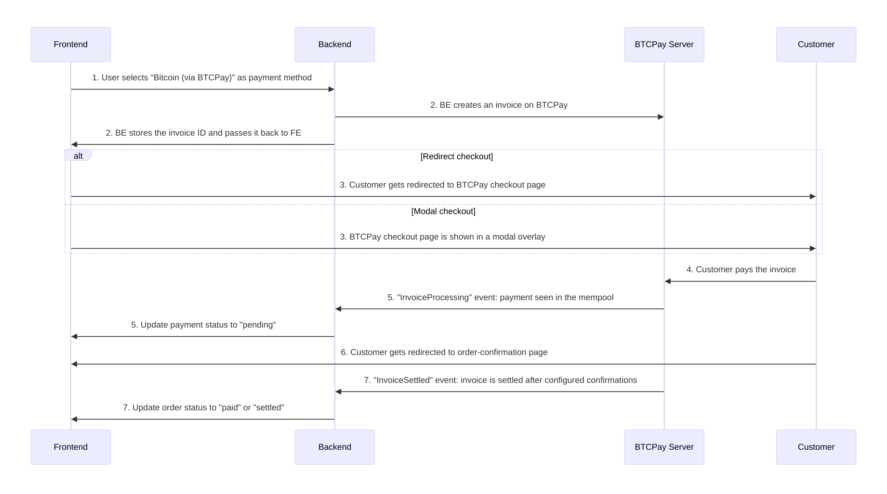

# eCommerce Integration Guide

This document aims to give best practices and a guide on how to integrate BTCPay Server as a payment solution into eCommerce, ERP, Point of Sale or other systems. If you want to do a broader integration which also manages stores and users on BTCPay this guide is still useful as a starting point. You can find examples on how to manage your BTCPay Server headless via [cURL](https://docs.btcpayserver.org/Development/GreenFieldExample/), [Node.js](https://docs.btcpayserver.org/Development/GreenFieldExample-NodeJS/) or [PHP](https://docs.btcpayserver.org/Development/GreenfieldExample-PHP/) in our docs.


## Table of contents
[[toc]]

## General information

The general idea is to have a smooth setup for your users and a seamless checkout experience for their customers. By providing an automated setup wizard as described below you can avoid writing lots of documentation and make the process as easy as possible for your users.

## Greenfield API docs

You can find the API documentation of our so-called Greenfield API [here](https://docs.btcpayserver.org/API/Greenfield/v1/) (or on your BTCPay Server on the `/docs` path). As a quick starter, we have covered the most basic eCommerce integration endpoints examples for [cURL](https://docs.btcpayserver.org/Development/GreenFieldExample/), [Node.js](https://docs.btcpayserver.org/Development/GreenFieldExample-NodeJS/) and [PHP](https://docs.btcpayserver.org/Development/GreenfieldExample-PHP/). We will refer to those examples throughout this document.

In the examples below we use the our demo server [https://mainnet.demo.btcpayserver.org](https://mainnet.demo.btcpayserver.org) as an example. On your integration, this will be the user provided BTCPay Server instance URL.

## Authentication

Authentication can be done over Basic-Auth or API key. Using Basic-Auth is not recommended as it will always have full access of your user. With API keys you can give fine-grained permissions per store that can’t do much damage even if your API key is leaked.

**Important**: the Authorization-Header is formatted like this:

`Authorization: token API_KEY`
(Replace API_KEY with the actual API key)

Example using cURL:
```bash
curl -s \
     -H "Content-Type: application/json" \
     -H "Authorization: token API_KEY" \
     -X GET \
     "https://mainnet.demo.btcpayserver.org/api/v1/stores/STORE_ID"
```

### API Keys

You can generate API keys via the [authorization endpoint](https://docs.btcpayserver.org/API/Greenfield/v1/#tag/Authorization) (as detailed below in [automatic setup](#automatic-setup)) or for testing you can do so manually as described on [manual setup](#manual-setup).

### Permissions

You need the following permissions for a typical eCommerce integration and as a starting point to process payments and refunds:

`btcpay.store.canviewinvoices` \
`btcpay.store.cancreateinvoice` \
`btcpay.store.canmodifyinvoices` \
`btcpay.store.webhooks.canmodifywebhooks` \
`btcpay.store.canviewstoresettings` \
`btcpay.store.cancreatenonapprovedpullpayments`

This allows you to have the minimal needed permissions to create invoices, refunds and to programmatically register a webhook. You should also limit your API key to a specific store, otherwise the API key will work for all the stores of a user.


## Setup best practices

### Automatic setup


To make the connection flow between your eCommerce system and BTCPay Server as smooth and easy as possible for your users, you can guide them through a setup wizard. This means that ideally the user only enters the URL to their BTCPay Server instance (e.g. [https://mainnet.demo.btcpayserver.org](https://mainnet.demo.btcpayserver.org)) and clicks on a "_Connect BTCPay Server_" button that will start the following process:

* User will get redirected to BTCPay Server authorization page
* User logs in with their BTCPay Server account (if not already)
* User selects the desired store (if they have multiple stores)
* User can enter a label to identify the API key in their BTCPay Server account (optional)
* Required permissions (see above screenshot) are already pre-filled for the user
* When the user clicks "Authorize app" BTCPay will generate an API key with the permissions and bound to a single store and send it back to your eCommerce system
* There you can process the returned payload which contains the API key and the store id
* Using that API key you can register a webhook endpoint (of your eCommerce system) on the users store
* That endpoint will return a webhook "secret" that you need later to store and use to validate incoming webhook events on invoice status changes
* You store all those information in your eCommerce system and the setup is done

#### Example of request of [Authorization endpoint](https://docs.btcpayserver.org/API/Greenfield/v1/#operation/ApiKeys_Authorize):

**Important**: "selectiveStores" needs to be set to true so the user has to explicitly select a store for which the API key will get permissions to. Otherwise the user can select multiple stores.

```bash
curl -s \
      -H "Content-Type: application/json" \
      -X GET \
      "https://mainnet.demo.btcpayserver.org/api-keys/authorize?permissions=btcpay.store.canviewinvoices&permissions=btcpay.store.cancreateinvoice&permissions=btcpay.store.canmodifyinvoices&permissions=btcpay.store.webhooks.canmodifywebhooks&permissions=btcpay.store.canviewstoresettings&permissions=btcpay.store.cancreatenonapprovedpullpayments&strict=true&selectiveStores=true&applicationName=YourAppName&redirect=https://example.com/your-callback-url"
```

### Manual setup

You or your user can also create API keys manually in the BTCPay Server UI. That said, the automatic setup is more user-friendly and less error-prone. The manual setup is done as follows:

* User logs into BTCPay Server instance
* User clicks "_Account_" -> "_Manage Account_" -> "_API keys_"
* Creates an API key with above-mentioned permissions, limited to a specific store
* Copies the API key and store id to your form
* Creates a webhook in store: "_Settings_" -> "_Webhooks_"; Copies the `secret` into your settings form

## Checkout flow

### Overview of the checkout flow

**_Legend_**:

**FE**: Frontend (your website/existing system) \
**BE**: Backend (your website/existing system) \
**BTCPay**: BTCPay Server instance hosted by yourself or a 3rd party



1. FE: On checkout the user selects payment method (in this case e.g. Bitcoin (via BTCPay))
2. FE/BE: Checkout data is passed to BE and BE [creates an invoice](#creating-an-invoice) on BTCPay, your BE stores the invoice ID alongside your internal order or checkout id so it can be matched at a later point.
3. FE option 1: the customer gets redirected to BTCPay invoice page and sees the QR-code and payment options  \
   FE option 2: the customer sees the BTCPay checkout page in an modal overlay
4. Customer pays the invoice
5. BTCPay: as soon as the payment is seen in the mempool (and the invoice is paid fully) BTCPay fires a webhook with the "InvoiceProcessing" event; BE needs to update the payment status to e.g. "pending", "approved", "on-hold"
6. Customer gets redirected to order-confirmation page either automatically or by clicking a button
7. BTCPay: depending on configured number of confirmations (defaults to 1 confirmation) BTCPay fires a webhook with the "InvoiceSettled" event; BE updates the order status to e.g. "paid", "settled"

Note: the webhooks of 5. and 7. fire with an average 10 minute time gap, depending on when the next block is found for on-chain bitcoin transactions. For Lightning Network (off-chain) transactions those two events fire immediately after each other and the payment is settled.


### Showing BTCPay (Bitcoin / Lightning Network) as payment gateway

This is highly dependent on how your checkout flow works. On most eCommerce stores you have a payment step and on that step different payment methods are listed. Usually you list "Bitcoin / Lightning Network". The default is that all configured payment methods on BTCPay Server side will be available on the invoice page where the QR-code is shown. For more advanced use-cases you could also list supported payment methods separately and pass them when creating the invoic, this way you could give e.g. discount on Lightning Network payments compared to on-chain payments.

### Creating an invoice

When the customer chooses BTCPay (Bitcoin / Lightning Network) as payment option on the FE your BE needs to create an invoice using the create invoice endpoint. This will return you an invoice object with an invoice ID, this invoice ID should be stored alongside your order as it will be used in webhooks so you can match and find your order. The returned invoice object also contains a property "checkoutLink" this is the link you can redirect your customer to pay, see below.

This is done by using the [create invoice endpoint](https://docs.btcpayserver.org/API/Greenfield/v1/#operation/Invoices_CreateInvoice), see examples in [cURL](https://docs.btcpayserver.org/Development/GreenFieldExample/#create-an-invoice), [Node.Js](https://docs.btcpayserver.org/Development/GreenFieldExample-NodeJS/) or [PHP](https://docs.btcpayserver.org/Development/GreenfieldExample-PHP/#create-an-invoice).

It is important that you store the invoice id alongside your internal order or checkout object. This is needed so that you can find the matching internal order when you process the [webhook events](#invoice-webhook-events).

### Redirect

The invoice object contains the property `checkoutLink` which is the URL to your BTCPay checkout page for that specific invoice. You can redirect the customers to that page so they can pay.

After successful payment the customer will get redirected back to your store or to the specified `redirectURL` in the `checkout` object, you can set that on creating the invoice.

### Modal invoice page (advanced, optional)

Instead of redirecting the customer to an external BTCPay invoice checkout page you can also show it via an modal/overlay directly on your store checkout. For this you need to load the `btcpay.js` from your BTCPay instance and add some Javascript to your frontend that listens on payment events.

Load the `btcpay.js` script from your BTCPay instance:
`https://mainnet.demo.btcpayserver.org/modal/btcpay.js`

Below is a simplified example of how to listen to payment events. You can find a full example in our WooCommerce plugin [here](https://github.com/btcpayserver/woocommerce-greenfield-plugin/blob/master/resources/js/frontend/modalCheckout.js).

```js
let invoice_paid = false;
window.btcpay.onModalReceiveMessage(function (event) {
  if (isObject(event.data)) {
    if (event.data.status) {
      switch (event.data.status) {
        case 'complete':
        case 'paid':
          invoice_paid = true;
          window.location = data.orderCompleteLink;
          break;
        case 'expired':
          window.btcpay.hideFrame();
          // Show some error to the user.
          break;
      }
    }
  } else { // handle event.data "loaded" "closed"
    if (event.data === 'close') {
      if (invoice_paid === true) {
        window.location = data.orderCompleteLink;
      }
      // Show some error to the user, user closed the modal by clicking the X.
    }
  }
});
const isObject = obj => {
  return Object.prototype.toString.call(obj) === '[object Object]'
}
```

### Validate and process webhooks

#### Invoice webhook events

These invoice webhook events are available, for details click on the link to the API doc.
- **InvoiceCreated**: Invoice has been created
- **InvoiceReceivedPayment**: Payment has been seen in the mempool (unconfirmed)
- **InvoicePaymentSettled**: Payment has been confirmed on the blockchain
- **InvoiceProcessing**: Full invoice payment ahs been seen in the mempool (unconfirmed), BE should update the order status to "pending" or "approved"
- **InvoiceExpired**: Payment is not seen in the mempool within the time frame, BE should update the order status to "expired"
- **InvoiceSettled**: Payment is confirmed on the blockchain, BE should update the order status to "paid" or "settled"
- **InvoiceInvalid**: Payment is invalid, BE should update the order status to "invalid"

The most important events are:
- InvoiceProcessing
- InvoiceExpired
- InvoiceSettled
- InvoiceInvalid

But you also need these events to e.g. handle payments after expiration:
- InvoiceReceivedPayment
- InvoicePaymentSettled

#### Possible invoices states

Normally the webhook events are enough to set the order status in your BE and there is no need to do an additional GET request to check the status of the invoice. However sometimes you still need to do that and check what the actual status is. You can do that by using the [get invoice endpoint](https://docs.btcpayserver.org/API/Greenfield/v1/#operation/Invoices_GetInvoice).

Like with the webhook events you need to be aware of edge-cases like partial or overpayment. On the returned invoice object you have two important properties that will give you a clear status of what the current satus of the invoice is:
- **status**: `Expired` `Invalid` `New` `Processing` `Settled`
- **additionalStatus**: `Invalid` `Marked` `None` `PaidLate` `PaidOver` `PaidPartial`

You always need to check both properties to get the full picture of the invoice status. It could happen that an invoice is expired but it was paid partially or fully paid after the invoice expired.

#### Validate webhook signature

When you receive a webhook event you should validate the signature to make sure the event is actually coming from your BTCPay Server instance. The signature is a HMAC-SHA256 hash of the event payload and your webhook secret. The secret is returned when you register a webhook on the store (as mentioned above). You can find the secret in the BTCPay Server UI under "_Settings_" -> "_Webhooks_".

You can find examples for [Node.Js](https://docs.btcpayserver.org/Development/GreenFieldExample-NodeJS/#validate-and-process-webhooks) and [PHP](https://docs.btcpayserver.org/Development/GreenfieldExample-PHP/#validate-and-process-webhooks) in our docs.

#### Process webhook events

Each webhook payload with have an `invoiceId` property, this is the id of the invoice that the event is related to. As you stored that invoice id alongside your order you can now find the matching order and update the status accordingly.

In most cases you can ignore the `InvoiceCreated` event as you created the invoice during the checkout process and already have stored the invoice id alongside your order. But there are some edge-cases where you will have expired invoices that have been paid partially or overpaid. You can check our WooCommerce plugin PHP code for an example on how to handle those cases [here](https://github.com/btcpayserver/woocommerce-greenfield-plugin/blob/master/src/Gateway/AbstractGateway.php#L504).

:::tip
On the invoice details page you can manually re-trigger the webhook events for testing purposes, by clicking on the "Redeliver" link on the list of webhooks.
:::

### Refunds

Refunds can be issued via the [invoice refund endpoint](https://docs.btcpayserver.org/API/Greenfield/v1/#operation/Invoices_Refund). This will return a link where the customer can claim the refund. You can find examples for [Node.Js](https://docs.btcpayserver.org/Development/GreenFieldExample-NodeJS/#issue-a-full-refund-of-an-invoice) and [PHP](https://docs.btcpayserver.org/Development/GreenfieldExample-PHP/#issue-a-full-refund-of-an-invoice) in our docs.

Alternatively you can also use the more generic [pull-payments endpoint](https://docs.btcpayserver.org/API/Greenfield/v1/#operation/PullPayments_CreatePullPayment).

## Logging / Debugging

On every API call and internal interaction like status updates you should catch errors and log them accordingly. So that in your BE the users/admins can see what the problem is and reach out to you with the actual error. You avoid lots of back and forth this way. You can also consider to do a "debug-mode" which will log even more data like webhook payloads and internal status updates - to allow more fine-grained bug hunting.

## Data scarcity

While it is possible that you pass any data as metadata to an invoice, you should not send customer data unless you have good reasons to do so. The most important metadata you want to send is the `orderId` which you can use to then link with BTCPay `invoiceId`. This way there is no need to pass all customer data along and risk leaking the data if there is a hack of your BTCPay Server instance (or in case your users use a 3rd party host).
