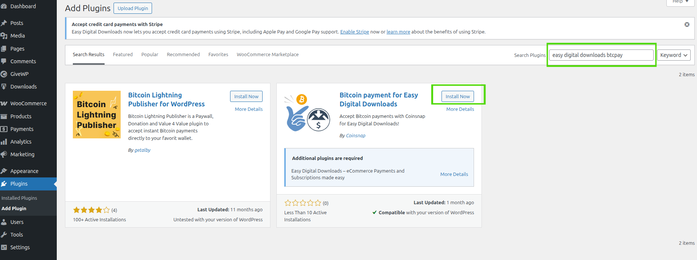
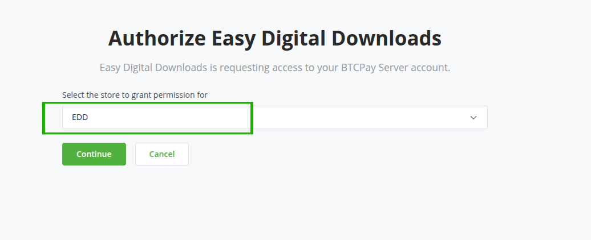
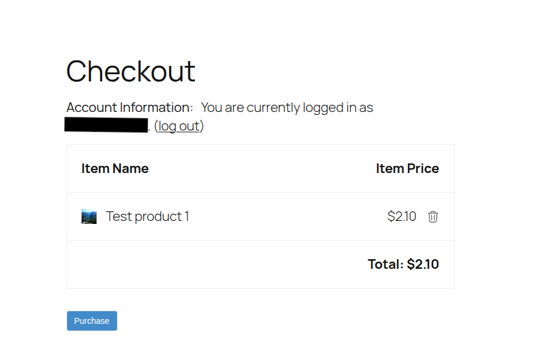
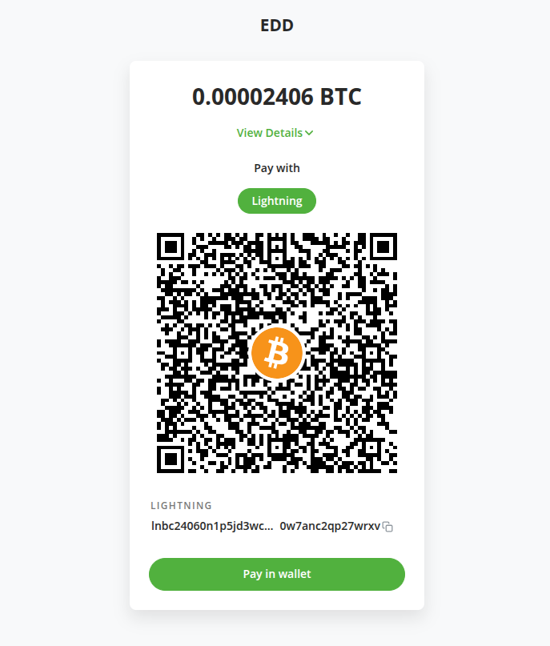
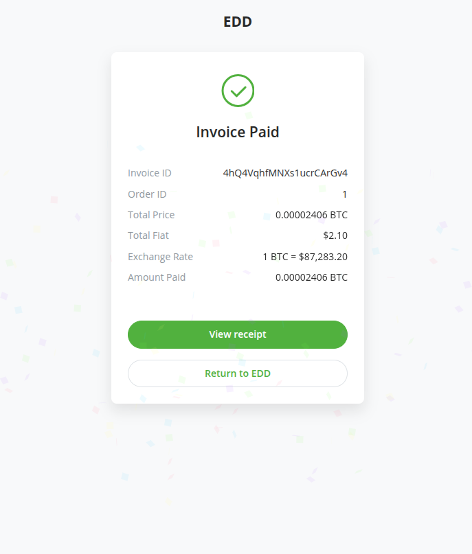
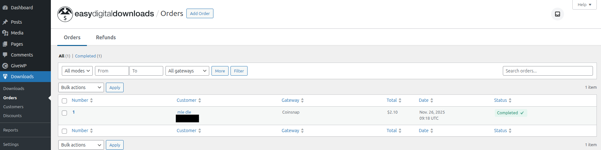

# Easy Digital Downloads (EDD) integration

:::warning
Please be aware that this integration is not maintained by the BTCPay Server team. If you have any feature requests or bug reports, please do so on [coinsnap repository](https://github.com/Coinsnap/Coinsnap-for-EasyDigitalDownloads) directly.
:::

## Requirements

Please ensure that you meet the following requirements before installing this plugin.

- PHP version 8.0 or newer
- The cURL, gd, intl, json, and mbstring PHP extensions are available
- A WordPress site with Easy Digital Downloads (EDD) installed ([Installation instructions](https://easydigitaldownloads.com/docs/quickstart-guide/)
  Note: you don't need the Pro version of EDD to get started
- You have a BTCPay Server version 2.0.0 or later, either [self-hosted](/Deployment/README.md) or [hosted by a third-party](/Deployment/ThirdPartyHosting.md)
- [You've a registered account on the instance](./RegisterAccount.md)
- [You've a BTCPay store on the instance](./CreateStore.md)
- [You've a wallet connected to your store](./WalletSetup.md)

## 1. Install Bitcoin for Easy Digital Downloads Plugin

Thanks to [Coinsnap](https://coinsnap.io), with their **Bitcoin for Easy Digital Downloads** plugin you can also connect it to BTCPay Server.

There are three ways to install the plugin:

- From within WordPress via the Admin Dashboard (recommended, see below)
- [WordPress plugin directory](https://wordpress.org/plugins/coinsnap-for-easy-digital-downloads/)
- [GitHub Repository](https://github.com/Coinsnap/Coinsnap-for-EasyDigitalDownloads)

### 1.1 Install plugin from WordPress Admin Dashboard (recommended)

1. On left sidebar click _Plugins_ -> _Add New_.
2. In Search, type "easy digital downloads btcpay".
3. Click _Install now_ and then _Activate_.

### 1.2 Download and install plugin from GitHub

Alternatively, you can download the plugin from GitHub and install it manually:

1. [Go to the plugin repository](https://github.com/btcpayserver/givewp/releases).
2. Download the .zip by clicking on _Code_ -> _Download ZIP_.
3. On WordPress admin dashboard click on _Plugins_ -> _Add Plugin_.
4. Click on _Upload Plugin_ button and select the .zip file you just downloaded.
5. Click _Install Now_ and then _Activate_.

## 2. Connecting EDD and BTCPay Server

Bitcoin for EDD plugin is a **bridge between your BTCPay Server (payment processor) and your EDD store**.
No matter if you're using a self-hosted or third-party solution, the connection process is identical.

### 2.1 Enable Bitcoin support in EDD

:::info
After the installation above the payment gateway will be listed as "Coinsnap" in the EDD payment gateways.
:::

1. In WordPress admin UI: click on _[Settings]_ inside your EDD (Downloads) section on the left sidebar
2. Click on _"Payments"_ tab at the top
3. Switch _Coinsnap_ toggle to enable it.
4. Click _[Save Changes]_ button at the bottom.

### 2.2 Configure Coinsnap gateway

1. Make sure you are on the Coinsnap settings form, if not click on the _"Coinsnap" tab at the top.
2. On the field "Payment provider" make sure you select _"BTCPay Server"_.
3. You will see the _"BTCPay Server URL"_ input field, enter the URL to your BTCPay Server instance (e.g., `https://btcpay.example.com`).
4. Now you can click on the _[Generate API key]_ button.

You will get redirected to the BTCPay Server instance and follow the steps below:

### 2.3 On BTCPay Server: Authorize the plugin access

On your BTCPay Server instance:

1. You will see an authorization page where you need to select your store, in our case "EDD". Click on _[Continue]_.
   
2. On the next screen you will see the permissions required by the plugin. Enter a label and click on _[Authorize app]_ button at the bottom.
   
3. You will get redirected back to the EDD settings form. You should now see that the "Connection status" says BTCPay Server is connected and the "Store ID" and "API key" fields are filled already.
   
4. To be sure all has beens saved, click on _[Save Changes]_ button at the bottom.

Congratulations, you are now ready to sell your downloads for Bitcoin via BTCPay Server!

## 3. Testing the checkout

Making a small test-payment from your store will give you peace of mind.
Always make sure that everything is set up correctly before going live.

On Checkout place your order:

You will get redirected to BTCPay Server and qr-code for the invoice will be shown:

After you paid the invoice you can go back to your site:

You will see the order confirmation page, with a completed payment satus:

On admin backend under "_Downloads_" -> _"Orders"_ you will also see the order is completed:

## Get support
You can open an issue on [Coinsnap Github repository](https://github.com/Coinsnap/Coinsnap-for-EasyDigitalDownloads) or reach us on [Telegram](https://t.me/btcpayserver) or [Mattermost chat](http://chat.btcpayserver.org/).
