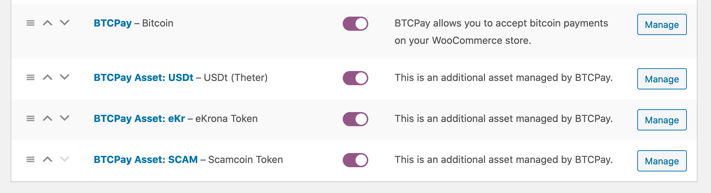
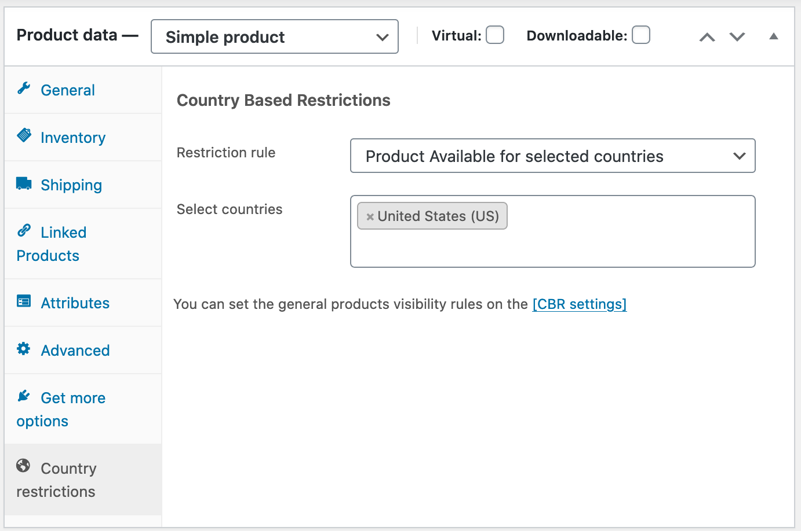
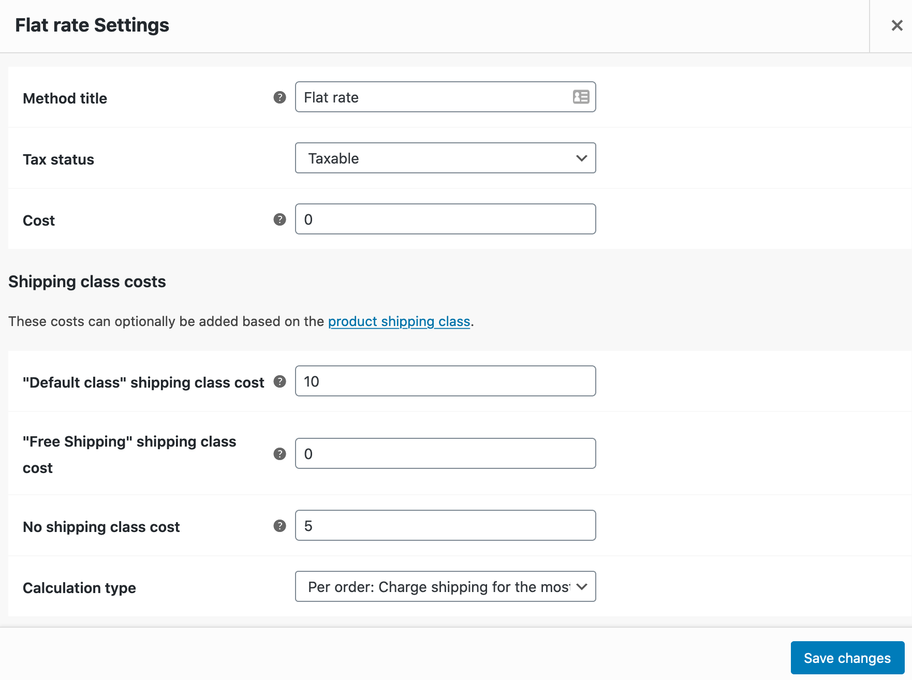
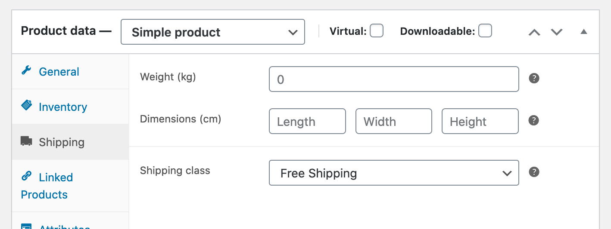
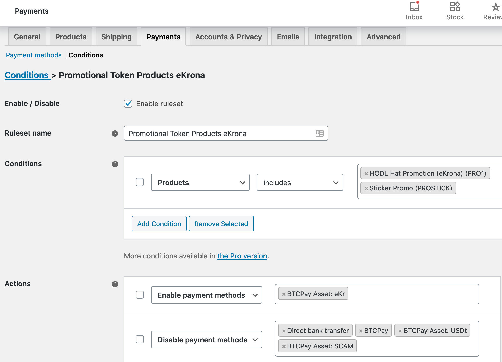
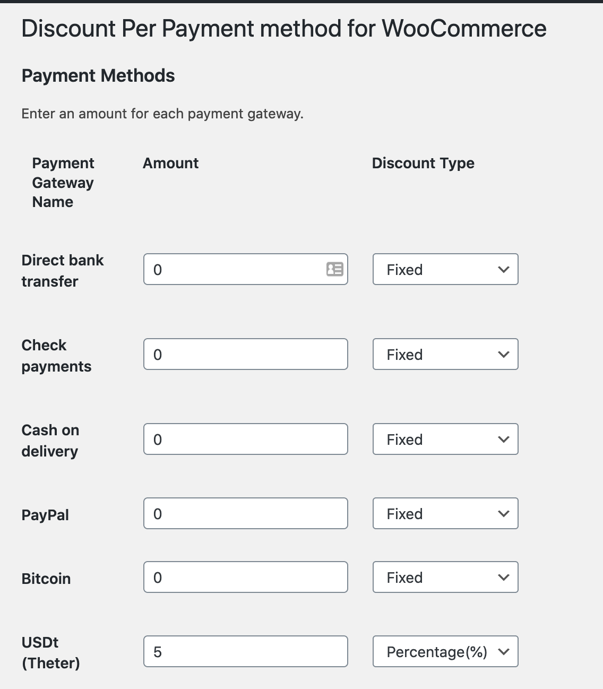
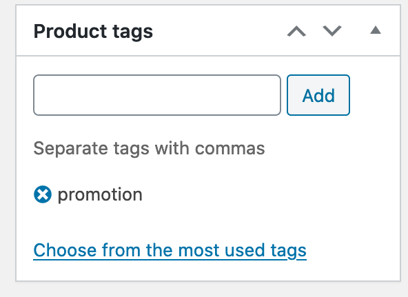

# BTCPay Integrations Frequently Asked Questions
This page covers questions about BTCPay integrations.

## [Integrations General](FAQ-Integrations.md#integrations-general-faq)

* [What e-commerce integrations are available?](FAQ-Integrations.md#what-e-commerce-integrations-are-available)
* [Does BTCPay have a Shopify plugin?](FAQ-Integrations.md#does-btcpay-have-a-shopify-plugin)
* [Can I use BTCPay without an integration?](FAQ-Integrations.md#can-i-use-btcpay-without-an-integration)

## [WooCommerce FAQ](FAQ-Integrations.md#woocommerce-faq-1)

* [How to configure order status in WooCommerce?](FAQ-Integrations.md#how-to-configure-order-status-in-woocommerce)
* [How to customize e-mail confirmations in WooCommerce?](FAQ-Integrations.md#how-to-customize-e-mail-confirmations-in-woocommerce)
* [Error: If you use an alternative order numbering system, please see class-wc-gateway-btcpay.php to apply a search filter](FAQ-Integrations.md#error-if-you-use-an-alternative-order-numbering-system-please-see-class-wc-gateway-btcpayphp-to-apply-a-search-filter)
* [How to configure Additional Token Support](FAQ-Integrations.md#how-to-configure-additional-token-support)

## Integrations General FAQ

## What e-commerce integrations are available?

* [WooCommerce](../WooCommerce.md)
* [Drupal](../Drupal.md)
* [Magento](../Magento.md)
* [PrestaShop](../PrestaShop.md)
* [Custom Integration](../CustomIntegration.md)

If you're a developer, you can develop your own integration, by following the [custom integration instructions](../CustomIntegration.md).

### How to use WooCommerce store with BTCPay?

- [BTCPay and WooCommerce](https://www.youtube.com/watch?v=tTH3nLoyTcw)
- [BTCPay WordPress plugin installation](https://www.youtube.com/watch?v=6QcTWHRKZag)
- [Connecting your store to a third-party BTCPay host](https://www.youtube.com/watch?v=IT2K8It3S3o)
- [Connect your wallet to BTCPay](https://www.youtube.com/watch?v=xX6LyQej0NQ)
- [Test your store checkout when you finish with the setup](https://www.youtube.com/watch?v=Fi3pYpzGmmo)

### How to use BTCPay with Drupal?

- [BTCPay and Drupal installation and configuration](https://github.com/btcpayserver/commerce_btcpay#installation-and-configuration)
- [Drupal Commerce BTCPay module installation walkthrough](https://youtube.com/watch?v=XBZwyC2v48s)

### How to use BTCPay with Prestashop?

- [Using the BTCPay plugin for Prestashop](../PrestaShop.md)

### Does BTCPay have a Shopify plugin?

Yes, there is a BTCPay and Shopify integration. To get started, check out our [Shopify Integration Guide](../Shopify.md)

### Can I use BTCPay without an integration?

Yes, you can. While various e-commerce CMS use integrations,  you can use BTCPay even if you're not a merchant. For more information about use-cases, see [this page](../UseCase.md)

## WooCommerce FAQ

### How to configure order status in WooCommerce?

Order status depends on a merchant's business model. To better understand BTCPay order (invoice) status [read this document](../WooCommerce.md#btcpay-order-statuses).
There's no best way to configure them without trial and error and seeing what works for your business.

### How to customize e-mail confirmations in WooCommerce?

If you wish to send an e-mail after a certain status to the customer, you need to edit WooCommerce order e-mail templates. This is recommended only if you know what you're doing. [Check out this guide](https://www.cloudways.com/blog/how-to-customize-woocommerce-order-emails/).

### Error: If you use an alternative order numbering system, please see class-wc-gateway-btcpay.php to apply a search filter

If by any chance you use a different order numbering than standard in WooCommerce, the following error may appear in your BTCPay WooCommerce plugin logs:

> [Error] The BTCPay payment plugin was called to process an IPN message but could not retrieve the order details for order_id: "ON123". If you use an alternative order numbering system, please see class-wc-gateway-btcpay.php to apply a search filter.

Paste the following code at the bottom of your child theme's **functions.php** file:

<details>
  <summary>Click to view code snippet</summary>

```php
function get_order_id_from_custom_order_style($orderid){
  if(is_string($orderid)){
    $result = preg_replace('~\D~', '', $orderid);
    return $result;
  }
  return $orderid;
}

add_filter('woocommerce_order_id_from_number', 'get_order_id_from_custom_order_style', 1);
```
</details>

### How to configure Additional Token Support

::: tip Note
The Wordpress and Woocommerce plugins used in this integration are neither endorsed nor have they been thoroughly verified or vetted by the BTCPay Server team. Use them at your own risks.
:::

With using the additional token configuration you will be able to have separate payment methods for each configured Currency, Asset, Altcoin or Token. This means you can have separate payment methods for BTC, Lightning Network, LTC, ETH (and ERC20 tokens), Liquid assets, ... you name it. This allows you to issue and use [Liquid Assets](https://help.blockstream.com/hc/en-us/articles/900001543146-What-are-Liquid-assets-) as coupons or vouchers, see more details below.)

#### Use cases
- give away products for free via promotional tokens
- allow discounts for certain payment methods (tokens)
- restrict products to certain payment methods (tokens)
- restrict payment methods (tokens) on shipping zones
- and many more, see examples below

#### Requirements
- all tokens you configure on the WooCommerce side need to be available in your store on BTCPay Server side
- to use promotional tokens you need to have [Liquid Assets plugin](https://github.com/btcpayserver/btcpayserver-plugins) installed on BTCPay Server

#### Token types
##### Payment tokens
Payment tokens are what is supported by BTCPay Server out of the box (BTC, Lightning Network, LTC, XMR, etc.). They are used as normal payment currency converted by the current exchange rate vs the fiat currency of your shop.

##### Promotional tokens (100% discount)
With the introduction of above mentioned Liquid Assets plugin you now also have the possibility to accept **promotional tokens**. You can think of them like coupons or vouchers that can be used to redeem a product/gift. They are special in the sense that they do not have decimals and you need to always pay 1 token per quantity of a product.

You as a store owner can [issue your own Liquid assets](https://docs.blockstream.com/liquid/developer-guide/developer-guide-index.html#issued-assets) for this purpose or accept [existing ones](https://blockstream.info/liquid/assets).

#### Configuration
Make sure the tokens you will configure on your WooCommerce store are available and properly configured on your BTCPay Server, otherwise you will get errors on invoice creation during the checkout process. This will change in the future when we have a new woocommerce plugin that directly fetches the needed data via the Greenfield API but for now the data needs to be entered in some comma separated value (CSV) style.

##### Preparation
Make sure to have the latest woocommerce plugin installed.

##### Setup your additional tokens
###### Setting: Additional token configuration
In the BTCPay payment method settings you have a new setting **“Additional token configuration”** where you can input the token configuration in a specific CSV format of 4 columns.

1. **token symbol**:   
   Important: this needs to match the symbol on BTCPay Server, e.g. BTC,

2. **display name**:   
   The visible text for the payment method on checkout

3. **type**:   
   this can be “**payment**” or “**promotion**” [see explanation above](#token-types)

4. **token icon (optional)**:    
   url to token symbol shown during checkout (can be empty but be sure to include the quotes). You can upload the icon in media manager and copy the url or you can use a link to external site or CDN.

:::danger   
**Important:** All the columns text needs to be enclosed by double quotes `"` and separated by semicolon `; each asset has to be put in a new line.   
:::

**Example additional token config**   
```
"BTC_OFFCHAIN";"Lightning BTC";"payment";""
"USDt";"USDt (Liquid Theter)";"payment";"https://example.com/wp-content/uploads/2021/01/usdt.png"
"eKr";"eKrona (Liquid Asset)";"promotion";""
```

After saving you will see each asset to be available as payment method. You can enable/disable them like any other payment method. They won’t have any settings itself for now though (everything is configured by the CSV data). But you can use them together with e.g. woocommerce payment plugins to allow discounts for certain payment methods etc.



###### Setting: Additional tokens: Enforce payment tokens
The default payment method of BTCPay Server (Bitcoin) will **not** enforce any configured Currency, Asset, Altcoin or Token. This means when you have the default payment method "Bitcoin" enabled the user can select all the configured Currency, Asset, Altcoin or Tokens (which have an exchange rate) on the BTCPay Server payment page. You may not want this but enforce/limit which payment options will be available. By selecting this checkbox only the Currency, Asset, Altcoin or Tokens of type "payment" listed in the setting [Setting: Additional token configuration](#setting-additional-token-configuration)

#### Common WooCommerce use-cases using the Additional Token Support feature

##### Use-case 1: limit product to a region/shipping zone
Free plugin used: [Country Based Restrictions for WooCommerce](https://wordpress.org/plugins/woo-product-country-base-restrictions/)
After installing and activating the plugin go to a product in “Product data” block there is a new tab “Country restrictions”. You can configure the restrictions you want there.

Example configuration:   


##### Use-case 2: (Promotion) products should have free shipping
This adds the ability to offer free shipping when a customer pays with a selected Currency, Asset, Altcoin or Token.
This is doable with woocommerce out of the box (no plugins needed):

1. In shipping settings add a new shipping class e.g. “free-shipping”
2. On your shipping zones / shipping method config you need to make sure you set the rate to be 0 for that shipping class but also that “cost” is empty or 0. And your “no shipping class cost” is set to the normal rate (using flat-rate as example):   
   
3. In product settings "Product data" block you have a tab "Shipping", there you set the above created "Free-shipping" class and it will taken care during checkout.   
   

##### Use-case 3: limit product payment methods
E.g. allow only a certain Currency, Asset, Altcoin or Token to be used as payment for promotional product(s)

Free plugin used: [Conditional Payments for WooCommerce](https://wordpress.org/plugins/conditional-payments-for-woocommerce/)

This plugin provides a condition rules builder where you can enable/disable available payment methods for products. See example config in the screenshot:   


##### Use-case 4: discount per payment method
Adds the ability to offer a discount when customer uses a selected Currency, Asset, Altcoin or Token as payment.

Free plugin used: [Discounts Per Payment Method for WooCommerce](https://wordpress.org/plugins/woo-payment-discounts/)

In the now available “Discount per Payment” setting in your WooCommerce settings you have a list of all payment methods and can give percentage or fixed discounts.



##### Use-case 5: make sure promotional products can only be purchased exclusively

This is needed because payment methods based on a selected Currency, Asset, Altcoin or Token - used as promotional token - need to override the product price with 1 (per quantity) to allow users to pay with 1 promotion token per quantity. Otherwise, a user could mix normal products with promo products during checkout and pay both with the promotional tokens, which you want to avoid.

In product settings on the right sidebar you have “Product tags” enter a new tag “promotion”



Paste the following code at the bottom of your child theme's **functions.php** file:

<details>
  <summary>Click to view code snippet</summary>

```php
/**
* Check if a product is tagged with "promotion" and show a notice that it only
* can be ordered exclusively without any other products in the cart.
*/
function btcpay_check_promotion_product($valid, $product_id, $quantity) {
  $promotion_tag = 'promotion';
  // Check if there are any items in the cart.
  if (!empty($cart_items = WC()->cart->get_cart()) && $valid) {
    // Check if the product is a promotional product and abort.
    if (has_term($promotion_tag, 'product_tag', $product_id)) {
      wc_add_notice( 'Promotional products can only be purchased exclusively, please remove other items from your cart first.', 'error' );
      return false;
    }
    // Also check the case where one has already a promotion product in the
    // cart and also do not allow adding a normal product in that case.
    foreach ($cart_items as $item) {
      if (has_term($promotion_tag, 'product_tag', $item['product_id'])) {
        wc_add_notice( 'Promotional products can only be purchased exclusively, please proceed with checkout or remove the item first.', 'error' );
        return false;
      }
    }
  }
 
  return $valid;
}
add_filter('woocommerce_add_to_cart_validation', 'btcpay_check_promotion_product', 10, 3);
```
</details>

##### Use-case 6: Limit the checkout of only 1 piece of a product
Adds the ability to limit the number of a Currency, Asset, Altcoin or Token that can be spent by a customer in a single checkout.

Useful for coupon-style promotions that are limited to one discount per checkout.

This is also solved already by WooCommerce. You can activate this on a per product level in Product settings: Tab “**Inventory**”:    
set the checkbox [x] “*Enable this to only allow one of this item to be bought in a single order*”
