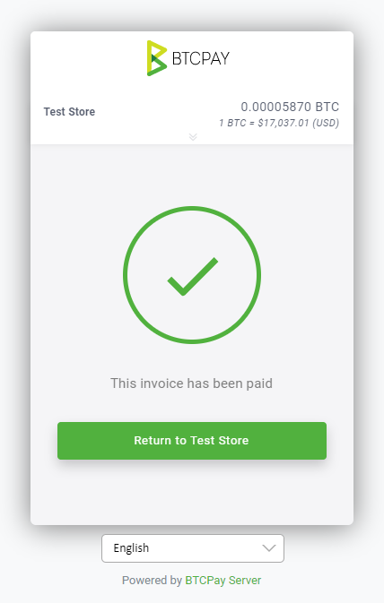

# BTCPay Stores Frequently Asked Questions.

This page shows common issues and frequently asked questions about Stores in BTCPay.

* [How to create a store in BTCPay?](./FAQ-Stores.md#how-to-create-a-store-in-btcpay)
* [How many stores can I create?](./FAQ-Stores.md#how-many-stores-can-i-create)
* [Why are invoices without payment showing as complete?](./FAQ-Stores.md#why-are-invoices-without-payment-showing-as-complete)
* [Add network fee to invoice (vary with mining fees)?](./FAQ-Stores.md#add-network-fee-to-invoice-vary-with-mining-fees)
* [Allow anyone to create invoice?](./FAQ-Stores.md#allow-anyone-to-create-invoice)
* [Invoice expires if the full amount has not been paid after ... minutes?](./FAQ-Stores.md#invoice-expires-if-the-full-amount-has-not-been-paid-after-minutes)
* [Payment invalid if transactions fails to confirm ... minutes after invoice expiration?](./FAQ-Stores.md#payment-invalid-if-transactions-fails-to-confirm-minutes-after-invoice-expiration)
* [Consider the invoice confirmed when the payment transaction?](./FAQ-Stores.md#consider-the-invoice-confirmed-when-the-payment-transaction)
* [Consider the invoice paid even if the paid amount is ... % less than expected?](./FAQ-Stores.md#consider-the-invoice-paid-even-if-the-paid-amount-is-less-than-expected)
* [How to disable email on invoices?](./FAQ-Stores.md#how-to-disable-email-on-invoices)
* [How to denominate invoices in sats?](./FAQ-Stores.md#how-to-denominate-invoices-in-sats)
* [How to collect additional buyer information?](./FAQ-Stores.md#how-to-collect-additional-buyer-information)
* [How to redirect store invoices after payment?](./FAQ-Stores.md#how-to-redirect-store-invoices-after-payment)
* [Can I delete invoices from BTCPay?](./FAQ-Stores.md#can-i-delete-invoices-from-btcpay)
* [How to change the exchange rate provider for invoices?](./FAQ-Stores.md#how-to-change-the-exchange-rate-provider-for-invoices)
* [Getting GetRatesAsync was called on coinaverage error](./FAQ-Stores.md#getting-getratesasync-was-called-on-coinaverage-error)

## How to create a store in BTCPay?

To create your first store, go to > Stores from the header menu and click "create a new store."

## How many stores can I create?

There's no limit on a number of stores you can create in BTCPay.

## Why are invoices without payment showing as complete?

When an invoice is created to receive a payment value of 0 (zero amount due) the invoice by definition, is already paid. The invoice will appear as complete as soon as it's created.

The purpose of this type of invoice is typically for when a merchant would like to observe user interest in an event or giveaway using BTCPay Server invoices without requiring the user to provide funds. Another use case is for developers who are testing the invoice process allowing them to bypass providing actual funds to verify the software is working properly.

## Add network fee to invoice (vary with mining fees)?

Network fee (cost) is a feature in BTCPay which protects merchants from customers who pay the invoice partially. When an invoice is paid from many outputs, the fee for a merchant who needs to move those funds later will be higher.

For example, the customer created an invoice for 20$ and paid it partially, paying 1$ 20 times until the invoice is paid fully. Merchant now has a larger transaction which increases the mining cost in case the merchant decides to move those funds later. By default, BTCPay applies an **additional network cost** to the total invoice amount to cover that expense for the merchant.

BTCPay offers several options to customize this protection feature. You can apply a network fee :

* Only if the customer makes more than one payment for the invoice (In the above example, if the customer created an invoice for 20$ and paid 1$, total invoice due is now 19$ + the network fee. The network fee is applied **after the first payment**)
* On every payment (including the first payment, in our example, the total  will be 20$ + network fee right away, even on the first payment)
* Never add network fee (disables the network fee entirely)

The network fee in BTCPay is **not the mining fee**. The customers still need to pay for the miner's fee.

The network cost is an optional feature. It's enabled by default, but it's entirely up to a merchant to enable or disable it. The customer sees the "network cost" at the checkout when they expand the invoice information.

While it protects from dust transactions, it can also reflect negatively on businesses if not communicated properly. Your customers may have additional questions and may think you're overcharging them.

Please think twice about how this may affect your business and make sure to communicate it to your customers properly inside your store Terms of Service or through other means.

## Allow anyone to create invoice

You should enable this option if you want to allow the outside world to create invoices in your store. This option is only useful if you're using the payment button or if you are issuing invoices via API or 3rd party HTML website. POS app is pre-authorised and does not need this enabled for a random visitor to open your POS store and create an invoice. If in doubt, don't enable it as you can always enable it if needed.

## Invoice expires if the full amount has not been paid after ... minutes

The invoice timer is set to 15 minutes by default. The timer is a protection mechanism against the volatility since it locks the cryptocurrency amount according to the crypto to fiat rates. If the customer does not pay the invoice within the defined period, the invoice is considered expired. The invoice is considered "paid" as soon as the transaction is visible on the blockchain (o-confirmations) but considered "complete" when it reaches the number of confirmations the merchant defined (usually, 1-6). The timer is customizable.

## Payment invalid if transactions fails to confirm ... minutes after invoice expiration

If the customer pays the invoice, but it fails to get the defined number of confirmations within the set period, it is marked as "invalid." The merchant can then decide whether to accept the invoice afterward manually or decline it and require additional payment from the customer. This is an additional protection mechanism against the volatility.

## Consider the invoice confirmed when the payment transaction

The invoice is considered "paid," as soon as it's visible on the blockchain. When the invoice reaches the defined number of confirmations, it is considered "confirmed." Here you set the minimum amount of confirmations after which the invoice gets the "confirmed" status. The "completed" status is given when the invoice has at least 6 confirmations. Note this only applies to on-chain payments. Invoices paid via the Lightning Network immediately go to a completed state, as their confirmation is instant. In practice, as a merchant, you ship your product as soon as you see the invoice marked as completed or confirmed.

## Consider the invoice paid even if the paid amount is ... % less than expected

In a situation where a customer uses an exchange wallet to pay directly for an invoice, the exchange takes a small amount of fee. This means that such invoice is not considered fully completed. The invoice gets status "paid partially." If a merchant wants to accept underpaid invoices, you can set the percentage rate here.

## How to disable email on invoices

To disable the email requirement for your store's invoices, go to Stores > Settings > Checkout Experience > uncheck 'Requires a refund email' box.

## How to denominate invoices in sats

To use Satoshis as the invoice currency unit, you can simply use `SATS` (e.g. instead of `BTC`).

Alternatively you can also use the Store > Settings > Checkout Experience > Display Lightning payment amounts in Satoshis option.

## How to redirect store invoices after payment?

To automatically redirect paid invoices for a store, enable the setting in: Stores > Settings > Checkout experience > check 'Redirect invoice to redirect url automatically after paid' box.

This setting is typically used for redirecting invoices made directly to the store, such as with a [Payment Button](../Apps.md#payment-button). After payment, the invoice would return to the original page where the payment button was embedded or to the redirect URL provided on the Edit Payment Button page.

When this feature is not enabled, the customer will be prompted in the invoice to return to the original payment page.



To redirect to a specific URL in the Point of Sale app, use the [PoS Redirect](../FAQ/FAQ-Apps.md#how-to-redirect-to-another-site-after-payment) instead.

## Can I delete invoices from BTCPay?

Invoices in BTCPay Server can't be deleted, but can be archived.
To archive an invoice, select the one you would like to archive from the list of invoices and mark as archived from the actions dropdown. Or from the invoice details page click the `Archive` button in top right corner.
This action removes it from the `Invoices` page.

An invoice can be restored by clicking the `Archived` button or by using the archive search filter to display them. Find out more about archived invoices [here](../Invoices.md#archived-invoices).

## How to collect additional buyer information?

The Buyer information section of the invoice details page is only used for custom solutions such as integrations, like WooCommerce or API invoice creation. Currently there is no way to collect Buyer Information using the BTCPayServer interface.

## How to change the exchange rate provider for invoices?

The default fiat to cryptocurrency exchange rate provider used in your BTCPay invoices can be modified by navigating to your Store Settings > Rates > Preferred price source. There are several exchange rate provider options available. Each store may use different settings.

## Getting GetRatesAsync was called on coinaverage error

Coinaverage discontinued their free tier API. As a result the following error may appear:

```
GetRatesAsync was called on coinaverage when the rate is outdated. It should never happen, let BTCPayServer developers know about this.
```

The issue can be fixed by [selecting a different rate source provider](./FAQ-Stores.md#how-to-change-the-exchange-rate-provider-for-invoices) in Stores > Settings > Rates, or by [updating your BTCPay Server](./FAQ-ServerSettings.md#how-to-update-btcpay-server) if you're running version 1.0.3.146 or older. The update will automatically replace Coinaverage with CoinGecko.
