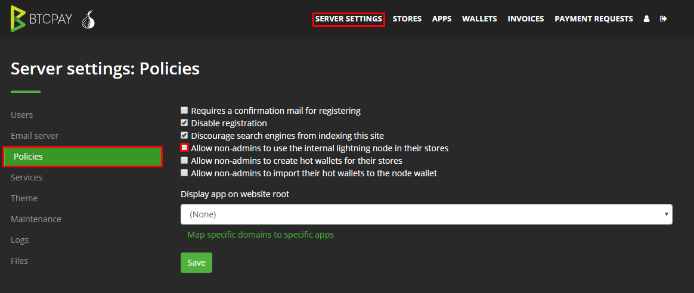
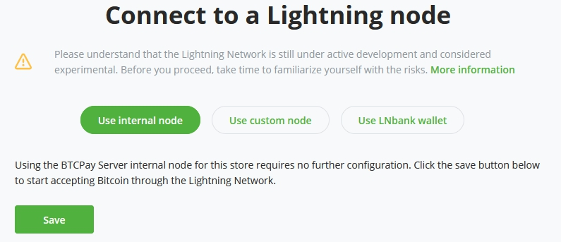
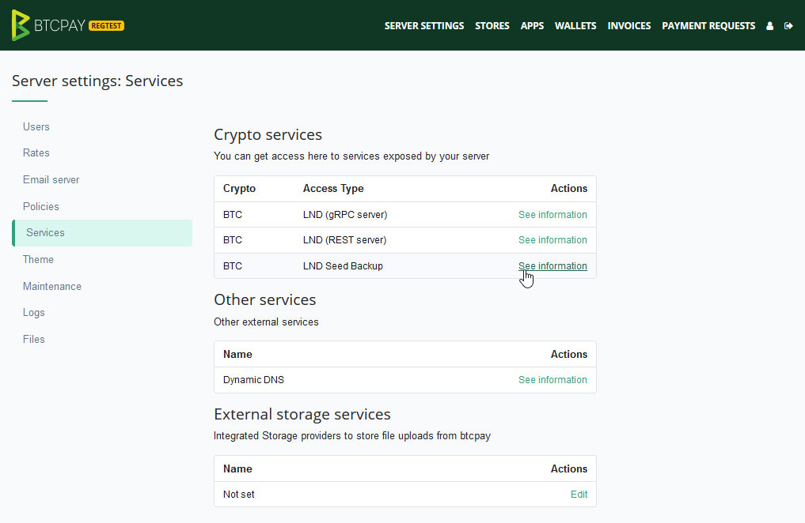
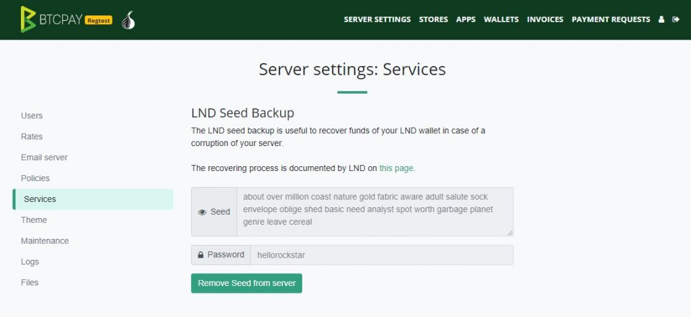

# Lightning Network FAQ

This document clarifies some of the most common questions and issues users face with the Lightning Network in BTCPay. Before you start using the off-chain protocol, familiarize yourself with the risks. Additionally, read [Getting Started with Lightning Network in BTCPay](../LightningNetwork.md)

[[toc]]

## Lightning Network General FAQ

Here are some general questions about LN in BTCPay, regardless of the implementation.

### How many users can use Lightning Network in BTCPay?

On a self-hosted server, you can use only one internal Lightning node. Server owners can use the same Lightning node for an unlimited number of stores tied to their admin account.

Since version 1.0.3.128, a BTCPay Server host can enable it's registrants to use the internal Lightning Network node.
It can be enabled in Server Settings > Policies > Allow non-admins to use the internal lightning node in their stores.



:::warning As a third-party host
All your registrants' funds will go to your own Lightning Wallet.
You will have to manually check and redispatch the funds to their respective owners. This could potentially become a burden.
:::

:::danger As an individual using a third-party host
All payments made through the Lightning Network will go to your third-party's wallet.
Take precautions and only use this option while using a trustworthy third-party host to ensure you get your funds back.
:::

Non-admin users can also connect to their own external nodes. Lightning node external connections are a technically advanced task. We recommend that if you want Lightning, you should deploy your own server instead, which comes with all the necessities bundled up.

### How to find node info and open a direct channel with a store using BTCPay?

If you're a customer trying to pay a Lightning Network invoice:

1. make sure to select "Lightning" from coin selection.
2. Select Copy/Scan
3. Select Node Info and scan or copy it manually.


The exact procedure of opening a direct Lightning Network channel depends on the wallet you’re using. But, you should be able to figure it out easily now that you have merchant’s node information.

### As a merchant, do I need to open direct channels?

Merchants need incoming channels. Other people opening a channel with them provides liquidity to the merchant. Your customer should be able to open a direct channel with you.

You can also ask well-connected nodes to open a direct channel with you. Opening a channel is not spending funds, it’s more like putting the funds on a pre-paid card, and spending it later, or withdrawing it by closing a channel.

### How can I get inbound capacity to my node?

There are many ways in which one can get an inbound capacity. We recommend that you read this great article that provides [practical tips to inbound capacity](https://medium.com/lightningto-me/practical-solutions-to-inbound-capacity-problem-in-lightning-network-60224aa13393).
When asking for inbound capacity, consider any routing policy fees the service may have.

### I previously installed BTCPayServer without lightning, can I enable it?

BTCPay Server will allow you to set up your Lightning at any moment after creating your first store.
We currently support three implementations of the Lightning Network.

- [LND](https://github.com/lightningnetwork/lnd)
- [Core Lightning (CLN)](https://github.com/ElementsProject/lightning)
- [eclair](https://github.com/ACINQ/eclair)



Want to learn more on how to set up your store with Lightning ?
Follow along the [Lightning Network](../LightningNetwork.md) guide, and you will get your store connected to Lightning Network!

### Can I use a pruned node with LN in BTCPay?

It is recommended to use Core Lightning (CLN) because the implementation supports pruned nodes.

### Can I use my existing LN node with BTCPay?

If you already have a well connected lightning node with sufficient inbound liquidity, you may want to use it with BTCPay instead of the included lightning node.

To do so, go to the lightning node settings page of your store (Store > Settings > Lightning > Modify). Here on the lightning node setting page, select the option for Use a custom lightning node.

The connection strings vary per lightning implementation, the [settings page](../LightningNetwork.md#connecting-an-external-lightning-node-in-btcpay) contains the documentation for the connection settings to give you further guidance.

### How to change from Core Lightning (CLN) to LND or vice-versa?

:::warning
Be sure to have closed all channels and removed both on-chain and Lightning funds from the Lightning node before switching from one to the other.

:::

You need to SSH log in into your virtual machine.

To switch to LND:

```bash
sudo su -
cd btcpayserver-docker
export BTCPAYGEN_LIGHTNING="lnd"
. ./btcpay-setup.sh -i
```

To switch to Core Lightning (CLN):

```bash
sudo su -
cd btcpayserver-docker
export BTCPAYGEN_LIGHTNING="clightning"
. ./btcpay-setup.sh -i
```

### I switched Lightning Network implementation, but getting "no payment available" error

When you switch from one implementation to another, you need to reconfigure your lightning connection string at a store level, to use adequate implementation. Stores > Settings > Lightning > Setup > **Connection string**. In connection string, click on the "click here" link.

### I get "WARNING: The LIGHTNING_ALIAS variable is not set. Defaulting to a blank string" when starting container

You can ignore this.
If you want to set an alias for your lightning node, open the env file:

```bash
sudo su -
vim $BTCPAY_ENV_FILE
```

And add or modify the `LIGHTNING_ALIAS` entry to `LIGHTNING_ALIAS=myawesomenode`.

### How to display my Lightning Node information so that others can connect to me?

The information other users need to connect to your node, is already displayed at the checkout. Sometimes, merchants want to display their node so that their customers can connect beforehand.

There are numerous ways to find your node information, but the easiest way to display it to others is by using Lightning Node info page. Go to Store > Settings > Lightning > Modify. At the bottom of the page, there is a "Open Public Node Page" button. Click on it to see the information. The page can be embedded into your website with `<iframe>`.


### Where can I find recovery seed backup for my Lightning Network wallet in BTCPay Server?

Originally BTCPay did use `noseedbackup`, so you couldn’t backup your LN wallet or get your recovery seed. This was because in Lightning Network there was no solution for backing up funds in channels, just in your on-chain wallet.
By now LND has functionality like static channel backup that depends on seed presence.
But once again, please understand that the Lightning Network is still in an experimental phase and do not put funds into it, which you're not [willing to lose](https://www.youtube.com/watch?v=5fMv8MpzLgQ).

#### Using LND with seed (since [`v1.0.3.138`](https://github.com/btcpayserver/btcpayserver/releases/tag/v1.0.3.138))

You can find the LND Seed Service under:

- Server Settings > Services > LND Seed Backup



Safely backup and store your recovery seed. The seed is a backup of your on-chain Lightning wallet, but is also necessary to perform static channel backups.



If you backed it up safely you can remove it from the server.

If you migrate from an older version to `v1.0.3.138` [this blog post on how to do the migration](https://blog.btcpayserver.org/btcpay-lnd-migration) might be helpful.

### How to disable on-chain payments and use LN payments only?

There are two easy ways to do this:

1. Store > Settings > Checkout experience > Choose default payment method at checkout
2. Store > Settings > Modify > Uncheck the Enabled box to disable on-chain payments

### How to see my Lightning Network version?

You can check your Lightning Network version from the command line.
For LND

```bash
sudo su -
cd btcpayserver-docker
./bitcoin-lncli.sh help
```

For Core Lightning (CLN)

```bash
sudo su -
./bitcoin-lightning-cli.sh getinfo
```

Most of the wallets (RTL, Zap, Zeus, etc.) that are able to your lightning node remotely will display the version on the front-end as well.

### How to redirect a Lightning Address?

Use case: Your run a BTCPay server at `pay.example.com`, but want to use `me@example.com` as your Lightning Address, because it looks nicer than `me@pay.example.com`.

All you need to do is set up a `301` redirect from `example.com/.well-known/lnurlp/me` to `pay.example.com/.well-known/lnurlp/me`.
You can do so in your webserver configuration, here is an example for nginx:

```nginx
server {
  server_name example.com;

  # Redirect Lightning Address requests to BTCPay Server
  rewrite ^/\.well-known/lnurlp/(.*)$ https://pay.example.com/.well-known/lnurlp/$1 permanent;
}
```

## Lightning Network LND FAQ

Here are some of the common questions about the [LND implementation](https://github.com/lightningnetwork/lnd/issues) of the Lightning Network.

### How to restart my LND?

```bash
sudo su -
docker restart btcpayserver_lnd_bitcoin
```

### How to rescan the LND on-chain wallet?

:::warning
only enable this fragment temporarily to reset the on-chain wallet transactions of lnd and to trigger a rescan
after a successful rescan, you should disable this fragment again, or it will rescan the on-chain wallet at
every restart!
WARNING: The rescan can only pick up the transactions within your archived blocks (beware of PRUNED nodes!)
:::
To customize LND settings which are not available as environment variables, you can [create a custom fragment](../Docker/README.md#how-can-i-customize-the-generated-docker-compose-file) in `docker-compose-generator/docker-fragments/opt-lnd-wallet-rescan.custom.yml` like this:

```
version: "3"
services:
  lnd_bitcoin:
    environment:
      LND_EXTRA_ARGS: |
        reset-wallet-transactions=1
  lnd_litecoin:
    environment:
      LND_EXTRA_ARGS: |
        reset-wallet-transactions=1
  lnd_bitcoingold:
    environment:
      LND_EXTRA_ARGS: |
        reset-wallet-transactions=1
```

For more information on this LND feature, see [their documentation](https://github.com/lightningnetwork/lnd/blob/master/docs/recovery.md#forced-in-place-rescan).

### How to see LND logs?

To check the logs of your LND node in BTCPay Server (Docker installations) use the following command:

`docker logs --tail 40 btcpayserver_lnd_bitcoin`

You can change 40 to whatever number you wish. The number represents the lines of code that will be shown. For more information about the logs, see [Troubleshooting page](../Troubleshooting.md)

### What’s the default directory of LND in BTCPay?

`/var/lib/docker/volumes/generated_lnd_bitcoin_datadir/_data`

### Which macaroon needs to be provided for external nodes?

BTCPay Server needs the `admin.macaroon` to check whether the lightning node is fully synced before creating an invoice.
If you want to tailor a macaroon specific to the BTCPay Server connection, use the LND macaroon bakery:

```bash
lncli bakemacaroon address:read address:write info:read invoices:read invoices:write onchain:read
```

### LND connection issues after an update

Authentication tends to fail on LND after an update, symptoms are:

- In store settings, when testing the connection to your node you get `Error while connecting to the API (The HTTP status code of the response was not expected (500).)`
- In Zap wallet, `Unable to connect to host: cannot retrieve macaroon: cannot get macaroon: root key with id 0 doesn’t exist`

In such case, you need to delete the macaroon of lnd and restart it.

If you are using docker deployment, please connect with SSH to your VM and the following command:

```bash
sudo su -
docker exec btcpayserver_lnd_bitcoin rm /data/admin.macaroon
docker exec btcpayserver_lnd_bitcoin rm /data/invoice.macaroon
docker exec btcpayserver_lnd_bitcoin rm /data/readonly.macaroon
docker exec btcpayserver_lnd_bitcoin rm /data/data/macaroons.db
docker exec btcpayserver_lnd_bitcoin rm /data/data/chain/bitcoin/mainnet/invoice.macaroon
docker exec btcpayserver_lnd_bitcoin rm /data/data/chain/bitcoin/mainnet/macaroons.db
docker exec btcpayserver_lnd_bitcoin rm /data/data/chain/bitcoin/mainnet/readonly.macaroon
docker restart btcpayserver_lnd_bitcoin
```

If a macaroon does not exist, you will see an error message, you can safely ignore it.

Because this will invalidate the previous macaroons, you need to manually reconnect with Zap with `Server Settings / Services / LND-gRPC`.

### How to change my LND Node alias?

To change the display name of your LND node, you should ssh log in into your virtual machine and apply the following:

```bash
sudo su -
cd btcpayserver-docker
export LIGHTNING_ALIAS="namehere"
. ./btcpay-setup.sh -i
```

### How to edit lnd.conf?

To customize [LND settings](https://docs.lightning.engineering/lightning-network-tools/lnd/lnd.conf) which are not available as environment variables, you can [create a custom fragment](../Docker/README.md#how-can-i-customize-the-generated-docker-compose-file) in `docker-compose-generator/docker-fragments/opt-lnd-config.custom.yml` like this:

```yml
version: '3'
services:
  lnd_bitcoin:
    environment:
      LND_EXTRA_ARGS: |
        minchansize=1234567
```

You can add your customizations in the `LND_EXTRA_ARGS` value, like shown by setting the `minchansize` value.

Afterwards the configuration has to be added to the additional fragments and setup needs to be run:

```bash
export BTCPAYGEN_ADDITIONAL_FRAGMENTS="$BTCPAYGEN_ADDITIONAL_FRAGMENTS;opt-lnd-config.custom"
. ./btcpay-setup.sh -i
```

This way your custom settings gets added to the config and they will persist updates.

### How to connect to a LND watchtower?

To connect a LND watchtower you need to integrate the [`opt-lnd-wtclient`](https://github.com/btcpayserver/btcpayserver-docker/blob/master/docker-compose-generator/docker-fragments/opt-lnd-wtclient.yml) fragment and optionally configure the `LND_WTCLIENT_SWEEP_FEE`:

```bash
export BTCPAYGEN_ADDITIONAL_FRAGMENTS="$BTCPAYGEN_ADDITIONAL_FRAGMENTS;opt-lnd-wtclient"
export LND_WTCLIENT_SWEEP_FEE=10 # Fee to be used for sweep transaction, 10 sat/vbyte is the default
. ./btcpay-setup.sh -i
```

Afterwards you can use the `wtclient` RPC commands for managing the connections to watchtowers:

```bash
# Connect to a remote watchtower
./bitcoin-lncli.sh wtclient add PUBKEY@IP:PORT

# See your watchtower connections
./bitcoin-lncli.sh wtclient towers
```

### How to run a LND watchtower?

You can run a watchtower alongside your LND instance by integrating the [`opt-lnd-watchtower`](https://github.com/btcpayserver/btcpayserver-docker/blob/master/docker-compose-generator/docker-fragments/opt-lnd-watchtower.yml) fragment:

```bash
export BTCPAYGEN_ADDITIONAL_FRAGMENTS="$BTCPAYGEN_ADDITIONAL_FRAGMENTS;opt-lnd-watchtower"
. ./btcpay-setup.sh -i
```

This will make the watchtower available on the server.

To allow connections from other watchtower clients (via the [wtclient RPC commands]()), you will need to add the `watchtower.externalip` to a [custom fragment](../Docker/README.md#how-can-i-customize-the-generated-docker-compose-file) in `docker-compose-generator/docker-fragments/opt-lnd-config.custom.yml` like this:

```yml
version: '3'
services:
  lnd_bitcoin:
    environment:
      LND_EXTRA_ARGS: |
        watchtower.externalip=YOUR_SERVER_IP
```

Afterwards the configuration has to be added to the additional fragments and open the port `9911` in the firewall settings:

```bash
# Add the custom LND fragment
export BTCPAYGEN_ADDITIONAL_FRAGMENTS="$BTCPAYGEN_ADDITIONAL_FRAGMENTS;opt-lnd-config.custom"
. ./btcpay-setup.sh -i

# Open port the watchtower RPC port in the firewall
ufw allow 9911/tcp
```

Running the `tower info` command should then list your public watchtower instance in  the `uris` section.

```bash
# ./bitcoin-lncli.sh tower info
{
    "pubkey": "YOUR_TOWER_PUBKEY",
    "listeners": [
        "172.23.0.9:9911",
        "127.0.0.1:9911"
    ],
    "uris": [
        "YOUR_TOWER_PUBKEY@YOUR_SERVER_IP:9911"
    ]
}
```

Learn more about [configuring watchtowers](https://docs.lightning.engineering/lightning-network-tools/lnd/watchtower).

### How to install ThunderHub?

To install ThunderHub on your instance apply the following:

```bash
export BTCPAYGEN_ADDITIONAL_FRAGMENTS="$BTCPAYGEN_ADDITIONAL_FRAGMENTS;opt-add-thunderhub"
. btcpay-setup.sh -i
```

If you get the following warning message **Unable to connect to this node** it is probably because the certificate used to communicate with LND doesn't have the correct domains. LND doesn't generate new ones unless the previous ones are deleted first.

To delete the old certificate and key and have LND generate new ones, apply the following:

```bash
docker exec btcpayserver_lnd_bitcoin rm /data/tls.cert
docker exec btcpayserver_lnd_bitcoin rm /data/tls.key
docker restart btcpayserver_lnd_bitcoin
docker restart generated_bitcoin_thub_1
```

## Lightning Network Core Lightning (CLN) FAQ

Here are some of the common questions about the [Core Lightning (CLN)](https://github.com/ElementsProject/lightning/issues) implementation of the Lightning Network.

### How to restart my Core Lightning (CLN)?

```bash
sudo su -
docker restart btcpayserver_clightning_bitcoin
```

### How to announce an IPv6 address?

First, copy `bitcoin-clightning.yml` into the docker fragment folder as `bitcoin-clightning.custom.yml`.
Important: the file must end with `.custom.yml`, or there will be git conflicts whenever you run `btcpay-update.sh`.

Modify the new `bitcoin-clightning.custom.yml` as the following:

```yaml
services:
  clightning_bitcoin:
    environment:
      LIGHTNINGD_OPT: |
        announce-addr=[ipv6 here]
```

Make sure to insert the address between the two square brackets [].

Then set it up:

```bash
export BTCPAYGEN_ADDITIONAL_FRAGMENTS="bitcoin-clightning.custom"
. ./btcpay-setup.sh -i
```

### How to edit .lightning/config?

To customize the [Core Lightning settings](https://docs.corelightning.org/reference/lightningd-config) which are not available as environment variables, you can [create a custom fragment](../Docker/README.md#how-can-i-customize-the-generated-docker-compose-file) in `docker-compose-generator/docker-fragments/opt-lightningd-config.custom.yml` like this:

```yml
version: '3'
services:
  clightning_bitcoin:
    environment:
      LIGHTNINGD_OPT: |
        alias=MyNodeName
        rgb=003366
```

You can add your customizations in the `LIGHTNINGD_OPT` value, like shown by setting the `alias` and `rgb` values.

Afterwards the configuration has to be added to the additional fragments and setup needs to be run:

```bash
export BTCPAYGEN_ADDITIONAL_FRAGMENTS="$BTCPAYGEN_ADDITIONAL_FRAGMENTS;opt-lightningd-config.custom"
. ./btcpay-setup.sh -i
```

This way your custom settings gets added to the config and they will persist updates.

## Lightning Network Questions and Support

Community support for Lightning Network questions is pretty limited, since the protocol is fairly new.

If you're facing a technical problem with your Lightning Network implementation, that's not documented here you may want to ask questions in their respective communities.

#### LND Support

- [LND GitHub](https://github.com/lightningnetwork/lnd/issues)
- [Lightning Community on Slack](https://lightningcommunity.slack.com)

#### Core Lightning (CLN) Support

- [CLN GitHub](https://github.com/ElementsProject/lightning/issues)
- [CLN Telegram Group](https://t.me/lightningd)
- [CLN docs](https://lightning.readthedocs.io/)
