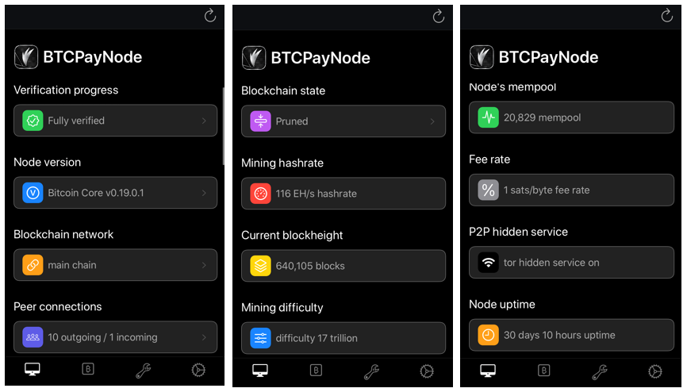

# Wallet FAQ

This document contains frequently asked questions related to BTCPay Server's [internal wallet](../Wallet.md).

[[toc]]

## What is BTCPay Server wallet?

BTCPay Server has an internal wallet which you can use to view incoming and outgoing associated Bitcoin transactions and spend your funds.

It works like any other wallet, but has enhanced privacy features (non-custodial, no third-parties, verified with your server's dedicated full node, etc.) by default and also solves certain UX problems you may encounter when using an existing wallet with BTCPay Server. It also includes many other wallet features such as custom transaction labelling, blockchain explorer links, transaction confirmation status, etc. It can be connected with many different external wallet types and even server generated hot wallets. For these reasons, it's recommended to use the internal wallet for the most flexible and best wallet experience in BTCPay Server.

For more information on how to use the built-in wallet [check this page](../Wallet.md). To use the internal wallet, you first need to [set up the wallet](../WalletSetup.md) with your BTCPay store.

## How to set up my wallet with BTCPay Server?

Your store's wallet setup page should guide you completely step by step to setting up any kind of wallet with BTCPay Server. If you have more questions, check our in-depth documentation on [how to set up a wallet](../WalletSetup.md).

## Can I use a hardware wallet with BTCPay Server?

The internal wallet has a [built in hardware wallet integration](../HardwareWalletIntegration.md). You can use a supported hardware wallet with the [BTCPay wallet](../Wallet.md).

This means that you're using a hardware wallet without leaking information to third-party apps or servers unlike the default software for the devices, since the wallet relies on the full node in your BTCPay.

## Is there address re-use for separate stores using same xpub?

In short, no there is not.
Create 2 separate stores on BTCpay Server under the same instance with the same xpub.
If you do so, BTCPay Server will do address rotation correctly and never re-use between the stores.

:::warning
This has to be done on the same instance.
As was documented in [Github issue #960](https://github.com/btcpayserver/btcpayserver-doc/issues/960)
:::

## Do I have to use BTCPay Server wallet?

By default BTCPay Server only requires an extended public key. To receive payments to your BTCPay store, you provide an extended public key (xPub) which you can generate in an external (existing) wallet. You do not have to use the built in wallet at all, you can manage funds in your [existing wallet](../WalletSetup.md#use-an-existing-wallet) instead.

However, it's recommended to use the built in wallet for funds management. The built in wallet not only improves your privacy by default, but also solves user-experience issues like [gap-limit](#missing-payments-in-my-software-or-hardware-wallet).

## Why is sending a transaction using Trezor failing?

If you are experiencing problems (such as "user refused" or unresponsive Trezor) while trying to send a (PSBT) transaction using the BTCPay [HWI (Vault)](../HardwareWalletIntegration.md) and your Trezor wallet, enable the **Always include non-witness UTXO if available** setting by expanding the Advanced Settings on the Send page.

## Missing payments in my software or hardware wallet

If you're using an [existing software or a hardware wallet](../WalletSetup.md#use-an-existing-wallet) with your BTCPay Server, you may experience a discrepancy between balance in your BTCPay wallet and the external wallet's web, desktop or mobile app. This discrepancy is usually related to a **gap-limit** issue.

### The gap limit problem

The majority of third party wallets are [light wallets](https://en.bitcoin.it/wiki/Lightweight_node), which share a node between many users. To prevent performance issues, both light and full node reliant wallets limit the amount (typically 20) of addresses without balance that they track on the blockchain. BTCPay Server generates a new address for every invoice.

With above in mind, after BTCPay Server generates 20 consecutive unpaid invoices, the external wallet stops fetching the transactions, assuming no new transactions occurred. Once 21st, 22nd, etc invoices are paid, your external wallet won't show them.

On the other hand, internally, BTCPay Server wallet tracks any address it generates itself along with a much greater gap limit. It does not rely on a third-party and is able to always show a correct balance.

### The gap limit solution

It's not easy to solve the gap limit problem. You have two options:

1. Increase the gap limit in your existing (external) wallet
2. Use internal BTCPay Server wallet

#### 1. Increasing the gap limit

If your [external/existing wallet](../WalletSetup.md#use-an-existing-wallet) allows gap-limit configuration, the easy fix is to increase it. However, majority of wallets do not allow this.

The only wallets that allow gap-limit configuration that we're aware of are the following:
- [Electrum](../ElectrumWallet.md)
- [Wasabi](../WasabiWallet.md)
- [Sparrow](https://sparrowwallet.com/)
- [Bitcoin Core](https://github.com/bitcoin/bitcoin)
- [Specter](https://specter.solutions/index.html)
- [Nunchuk](https://nunchuk.io/)
- [Samourai Wallet](https://samouraiwallet.com/) (when used with Dojo Maintenance Tool)

Unfortunately, with any other wallet you're likely to encounter a problem.

If you'd like to use an [external wallet](../WalletSetup.md#use-an-existing-wallet) to manage the funds, we recommend that you recover your existing wallet into one of following wallets and increase the gap limit:

- [Increasing the gap limit in Electrum](../ElectrumWallet.md#configuring-the-gap-limit-in-electrum)
- [Increasing the gap limit in Wasabi](../WasabiWallet.md#configuring-the-gap-limit-in-wasabi)

After you've increased the gap limit, the balance in your external wallet and BTCPay wallet should match. If they don't, you may have set up your derivation scheme incorrectly.

#### 2. Use the internal wallet

For best user-experience and privacy, we recommend that you consider dropping external wallets and start using the [BTCPay Server internal wallet](../Wallet.md).

## What is a derivation scheme?

No matter [how you set up your wallet](../WalletSetup.md), BTCPay Server uses a `derivation scheme` to represent the destination of the funds received by your invoices. The destination of those funds will be your wallet, located by the extended public key that you provide.

Using different derivation schemes with your extended public key, you can also choose to create various receiving address types, shown in your store invoices.

| Address Type         |             Example             |
| :------------------- | :-----------------------------: |
| P2WPKH               |             xpub...             |
| P2SH-P2WPKH          |         xpub...-[p2sh]          |
| P2PKH                |        xpub...-[legacy]         |
| Multi-sig P2WSH      |     2-of-xpub1...-xpub2...      |
| Multi-sig P2SH-P2WSH |  2-of-xpub1...-xpub2...-[p2sh]  |
| Multi-sig P2SH       | 2-of-xpub1...-xpub2...-[legacy] |

:::tip
On top of the xPub extended public key formats shown above, BTCPay Server supports yPub and zPub formats. Please note that these will be converted to xPub once the wallet setup is completed. This has no effect on how you receive or send funds.
:::

## What is a Replace-By-Fee (RBF) transaction?

A Replace-By-Fee (RBF) transaction is a feature of the Bitcoin protocol. Learn more about what it is, why it happens and the different types of RBF [here](https://bitcoin.stackexchange.com/a/54457/85016).

RBF capability is by default randomly enabled/disabled between transactions when using the BTCPay Server internal wallet, for enhanced privacy. In order to ensure it is enabled, or to disable it, see the advanced options of the BTCPay Server [internal wallet](../Wallet.md#rbf-replace-by-fee).

## Does BTCPay Server use mempoolfullrbf=1 ?

In very short, yes.
We've decided to add this as default to your BTCPay Server setup. However, we've also made it a fragment you can disable yourself.
Without mempoolfullrbf=1 if a customer is double-spending a payment with a transaction not signaling RBF, the merchant would only know after confirmation.

However, some users don't want to activate this policy. Some people consider that while it aligns with the merchant's incentive to activate it, it is considered against the interests of the network, as it makes accepting a payment with 0 confirmations harder once the policy is widely deployed.

To opt out use the following :

```bash
BTCPAYGEN_EXCLUDE_FRAGMENTS="$BTCPAYGEN_EXCLUDE_FRAGMENTS;opt-mempoolfullrbf"
. btcpay-setup.sh -i
```

## How to add custom labels and comments to transactions?

In addition to the [automatic labels](../Wallet.md#transaction-labels), you can easily create your own custom transaction labels. Labels can be used for filtering transactions in the wallet view. You can also add individual comments to transactions to leave a note or description about the payment.


## I don't see Lightning network payments in BTCPay wallet?

The [Lightning Network](../LightningNetwork.md) and the BTCPay Server [wallet](../Wallet.md) are different concepts. The internal BTCPay Server wallet only shows on-chain payments.

In the future they may become unified but for the time being, to manage your Lightning Network funds, use Ride the Lightning, ThunderHub, an externally connected Lightning wallet (Zeus, Zap, etc.), or the Command Line Interface (CLI).

## Is there a mobile app for BTCPay Server wallet?

:::tip
Update 11/2023:
There will be a mobile app for BTCPay Server wallet in the future. [It is currently in development](https://twitter.com/BtcpayServer/status/1699114457421447543).
:::

BTCPay Server is a web app (not a mobile app) and may be viewed using any device that can display a web browser. There are mobile apps which allow you to connect to your BTCPay Server Lightning node (Zeus, Zap, etc.).

You can also use mobile apps to connect to your Bitcoin full node using either P2P or RPC. If you are on iOS you can easily connect to your Bitcoin full node using Fully Noded.

To connect your BTCPay node to Fully Noded:

    1. Download Fully Noded from the App store.
    2. In BTCPay, go to Server Settings > Services and click on the Full Node RPC.
    3. Open your Fully Noded app, Quick Connect QR.
    4. Scan the QR code displayed on your BTCPay.
    5. Your Bitcoin full node is now connected to Fully Noded.

Here are some node statuses and network information you can easily monitor from your Fully Noded:



## How can I use PSBT (partially signed bitcoin transactions) with BTCPay Server?

You can use BTCPay Server to create and/or broadcast PSBT. Check our guides to [Sign a PSBT transaction with ColdCard hardware wallet](./ColdCardWallet.md#spending-from-btcpay-server-wallet-with-coldcard-psbt) and [create and sign a PSBT transaction with Sparrow wallet](./Sign-PSBT-with-sparrow-wallet.md).
