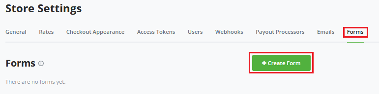
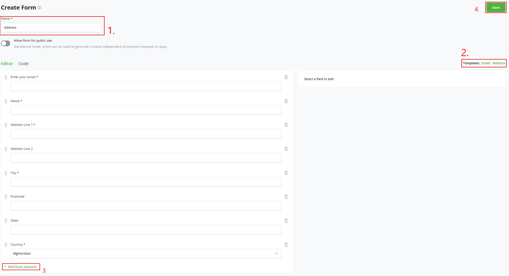
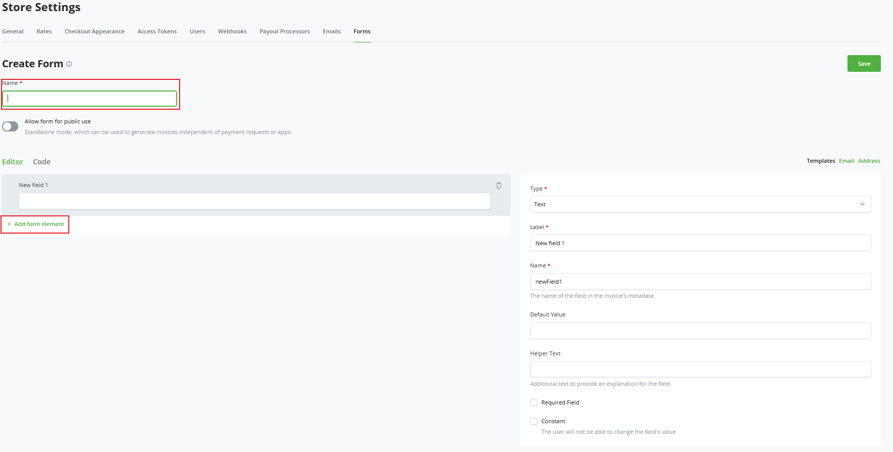
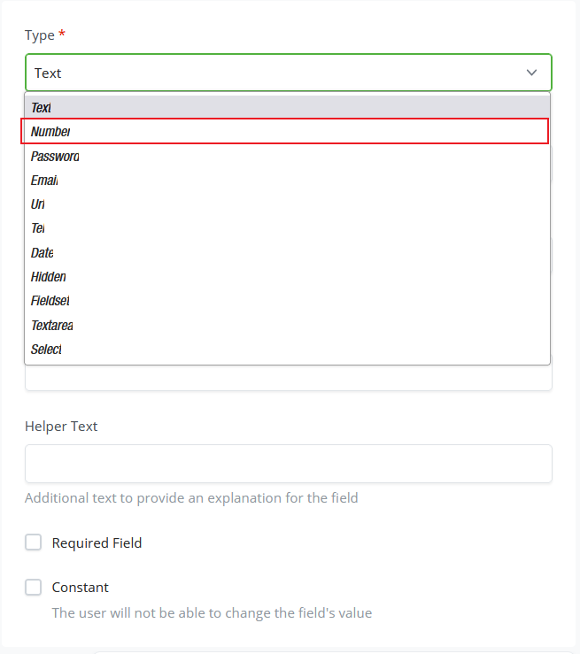
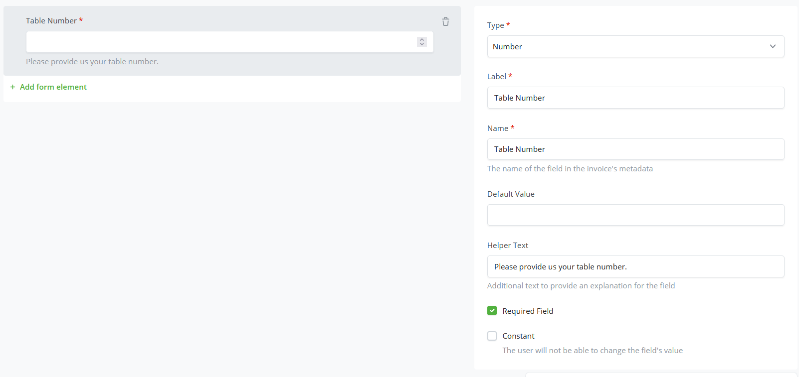

# Forms

BTCPay Server's Forms Builder enables you to request specific information from your customer.

These forms are fully customizable to suit your requirements.
In this introduction, we will go through the visual form builder; if you'd like to do more advanced settings, please visit the [Advanced Forms](./AdvancedForms.md) section of our documentation.

## Setting up your store's first Custom form.

In this example, we will start with creating a standard form we've pre-made.
Click on Store Settings and the last tab of your store settings is Forms. Click Forms to create your first Custom Form.

On the custom forms page, click Create New Form.
We've pre-made two examples, `Email` and `Address`.
For this example, click the Address form.

We can now drag around the fields pre-made by BTCPay Server.
You can re-order them or create a new field by clicking on the `Add form element` at the bottom of the form.

## Create a custom form.

You might have a different use case. For example if you own a restaurant you need to know the table number, how to call the customer when serving them, allergies, and special requests.

Let's create a custom form in the following steps.
We will start at the same settings tab from the previous example, Store settings -> Forms.

Click `create form` in the top right.
We'll start by giving it a name; in the example, we will use `Restaurant`.
Unlike before, we will start with the empty field that was generated.

1. We will name the first field, `Table number`
2. Define the `Type` of the field; we need it to be Text or Number, click on the drop-down and select `Number`.

3. The label we set for this field as it shows to the customer; in our example, we will name it `Table Number`.
4. Regarding The name of the field, we replicate the previous field's name, `Table Number`, for consistency.
5. We could define a `Default value`; however, we'll keep it empty in the example.
6. `Helper Text` This is the text provided below the field we are creating to indicate what you request from the customer.
7. Last, we can set two parameters; one is always to make it required to be filled out; in this example, we will set this to yes. And if it's a Constant, users can't change this so we won't use the setting for the example.

After you've filled in the parameters for the field, it should show on the left of your editor how the field displays and functions when the customer interacts with it.

Now that the first field is done, you can click on the `+ Add form element` below your first field and create the rest of the required form fields. Once you've made all the fields, click `Save` in the top right of your screen, and all should be set!

The `Form Builder` makes creating custom forms flexible and easy. If you still require more personalization, as mentioned at the start of this guide, please read on [Advanced Forms](./AdvancedForms.md) to learn about the JSON created in the `Code` tab in the Form builder.

## Public Forms

When `Allow form for public use` is enabled, a form can be used as a way to share a URL, where users must fill in the form and an invoice is then generated.

By default, the invoice currency is set to the store's default currency, and the amount is set to "any".

You can configure the form to have a pre-configured currency and amount by creating fields with specific names.

* Invoice currency: Create a field that has its name as `invoice_currency`. Make sure its value returns a valid currency code.
* Invoice amount: Create a field that has its name as `invoice_amount`. Make sure its value returns a number.

 You can create these fields with type `hidden` to not show it to the user. Additionally, if you'd like the user to not be able to modify the values, you must set `Constant` to checked.

 This can be used as an alternative to the Pay Button, with the added benefit that you can lock in invoice parameters such as amount and currency.

## Adjust invoice amounts based on user input

 In most modern ecommerce scenarios, you need to modify the amount being charged based on user input, such as their preferred shipping method, their country, promotional codes, etc.

 The form comes with such functionality as of BTCPay Server version 1.11.0. Any field that has its name start with `invoice_amount_adjustment` (supported since v1.11) or `invoice_amount_multiply_adjustment` (supported since v1.12) and its value being a valid number will automatically adjust the invoice amount.

 This functionality currently works for public form usage and for the Point of Sale plugin.
 See the [Mirror Fields](./AdvancedForms/#mirror-fields) section of the Advanced Forms guide for details.

### Charging extra based on shipping method

Create a field of type "select", with the name `invoice_amount_adjustment_shipping_method`, and options that map to what shipping methods you have available. We will use 2 options: `DHL` with a value of `10` and `Fedex` with a value of `20`.  When a user selects either or, the invoice amount will be adjusted by 10 or 20 respectively.

Note: This is a simple example. While the invoice amount will be correctly adjusted, you will not be able to see the selected shipping option inside the created invoice. We must make use of `Mirror` fields to accomplish this.

To save the user selected shipping method choice we must do the following instead:
* Create a field of type "select", with the name `shipping_method`, and options that map to what shipping methods you have available. We will use 2 options: `DHL` with a value of `dhl` and `Fedex` with a value of `fedex`.
* Create a field of type "mirror", with the name `invoice_amount_adjustment_shipping_method`. In `Field to mirror`, select the `shipping_method` field. And in `Value Mapper`, create all the options from `shipping_method` and the value to charge.

### Promo codes

* Create a field of type "text", with the name `promoCode`.
* Create a field of type "mirror", with the name `invoice_amount_adjustment_promo`. In `Field to mirror`, select the `promoCode` field. And in `Value Mapper`, create all the promotional codes you wish to have available. For example set `Original Value` to `chocolate` and `Mapped Value` to `-5`.

When the user enters `chocolate` in the promo code field, the invoice amount will be adjusted by -5.

### Showing user input on the receipt

By default, none of the user input will be shown on the invoice receipt. To do this, we must create a mapping for each field.
* Create a field of type `fieldset`, with name `receiptData`.
* For every field you wish to show in the receipt, create a field of type `mirror`, and set the `Field to mirror` to the field you wish to copy over to the receipt.
