## Requirements

Please ensure that you meet the following requirements before installing this plugin.

- PHP version 8.0 or newer
- The cURL, gd, intl, json, and mbstring PHP extensions are available
- A WordPress site with GiveWP installed ([Installation instructions](https://givewp.com/getting-started/intro-to-givewp/)
- You have a BTCPay Server version 2.0.0 or later, either [self-hosted](/Deployment/README.md) or [hosted by a third-party](/Deployment/ThirdPartyHosting.md)
- [You've a registered account on the instance](./RegisterAccount.md)
- [You've a BTCPay store on the instance](./CreateStore.md)
- [You've a wallet connected to your store](./WalletSetup.md)

## 1. Install BTCPay for GiveWP Plugin

There are three ways to install the **BTCPay for GiveWP** plugin:

- From within WordPress via the Admin Dashboard (recommended, see below)
- [WordPress plugin directory](https://wordpress.org/plugins/btcpay-for-givewp/)
- [GitHub Repository](https://github.com/btcpayserver/givewp/releases)

### 1.1 Install plugin from WordPress Admin Dashboard (recommended)

1. On left sidebar click _Plugins_ -> _Add New_.
2. In Search, type "BTCPay for GiveWP".
3. Click _Install now_ and then _Activate_.

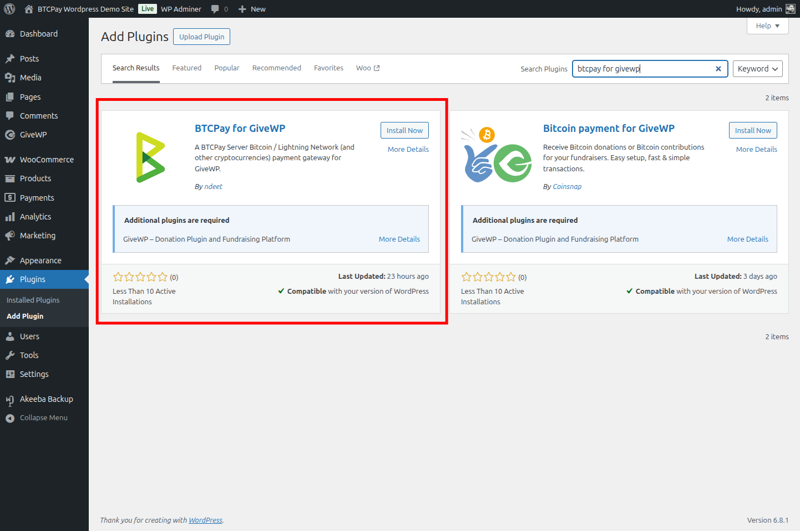

### 1.2 Download and install plugin from GitHub

Alternatively, you can download the plugin from GitHub and install it manually:

1. [Download the latest BTCPay plugin](https://github.com/btcpayserver/givewp/releases).
2. On WordPress admin dashboard click on _Plugins_ -> _Add Plugin_.
3. Click on _Upload Plugin_ button and select the .zip file you just downloaded.
4. Click _Install Now_ and then _Activate_.

## 2. Connecting GiveWP and BTCPay Server

BTCPay for GiveWP plugin is a **bridge between your BTCPay Server (payment processor) and your donation forms**.
No matter if you're using a self-hosted or third-party solution, the connection process is identical.

### 2.1 Create API key

On your BTCPay Server instance (ideally on a separate browser tab):

1. Click on _[Account]_ -> _Manage Account_ on the bottom left
2. Click on _"API Keys"_
3. Click _[Generate Key]_ to select permissions.
4. Click on the _"Select specific stores"_ link and select the GiveWP store you want to connect - for the following permissions: `View invoices`, `Create invoice`, `Modify invoices`, `Modify stores webhooks`, `View your stores`, `Create non-approved pull payments` (used for refunds (not implemented yet))
   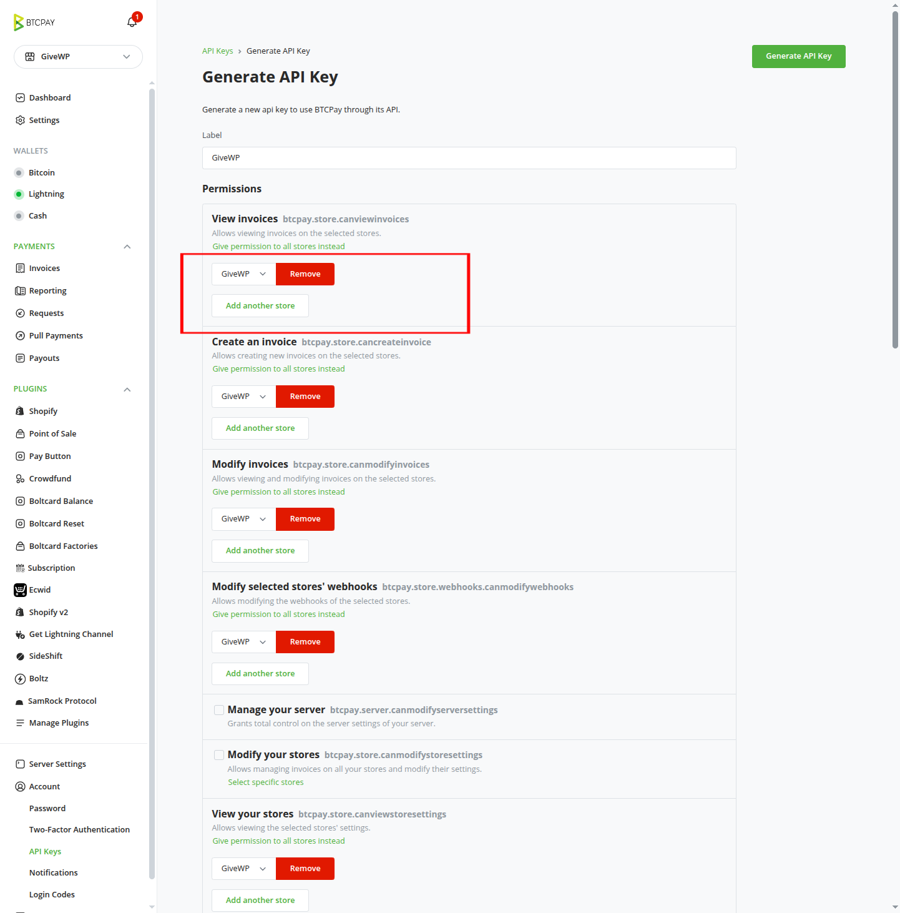
   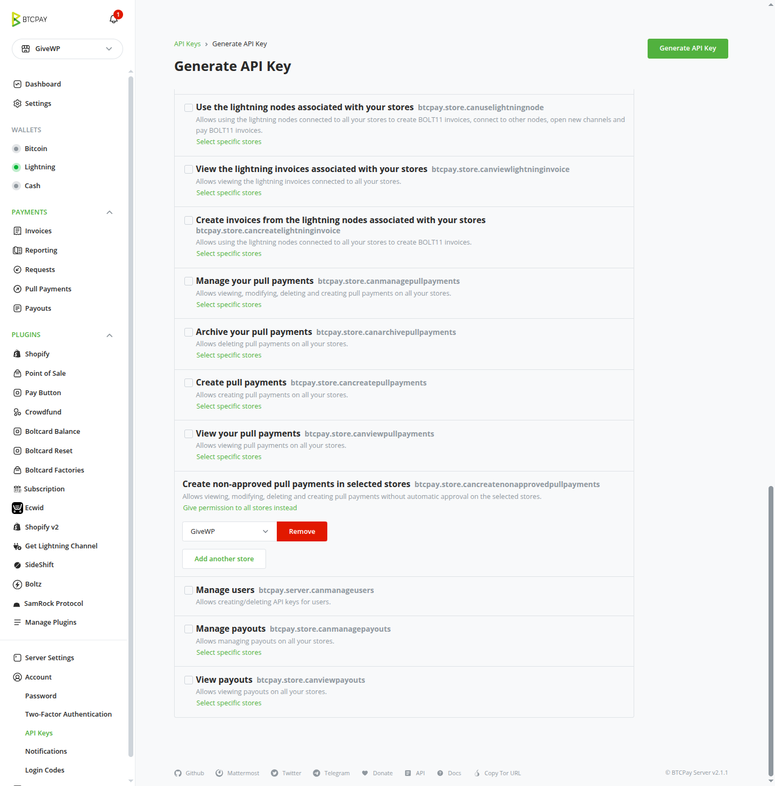
5. Click on the _[Generate API Key]_ button in the top right corner.
6. Copy the generated API Key and Store ID to a safe place. You will need them in the next steps.
   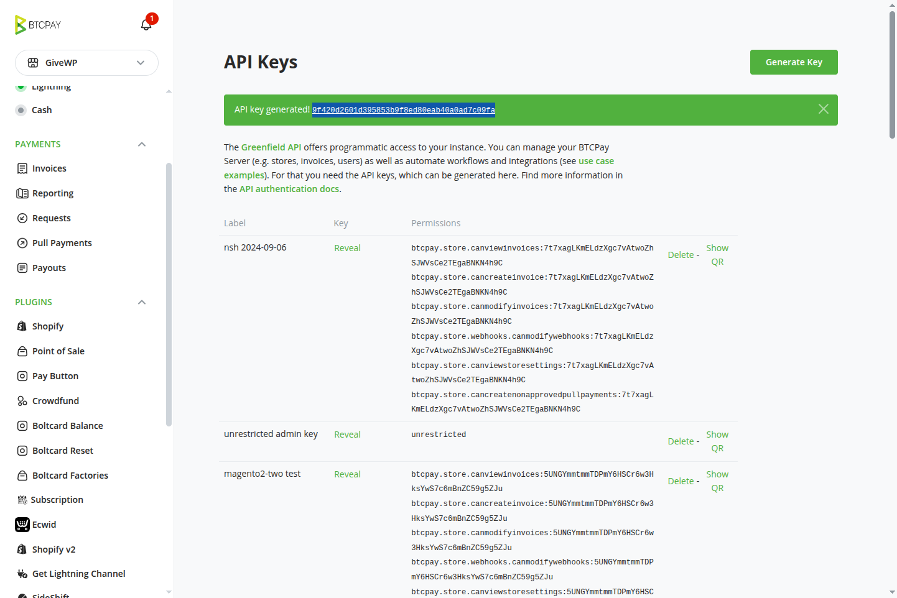

### 2.2 Copy Store ID

Still on your BTCPay Server instance:

1. In the left sidebar, in the stores dropdown, select the store you want to connect to GiveWP.
2. Still, in the left sidebar, click on _[Settings]_.
3. You will see the _Store ID_ at the top of the page.
   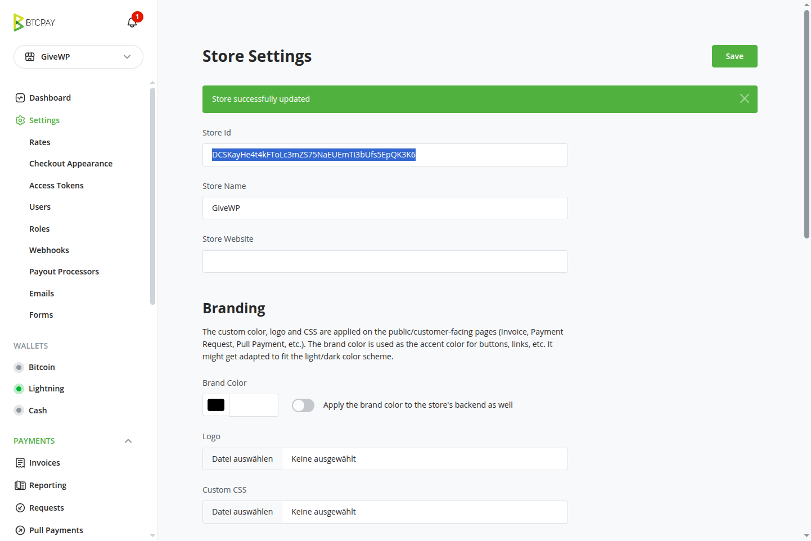
4. Copy the Store ID to a safe place. You will need it in the next steps.

### 2.3 Enter API key and store ID in GiveWP settings

Back on your WordPress site:

1. Go to your WordPress dashboard.
2. In the sidebar _GiveWP_ -> _Settings_ -> _Payment Gateways_.
3. Click on the _BTCPay Gateway_ tab.
4. Fill in the _BTCPay Server URL_ with your BTCPay Server instance URL (e.g., `https://btcpay.example.com`).
5. Copy the store ID to your GiveWP _BTCPay Settings_
6. Copy the generated API Key to your GiveWP _BTCPay Settings_ 
   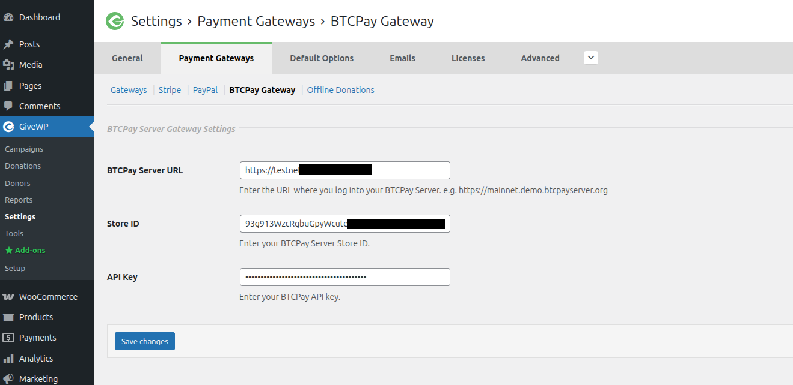
7. Click on _[Save changes]_ at the bottom of the page
8. Make sure you see the notification "_BTCPay for GiveWP: BTCPay Server API credentials verified successfully." and "BTCPay for GiveWP: Webhook created successfully." at the top of the page.
   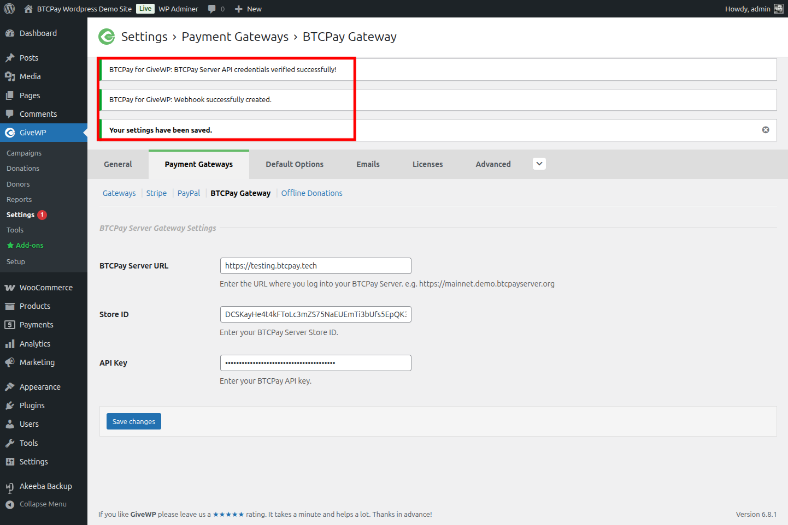
9. Now click on the [Gateways] link/tab at the top of the page to return to the gateways overview.

10. In the gateways overview, you should see the _BTCPay Server Gateway_ listed as an available payment gateway.
11. Make sure to put a checkmark in the "Enabled" column to enable the BTCPay Server Gateway. You can also make it the default gateway by checking the "Default" column.   
    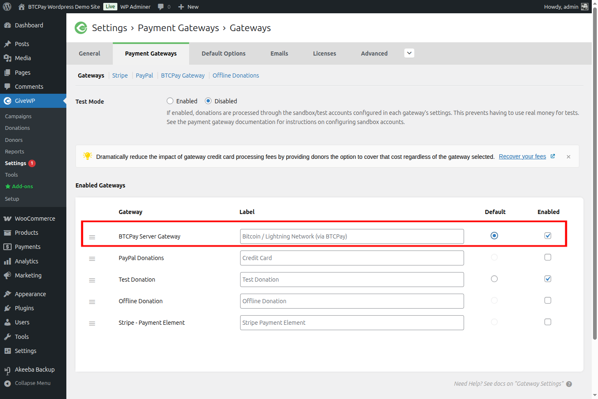

Congratulations, you are now ready to accept donations via BTCPay Server on your GiveWP donation forms!

## 3. Testing the donation payment

Making a small test-donation from your store will give you peace of mind.
Always make sure that everything is set up correctly before going live.

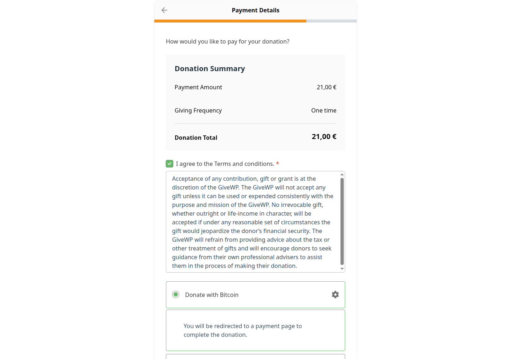
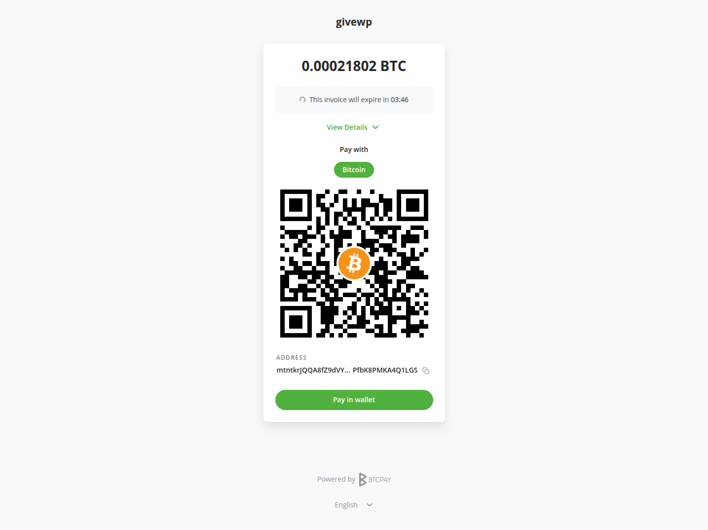
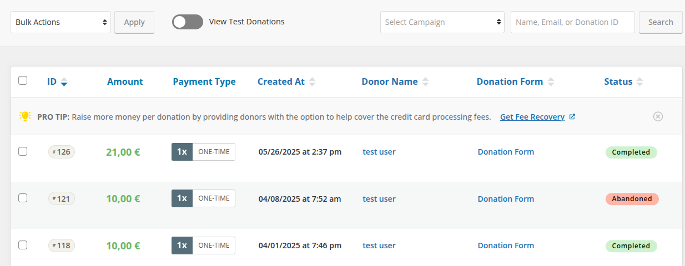