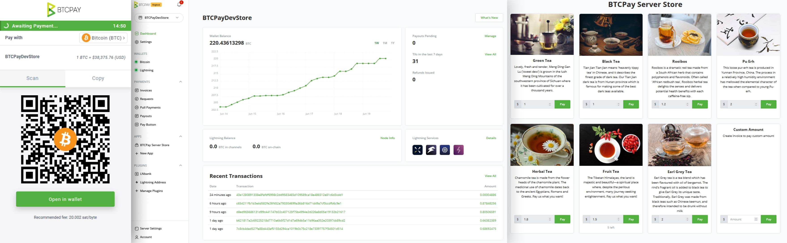

# BTCPay Server Documentation

## What is BTCPay Server?

BTCPay Server is a free, open-source & self-hosted bitcoin payment gateway that allows self-sovereign individuals and businesses to accept bitcoin payments online or in-person without any fees.

## How BTCPay Server works?

## Getting started

To start using BTCPay Server, [deploy](/Deployment/README.md) your own instance, or use a [third-party host](/Deployment/ThirdPartyHosting.md).

## Features

* Direct, peer-to-peer Bitcoin payments
* No transaction fees (other than the [network fee](https://en.bitcoin.it/wiki/Miner_fees))
* No processing fees
* No middleman
* No KYC
* Non-custodial (complete control over the private key)
* Enhanced privacy
* Enhanced security
* Self-hosted software
* SegWit support
* Lightning Network support (LND, c-lightning & Eclair implementations)
* Tor support
* Opt-in [altcoin](./Development/Altcoins.md) integrations
* Full compatibility with legacy BitPay API (easy migration)
* Process payments for others
* Easy-embeddable payment buttons
* Point of sale app
* Crowdfunding app
* Payment Requests
* Internal, full-node reliant wallet with [hardware wallet integration](./HardwareWalletIntegration.md)
* [Payjoin Support](./Payjoin.md)

## Get involved

Contributing to an open-source project is great way to learn, network and build your portfolio. BTCPay Server is maintained by volunteers around the internet. If you would like to contribute to the project development, check our [contributing guidelines](/Contribute.md)

If you're interested in helping out with documentation, take a look at the video below.

## Support

If you have trouble using BTCPay Server, consider joining the [communities listed on the official website](https://btcpayserver.org/#communityCTA) to get help from BTCPay community members.

Only file a [Github issue](https://github.com/btcpayserver/btcpayserver/issues) for technical issues you can't resolve through other channels or feature requests you've validated with other members of the community.

Please check out our [official website](https://btcpayserver.org/),and [FAQ](./FAQ/README.md#btcpay-frequently-asked-questions-and-common-issues) for more details.

!!!include(supporters.html)!!!
