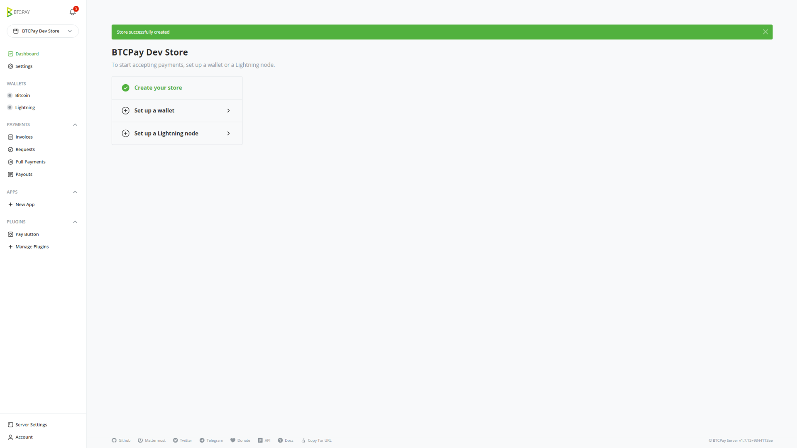
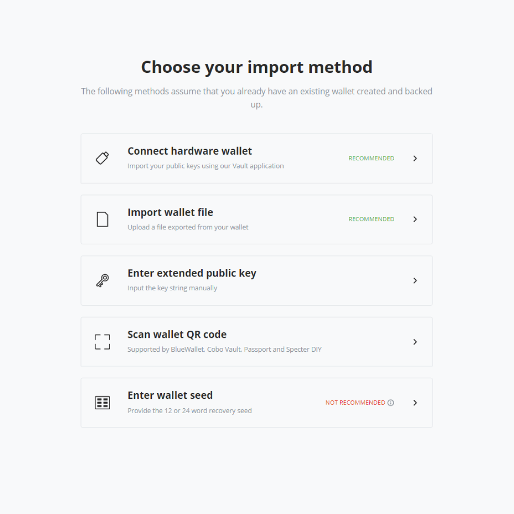
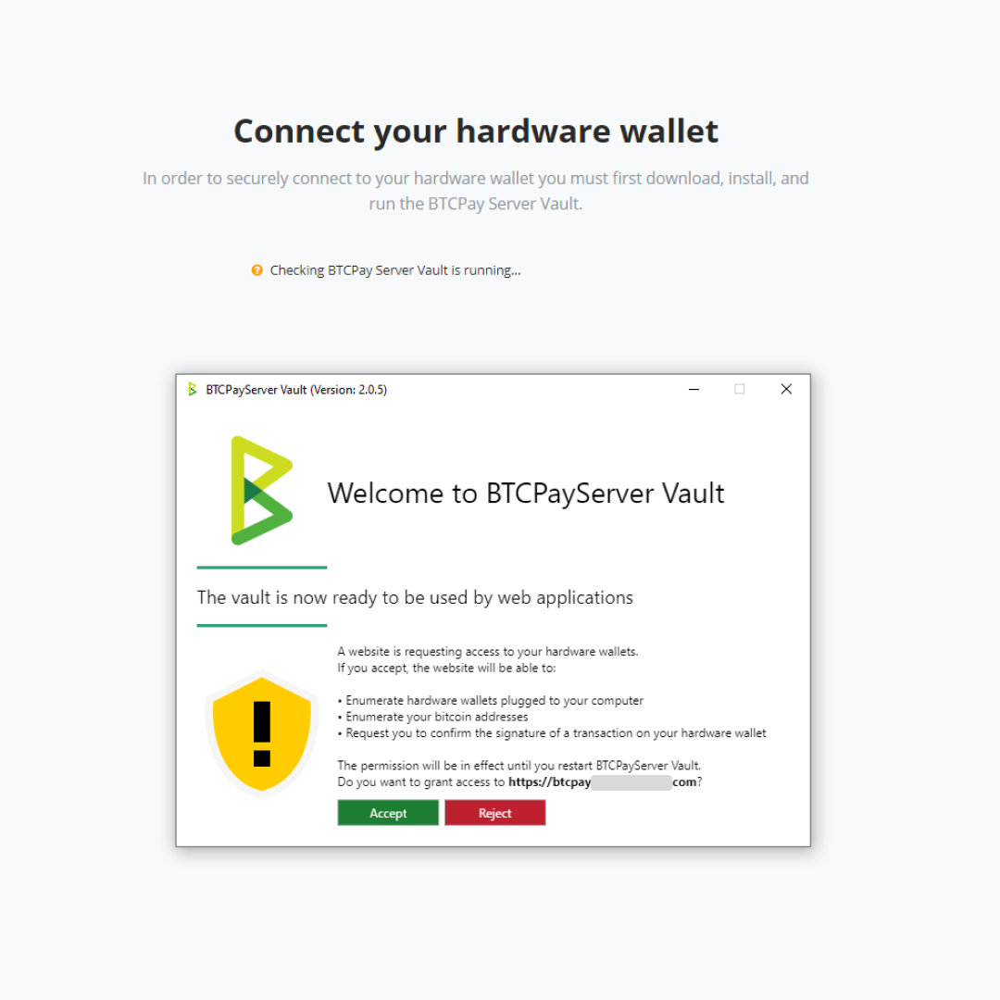
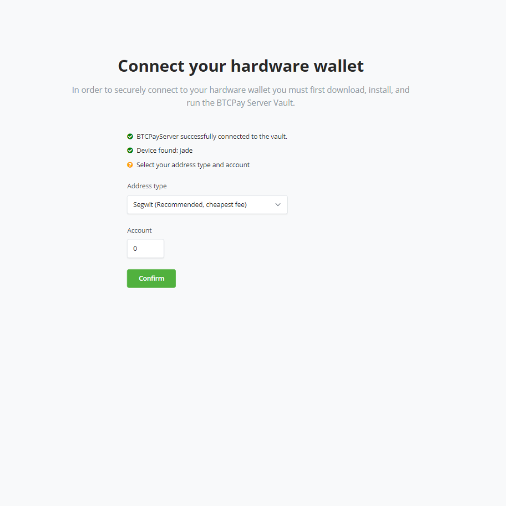
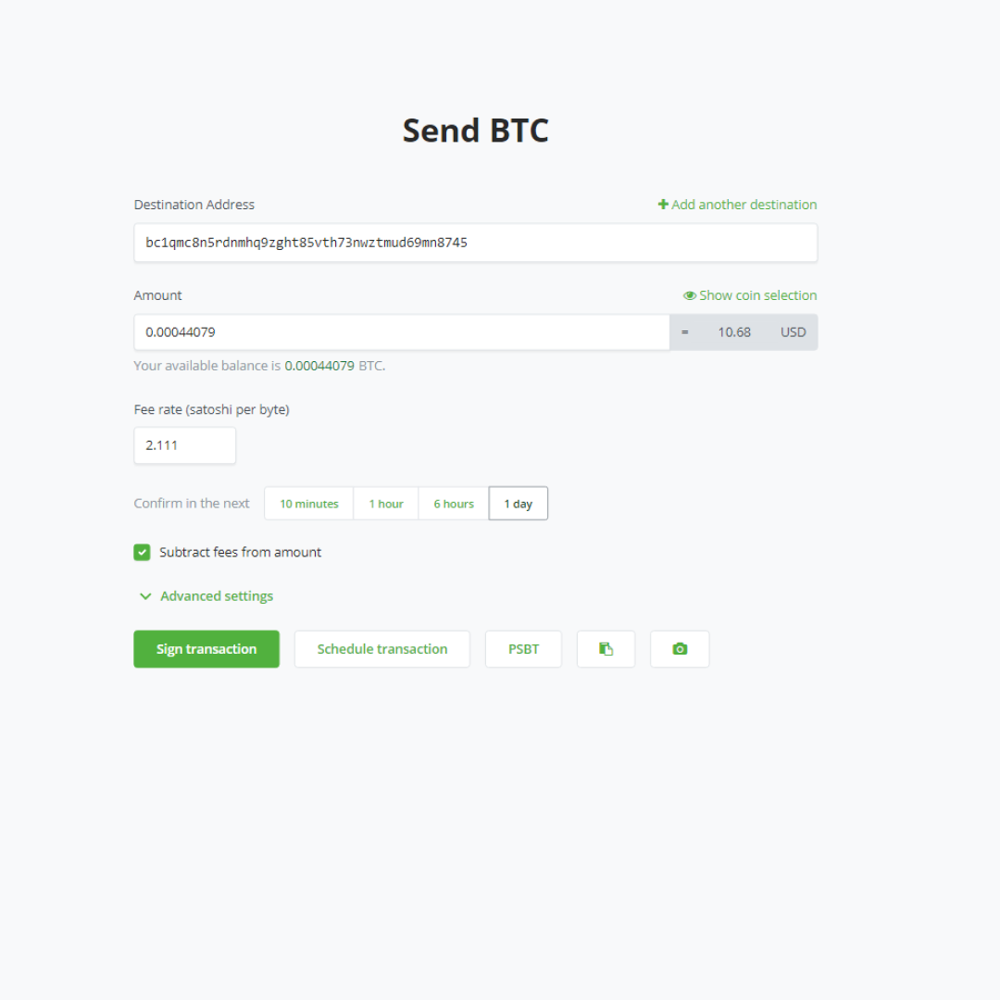
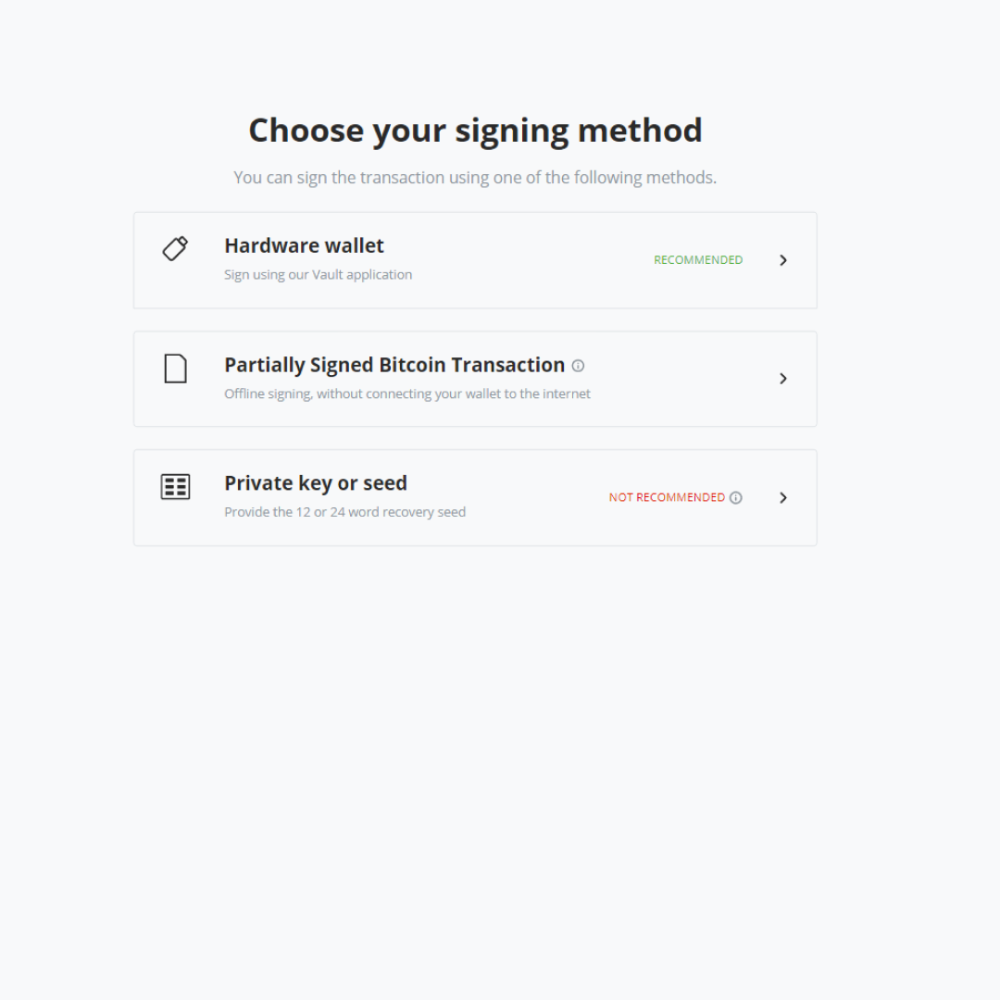

# Hardware Wallet Integration

For optimal balance between ease of use, security and privacy, it's recommended to use [BTCPay Server Wallet](Wallet.md) with a hardware wallet.

The hardware wallet integration within BTCPay Server allows you to import your hardware wallet and spend the incoming funds with a simple confirmation on your device. Your private keys never leave the device and all funds are being validated against your own full node and no data leakage.

## Getting Started

1. [Download the BTCPay Vault app](https://github.com/btcpayserver/BTCPayServer.Vault/releases)
2. Install the Vault on your PC (Windows, MacOS or Linux)
3. Open the BTCPay Vault app
4. Plug in the hardware wallet into your PC and make sure it’s in a wake up state
5. Do you have an existing store? Skip ahead to step 7.
6. Connect existing wallet and then click on the Connect a hardware wallet.
7. Now you will see BTCPay Server searching for your hardware wallet, this step requires you to run BTCPay Server Vault.
8. Click accept on your BTCPay Vault application. Vault is now searching for your device, it will now ask for your pin on the device.
9. After device was found and accepted, select your address type and click confirm. BTCPay Server will show your public key information from your hardware wallet.
10. Once you've confirmed the public key is correct, BTCPay Server now shows the address to validate on your device. If they are correct click confirm to complete the setup.

### Spending funds

Once you’ve received funds to your wallet and you decide to spend them, you can sign the transaction with your hardware wallet, all inside BTCPay Server.

1. Open BTCPay Vault app on your PC
2. Plug in the hardware wallet and make sure it’s in wake up state
3. In BTCPay Server, go to your Bitcoin Wallet and click on send
4. Fill in the Destination address and the Amount
5. Select Sign with a hardware wallet
6. Verify the transaction on your hardware wallet and confirm it
7. Broadcast the transaction

## Advanced Settings

Additional transaction settings can be found by clicking on the [Advanced Settings](Wallet.md#advanced-settings) button. If you are not familiar with these types of settings, you may leave them as is to use the default settings.

If you are experiencing issues sending transactions from a Trezor wallet, you may need to enable [this advanced setting](FAQ/Wallet.md#why-is-sending-a-transaction-using-trezor-failing).

## Supported Hardware Wallets

The list of supported hardware wallets is available at [this link](https://github.com/bitcoin-core/HWI#device-support).

:::warning
The hardware wallet integration in BTCPay Server only supports Bitcoin. [Altcoin](/Development/Altcoins.md) wallets enabled on your server won't work.
:::
