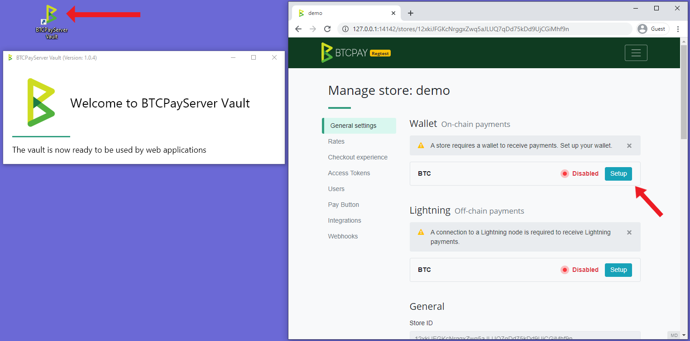

# Hardware Wallet Integration

For optimal balance between ease of use, security and privacy, it's recommended to use [BTCPay Server Wallet](Wallet.md) with a hardware wallet.

The hardware wallet integration within BTCPay Server allows you to import your hardware wallet and spend the incoming funds with a simple confirmation on your device. Your private keys never leave the device and all funds are being validated against your own full node and no data leakage.

## Getting Started

1. [Download the BTCPay Vault app](https://github.com/btcpayserver/BTCPayServer.Vault/releases)
2. Install the Vault on your PC (Windows, MacOS or Linux)
3. Open the BTCPay Vault app
4. Plug in the hardware wallet into your PC and make sure it’s in a wake up state
5. Go to your BTCPay Server’s Store > Settings > Wallet > Setup > **Import from a hardware wallet**
6. Grant the permission
7. The public key will automatically be imported in the store and configured to an appropriate format
8. Validate that address shown on BTCPay is the same as the one on your device
9. Save

### Spending funds

Once you’ve received funds to your wallet and you decide to spend them, you can sign the transaction with your hardware wallet, all inside BTCPay Server.

1. Open BTCPay Vault app on your PC
2. Plug in the hardware wallet and make sure it’s in wake up state
3. In BTCPay Server, go to > Wallets > Manage > Send
4. Fill in the Destination address and the Amount
5. Select Sign with a hardware wallet
6. Verify the transaction on your hardware wallet and confirm it
7. Broadcast the transaction

## Advanced Settings

Additional transaction settings can be found by clicking on the [Advanced Settings](Wallet.md#advanced-settings) button. If you are not familiar with these types of settings, you may leave them as is to use the default settings.

If you are experiencing issues sending transactions from a Trezor wallet, you may need to enable [this advanced setting](FAQ/Wallet.md#why-is-sending-a-transaction-using-trezor-failing).

## Supported Hardware Wallets

The list of supported hardware wallets is available [on this link](https://github.com/bitcoin-core/HWI#device-support).

:::warning
The hardware wallet integration in BTCPay Server only supports Bitcoin. [Altcoin](/Development/Altcoins.md) wallets enabled on your server won't work.
:::
