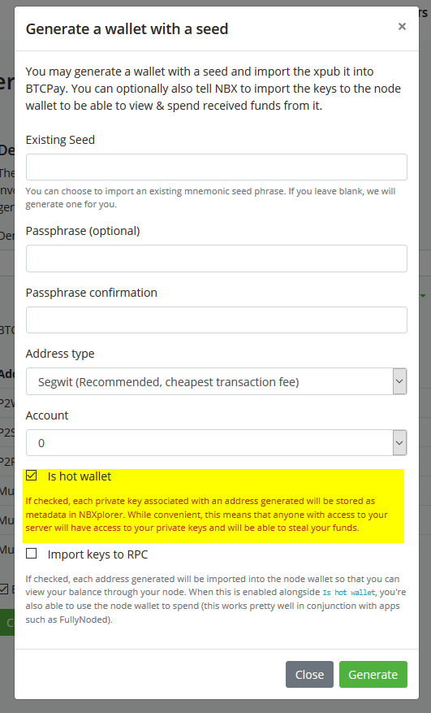
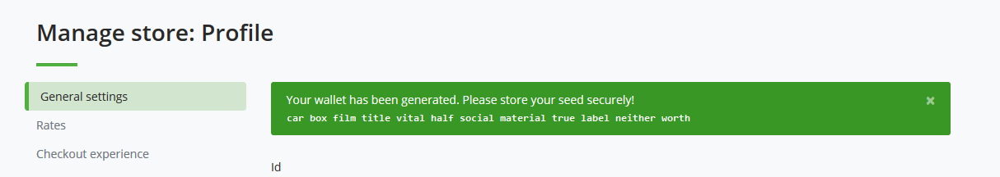

# BTCPay Hot Wallet

BTCPay Server also allows stores to generate or import a wallet while also (optionally) storing its private keys. This enables generating new wallets entirely within BTCPay, [Payjoin support](Payjoin.md) and is a requirement for [Liquid support](https://github.com/btcpayserver/btcpayserver/issues/1282).

## Security Implications

Storing private keys on a public server comes with risks. This is similar to the risks of running and using the [Lightning Network](LightningNetwork.md) (except that you can recover funds with a backup). **Please, ALWAYS be sure to back up any seed that is generated by this feature and to never leave money you cannot afford to lose spendable by those private keys**.

## Requirements for Hot Wallet

By default, you need to be a server admin to use the hot wallet feature. This is because server admins are able to extract the private key easily. If for some reason (such as allowing individuals that trust you enough with their store), you can enable the hot wallet for non-admins from Server Settings->Policies->"Allow non-admins to create hot wallets for their stores".

### Setting up your store

Setting up a hot wallet is quite easy.

1. Go to your BTCPay Server’s Store > General Settings > Derivation Scheme > **Import from a new/existing seed.**
2. If you have already generated a seed, you can provide it to the hot wallet.
3. Be sure to tick "Is hot wallet" for the key to be stored (not ticking this will not store any private key).
4. Press Generate
5. If you did not provide an existing seed, a seed will be generated and shown to you. You MUST backup this seed responsibly.
6. The public key will automatically be imported in the store and configured to an appropriate format.
7. If you provided an existing seed, a list of preview addresses will be shown. Validate that they are the same as the one on your wallet and Save.

### Spending funds with BTCPay Hot Wallet

Once you’ve received funds to your wallet and you decide to spend them, you can sign the transaction automatically, all inside BTCPay Server.

1. In BTCPay Server, go to > Wallets > Manage > Send
2. Fill in the Destination address and the Amount
3. Select Sign with the seed saved in NBXplorer
4. Broadcast the transaction

## Reducing risk

As mentioned above, the hot wallet functionality includes risk of funds being stolen in the case of the server or account being compromised. To mitigate this risk, we advise you to:

* Enable two factor or U2F authentiation
* Occasionally move funds to your cold storage either manually or by configuring [BTC Transmuter](https://github.com/btcpayserver/btcTransmuter/blob/master/README.md) with automatic payment forwarding.

## Importing seeds with an existing balance

You can import an existing seed with an existing balance but will need to [rescan it](Wallet.md#re-scan).
