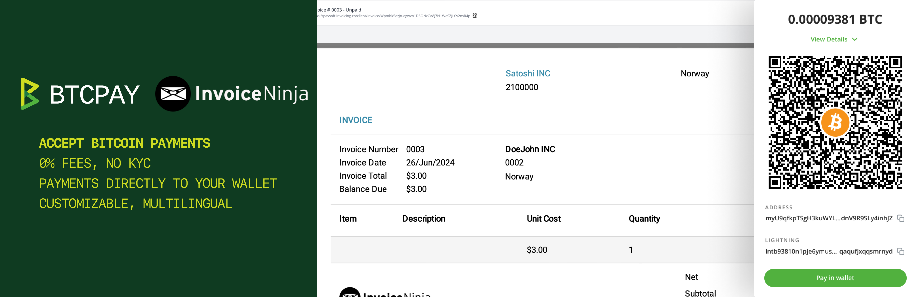
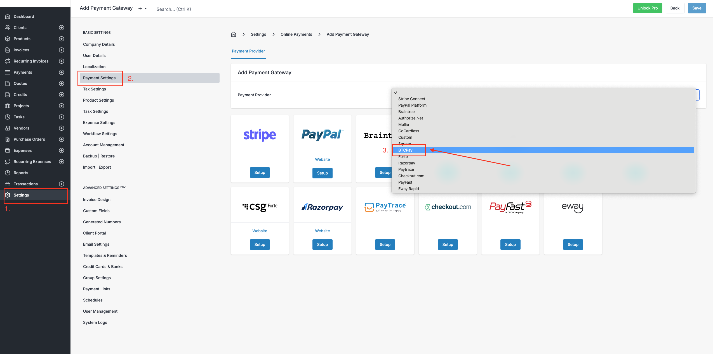
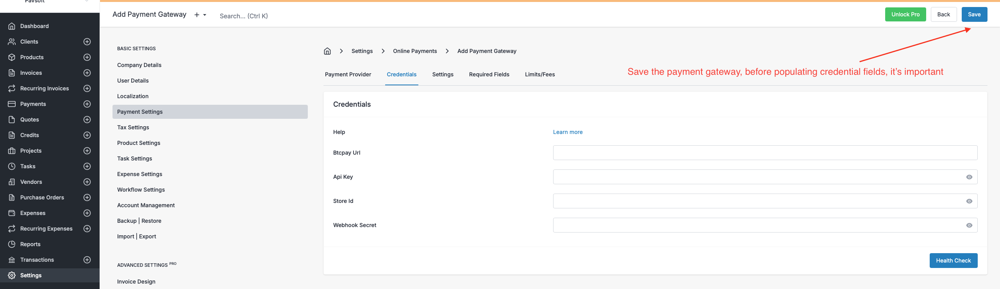
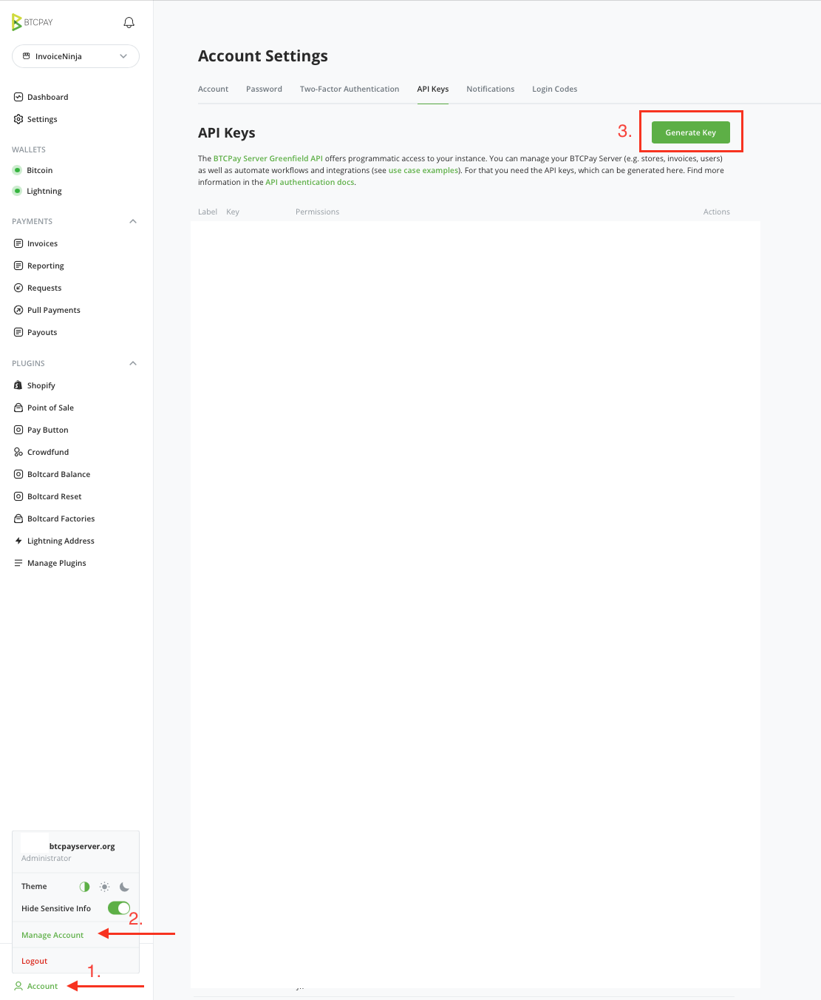
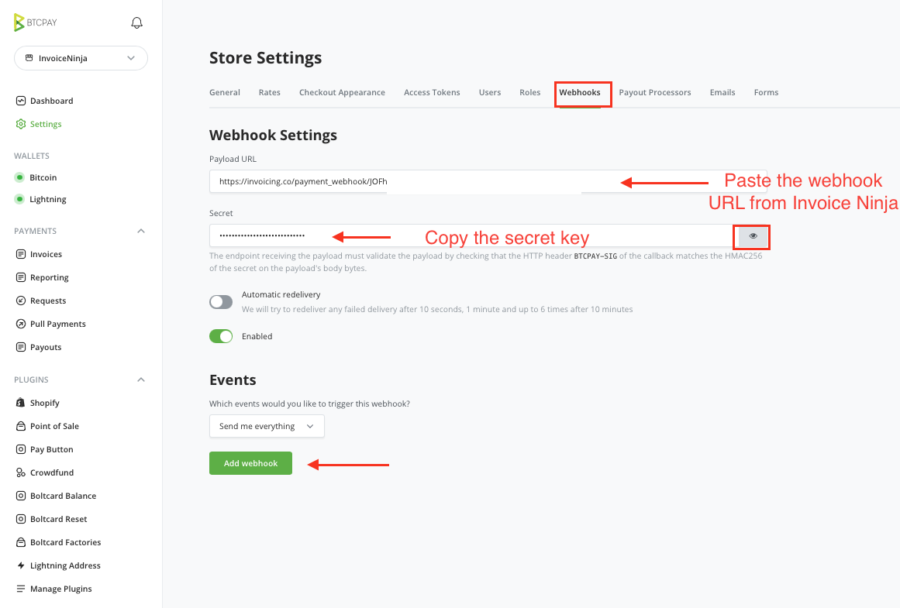
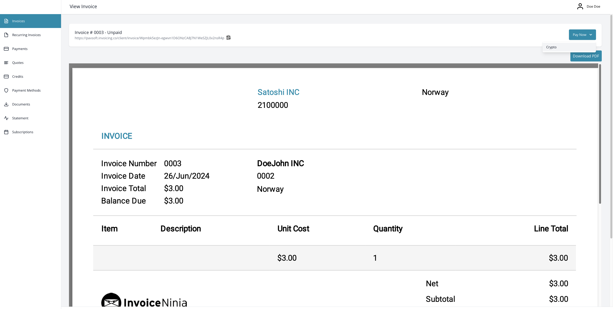
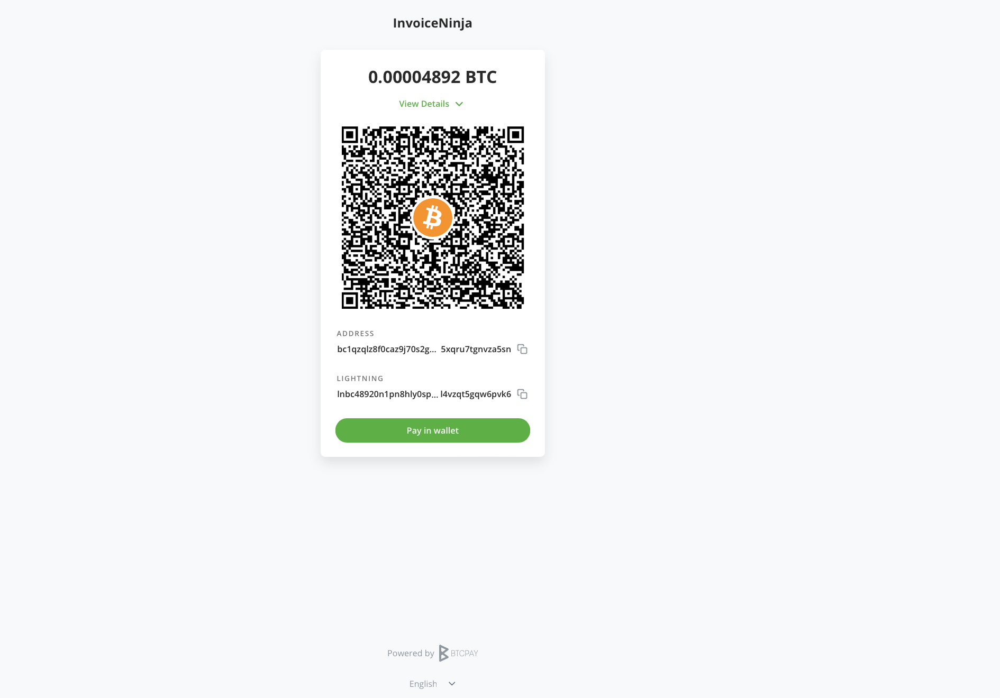

# How to accept Bitcoin payments with Invoice Ninja?

[Invoice Ninja](http://invoiceninja.com) is a robust invoicing and billing software designed to help small businesses, freelancers, and entrepreneurs manage their invoices, payments, and clients. With its wide array of features, InvoiceNinja simplifies the billing process, allowing users to focus on growing their business. 

The integration of [BTCPay Server](https://btcpayserver.org) with Invoice Ninja enables you to accept bitcoin as a payment method, without fees, intermediaries with payments going directly to your bitcoin wallet. 

This guide will walk you through the steps to configure and use your BTCPay Server with InvoiceNinja. BTCPay payment capabilities are directly integrated into InvoiceNinja. No plugins are needed.

## Requirements

- InvoiceNinja (hosted or self-hosted)
- BTCPay Server ([self-hosted](https://docs.btcpayserver.org/Deployment/) or hosted by a [third-party provider](https://docs.btcpayserver.org/Deployment/ThirdPartyHosting/))
- [Created store](https://docs.btcpayserver.org/CreateStore/) on BTCPay Server
- [Connected wallet](https://docs.btcpayserver.org/WalletSetup/) on BTCPay Server

## 1. Payment Gateway configuration

To configure BTCPay in Invoice Ninja, follow these steps:

1. Log in to the Invoice Ninja Admin Portal:
2. Go to the Settings > **Payment Settings**
3. In the top right corner, click on the **Add payment gateway**
4. Scroll through the dropdown menu and click **BTCPay**
5. Next, you’ll see the BTCPay configuration page. It’s important that **before adding any data** in the credential fields, **you click Save, to create a payment gateway**. 

Once we created a payment gateway, let’s proceed to step 2, and pair our BTCPay Server with Invoice Ninja.

## 2. Pairing your BTCPay Server

### 2.1 BTCPay URL

In the BTCPay URL field of your, simply input the link to your self-hosted server or the one hosted by a [third-party provider](https://directory.btcpayserver.org/filter/hosts). 
*For example; https://mainnet.demo.btcpayserver.org*

### 2.2 BTCPay Store ID

BTCPay Store ID can be obtained from your BTCPay Server, in **Store Settings > General > Store ID** field. Copy it and paste it over in the BTCPay Store ID field.

### 2.3 Generating the API key

To create the BTCPay API key, click on the Account located at the bottom of the sidebar.
1. Click on the **Manage Account > API Key**.
2. Click on the **Generate API** key button
3. Click on the checkboxes and enable the following permissions:
    - View invoices
    - Create an invoice
    - Modify invoices
    - Modify selected stores' webhooks
    - View your stores
    - Create non-approved pull payments in selected stores
4. Optionally, if you have multiple BTCPay Stores, you can select a store to which permissions apply 
5. **Reveal and copy the API key** by and **paste** it over in the Invoice Ninja in the API Key field.

### 2.4 Generating the webhook

1. In your InvoiceNinja, under your **Payment Settings > Edit Payment Gateway,** click on the **Payment Gateway** tab, and copy the **Webhook URL**" 
2. Next, go to your BTCPay Server Store Settings > **Webhooks**
3. Click on the **Create Webhook** button
4. Paste the Webhook URL you copied from InvoiceNinja (step 1) into **Payload URL** field
4. Click on the "Eye" icon next to the Secret field to reveal the secret key and copy it.
5. Don't forget to click on the Add webhook to apply all the changes.
6. Go back InvoiceNinja and paste the Secret Key into the Webhook Secret field
7. Click **Save** to apply all the changes

*In the"Settings" and "Limits/Fees" tab, you can set other options, common to other InvoiceNinja payment systems.*

### 3. Enable Crypto payment method

Once everything is set up, don’t forget to enable the Crypto payment option from the Payment Gateway Settings tab, and click save.

Now you are all set! Feel free to generate invoices for your clients and get paid in Bitcoin.

