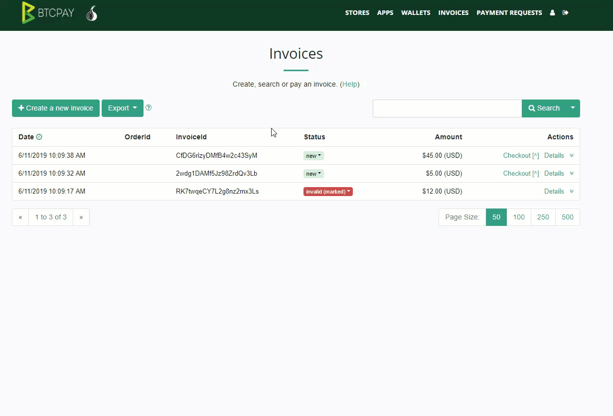

# Invoices

The invoices page lists the **invoices from all stores and [apps](./Apps.md) and [payment requests](./PaymentRequests.md) in BTCPay Server**.
It cumulatively sorts invoices by date and allows plenty of customization options for a better invoice management.

## Managing Invoices

### Invoice Filtering

Invoices can be filtered via the quick filters located next to the search button or via the advanced filters which can be toggled by clicking the (Help) link on the top of the page.
Users can **filter invoices** by store, order id, item id, status or a date.

### Invoice Export

**BTCPay Server Invoices can be exported in CSV or JSON format**.
For more information about invoice export and accounting, [see this page](./Accounting.md).

## Invoice Statuses

Table below lists and describes common invoice statuses in BTCPay and suggests common actions.
Actions are just recommendations.
It's up to users to define best course of action for their use-case and business.

| Invoice Status         | Description                                                  | Action        |
| ---------------------- | ------------------------------------------------------------ | ------------- |
| New                    | Not paid, invoice timer still has not expired                | None          |
| New (paidPartial)      | Not paid in full, invoice timer still has not expired        | None          |
| Expired                | Not paid, invoice timer expired                              | None          |
| Paid                   | Paid, but has not received sufficient amount of confirmations specified in the Store Settings | Wait for confirmations (The invoice should become - complete) |
| Confirmed*             | Paid, confirmed, by reaching the number of confirmations in store settings but has not received the default number (6) of confirmations in BTCPay. | Wait for remaining confirmations, or proceed if store settings confirmations is acceptable  |
| Complete               | Paid, completed, received sufficient amount of confirmations in store | Fulfil the order |
| Complete (marked)      | Status was manually changed to complete from an invalid or expired status | Store admin has marked the payment as complete |
| Expired (paidPartial)**| Paid, not in full amount, and expired                    | Contact buyer to arrange a refund or ask for them to pay their due. Optionally mark invoice as complete or invalid |
| Expired (paidLate)     | Paid, in full amount, after expired                      | Contact buyer to arrange a refund or process order if late confirmations are acceptable.  | Optionally mark as complete or mark as invalid |
| Paid (paidOver)        | Paid more than the invoice amount, but has not received sufficient amount of confirmations specified in the Store Settings | Wait for confirmations. The invoice should become - Complete (Paid Over) |
| Complete (paidOver)    | Paid more than the invoice amount, completed, received sufficient amount of confirmations | Contact buyer to arrange a refund for the extra amount, or optionally wait for buyer to contact you |
| Invalid***             | Paid, but failed to receive sufficient amount of confirmations within the time specified in store settings | Check the transaction on a blockchain explorer, if it received sufficient confirmations, mark as complete |
| Invalid (marked)       | Status was manually changed to invalid from a complete or expired status | Store admin has marked the payment as invalid |
| Invalid (paidOver)     | Paid more than the invoice amount, but failed to receive sufficient amount of confirmations within the time specified in store settings | Check the transaction on a blockchain explorer, if it received sufficient confirmations, mark as complete |

* *Invoices paid via the [Lightning Network](./LightningNetwork.md) immediately go to a completed state, as their confirmation is instant.
* **Paid Partial invoice usually happens when a buyer pays the invoice from the exchange wallet  which takes a fee for their service and deducts it from a total. In some cases, it happens when buyer enters an  incorrect amount in their wallet.
* ***Invalid - If you're receiving a lot of invalid invoices in your store, you may want to [adjust invalid invoice time in store settings](./FAQ/FAQ-Stores.md#payment-invalid-if-transactions-fails-to-confirm-minutes-after-invoice-expiration).
