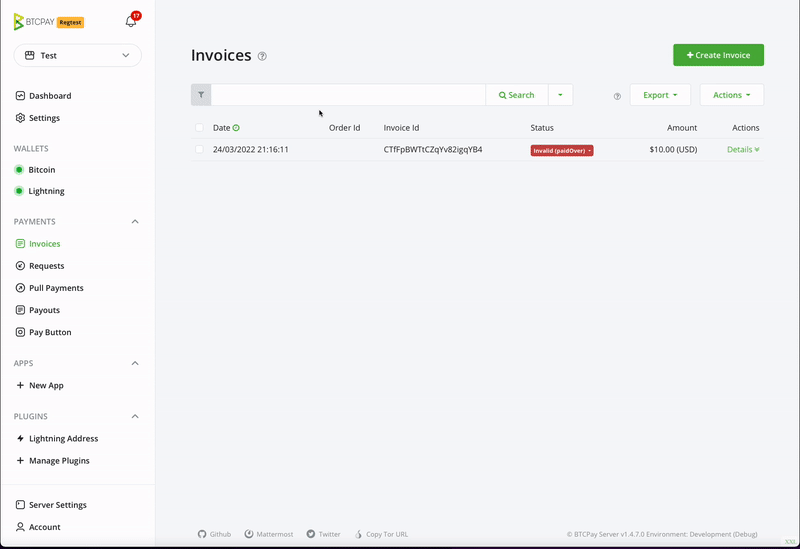

# What is an invoice in BTCPay Server?

An **invoice** is a document issued by the seller to a buyer to collect payment.

In BTCPay Server, an invoice represents a document that must be paid within a **defined time interval** at a fixed exchange rate. Invoices have expiration because they lock the exchange rate within a specified time frame to protect the receiver from price fluctuations.

The core of BTCPay Server is the ability to act as a bitcoin invoice management system. An invoice is an essential tool for keeping track and managing a received payment.

Unless you use a built in [Wallet](/Wallet.md) to receive payments manually, all payments within a store will be shown on the `Invoices` page. This page cumulatively sorts payments by date and is a central piece for invoice management and payment troubleshooting.

## Invoice statuses

Table below lists and describes common invoice statuses in BTCPay and suggests common actions.
Actions are just recommendations.
It's up to users to define best course of action for their use-case and business.

| Invoice Status                 | Description                                                                                                                             | Action                                                                                                                      |
| ------------------------------ | --------------------------------------------------------------------------------------------------------------------------------------- | --------------------------------------------------------------------------------------------------------------------------- | --------------------------------------------- |
| **New**                        | Not paid, invoice timer still has not expired                                                                                           | None                                                                                                                        |
| **New (paidPartial)**          | Paid, not in full, invoice timer still has not expired                                                                                  | None                                                                                                                        |
| **Expired**                    | Not paid, invoice timer expired                                                                                                         | None                                                                                                                        |
| **Expired (paidPartial)** \*\* | Paid, not in full amount, and expired                                                                                                   | Contact buyer to arrange a refund or ask for them to pay their due. Optionally mark invoice as settled or invalid           |
| **Expired (paidLate)**         | Paid, in full amount, after the invoice timer has expired                                                                               | Contact buyer to arrange a refund or process order if late confirmations are acceptable.                                    | Optionally mark as settled or mark as invalid |
| **Settled (paidOver)**         | Paid more than the invoice amount, settled, received sufficient amount of confirmations                                                 | Contact buyer to arrange a refund for the extra amount, or optionally wait for buyer to contact you                         |
| **Processing**                 | Paid in full, but has not received sufficient amount of confirmations specified in the store settings                                   | Wait for confirmations (The invoice should become - settled)                                                                |
| **Processing (paidOver)**      | Paid more than the invoice amount, not received sufficient amount of confirmations                                                      | Wait to be settled then contact buyer to arrange a refund for the extra amount, or optionally wait for buyer to contact you |
| **Settled**                    | Paid, in full, received sufficient amount of confirmations in store                                                                     | Fulfil the order                                                                                                            |
| **Settled (marked)**           | Status was manually changed to settled from an processing or invalid status                                                             | Store admin has marked the payment as settled                                                                               |
| **Invalid\***                  | Paid, but failed to receive sufficient amount of confirmations within the time specified in store settings                              | Check the transaction on a blockchain explorer, if it received sufficient confirmations, mark as settled                    |
| **Invalid (marked)**           | Status was manually changed to invalid from a settled or expired status                                                                 | Store admin has marked the payment as invalid                                                                               |
| **Invalid (paidOver)**         | Paid more than the invoice amount, but failed to receive sufficient amount of confirmations within the time specified in store settings | Check the transaction on a blockchain explorer, if it received sufficient confirmations, mark as settled                    |

- - Invoices paid via the [Lightning Network](./LightningNetwork.md) immediately go to a settled state, as their settlement is instant.
- \*\* Paid Partial invoice usually happens when a buyer pays the invoice from the exchange wallet which takes a fee for their service and deducts it from a total. In some cases, it happens when buyer enters an incorrect amount in their wallet.
- \*\*\* Invalid - If you're receiving a lot of invalid invoices in your store, you may want to [adjust invalid invoice time in store settings](./FAQ/Stores.md#payment-invalid-if-transactions-fails-to-confirm-minutes-after-invoice-expiration).

### Invoice details

The invoice details page contains all information related to an invoice.

Invoice information is created automatically based on invoice status, exchange rate, etc. Product information is created automatically if the invoice was created with product information such as in the Point of Sale app. Read about collecting Buyer information [here](./FAQ/Stores.md#how-to-collect-additional-buyer-information).

### Invoice filtering

Invoices can be filtered via the quick filters located next to the search button or the advanced filters, which can be toggled by clicking the (Help) link on the top. Users can **filter invoices** by store, order id, item id, status, or date.

### Invoice export

BTCPay Server Invoices can be exported in CSV or JSON format. For more information about invoice export and accounting, [see this page](./Reporting.md).

## Refunding an invoice

If for any reason you would like to issue a refund, you can easily create a refund from the invoice view. Check our [refunding documentation](/Refund.md) for more information.

## Archiving invoices

As a result of the no address re-use feature of BTCPay Server, it's common to see many expired invoices in your store's invoice page. To hide them from your view, select them in the list and mark them as **archived**. Invoices that have been marked as archived are not deleted. Payment to an archived invoice will still be detected by your BTCPay Server (paidLate status). You can view the store's archived invoices at any time by selecting archived invoices from the search filter dropdown.
