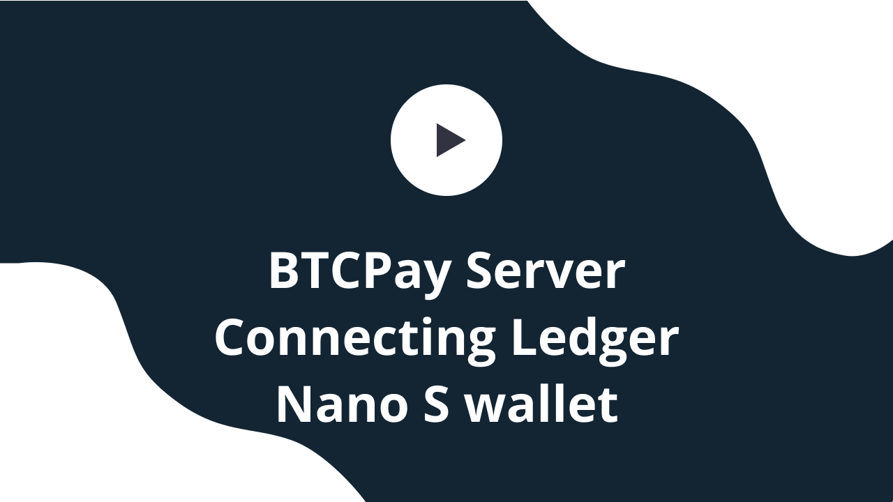

# Connecting Ledger Wallet to BTCPay Server

This document shows how to connect Ledger Nano S Wallet to BTCPay Server. 

## Ledger Nano S Wallet Setup

This guide assumes, you have a Nano S wallet set up. To configure the Nano S, please see the [quick setup guide on manufacturer's website](https://www.ledger.com/start/).

### Requirements

1. Bitcoin App installed on the Ledger
2. Google Chrome or Firefox 
3. For Firefox, U2F needs to be enabled in about:config
4. No other U2F devices plugged in into your PC (Yubikey, other wallets, etc)

### Quick Setup

1. Plug in Ledger Nano S into your PC.
2. Open the Bitcoin app on your Ledger.
3. In BTCPay Server, Store Settings > General > Derivation Scheme > Import from Hardware Device > Ledger wallet
4. Select the account which you want to use, in most cases it's the `Account 0`
5. Confirm the `Export public key` on the wallet.
6. The xpubkey will now automatically be added from Ledger to your BTCPay Server Store.
7. Make sure that the derivation scheme is `Enabled`
8. Click `Continue`
9. `Confirm` the address match in BTCPay.

Your Ledger wallet is now connected to your BTCPay. Payments go directly to Ledger.

#### Manual Setup

If you have more than 20 accounts in your Ledger you might not be able to find the correct account because the select shows a maximum of 20 entries.  
In this case you can manually find the xpub for your wanted account in these steps:

1. Open the [Ledger live app](https://shop.ledger.com/pages/ledger-live)
2. Accounts -> choose your account
3. Edit Account on the top right via the tool-icon
4. In Edit Account -> ADVANCED LOGS
5. Copy the xpub string
6. Paste it manually into the "DerivationScheme" textfield
7. Continue with [Step 7 of the Quick Setup above](#quick-setup)

###  Spending from BTCPay Server wallet with Ledger

Once there are some funds in received to your BTCPay Wallet connected to Ledger, you can spend them by signing a transaction with your hardware wallet. This allows easy interaction of the Ledger wallet with your full node, without leaking information to third-party servers.

1. Plug in Ledger Nano S into your PC.
2. Open the Bitcoin app on your Ledger.
3. In BTCPay, go to Wallets > Manage > Send
4. Fill in destination address and the amount
5. Click on the Sign with `your Ledger Wallet device`.
6. BTCPay will establish a connection with the Ledger wallet and display transaction information on the wallet screen.
7. Confirm the transaction on the Ledger.
8. In Ledger, click on the `Ready To Sign`
9. Review your transactions and click `Broadcast` to broadcast it on the network.

The video below shows how to connect your BTCPay store to your Ledger and how to use Ledger with the [internal BTCPay wallet](Wallet.md).

