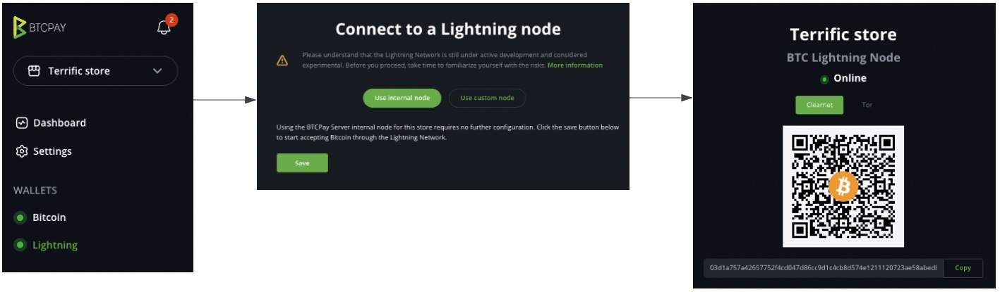

# Lightning Network Setup options

As discussed in the [Lightning Network overview](./LightningNetwork.md), there are several options to set up a Lightning Network node in BTCPay Server. Please read that page carefully to take the right choice and be aware of the pros and cons of each option.

On this page we will give you installation instructions and/or link to the relevant documentation.

Jump right to the section you are interested in:
[[toc]]

## Connecting a custodial Lightning Network wallet

## Using a swapping service

## Setting up your own Lightning Network node (fully self sovereign)

This guide will show you how to set up your Lightning Network (LN) node in BTCPay Server and guide you through the basics.

BTCPay Server currently offers these implementations of the Lightning Network:

- [LND](https://github.com/lightningnetwork/lnd)
- [Core Lightning (CLN)](https://github.com/ElementsProject/lightning) (formerly c-lightning)
- [Eclair](https://github.com/ACINQ/eclair)

::: danger
Before you proceed, please understand that running LN nodes is still a bit complicated. You need to ensure to have proper backups to be able to recover funds.
Using the Lightning Network can put your money at risk. Do not use more than you can afford to lose.
:::

Take time to familiarize yourself with the risks associated with using the Lightning Network.

If you choose to run the internal Lightning Node in BTCPay Server, consider:

1. Any LN node operates at two levels: **on-chain** and **off-chain**.
2. The LN implementation of choice will create an on-chain hot wallet that will be used to fund the off-chain payment channels.
3. Make sure you back up the **on-chain** hot wallet seed (see the instructions below for the individual implementations).
4. The seed in step #3 can **only recover the on-chain funds**, although it is necessary for the off-chain operation.
5. **Off-chain** funds locked in channels **cannot** be backed up using a single-seed. Read the documentation issued by your LN implementation of choice.
6. **Off-chain** recovery mechanisms are under active research and development. Erasing your BTCPay Server or unsafe/unsecure operation of the computing environment (e.g Filesystem corruption, compromised keys) can lead to permanent **loss of funds**.
7. Use our [backup script](./Docker/backup-restore) to regularly backup your BTCPay Server instance. This will help you recover your funds in case of a failure.

As the technology matures and develops, mechanisms for proper backup will be easier to implement in BTCPay Server.
As of [v1.0.3.138](https://blog.btcpayserver.org/btcpay-lnd-migration/), LND is the only Lightning Network implementation that allows for [lightning seed backups with BTCPay Server](./FAQ/LightningNetwork.md#where-can-i-find-recovery-seed-backup-for-my-lightning-network-wallet-in-btcpay-server).

### Choosing the Lightning Network implementation

First, read [here](./FAQ/LightningNetwork.md#can-i-use-a-pruned-node-with-ln-in-btcpay) about using pruned Bitcoin nodes with Lightning Network implementations before deploying.

On the installation, you'll be able to choose the implementation.

For [web-interface installations like on LunaNode](./Deployment/LunaNode.md), you can select the implementation from the drop-down menu.
For other [docker](https://github.com/btcpayserver/btcpayserver-docker) based [deployment methods](./Deployment/README.md) you need to:

```bash
sudo su -
cd btcpayserver-docker
export BTCPAYGEN_LIGHTNING="implementationgoeshere"
. ./btcpay-setup.sh -i
```

- For **Core Lightning (CLN)** use `export BTCPAYGEN_LIGHTNING="clightning"`
- For **LND** use `export BTCPAYGEN_LIGHTNING="lnd"`
- For **Eclair** use `export BTCPAYGEN_LIGHTNING="eclair"` AND `export BTCPAYGEN_ADDITIONAL_FRAGMENTS="opt-txindex"`

Finally, to begin using LN, your blockchain needs to be fully synced.

### Connecting your internal Lightning Node

Irrespective of the LN implementation deployed, the process of connecting your internal Lightning Node in BTCPay Server is the same.

1. Choose a store
2. Go to "Lightning" > Select "Use internal node"
3. Click "Save" > See "BTC Lightning node updated." message
4. Go to "Public Node Info" > The node should appear **"Online"**



If the internal connection fails, confirm:

1. The Bitcoin on-chain node is fully synchronized
2. The Internal lightning node is "Enabled" under "Lightning" > "Settings" > "BTC Lightning Settings"

If you are unable to connect to your Lightning node, try [restarting your server](./FAQ/ServerSettings.md#how-to-restart-btcpay-server) or reviewing our [troubleshooting guide](./Troubleshooting.md). You will not be able to accept lightning payments in your store until your Lightning node appears "Online". Try to test your Lightning connection by clicking the "Public Node Info" link.

### Connecting an external Lightning Node in BTCPay Server

BTCPay Server offers the option to connect to an external Lightning node. To configure it:

1. Go to "Lightning" > Select "Use custom node" if there is no Lightning node configured.
2. Go to "Lightning" > Select "Settings" > Select "Change connection" > Select "Use custom node" to modify an existing connection
3. Add the configuration details matching the lightning implementation used, click on "Test connection"
4. If successful, click "Save" > See "BTC Lightning node updated." message.

::: tip
If you already use [AlbyHub](https://getalby.com/) you can use the LNDHub connection support to connect your BTCPay wallet directly to your Alby account. As AlbyHub supports sub-accounts, you can use it similarly to the popular but discontinued LNBank plugin. Learn more on [how to connect your BTCPay wallet to Alby](https://guides.getalby.com/user-guide/v/alby-account-and-browser-extension/alby-lightning-account/connect-your-alby-lightning-account-to-other-apps/connect-to-btcpay-server).
:::

### Getting started with BTCPay Server and LND

#### Control your LND using Ride The Lightning (RTL)

The easiest way to use LND implementation with BTCPay Server is to use the **[Ride The Lightning](https://github.com/Ride-The-Lightning/RTL)** (RTL) service. A web user interface for the Lightning Network, RTL allows you to operate your node without leaving BTCPay Server, from your browser.
\
To initiate RTL in BTCPay Server, Go to Server Settings > Services > Ride The Lightning > See information.

#### Control your LND using Zeus

For remote control of your LN node with your mobile phone, you can use [ZEUS](https://docs.zeusln.app/for-users/remote-connections/btcpay/) 

#### Control your LND via the command-line: lncli

LND can be accessed via the command-line using the shell script `bitcoin-lncli.sh`.
\
If you're on Docker make sure you're in docker directory.

```bash
sudo su -
cd btcpayserver-docker
./bitcoin-lncli.sh $command
./bitcoin-lncli.sh getinfo #show info about the node
```

Run `./bitcoin-lncli.sh --help` to see a full list of commands or check the full [API documentation](https://api.lightning.community/).

### Getting started with BTCPay Server and Core Lightning (CLN)

#### Control your CLN using Ride The Lightning (RTL)

The easiest way to use CLN implementation with BTCPay Server is to use the **[Ride The Lightning](https://github.com/Ride-The-Lightning/RTL)** (RTL) service. A web user interface for the Lightning Network, RTL allows you to operate your node without leaving BTCPay Server, from your browser.
\
To initiate RTL in BTCPay Server, Go to Server Settings > Services > Ride The Lightning > See information.

#### Control your CLN using Zeus

For remote control of your LN node with your mobile phone, you can use [ZEUS](https://docs.zeusln.app/for-users/remote-connections/btcpay/)

#### Control your CLN via the command-line: lightning-cli

Similar to `lncli`, CLN can be accessed via the command-line using the shell script `bitcoin-lightning-cli.sh`.
\
If you're on Docker make sure you're in docker directory.

```bash
sudo su -
cd btcpayserver-docker
./bitcoin-lightning-cli.sh $command
./bitcoin-lightning-cli.sh getinfo #show info about the node
```

Run `./bitcoin-lightning-cli.sh help` to see a full list of commands or check the full [API documentation](https://lightning.readthedocs.io/).

### Lightning node backup

Before you start transacting using your new lightning node, consider backing up the **on-chain** wallet. Steps:

1. **for LND**: storing a copy of the LND seed.
   Go to "Server Settings" > "Services" > "LND Seed Backup" and select "See information"
2. **for CLN**: storing a copy of the [hsm_secret](https://lightning.readthedocs.io/BACKUP.html#hsm-secret)
   \
   The CLN $LIGHTNINGDIR is located in `/var/lib/docker/volumes/generated_clightning_bitcoin_datadir/_data/bitcoin`

Acknowledge the limitations of **off-chain** payment channel backups and associated risks.
\
See [backup FAQ](./Docker/backup-restore/#lightning-channel-backup) if you are running the BTCPay Server instance with Docker.

### Manage liquidity via a Lightning Service Provider (LSP)

For information on managing liquidity through Lightning Service Providers, please refer to the [Lightning Network overview](./LightningNetwork.md#using-liquidity-service-providers-lsps) section.

### Manage liquidity on your own (channel management)

#### Funding your on-chain wallet 

Now that your lightning node is active, before opening lightning payment channels, you will need to fund the on-chain wallet.
\
The on-chain funding process can be performed in two ways:

1. via the Ride The Lightning (RTL) UI interface

- Select a "Store" and go to the "Lightning" section
- Under "Services", select "Ride The Lightning"
- In the RTL app, go to "On-chain", select "Receive" under the "On-chain Transactions" menu
- Select "Generate Address" and use it as the destination for the allocated funds

2. via the command-line using `bitcoin-lncli.sh` or `bitcoin-lightning-cli.sh`

```bash
sudo su -
cd btcpayserver-docker
./bitcoin-lncli.sh newaddress p2wkh #for LND
./bitcoin-lightning-cli.sh newaddr  #for CLN
{
   "address" / "bech32": "bc1..........." #use this as the destination for the allocated funds
}
```

Once your on-chain lightning node is funded, it's time to connect to other nodes on the network and open payment channels.
\
Check out [Payment channels](./LightningNetwork_PaymentChannels.md) for recommendations on opening payment channels, liquidity management and more.

todo: move the payment channels page here or keep it linked like that