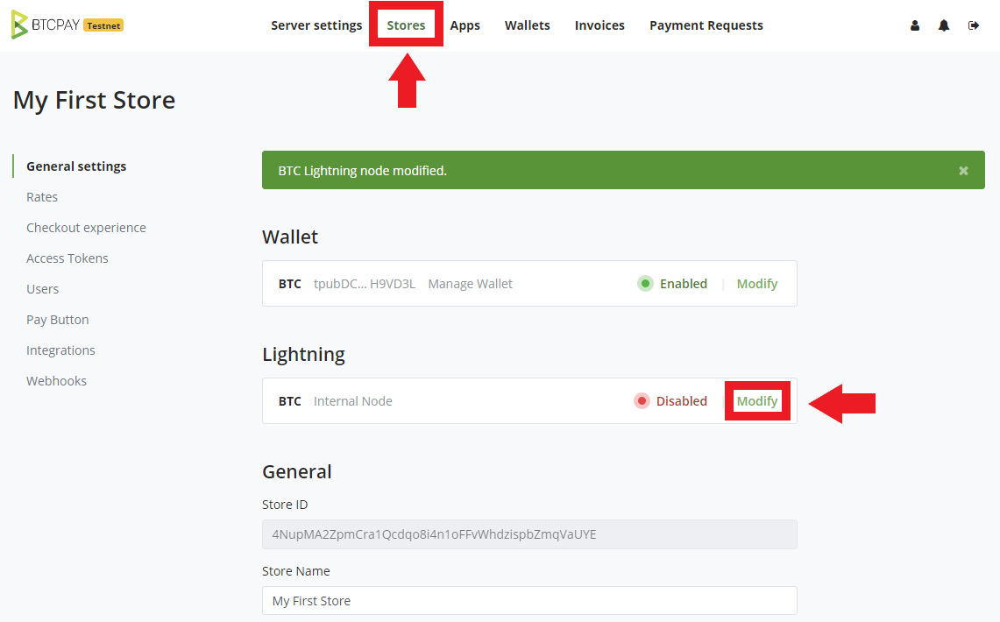
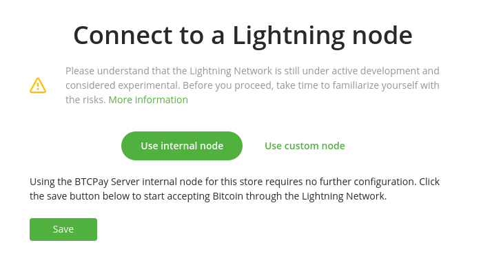
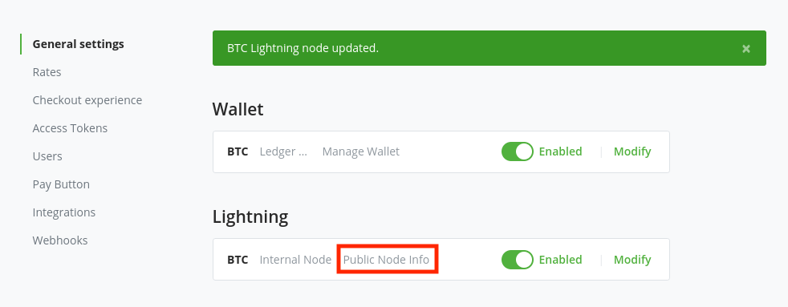
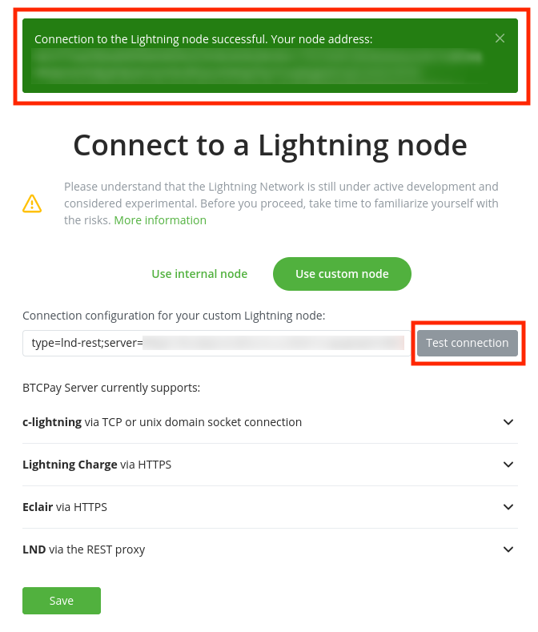

# Lightning Network and BTCPay

After deploying BTCPay Server, you may want to experiment with an innovative second-layer payment system built on top of Bitcoin protocol - the [Lightning Network](https://en.bitcoin.it/wiki/Lightning_Network).

This guide will show you how to **set up your Lightning Network node in BTCPay** and guide you through the basics.

::: danger
**Before you proceed, please understand that the Lightning Network is still in the experimental stage.
Do not put the money you can't afford to lose. There is a high risk of you losing the money.**
:::

Take time to familiarize yourself with the risks associated with using the Lightning Network.
**Your keys are in a hot-wallet.
Some implementations do not have a backup for lightning keys in BTCPay.**
This means:

1. If you erase your BTCPay Server or your machine crashes - you lose all the funds.
2. If your server gets hacked - a hacker can take all of your funds by accessing your keys.

While the keys from your **Lightning Network** don't have a backup and someone can steal them theoretically, your on-chain Bitcoin funds are safe and are never uploaded on the server.

As the technology matures and develops, things like a proper backup will be easier to implement in BTCPay.
As of [v1.0.3.138](https://blog.btcpayserver.org/btcpay-lnd-migration/), LND is the only lightning network implementation that allows for [lightning seed backups with BTCPay Server](./FAQ/FAQ-LightningNetwork.md#where-can-i-find-recovery-seed-backup-for-my-lightning-network-wallet-in-btcpay-server).

**BTCPay currently offers three implementations of the Lightning Network**:

* [LND](https://github.com/lightningnetwork/lnd)
* [c-lightning](https://github.com/ElementsProject/lightning)
* [eclair](https://github.com/ACINQ/eclair)

## Choosing the Lightning Network implementation

First, read [here](./FAQ/FAQ-LightningNetwork.md#can-i-use-a-pruned-node-with-ln-in-btcpay) about using pruned Bitcoin nodes with lightning network implementations before deploying.

On the installation, you'll have the option to choose the implementation.
For [web-interface installations](./LunaNodeWebDeployment.md), you can simply select the implementation from the drop-down menu.
For other [docker](https://github.com/btcpayserver/btcpayserver-docker) based [deployment methods](./Deployment.md) you need to:

```bash
sudo su -
cd btcpayserver-docker
export BTCPAYGEN_LIGHTNING="implementationgoeshere"
. ./btcpay-setup.sh -i
```

For **c-lightning** use `export BTCPAYGEN_LIGHTNING="clightning"`

For **LND** use `export BTCPAYGEN_LIGHTNING="lnd"`

For **eclair** use `export BTCPAYGEN_LIGHTNING="eclair"`

For eclair it also requires `export BTCPAYGEN_ADDITIONAL_FRAGMENTS="opt-txindex"`

Finally, to begin using Lightning, your blockchain needs to be fully synced.

## Connecting your internal Lightning Node in BTCPay

Regardless of the implementation (c-lightning or LND) you've decided to use, the process of **connecting your internal Lightning Node in BTCPay Server** is the same.

1. If you do not have a store, create one.
2. Store > Settings > Lightning > Modify
3. Select Use the internal Lightning node
4. Make sure it is Enabled
5. Click Submit
6. See BTC Lightning node modified message

**Your blockchain needs to be fully synced before you try to connect your Lightning Node, otherwise the connection will fail.**







To ensure that your lightning node is connected and accessible for use in your store's invoices, try to test your lightning connection by clicking the Test connection button. Verify that successful connection details are displayed. If your test connection fails, make sure you have a lightning implementation [enabled](./FAQ/FAQ-LightningNetwork.md#i-previously-installed-btcpayserver-without-lightning-can-i-enable-it) on your server.


If you are unable to connect to your lightning node, try [restarting your server](./FAQ/FAQ-ServerSettings.md#how-to-restart-btcpay-server) or reviewing our [troubleshooting guide](./Troubleshooting.md). You will not be able to accept lightning payments in your store until your test connection shows as successful.

## Connecting an external Lightning Node in BTCPay

If you would like to provide your own lightning node connection string, select the option to Use a custom Lightning node. If you aren't sure of which settings to use, there are some examples provided on this page to help guide you. This is typically used to connect an external lightning node to a BTCPay Server. 



## Getting Started with BTCPay and LND

The easiest way to use **LND implementation with BTCPay** is to use **[Ride The Lightning](https://github.com/ShahanaFarooqui/RTL)** (RTL).


RTL is a device agnostic **web user interface for Lightning Network** that allows you to operate your node without leaving BTCPay, from your browser.


To initiate RTL in BTCPay, Go to **Server Settings > Services > RTL > See information**.

Read the [RTL Getting Started Guide](https://medium.com/@suheb.khan/how-to-ride-the-lightning-447af999dcd2) for more details.

For remote use of your LND node on iOS or PC, you can use [Zap wallet integration](https://github.com/LN-Zap/zap-tutorials/blob/master/docs/desktop/btcpay-server.mdx).

[](https://www.youtube.com/watch?v=CWhTOunTb2Q "BTCPay Server - LND and Zap")

Besides Zap, there are a few more wallets that allow remote control of the LND node, [the Nayuta wallet](https://nayuta.co/) and the [ZeusLN](https://github.com/ZeusLN/zeus). Both of which have not yet extensively been tested by the community.

To remotely control your LND node via web browser, you can use Lightning Joule.

[](https://www.youtube.com/watch?v=a9_uHJhnKR4 "BTCPay Server - LND and Joule")

### LND Commands lncli

You can use **lncli commands** like described in their [API docs](https://api.lightning.community/) but instead of using lncli you use the shell script in of the btcpayserver-docker repository calles bitcoin-lncli.sh.

If you're on Docker make sure you're in docker directory.

```bash
sudo su -
cd btcpayserver-docker
./bitcoin-lncli.sh
```

So instead of running lncli getinfo you would run `./bitcoin-lncli.sh getinfo`

Run `./bitcoin-lncli.sh --help` to see a full list of commands or check above mentioned API docs.

## Getting Started with BTCPay and c-lightning

The most straightforward way to start using the **c-lightning implementation in BTCPay** is to use [Spark Wallet](https://github.com/shesek/spark-wallet) integration. Just like Zap for LND, Spark is a graphical interface of your internal c-lightning node.

You can use **Spark** as an internal or external wallet. Internal wallet allows users to use Spark via the web-browser inside their BTCPay Server. You can also connect externally to a Spark mobile or desktop app just by scanning a QR code.

[](https://www.youtube.com/watch?v=uV1R6IQpmg8 "BTCPay Server - c-lightning and Spark")

Go to **Server Settings > Services > Spark Server > See information**


### c-lightning Commands lightning-cli

To use **clightning CLI** it is the same like above for `lncli` but instead you use the shell script `bitcoin-lightning-cli.sh`

If you're on Docker make sure you're in docker directory.

```bash
sudo su -
cd btcpayserver-docker
./bitcoin-lightning-cli.sh
```

E.g. to list all commands: `./bitcoin-lightning-cli.sh help`
or show info about the node `./bitcoin-lightning-cli.sh getinfo`

### Lapps (Lightning Network Apps)

**[Lapps](https://blockstream.com/2018/03/29/blockstreams-week-of-lapps-ends/) are applications built on top of the [Lightning Charge](https://blockstream.com/2018/01/16/lightning-charge/)**, a complimentary package that allows users and developers to easier use and develop on top of c-lightning. If you decided to use c-lightning, you can easily **connect your BTCPay to any of the Lapps**.

BTCPay exposes all the necessary information required to **connect your internal BTCPay c-lightning node to a Lightning Network App**.  Go to Server Settings > Services > Lightning charge server > See information > Credentials.

Below are videos that showcase how to connect some of the lapps to your BTCPay.

[](https://www.youtube.com/watch?v=6EHNq1anD1k "BTCPay Server - c-lightning and lapps intro")

[](https://www.youtube.com/watch?v=ZbM3jcxau0o "BTCPay Server - c-lightning and lapps publisher")

[](https://www.youtube.com/watch?v=EYrsU3LGpbI "BTCPay Server - c-lightning and lapps woo lightning")
