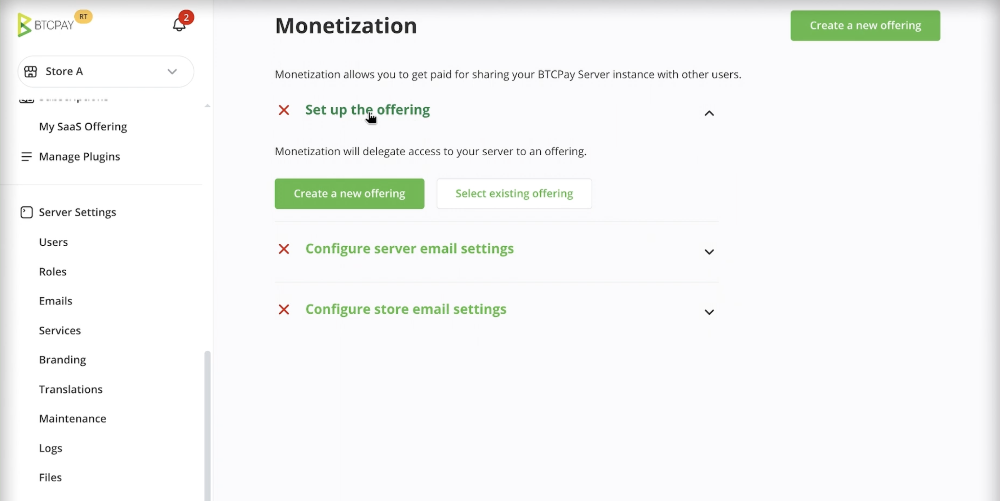
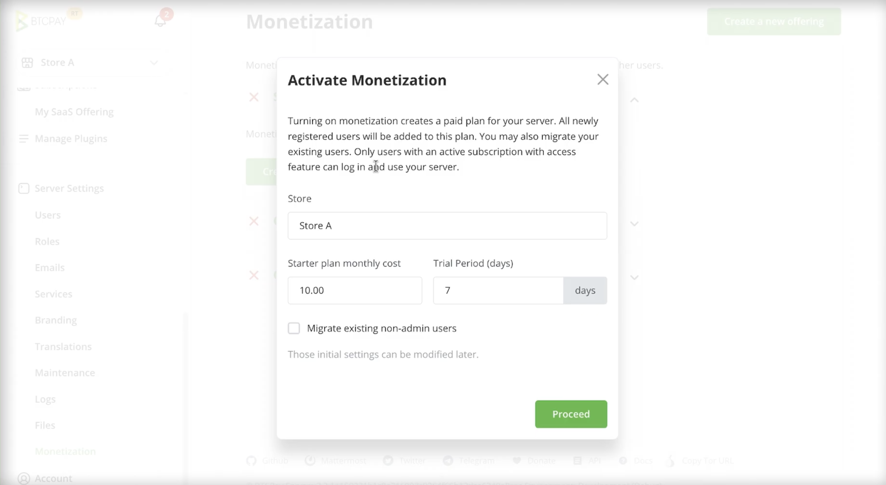
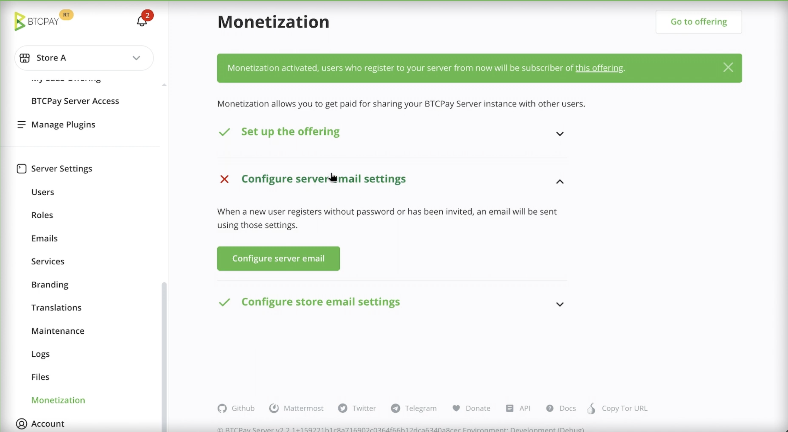
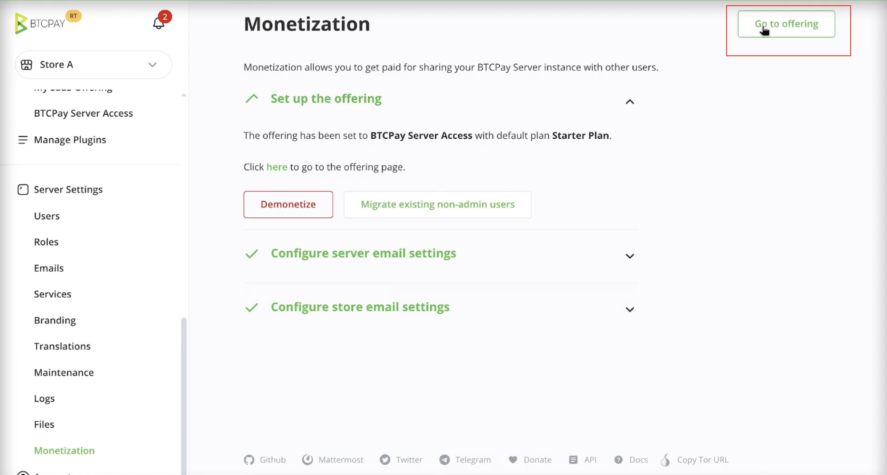
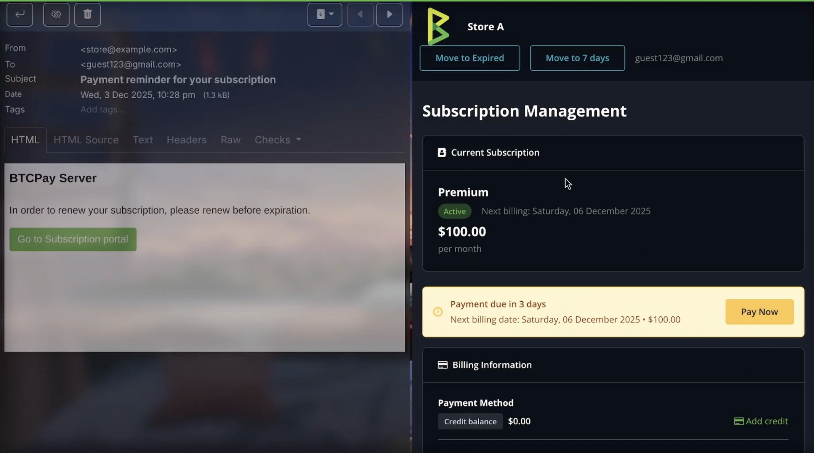
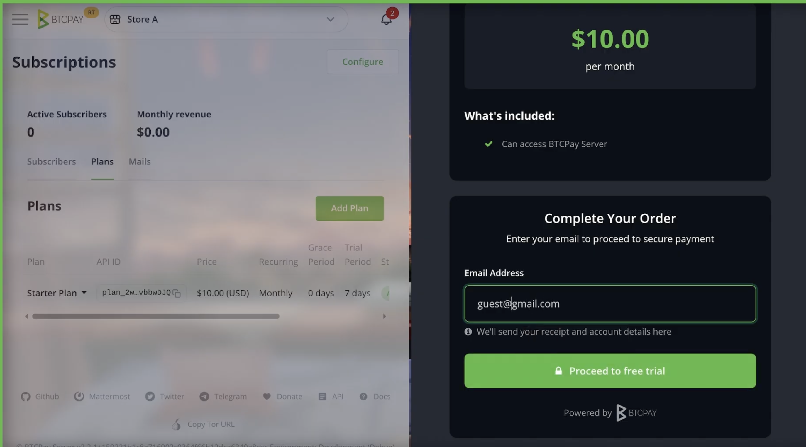

# Monetization

Monetization lets a BTCPay Server administrator charge users of their BTCPay Server instance using the built in [Subscriptions](http://docs.btcpayserver.org/Subscriptions) system. It is intended for operators who host BTCPay Server for others and want to charge for server access, maintenance or technical support.

Monetization is available starting with **BTCPay Server v2.3.0**.

## Enabling monetization

1. Go to **Server Settings > Maintenance**  
2. Select **Monetization**  
3. Click **Create a new offering**  
4. Configure the default store funds will go to  
5. Configure pricing and trial period  
6. Optionally, if you have users on your server, you can migrate all non-admin users to the subscription model.  
7. Click **Proceed**.  
8. If you haven’t configured email SMTP, you’ll be asked to do so. **Click Configure Server Email and fill in your SMTP details.**  
9. If you wish to customize your subscription plans at any point, click on **Go to Offering** in the top right corner.

## How does monetization work?

When monetization is enabled, BTCPay Server automatically:

* Creates a default subscription offering and plan (that can be configured later)  
* Enables subscription based access control for user accounts  
* Replaces the standard registration flow with a subscription checkout  
* Preconfigures basic email notifications (if Server SMTP is configured)

Users registering to your BTCPay Server, will now first have to go through a subscription checkout. The flow is as following:

* User registers on BTCPay Server  
* The user goes to Subscription Checkout where they can select a plan, and add their email.  
* They’ll receive registration details to their email

## User access and billing

* An active subscription grants access to the BTCPay Server account  
* An expired or suspended subscription disables access  
* Users can always access the billing portal to renew or top up, even if their account access is disabled  
* Automatic emails will be sent to users reminding them about recurring payment  
* Users manage billing through a **Manage billing** page in their account or a link received through an automatic email

The entire flow is highly customizable. If you’d wish to do beyond what’s pre-configured, check our [subscription documentation](http://docs.btcpayserver.org/Subscriptions).

## Notes and limitations

* Billing based on revenue is not yet available  
* Advanced permission controls are planned for future releases  
* This is beta feature and your feedback is highly welcome into shaping it further