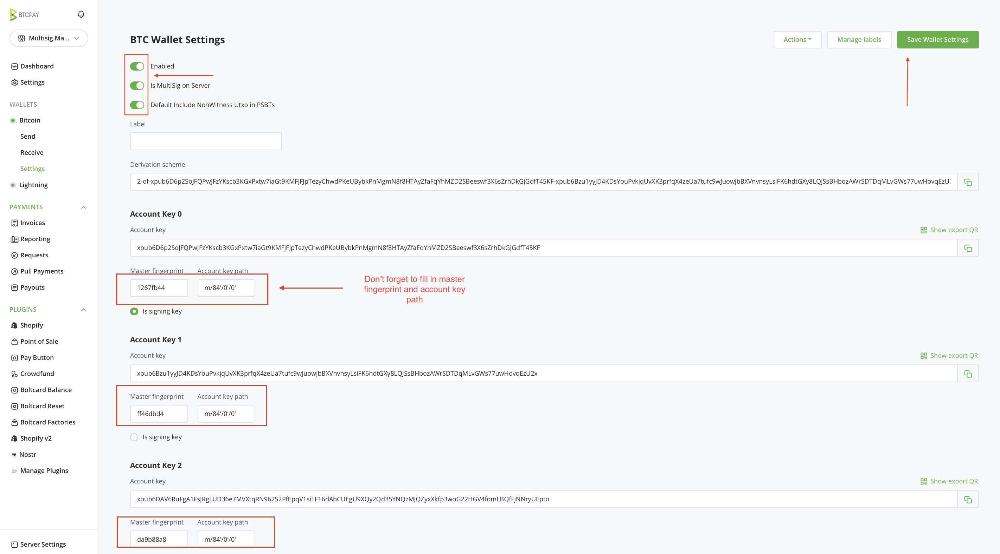
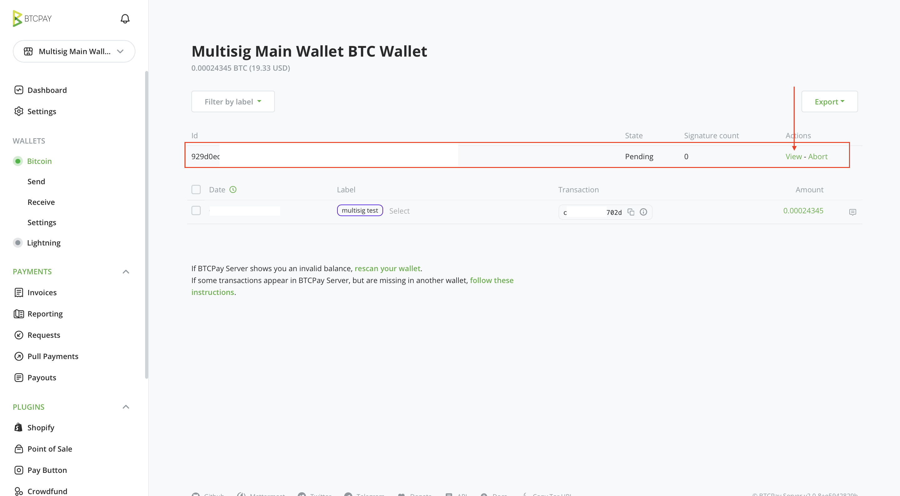
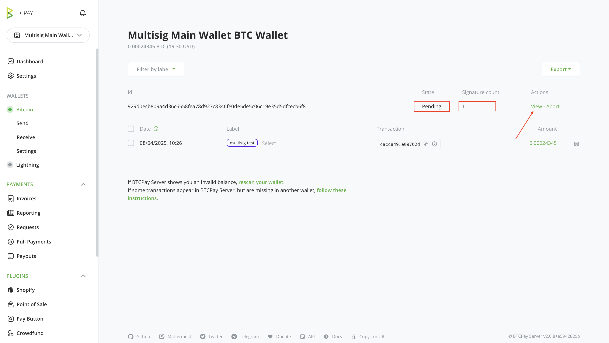
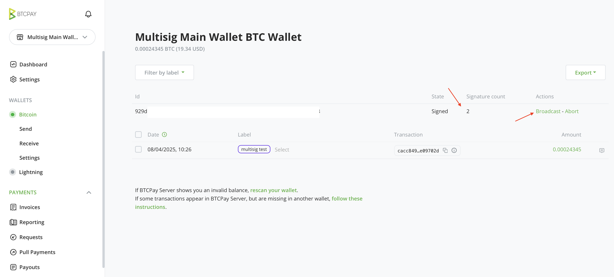

# MultiSig support in BTCPay Server

BTCPay Server v2.1.0 introduced refined support for multi signature (multisig) wallets designed to empower your setup with added security, collaboration, and flexibility.

This document provides step-by-step instructions for configuring and utilizing multisig wallets within your BTCPay Server instance.

[](https://www.youtube.com/watch?v=V95pLvVTAqM)

## Overview

Multisig functionality in BTCPay Server enables:

- **Collaborative custody**: Create a wallet that requires multiple signatures to authorize broadcast a transaction.
- **Self-hosted multisig coordination**: Shared control of company’s public keys and signing flow without relying on a third-party.
- **Hardware wallet support**: Works seamlessly with the BTCPay Vault and is compatible with majority hardware signing devices allowing you to authorize a transaction with a hardware wallet.
- **Notification system**: Stay informed with email alerts when transactions are created, pending, (requiring sufficient amount of signatures), and broadcasted.
- **Integration with plugins**: Works with Vendor Pay and future features, enabling multisig-based payouts. Integrates with Xpub Extractor, allowing all multisig participants to easily get appropriate format

## Prerequisites

Ensure the following components are installed and configured:

- BTCPay Server instance (v2.1 or later)
- [BTCPay Vault](https://github.com/btcpayserver/BTCPayServer.Vault)
- [XpubExtractor Plugin](https://github.com/btcpayserver/BTCPayServer.Plugins.XpubExtractor) (if you're setting up hardware wallet)

## Step 1: Collect Extended Public Keys

The following explains how to get required public key from the [hardware wallet](https://docs.btcpayserver.org/HardwareWalletIntegration/). If you're using software wallet, you can proceed to step 2.

1. Navigate to `Manage Plugins` and confirm that **XpubExtractor** is installed and published by *RockstarDev*.
2. Connect the hardware wallet and launch [BTCPay Vault](http://docs.btcpayserver.org/HardwareWalletIntegration/).
3. Use the `Fetch Xpub` function to retrieve:
   - Extended public key (xpub)
   - Root fingerprint
   - Derivation path
4. Save data for the wallet.

Example value:

```
xpub6CUGRUonZSQ4TWtTMmzXdrXDtypWKiKp5KUMRmD9YgoWDbEVpLFgje71pRAVBPX6DCmV9HNTLr8GHqKZANvNcFpSZe3kiKsH5Ej7ApG1NVDK
Root Fingerprint: abcdef21
Key Path: 48'/0'/0'/0'
```
### Inviting Additional Signers

1. Go to `Settings` > `Users`.
2. Add each participant’s email address and share the generated invite link with them directly. If you have Email SMTP in your server, they'll receive an invite email.
3. Instruct participants to:
   - Accept the invitation
   - [Create a BTCPay Server Store](https://docs.btcpayserver.org/CreateStore/)
   - Use [XpubExtractor](https://github.com/rockstardev/BTCPayServerPlugins.RockstarDev/tree/1235799827c24d33bfe1095db5169afd39e620f1/Plugins/BTCPayServer.RockstarDev.Plugins.XpubExtractor) to provide their xpub information
4. They should save data for their wallets and share them with you.

Please note that, for now, you must invite users as Store `Owners`. We plan to implement additional roles and permissions in the future to reduce the trust factor for those you invite to the multisig store. You can [track the status of this implementation on GitHub](https://github.com/btcpayserver/btcpayserver/issues/6651).

## Step 2: Create the Multi-signature Wallet

After collecting all required public keys, (e.g., 2-of-3 setup), proceed as follows:

1. Go to `Bitcoin Wallets`.
2. Select `Connect an existing wallet` > `Enter extended public key`.
3. Choose `Show multisig examples` and input the collected xpubs in the required format.
4. Click `Continue` to validate and preview the derived addresses. You can validate the preview via external software wallet, or simply by testing in the final step of this document.

An example of your multisig could look like this:

```
2-of-xpub6BosLW1vGZLkCW7NrgUQdREa7i3a7XJXnAMQzA3aJCEuEt8hXNRu2yG6Vxq2YvCCu8n2eUpZhVz5Zw3eQro2d5Wq8UdD2qhM1YG4ZcnC3kYd-xpub6FHVXph13QMR77fUMLREpN2L7D1fCqcVtzsGhM28jUy5CWTpYHDuN6gvN5Gi5rxJjL45AgXLhSzE27AHZkDwKZgTYaUmYc9rBoF2tuAgf6M-xpub6CJ61yVNhtEtcpS7pU8Jjpd1NHgAG6xWv1NG4b47SvhhVVqfzFrHdcDUpm96B2ftov3qd5uoy6b7bEVcdxQwK6R7T5ndJP8vTWTdS6RBn7Jr
```

This means 2 out of 3 listed signatures are required to authorize a transaction. You can as well put 3 out of 5, and so on.

Next, adjust wallet settings to ensure proper compatibility with various formats and easier signing.

1. Navigate to `Wallet Settings`.
2. Enable the `Multisig on Server` option.
3. Input the `root fingerprint` and `derivation path` for each key.
4. Enable `Include non-witness UTXO in PSBTs` for enhanced compatibility.
5. `Save` changes.



### (Optional) Testing the receive funds setup

1. From the main multisig store, in the sidebar, click `Bitcoin > Receive`
2. Label the address (e.g. "Test")
3. Send a small amount of Bitcoin to verify the setup
4. Optionally you can import the multisig into a different software to verify receiving works.

## 3. Configure email notifications

This step ensures all participants receive email when the new transaction is created, requires their signature and finally broadcasted successfully.

For participants to receive updates on multisig activity, you have to set up [custom email-rules](https://docs.btcpayserver.org/Notifications/#email-rules).


1. Go to `Store Settings > Emails > Email Rules`
2. Click on `Configure` and then `Create`
3. From the `Trigger` dropdown, select `Pending Transaction Created` and add email addresses of multisig participants, separated by a comma: `email1@test.com, email2@test.com, email3@test.com`
4. Feel free to modify the default Body and Text to your liking.
5. When you're done, click `Save`

Repeat the steps 3 to 5 for two more triggers: `Signature Collected` and `Transaction Broadcasted`

## Step 4: Send a transaction from the multisig wallet

1. Go to your multisig wallet
2. Enter recipient address and amount
3. Click `Create Pending Transaction`
4. Participants will now receive an email if you followed the Step 3, prompting them to sign a transaction with their wallet.


## Step 5. Signing a multi-sig transaction:

Now that transaction has been created, participants would have to sign(authorize it) with their hardware wallet.

1. In wallet transaction list of the main multi-signature store, participant will see a pending transaction.
2. Click on `View`
3. If you're signing with a hardware wallet, connect your hardware wallet and ensure `BTCPay Vault` is running
4. Click `Sign`
5. Follow on-screen and device prompts to `sign the transaction`






Other participants should follow the same steps.  Once the required number of signatures is collected, click Broadcast to send the transaction.




Congratulations! You’ve sent your first multisig transaction using BTCPay Server.