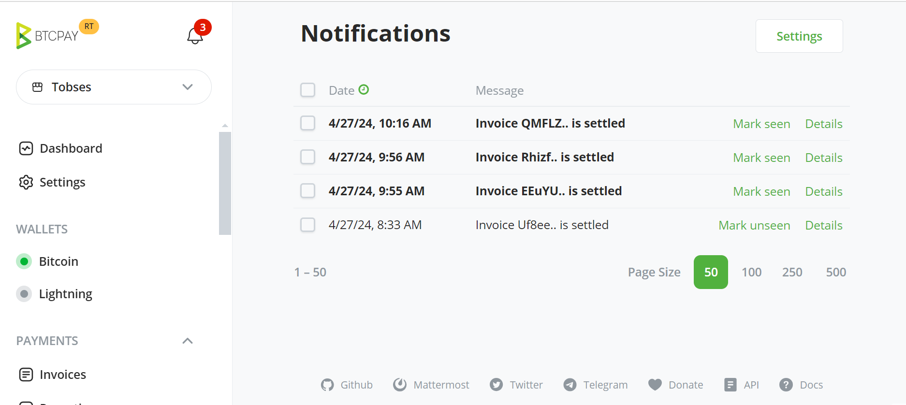
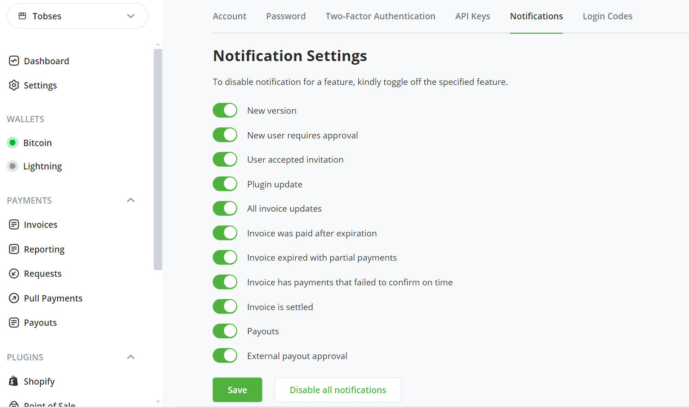
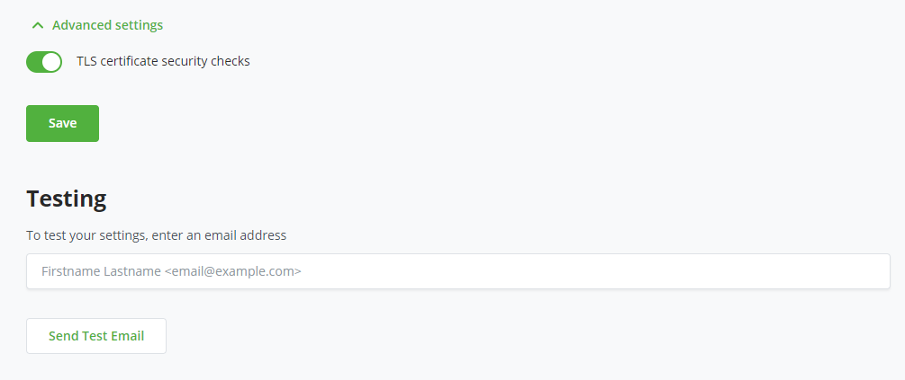
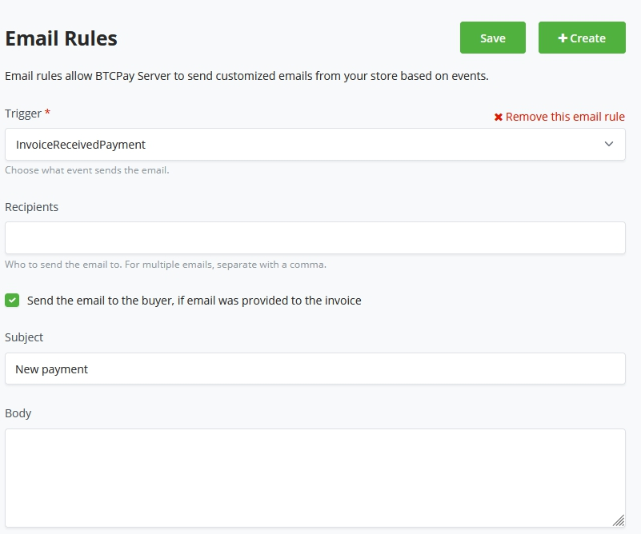

# Notifications

Notifications to monitor BTCPay Server events can be configured in several different ways.

- [Notification Alerts](#notification-alerts)
- [Server level SMTP (Email)](#server-emails)
- [Store level SMTP (Email)](#store-emails)
- [Store level Webhooks](https://docs.btcpayserver.org/API/Greenfield/v1/#tag/Webhooks)

## Notification Alerts

Click the notification icon in the main header to view the current notifications. The notification page shows the status of all current notifications such as invoice events, payouts, version updates, etc. Notifications can be marked as seen from the notifications dropdown or the notifications page.



Each user registered on the server can manage the notifications they receive.



## Server Emails

Emails can be sent from the server-level of BTCPay. These are [user emails](#user-emails). Admins can setup server SMTP in:

Server Settings > Email server > [Setup](#smtp-email-setup)

## Store Emails

Emails can be sent from the store-level of BTCPay. These emails are for store related events such as invoices. Users can setup store SMTP in:

Store Settings > General Settings > Services > Email > [Setup](#smtp-email-setup)

### SMTP Email Setup

Use the Quick fill settings dropdown for commonly used email client setup parameters. Send yourself a test email from the same page to verify your setup parameters work properly.




Each email client may have different requirements for setting up SMTP. For more information see this [SMTP FAQ](./FAQ/ServerSettings.md#how-to-configure-smtp-settings-in-btcpay) or refer to your email provider's documentation.

# User Emails

There are various user emails built-in to your BTCPay Server to communicate with your users.

:::warning
User emails will only be sent if SMTP is enabled for the server.
:::

- [Forgot Password](#forgot-password-email)
- [New User Confirmation](#new-user-confirmation-email)
- [New User Invitation](#new-user-invitation-email)
- [Custom Emails](#custom-emails)

## Forgot Password Email

This email can be sent to users who have lost their password. If SMTP is not enabled on the server, there is [no easy way](./FAQ/ServerSettings.md#forgot-btcpay-admin-password) to reset any user passwords including the server admin's password. Be sure to save your password in a safe place or setup email for your server.

## New User Confirmation Email

This email is used to confirm new user account registration. In order to reduce spam account registration, email confirmation may be required by the server admin (set in server settings policies). New users can click the link in this email to verify their account to complete their registration process.

## New User Invitation Email

Send an invitation email to [invite a new user](./FAQ/ServerSettings.md#how-to-add-a-new-user-by-invite) to register an account on your server. This can be used to keep server registration closed to the public but still invite new users.

## Custom Emails

Custom emails can be created using the BTCPay Server Transmuter preset [Email Receipts](https://docs.btcpayserver.org/Transmuter/EmailReceiptsPreset/#transmuter-email-receipts-setup).

## Email rules

Email rules allow BTCPay Server to send customized emails from your store based on events.
Click the `Configure` button and `create` a new Email rule.

Set your Email trigger out of the following :

- Invoice created
- Invoice Received Payment
- Invoice Processing
- Invoice Expired
- Invoice Settled
- Invoice Invalid
- Invoice Payment Settled

Set a recipient email address where you'd want to be updated by email on store events, or tick the option for `Send email to the buyer if an email was provided to the invoice`.
Fill out a subject for the event email, and you can stylize the body of the email at last.

Possible placeholder's we currently offer are as follows :

```
            {Invoice.Id}
            {Invoice.StoreId}
            {Invoice.Price}
            {Invoice.Currency}
            {Invoice.Status}
            {Invoice.OrderId}
```

Find the source [here for possible updates](https://github.com/btcpayserver/btcpayserver/blob/master/BTCPayServer/HostedServices/StoreEmailRuleProcessorSender.cs)


