# Accept Bitcoin payments in OpenCart

[BTCPay Server](https://btcpayserver.org/) is a free and open-source Bitcoin payment processor. It allows you receive payments directly into your wallet with no fees, or middleman.

 If you run an OpenCart store, expand your market reach today without any additional marketing cost by integrating it with BTCPay Server to offer Bitcoin as a payment option.


## Benefits of using BTCPay for OpenCart

1. **Fully Automated System:** Let BTCPay handle everything for you—payments, invoice management, and refunds—automatically.

2. **Zero Fees:** BTCPay Server is free. That’s right—no transaction fees, no processing fees, ever.

3. **Bitcoin QR Code at Checkout:** Enhance your customer’s experience with a simple and secure payment process by displaying a Bitcoin QR code for payment at checkout.

4. **Lightning Network Integration:** Enjoy instant, low-cost payments and payouts.

5. **Easy data exports:** Easily manage your financial reports with CSV export options.

6. **Versatile Plugin System:** Extend BTCPay’s functionality with a flexible plugin system tailored to your needs.

7. **Point-of-Sale Integration:** Accept Bitcoin in physical stores with POS integration.

8. **Multilingual Ready:** Serve your global audience in a language they understand

9. **Self-Hosted Infrastructure:** Choose self-hosting for full control or a third-party host for convenience. Both provide the complete BTCPay experience.

10. **Community-Driven Support:** Get help and advice from a dedicated community ([Mattermost](http://chat.btcpayserver.org/) or [Telegram](https://t.me/btcpayserver)).


## Requirements

Ensure that you meet the following requirements before installing this extension.

- PHP version >= 7.4 for OpenCart 3; PHP >= 8.1 for OpenCart 4
- The curl, gd, intl, json, and mbstring PHP extensions are available
- A OpenCart 3/4 store ([Download and installation instructions](https://www.opencart.com/index.php?route=cms/download))
- **IMPORTANT:** You have a BTCPay Server version 1.3.0 or later, either [self-hosted](/Deployment/README.md) or [hosted by a third-party](/Deployment/ThirdPartyHosting.md)
- [You've a registered account on the instance](./RegisterAccount.md)
- [You've got a BTCPay store on the instance](./CreateStore.md)
- [You've got a wallet connected to your store](./WalletSetup.md)

:::tip
The instructions are based on OpenCart 3, but the UI and steps are almost identical to OpenCart 4. Therefore we have no separate instructions.
:::

## Step-by-Step Guide to Install the BTCPay Extension for OpenCart
### 1. Install BTCPay extension

There are three ways to **download the BTCPay for OpenCart extension**:

- Via the Admin Dashboard (recommended)
- [OpenCart Marketplace](https://www.opencart.com/index.php?route=marketplace/extension/info&extension_id=44269)
- [GitHub Repository](https://github.com/btcpayserver/opencart)

#### 1.1 Install the extension from OpenCart admin dashboard

Note: The extension is currently undergoing review and will be available soon.

#### 1.2 Download and install the extension from Marketplace or GitHub

1. Download the latest BTCPay extension from the [Marketplace](https://www.opencart.com/index.php?route=marketplace/extension/info&extension_id=44269) or [Github](https://github.com/btcpayserver/opencart/releases)
2. Navigate to Menu: Extensions -> Install
3. Click the button [Upload] and upload the downloaded `btcpay.ocmod.zip`
   After the upload completes, you should see a notification saying, "Success: You have modified extensions!"


#### 1.3 Complete the Extension Installation

1. Go to Menu: Extensions -> Extensions
2. In the "Choose extension type" dropdown menu, select Payment.
3. Find the BTCPay extension in the list and click the green Install button in the "Action" column.
4. You will see a notification saying: "Success: You have modified payments!"

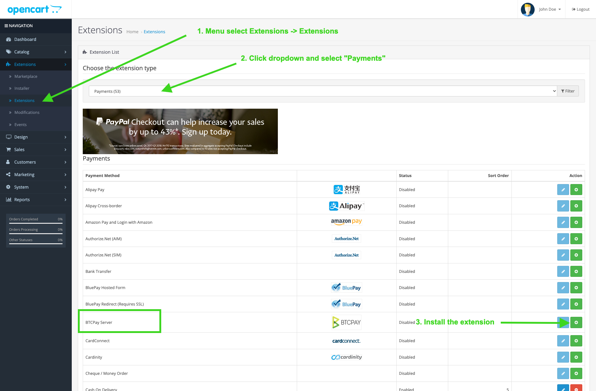

### 2. Connecting OpenCart and BTCPay Server

Before proceeding, ensure you have a BTCPay Server instance set up as described in the [requirements section](#requirements).

The BTCPay for OpenCart extension acts as a **bridge between your BTCPay Server (payment processor) and your e-commerce store**. Whether you're using a self-hosted or a third-party solution, the connection process remains the same.

#### 2.1 Configure BTCPay Server extension in OpenCart

1. In the OpenCart panel, navigate to Extensions -> Extensions.
2. Find the BTCPay extension in the list and click the blue Edit button.
   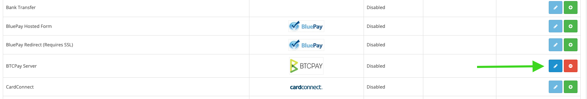
3. Configure BTCPay extension. 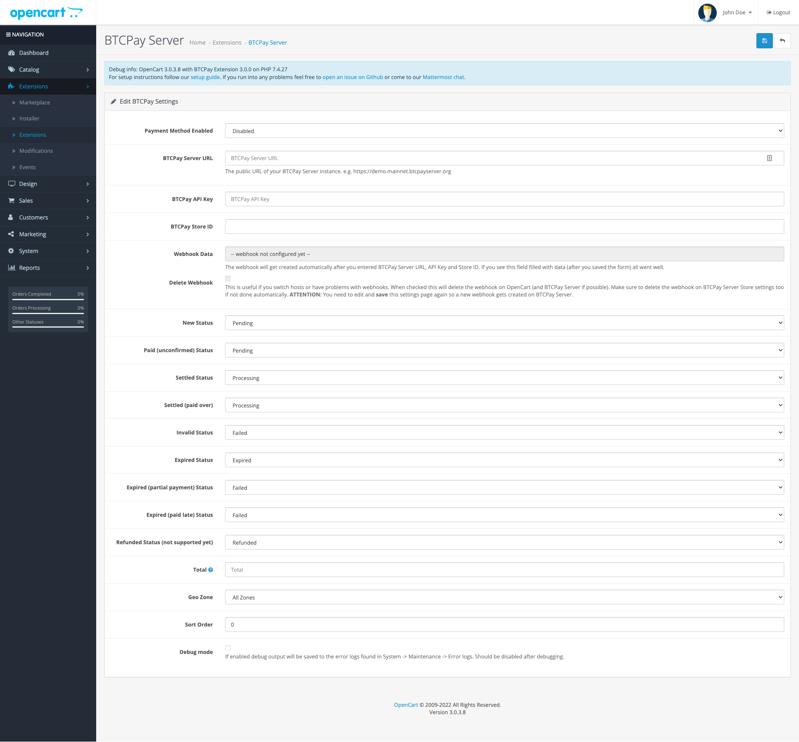
4. Set the "Payment Method Enabled" field to Enabled.
5. In the "BTCPay Server URL" field, enter the URL where your BTCPay Server instance is accessible, e.g., https://mainnet.demo.btcpayserver.org/. Instructions for deploying your BTCPay Server instance can be found in [requirements section above](#requirements)

Before you can continue, you need to create the API key for your user and store, as described in the next section. Keep this browser tab open, as we will come back shortly.

#### 2.2 Create an API key and configure permissions

On your BTCPay Server instance:

1. Click on _[Account]_
2. Click on _[Manage Account]_
   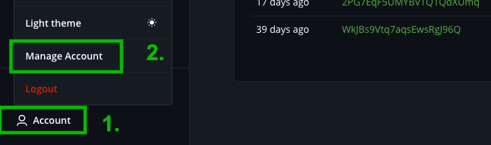
3. Go to the tab _"API Keys"_
4. Click _[Generate Key]_ to select permissions.  
   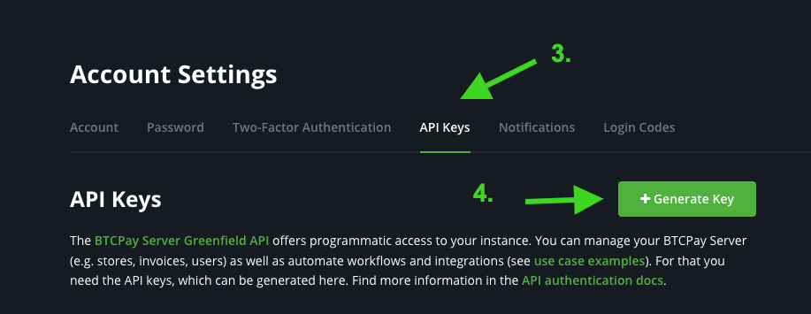
5. "Label": Add a label.
6. "Permissions": **Important:** click on the _"Select specific stores"_ link for the following permissions: `View invoices`, `Create invoice`, `Modify invoices`, `Modify stores webhooks`, `View your stores` and select the store you created for your OpenCart site. This makes sure that the API key only has access to that specific store and can't drain any funds even if the key is lost.
   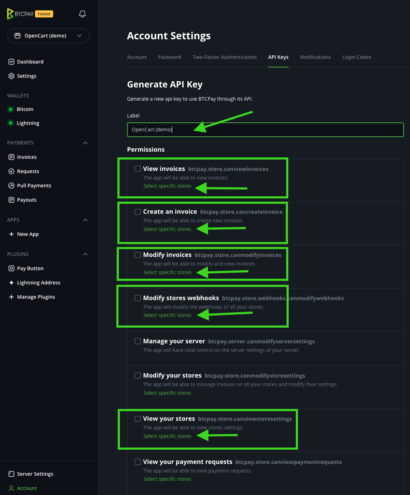  
   It should look like this:
   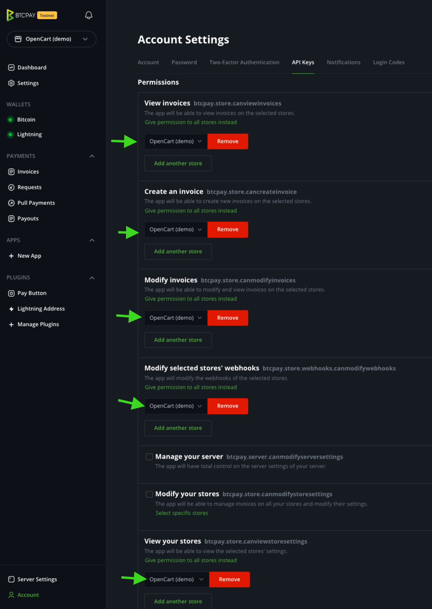
7. Click on _[Generate API Key]_ at the bottom
8. Copy the generated API Key to your _OpenCart BTCPay settings_ form field "BTCPay API Key"
   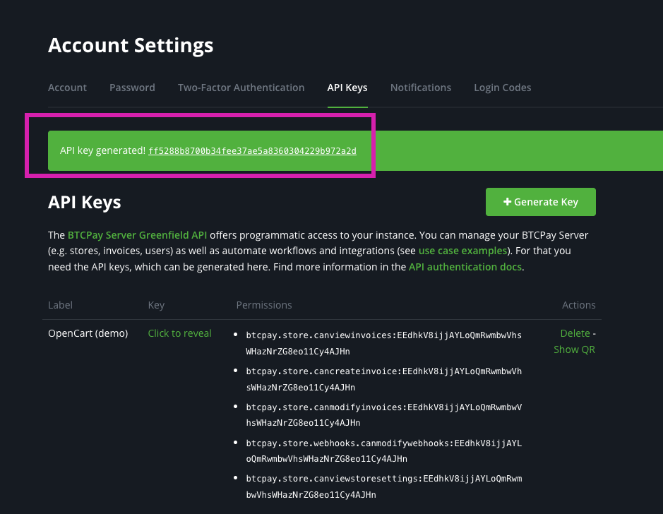
9. Back on BTCPay Server instance, go to your store settings and copy the store ID to your _OpenCart BTCPay Settings_ form  
   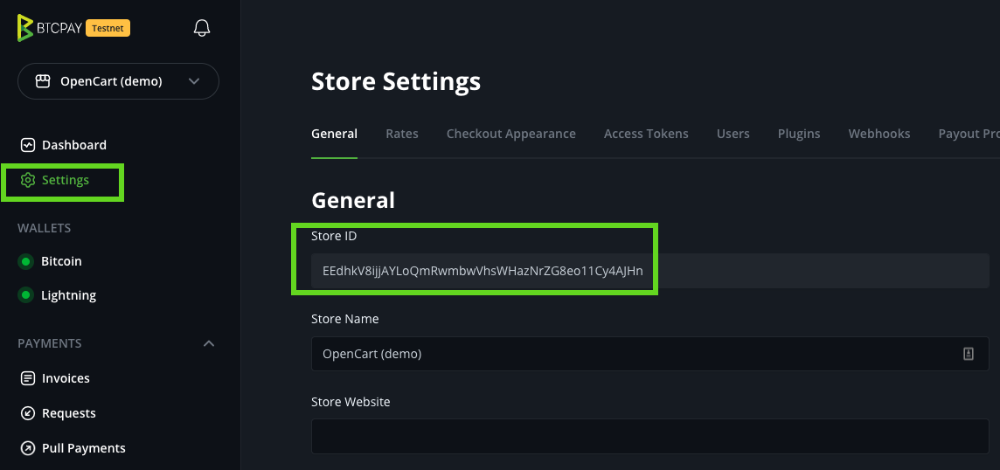
10. Back on _OpenCart BTCPay settings_ form make sure **BTPCay Server URL**, **API Key** and **Store ID** are set and click **[Save]** button (on the top right)  
    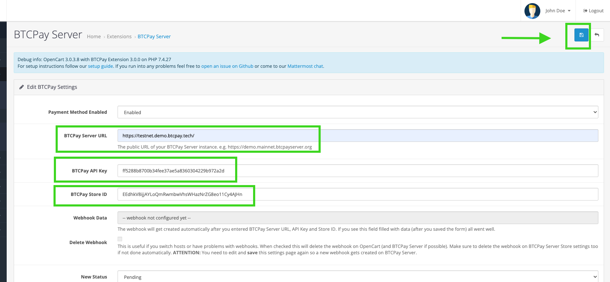


Return to the Extensions overview page, you should see a notification that says "BTCPay Server Payment details have been successfully updated.". If not, double-check that your URL, API Key, and Store ID are correctly entered.


On successfully saving, the BTCPay extension automatically creates a webhook to notify OpenCart when payments are settled or failed. To double check it was successful. You can do that by editing the BTCPay extension settings again if you see the "Webhook Data" field filled out like this:
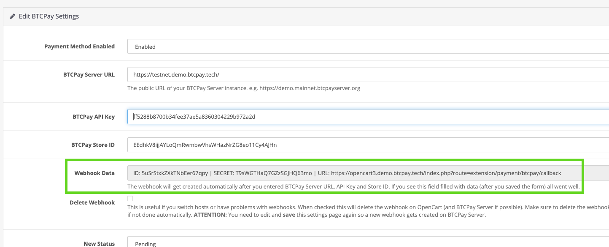

As you can see on the BTCPay extension settings, you can customize the order statuses depending on the [invoice statuses](https://docs.btcpayserver.org/Invoices/#invoice-statuses) and other common settings. The defaults should be a good starting point but feel free to adjust them to your specific needs.


### 3. Test the checkout

Now everything is set up; it's time to perform a test transaction:

Make a Test Purchase: Place a small order through your OpenCart store to ensure the checkout process works as expected.
Verify Order Status: Check that the order status in OpenCart updates according to the corresponding BTCPay invoice status.
Review Webhook Events: In the BTCPay Server invoice details, confirm that the webhook events were successful.

### Troubleshooting

#### Enable debug mode

If you have an error during checkout, you can enable the debugging mode on the BTCPay extension settings. Menu: Go to "Extensions -> extensions" select "Payments" on the "Choose Extension Type" dropdown and edit BTCPay Server extension.

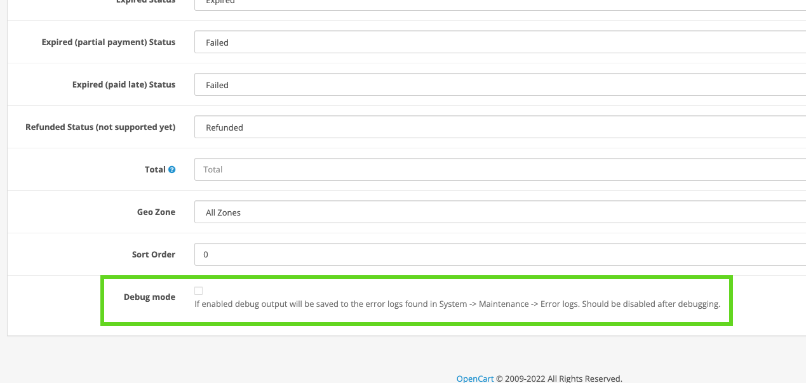

You can now find the debug output in the `error log` in the menu "System -> Maintenence -> Error Logs".

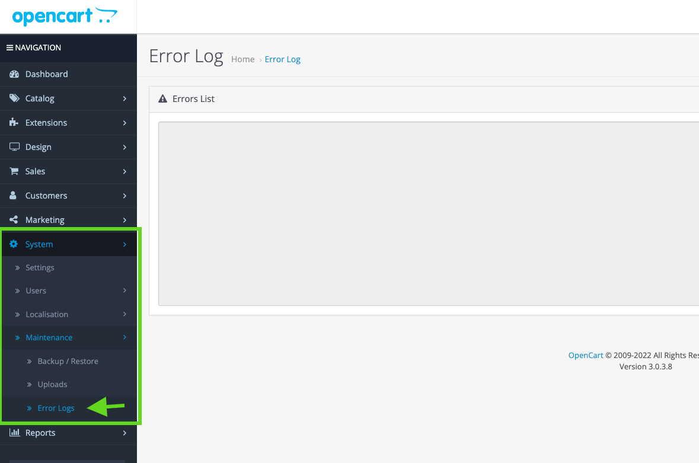

\*Please make sure to disable it after debugging is finished; otherwise, it will fill up your error logs.\*\*

**Example Error**:

> 2022-05-24 21:10:50 ERROR Error during POST to https://btcpay.example.com/api/v1/stores/4kD5bvAF5j8DokHqAzxb6MFDV4ikabcdefghijklm/invoices. Got response (401): {&quot;code&quot;:&quot;unauthenticated&quot;,&quot;message&quot;:&quot;Authentication is required for accessing this endpoint&quot;}

- This means there is some authentication error. Likely your API key does not have permission to create invoices for that store. Make sure you give the API key the correct permissions, give it to the right store, and enter that in the OpenCart payment configuration form.

- Another reason could be that you use a legacy API key. The legacy API keys are located in store settings -> Access Tokens. But you need to create an account API key located in Account -> Manage Account -> tab "API Keys". See section [2.2 Create an API key and configure permissions](#22-create-an-api-key-and-configure-permissions).

### The order states do not update, although the invoice has been paid.

Please check your invoice details to see if there were any errors on sending the webhook request. Some hosting providers, firewall setups, or security extensions may block POST requests to your site, which leads to an HTTP status of "403 forbidden".

You can check and verify yourself if there is something blocking requests to your site in one of these two ways:

**1. Copy webhook callback URL**  
Go to your _OpenCart BTCPay extension settings_ and copy the "URL" of the "Webhook Data" field. e.g., `https://YOURSTOREDOMAIN.TLD/index.php?route=extension/payment/btcpay/callback`


**2.1 Check using a command line (Linux or MacOS):**

```
curl -vX POST -H "Content-Type: application/json" \
    -d '{"data": "test"}' WEBHOOK_CALLBACK_URL
```

(replace `WEBHOOK_CALLBACK_URL` with the one copied above)

Result:

```
.... snip ....
* upload completely sent off: 16 out of 16 bytes
< HTTP/1.1 403 Forbidden
< access-control-allow-origin: *
< Content-Type: application/json; charset=UTF-8
< X-Cloud-Trace-Context: 4f07d5b2e5c2f05949d04421a8e2dd6a
< Date: Thu, 17 Feb 2022 10:06:50 GMT
< Server: Google Frontend
< Content-Length: 26
```

If you see that line "HTTP/1.1 403 Forbidden" or "HTTP/2 403" something is blocking data sent to your OpenCart site. It would be best to ask your hosting provider or make sure no firewall or security extension is blocking the requests.

**2.2 Check using an online service (if you do not have a command line available:**

- Go to [https://reqbin.com/post-online](https://reqbin.com/post-online)
- 1. Enter your callback url (copied from step 1 above): `https://YOURSTOREDOMAIN.TLD/index.php?route=extension/payment/btcpay/callback`
     (replace this URL with the webhook callback url from step 1)
- Make sure "POST" is selected
- 2. Click [Send]

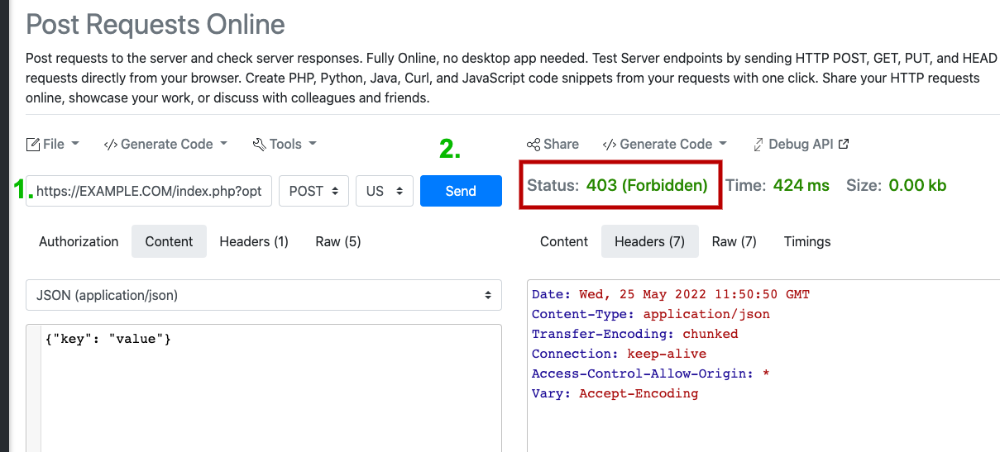

If you see "**Status 403 (Forbidden)**" then POST requests to your site are blocked for some reason. You should ask your hosting provider or ensure no firewall or security extension is blocking the requests. If you see any other status code (200, 500, ...) a firewall problem seems not to apply. You probably need to investigate further.

## I have trouble with using the extension or some other related questions.

Feel free to join our support channel over at [https://chat.btcpayserver.org/](https://chat.btcpayserver.org/) or [https://t.me/btcpayserver](https://t.me/btcpayserver) if you need help or have any further questions.
