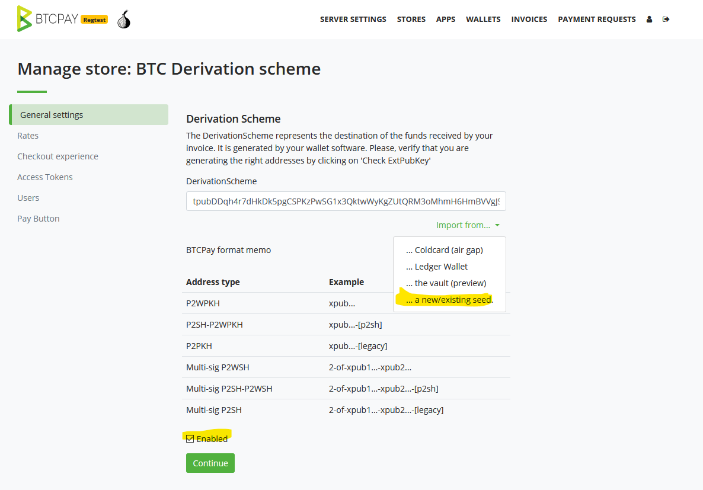
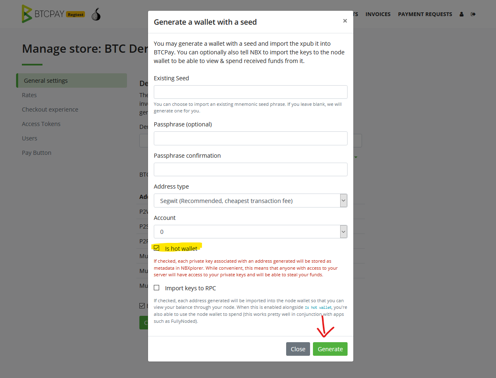
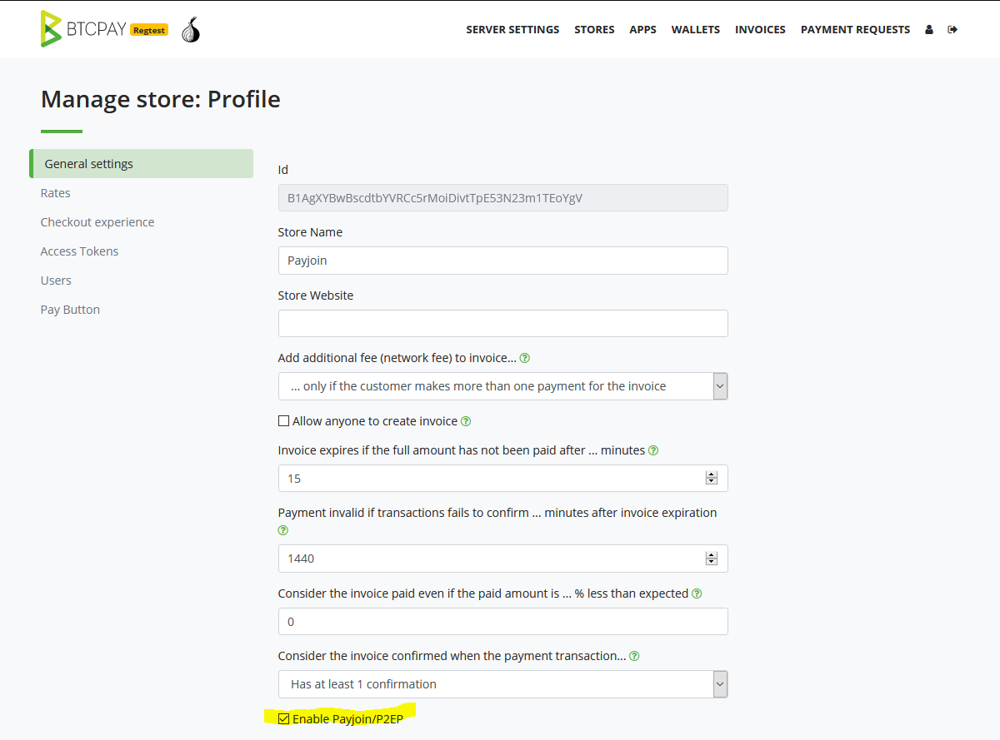
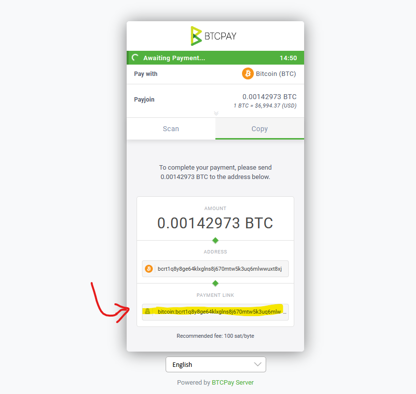
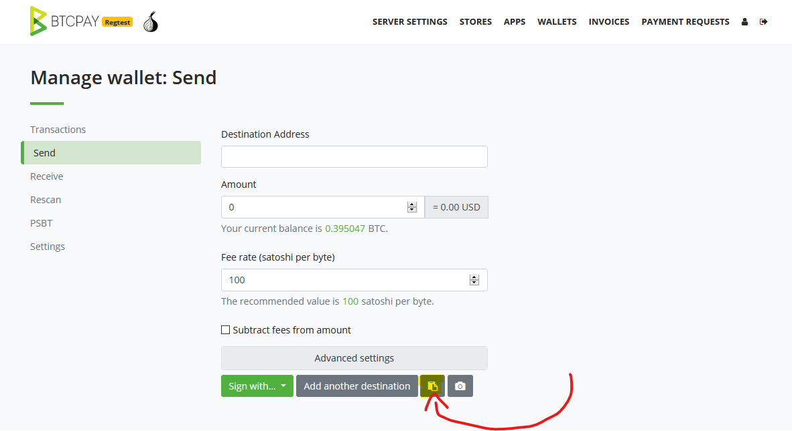
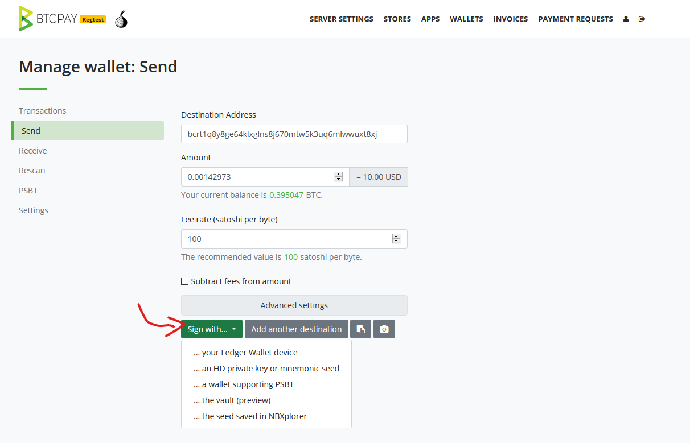
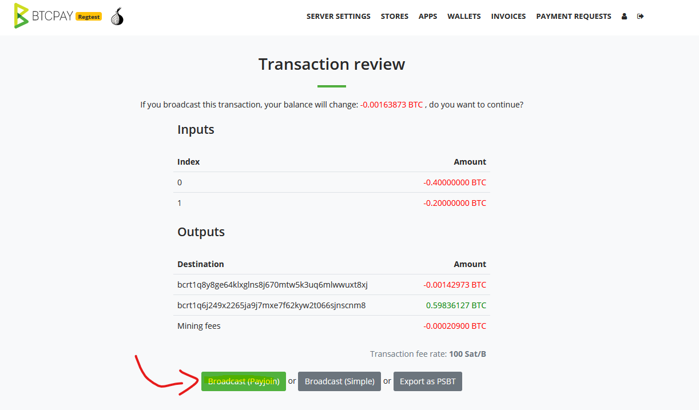

# BTCPay Server Payjoin Guide

This document explains how to use BTCPay Server's **Payjoin** feature. For a detailed, technical explanation of how payjoin is implemented, check [BIP78](https://github.com/bitcoin/bips/blob/master/bip-0078.mediawiki)

You can follow this video to better understand what payjoin is and how to use it.

## Enabling Payjoin as a merchant

1. Create a store
2. Configure a [hot wallet](./CreateWallet.md#hot-wallet) for your derivation scheme. Be sure to use either segwit or segwit wrapped as the address type.
3. Enable Payjoin/P2EP in the "General Settings" and click "Save"

It's important to note that you will need at least 1 UTXO for payjoin to work.

## Paying to Payjoin as a user

The [BTCPay Wallet](./Wallet.md) supports Payjoin.

1. Retrieve the BIP21 payment link from a BTCPay Server invoice which has payjoin enabled by either:
   * Scan the QR code with the camera scanning feature
   * Copy the link from the "Open in wallet" button and paste it in the "Parse BIP21" prompt
2. The send form should be populated with the payment details. You can check if the invoice supports payjoin by expanding the "advanced settings" and see if there is a "Payjoin endpoint" input with a url.
3. Sign your transaction using either BTCPay Server's hardware wallet support via [BTCPay Vault](./HardwareWalletIntegration.md) or the [hot wallet](./CreateWallet.md#hot-wallet) feature.
4. Once your original transaction is ready, you will be given the option to either `Broadcast (Payjoin)` or to `Broadcast (Simple)`. Choose `Broadcast (Payjoin)`.
5. The payjoin server will propose a new special transaction, if possible. If the payjoin server is unable to do the payjoin, the original transaction is broadcast instead.
6. If you are using a hardware wallet, you will be asked to sign the payjoin transaction again (the hot wallet feature signs the transaction for you automatically).
7. Congratulations, you've just helped improve Bitcoin's fungibility and your financial sovereignity!

## Why did a payjoin not happen?

There's multiple reasons for this:

* The store did not have any utxos to contribute towards a payjoin
* Your wallet does not use the same format as the store's (essential to not raise suspicion to analysis companies)
* You are not using segwit or p2sh wrapped segwit.
* The payjoin server is not available

## Supported wallets

Please contact and encourage your wallet developers to add support. The more widespread the **usage of payjoin**, the more broken the heuristics used by blockchain analysis companies become and can effectively trace your financial history. If you are a wallet developer, please [contact us](./Community.md) if you need help or have feedback.
