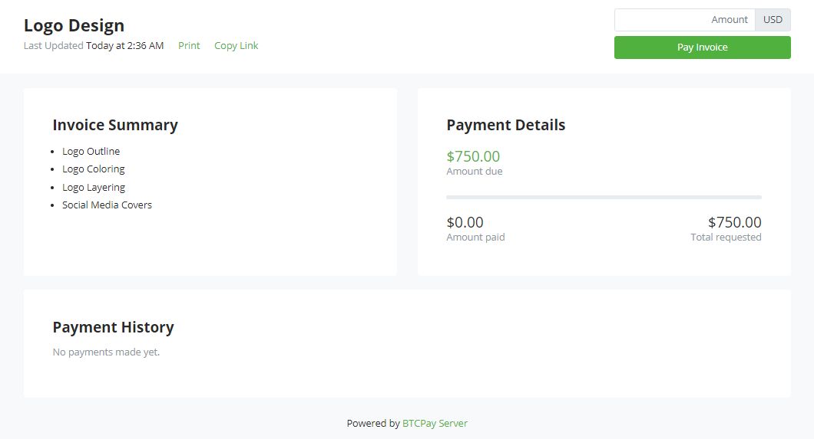

# Payment Requests

Payment Requests are a feature which allows BTCPay store owners to create long-lived invoices.
Funds paid to a payment request use the exchange rate at the time of payment.
This allows users to make payments at their convenience without having to negotiate or verify exchange rates with the store owner at the time of payment.

Users can pay requests in partial payments.
The payment request will remain valid until it is paid in full or if the store owner requires an expiration time.
Addresses are never reused. A new address is generated each time the user clicks pay to create an invoice for the payment request.

Store owners can also print payment requests (or export invoice data) for record keeping and accounting.
BTCPay automatically labels invoices as Payment Requests in your store's invoice list.

## Payment Requests Video

[](https://www.youtube.com/watch?v=j6CvwDPvfzQ "BTCPay Server Payment Requests")

## Customize Your Payment Requests

- **Invoice Amount** - Set Requested Payment Amount
- **Denomination** - Show Requested Amount in Fiat or Cryptocurrency
- **Payment Quantity** - Allow only single payments or partial payments
- **Expiration Time** - Allow payments until a date or without expiry
- **Description** - Text Editor, Data Tables, Embed Photos & Videos
- **Appearance** - Color and Style with CSS Themes

## Create a Payment Request

Click Payment Requests > Create new payment request


Provide the Request Name, Amount, Display Denomination, Associated Store, Expiration Time & Description (Optional)

Select the option *Allow payee to create invoices in their own denomination* if you want to allow partial payments to be made.

:::warning
Payment requests are store-dependent, which means that each payment request is associated with a store during creation.
Be sure to have a wallet connected to your store which the payment request belongs to.
:::

Click Save & View to review your payment request.



BTCPay creates a URL for the payment request. Share this URL to view your payment request.

## Paid Request for Payment

Both the payee and requester can view the status of the payment request after sending payment.
The status will appear as **Settled** if payment has been received in full.
If only partial payment was made, the Amount Due will show the balance due.


## Customize Payment Requests

The request's description content can be edited using the payment request's text editor.
If you want to use additional color themes or custom css styling, both options are available.

Non-technical users can use a [bootstrap theme](./Theme.md#2-bootstrap-themes).
Further customization can be done by providing additional CSS code, like shown below …

```css
:root {
  --btcpay-font-family-base: "Source Sans Pro", -apple-system, BlinkMacSystemFont, "Segoe UI", Roboto, "Helvetica Neue", Arial, sans-serif;
  --btcpay-color-primary: #7D4698;
  --btcpay-color-primary-accent: #59316B;
  --btcpay-body-color: #333A41;
  --btcpay-body-bg: #FFF;
  --btcpay-bg-tile: #F8F9FA;
}
#mainNav {
  color: white;
  background: linear-gradient(#59316B, #331840);
}
#mainNav .btn-link {
  color: white;
}
```


