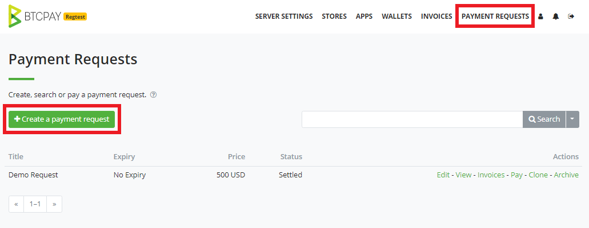

# Payment Requests

Payment Requests are a feature which allows BTCPay store owners to create long-lived invoices.
Funds paid to a payment request use the exchange rate at the time of payment.
This allows users to make payments at their convenience without having to negotiate or verify exchange rates with the store owner at the time of payment.

Users can pay requests in partial payments.
The payment request will remain valid until it is paid in full or if the store owner requires an expiration time.
Addresses are never reused. A new address is generated each time the user clicks pay to create an invoice for the payment request.

Store owners can also print payment requests (or export invoice data) for record keeping and accounting.
BTCPay automatically labels invoices as Payment Requests in your store's invoice list.

## Payment Requests Video

## Create a Payment Request

Click Requests > Create Requests

When creating a payment request, you provide the following details:

- **Title**: The payment request title
- **Amount & Currency**: The requested amount in Fiat or cryptocurrency 
- **Expiration Time**: The date until which payments are valid (optional)
- **Email**: If specified, the email address will receive notification regarding any payment done on this request
- **Request Customer data on checkout**: You can request customer's details such as email address or shipping address. 
- Memo: If you wish to leave a note for the client, you can write them in the memo section. A text editor that allows you format your message and also include attachment 

Select the option _Allow payee to create invoices in their own denomination_ if you want to allow partial payments to be made.

:::warning
Payment requests are store-dependent, which means that each payment request is associated with a store during creation.
Be sure to have a wallet connected to your store which the payment request belongs to.
:::

Click Create to review your payment request.

BTCPay creates a URL for the payment request. Share this URL to view your payment request.
Need multiple of the same request ? You can use the `Clone` option in the main menu to duplicate payment requests as shown.

## Paid Request for Payment

Both the payee and requester can view the status of the payment request after sending payment.
The status will appear as **Settled** if payment has been received in full.
If only partial payment was made, the Amount Due will show the balance due.

