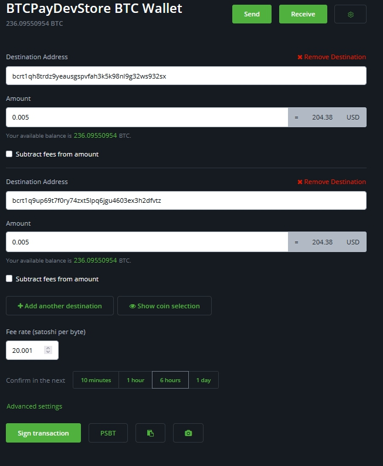

# Payouts

The payout functionality is tied into the [Pull Payments](./PullPayments.md). This feature allows you to create payouts within your BTCPay.
This feature allows you to process pull payment (refunds, salary payouts, or withdrawals).

## How does it work?

We will go through two examples, one will be a Refund, and the other will be a salary payout.

### Example

Let's start with the refund example.
The customer has bought an item in your store but sadly has to return the item. They want a refund.
Within BTCPay, you can create a [Refund](./Refund.md) and provide the customer with the link to claim their funds.
Whenever the customer has given their address and claimed the funds, it will be shown in the `Payouts`.

The first status it has is `Awaiting Approval`.
Store clerks can check if multiple ones are waiting, and after making the selection, you use the `Actions` button.

Options on the action button

- Approve selected payouts
- Approve & send selected payouts
- Cancel selected payouts

The next step is to `Approve & send selected payouts` as we want to refund the customer.
Check the Customer's Address, shows the amount and if we want fees to be subtracted from the refund or not.
Once you've done the checks, only signing the transaction is left.

The customer now gets updated on the Claiming page. He can follow the transaction as he's provided with a link to a block explorer and his transaction.
Once the transaction has been confirmed, and the status changes to Completed.

Now let's get into Salary payout, as this is driven from inside the store and not per the Customer's request.
The underlying is the same; it uses the Pull payments. But instead of creating a refund, we will make a [Pull Payment](./PullPayments.md).

Goto the `Pull Payments` tab in your BTCPay server.
In the top right, click the `Create Pull Payment` Button.

Now we are in the creation of the Payout, give it a name and the desired amount in desired currency, fill out the Description, so the employee knows what it's about.
The next portion is similar to refunds. The employee fills out the Destination address and the amount he wants to claim from this Payout. He might decide to make it 2 separate claims, to different addresses, or even partly claim over lightning.

If there are multiple waiting Payouts, you can batch these to be signed and sent out. Once signed, the payouts move to the `In progress` tab and show the Transaction.
When accepted by the network, the payout moves to the Completed tab.
The completed tab is purely for historical purposes. It holds the processed Payouts and the transaction that belongs to it.

## Using Greenfield API

As described in the [Pull Payments](./PullPayments.md#greenfield-api) Greenfield API allows for broader use of `Pull Payments`.
The payout request will always go to the Payouts tab in your BTCPay server whenever the concept is used.
By using the Greenfield API you could automate these requests, a future release of BTCPay server presumably will have automation options for payouts.
