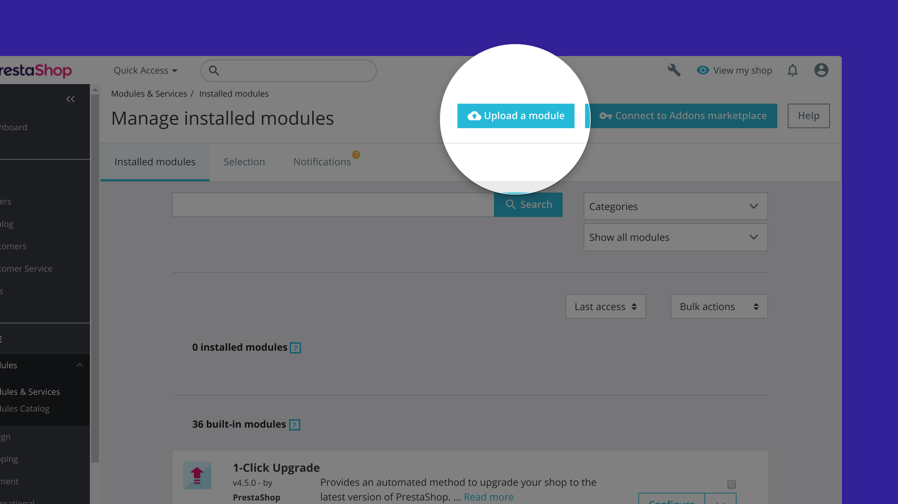
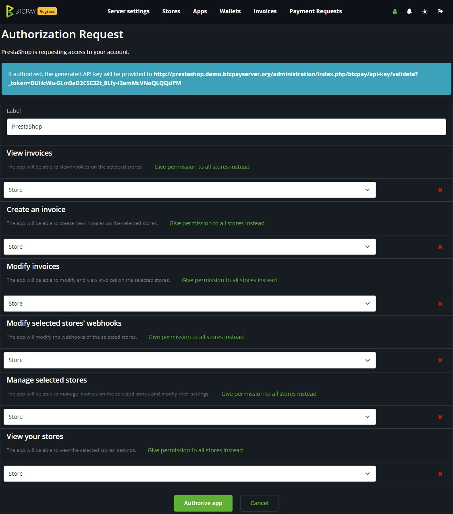
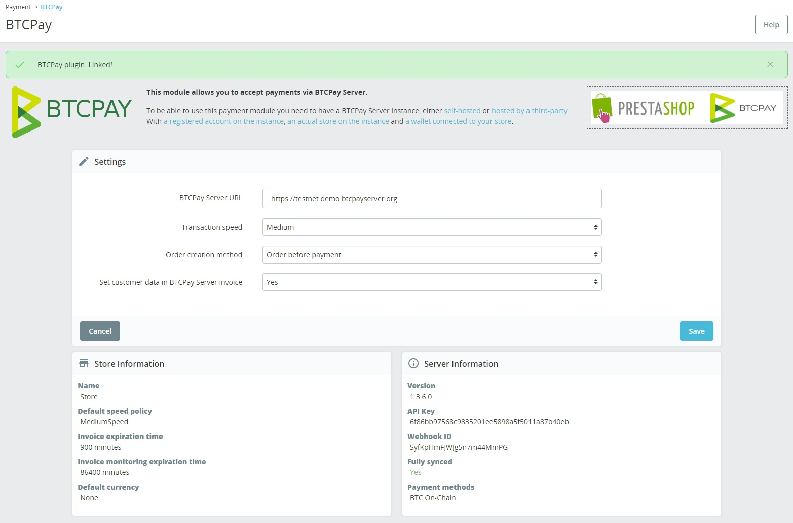

# Prestashop integration

This document explains how to **integrate BTCPay Server into your PrestaShop store**.
If you do not have a store yet, follow [this step by step article](https://blog.templatetoaster.com/how-to-install-prestashop/) to create one from scratch.

To integrate BTCPay Server into an existing PrestaShop store, follow the steps below.

:::tip
This document only applies to the latest _v5_ version of the module. If you want the _v4_ module documentation, [click here](https://github.com/btcpayserver/btcpayserver-doc/blob/cba96292ceea9483711ab53c479a98357383f857/docs/PrestaShop.md).
:::

## Server Requirements

Please ensure that you meet the following requirements before installing this plugin.

- You are using PHP 7.3.0 or higher
- Your PrestaShop is version 1.7.7.0 or higher.
- Your BTCPay Server is version 1.3.0 or higher
- The PDO, curl, gd, intl, json, and mbstring PHP extensions are available
+ You have a BTCPay Server, either [self-hosted](/Deployment/README.md) or [hosted by a third-party](/Deployment/ThirdPartyHosting.md)
+ [You've a registered account on the instance](./RegisterAccount.md)
+ [You've a BTCPay store on the instance](./CreateStore.md)
+ [You've a wallet connected to your store](./WalletSetup.md)

## Install BTCPay Plugin

1. [Download the latest BTCPay Server plugin](https://github.com/btcpayserver/prestashop-plugin/releases)
2. PrestaShop > Modules > Module Manager > Upload a module
3. Upload the `.zip`-file you just downloaded
4. Click on `configure` to setup the module

## Connecting the store

The Prestashop BTCPay Server module is a **bridge between your server (the payment processor) and your e-commerce store**.
No matter if you're using a self-hosted or third-party solution from step 2, the setup process is identical.

1. In the `BTCPay Server URL`-field, enter the full URL of your host (including the https) – for example https://testnet.demo.btcpayserver.org
2. Select the default transaction speed (this will change how much BTCPay recommends as transaction fee).
3. Select the relevant order mode for your store (order is created before or after payment).
4. Select if you want to send customer metadata to your BTCPay server instance for bookkeeping.
5. Press `Connect` to save your settings and be redirected to your BTCPay Server instance to create an API key.
6. When creating the API key, make sure to give the permissions to a specific store (multiple stores are not supported).

7. Press the `Authorize app`-button after which you will be redirected back to your Prestashop store.
8. Prestashop will try and create a connection to your BTCPay Server instance.
9. A message will be shown if the connection was successful (but it is smart to make a test purchase).

## 3. Contribute

BTCPay is built and maintained entirely by volunteer contributors around the internet. We welcome and appreciate new contributions.

Contributors looking to help out, before opening a pull request, please [create an issue](https://github.com/btcpayserver/prestashop-plugin/issues/new/choose)
or join [our community chat](https://chat.btcpayserver.org) to get early feedback, discuss the best ways to tackle the problem and to ensure there is no work duplication.

## PrestaShop Support

PrestaShop support can be found through its official channels.

* [Homepage](https://www.prestashop.com)
* [Documentation](https://doc.prestashop.com)
* [Support Forums](https://www.prestashop.com/forums)
