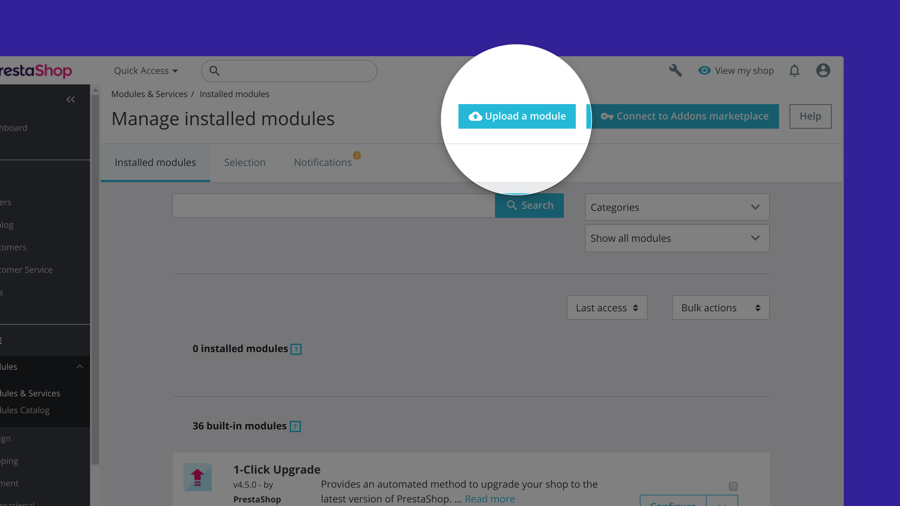

# Prestashop integration

This document explains how to **integrate BTCPay Server into your PrestaShop store**.
If you do not have a store yet, follow [this step by step article](https://blog.templatetoaster.com/how-to-install-prestashop/) to create one from scratch.

To integrate BTCPay Server into an existing PrestaShop store, follow the steps below.

## 0. Server Requirements

Please ensure that you meet the following requirements before installing this plugin.

+ You are using PHP 7.3 or higher
+ Your PrestaShop is version 1.7.7.0 or higher.
+ The curl, gd, intl, json, and mbstring PHP extensions are available
+ You have a BTCPay Server, either [self-hosted](./Deployment.md) or [hosted by a third-party](./ThirdPartyHosting.md)
+ [You've a registered account on the instance](./RegisterAccount.md)
+ [You've a BTCPay store on the instance](./CreateStore.md)
+ [You've a wallet connected to your store](./WalletSetup.md)

## 1. Install BTCPay Plugin

1. [Download the latest BTCPay plugin](https://github.com/btcpayserver/prestashop-plugin/releases)
2. PrestaShop > Modules > Module Manager > Upload a module
3. Upload the `.zip`-file you just downloaded
4. Click on `configure` to setup the module

## 2. Pairing the store

BTCPay PrestaShop plugin is a **bridge between your server (payment processor) and your e-commerce store**.
No matter if you're using a self-hosted or third-party solution from step 2, the pairing process is identical.

1. In the `BTCPay server url`-field, enter the full URL of your host (including the https) – https://btcpay.mydomain.com
2. Select the default transaction speed (this will change how much BTCPay recommends as transaction fee)
3. Select the relevant order mode for your store (order is created before or after payment)
4. Go to your BTCPay server, select a store, open its settings and select "Access Tokens".
5. Click on "Create a new token", select your store and then approve.
  5.1. You will see: "Server initiated pairing code: XXXX".
6. Enter your pairing code.
7. Press save. Prestashop will now attempt to make a connection with your BTCPayServer.
8. A message will be shown if the connection was successful.
9. It's recommended to do a test purchase.

## 3. Contribute

BTCPay is built and maintained entirely by volunteer contributors around the internet. We welcome and appreciate new contributions.

Contributors looking to help out, before opening a pull request, please [create an issue](https://github.com/btcpayserver/prestashop-plugin/issues/new/choose)
or join [our community chat](https://chat.btcpayserver.org) to get early feedback, discuss best ways to tackle the problem and to ensure there is no work duplication.

## PrestaShop Support

PrestaShop support can be found through its official channels.

* [Homepage](https://www.prestashop.com)
* [Documentation](https://doc.prestashop.com)
* [Support Forums](https://www.prestashop.com/forums)
