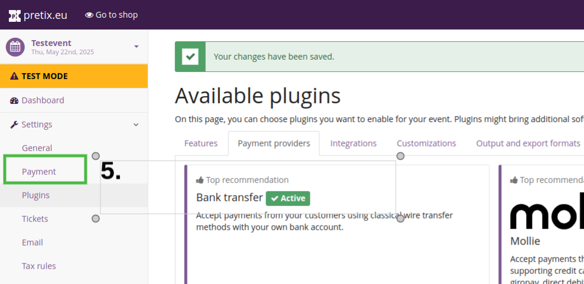
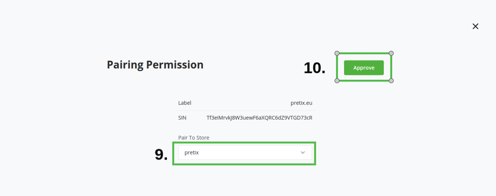
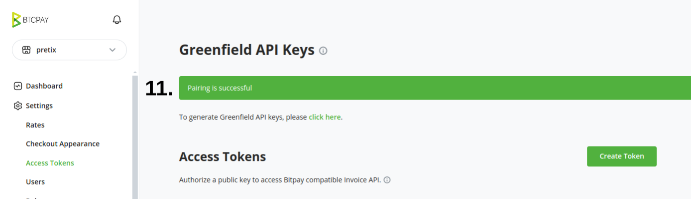
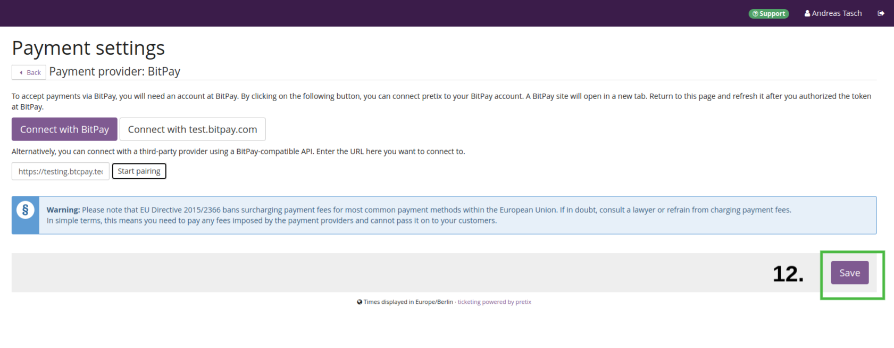

# Pretix - ticketing software for events

[Pretix](https://pretix.eu/) is a free and [open-source ticketing software](https://github.com/pretix/pretix) for conferences, festivals, exhibitions, workshops, and other events. You can deploy it on your own or start with their [cloud version](https://pretix.eu/about/en/pricing) which is free for up to 2500 ticket sales.

:::tip
This integration is maintained by Pretix and is not part of the BTCPay Server project.
:::

# Requirements
- You have a [Pretix cloud account](https://pretix.eu/signup/) or [self-hosted instance](https://docs.pretix.eu/en/latest/admin/installation/index.html)
- If you are self-hosting Pretix, you need to manually install their [BitPay plugin](https://github.com/pretix/pretix-bitpay)
- You have a BTCPay Server version 1.15.0 or later, either [self-hosted](/Deployment/README.md) or [hosted by a third-party](/Deployment/ThirdPartyHosting.md)
- [You've a registered account on the instance](./RegisterAccount.md)
- [You've a BTCPay store on the instance](./CreateStore.md)
- [You've a wallet connected to your store](./WalletSetup.md)

## Installing and configuring BitPay plugin for Pretix

:::tip
The plugin is called BitPay, but it actually supports BTCPay Server too as you can set a custom domain pointing to your BTCPay Server instance.
:::

1. In Pretix dashboard select the event you want to configure.
2. On left sidebar, expand "Settings" and click on "Plugins".
3. At the top select the "Payment providers" tab.
4. Find "BitPay" plugin and click on "Enable".

----
5. On left sidebar, click on "Payment".

----
6. On the line of "BitPay" click on "Settings".

----
7. Fill in the URL of your BTCPay Server instance, for example `https://mainnet.demo.btcpayserver.org` (this is where you have created your BTCPay Server store, see [Requirements](#requirements) above).
8. Click on "Start pairing".

----
9. You will get redirected to your BTCPay Server "pairing permission" page. Select the store you want to pair to.
10. Click on "Approve".

----
11. You should see the message "Pairing successful". You won't get redirected back to Pretix automatically, so you can close the tab now.

----
12. Go back to Pretix and click on "Save" on bottom right.

----
13. You now see the "Payment settings" page, you see **Enable payment method** at the top, check this box
14. **Payment method name**: Enter a name for the payment method, for example "Bitcoin / Lightning Network". You can leave the rest as is or adjust it to your needs.
15. Click on "Save" on bottom right.

Congratulations, you have completed the setup.

Now you can try a test purchase and make sure the payment method works as expected.
