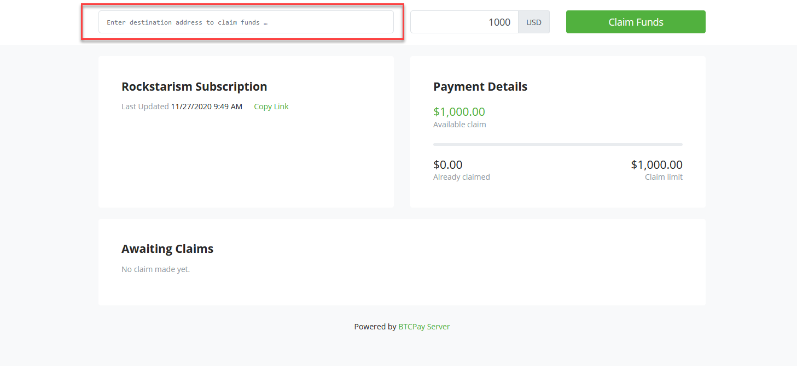
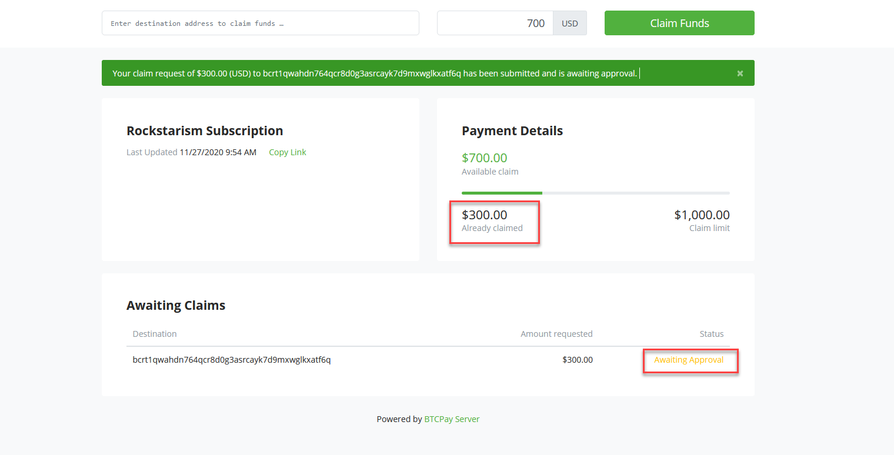

# Pull payments

## Introduction

Traditionally, to make a Bitcoin payment, a receiver shares their bitcoin address and the sender later sends money to this address.
Such system is called `Push payment` as the sender initiates the payment while the receiver may be unavailable, in effect `pushing` the payment to the receiver.

However, what about reversing the role?
What if, instead of a sender `pushing` the payment, the sender allows the receiver to `pull` the payment at a time the receiver seems fit?
This is the concept of `Pull payment`. This allows several new applications such as:

* A subscription service (where the subscriber allows the service to pull money every month)
* Refunds (where the merchant allows the customer to pull the refund money to his wallet when it seems fit)
* Time based billing freelancing (where the person hiring allows the freelance to pull money to his wallet as time get reported)
* Patronage (where the patron allows the recipient to pull money every month to continue supporting his work)
* Automatic selling (where a customer of an exchange would allow an exchange to pull money from his wallet to automatically sell every month)
* Balance withdraw system (where a high volume service allows users to request withdrawals from their balance, the service can then easily batch all the payouts to many users, at fixed intervals)

## Concept

When a sender configures a `Pull payment`, they can configure a number of properties:
* Start date
* End date (optional)
* A period (optional)
* A limit amount
* A unit (such as USD, BTC, Hours)
* Available payment methods

After this, the sender can share the pull payment with the receiver, allowing the receiver to `create a payout`.
The receiver will choose for their payout:
* Which payment method to use
* Where to send the money

Once a payout is created, it will count toward the `pull payment's limit` for the current `period`.
The sender will then approve the payout by setting the `rate` in which the payout will be sent, and proceed to payment.

For the sender, we provide an easy to use way to batch the payment of several payouts from the wallet of their BTCPay Server instance.

```

 +----------+           +-------------------+            +------------+
 |          |           |                   |            |            |
 |  Sender  |           |   BTCPay Server   |            |  Receiver  |
 |          |           |                   |            |            |
 +----------+           +-------------------+            +------------+
      |                            |                            |
      |                            |                            |
      |          Create            |                            |
      +--------------------------->+                            |
      |          Pull payment      |                            |
      |                            |                            |
      |                            |                            |
      |          Share             |                            |
      +-------------------------------------------------------->+
      |          Pull payment      |                            |
      |                            |                            |
      |                            |           Create           |
      |                            +<---------------------------+
      |                            |           Payout           |
      |                            |                            |
      |         Approve            |                            |
      +--------------------------->+                            v
      |         Payout             |
      |                            |
      |         Pay                |
      +--------------------------->+
      |         Payout             |
      |                            |
      |                            |
      v                            v
```

Note that BTCPay Server does not approve and pay a payout automatically.
Instead, a notification will appear for the sender, giving the sender the choice to approve and pay the payouts.

## Greenfield API

We provide a full API to both the sender and receiver that is documented in the `/docs` page of your instance. (or on our [public link](https://docs.btcpayserver.org/API/Greenfield/v1/) page)

Since our API exposes the full capability of pull payments, a sender can automate payments for his own need.

## User interface

The user interface only allows a subset of what is possible.

### Create a pull payment

1. Go to your wallet page / pull payments

2. Click on `Create a new pull payment`

3. Fill out the pull payment information, click `Create`

4. Go to the pull payment page by clicking on `View`
5. Share this page with the payment receiver

5. As the receiver, fill out how much `USD` you claim, and to which address should the money be sent.


### Approve and pay a payout
1. The sender get notified when the receiver is pulling money

2. Clicking on the notification brings the sender to a page listing all outstanding payouts

3. Check the payout to approve and pay and confirm

4. You are then brought to the normal wallet user interface of BTCPay Server

:::warning
Clicking on Confirm selected payouts will use the current exchange rate of your wallet's store settings. The rate is then fixed, even if you don't complete the payment. Payments made at a later time will use this previously confirmed rate.
:::

### Create a refund

Another way of using pull payments is by the invoice refund mechanism:
* After an invoice has been confirmed, go in the Invoices page and click `Details` on the invoice.

* Click `Issue a refund`

* Select the way you want to issue the refund

* You can now share the pull payment link with the customer

