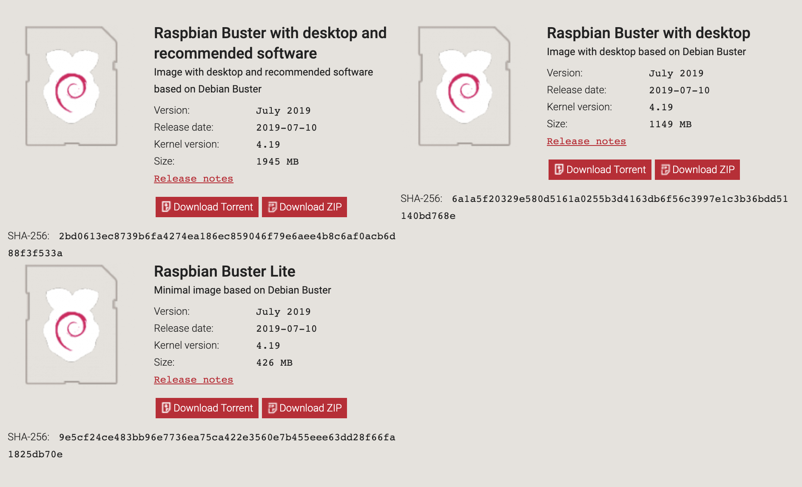

# Raspberry Pi 4 Deployment

This document guides you step by step on **how to run BTCPay Server on a Raspberry Pi 4**. See here the [Raspberry Pi 3 instructions](./RPi3.md)

The newly released **Raspberry Pi 4** is currently the best low-cost single-board computer available. You can **use a Raspberry Pi 4 to run your BTCPay Server** at home for around $150 worth of parts, described below.

## Required Hardware

### Raspberry Pi 4

- [Raspberry Pi 4 with **4GB RAM**](https://www.canakit.com/raspberry-pi-4-4gb.html) ($55)
- [Sandisk 16GB SD Card](https://www.amazon.com/dp/B073K14CVB/) ($5)

Don’t settle for only 1GB or 2GB of RAM. The **4GB RAM** version is harder to find than the other versions, but you absolutely want that **4GB of RAM** for a few extra bucks, and it’s totally worth spending a few extra minutes searching on the Internet to find a vendor that has the 4GB RAM version in stock. You’ll also need an **SD card reader** if you don’t already have one.

### Power Adapters and USB-C Cable

- [Official Raspberry Pi 4 USB-C Power Adapter 5.1V/3A for US](https://shop.pimoroni.com/products/raspberry-pi-official-usb-c-power-supply-us?variant=29391144648787) ($10)
- [Official Raspberry Pi 4 USB-C Power Adapter 5.1V/3A for EU](https://shop.pimoroni.com/products/raspberry-pi-official-usb-c-power-supply-eu?variant=29391130624083) ($10)
- [Official Raspberry Pi 4 USB-C Power Adapter 5.1V/3A for AU](https://shop.pimoroni.com/products/raspberry-pi-official-usb-c-power-supply-au?variant=29391160737875) ($10)

Don’t waste your time with random Chinese power adapters from Amazon, or expect that the existing ones you have at home are going to work fine. The Raspberry Pi 4 has issues with unofficial adapters, and for only $10 it’s better to just **get an official adapter** instead of learning this the hard way.

### Cooling options: Passive vs Active vs Passive+Active

- [Pimoroni Fan Shim](https://shop.pimoroni.com/products/fan-shim) ($10)

Strictly speaking, you don’t actually **need** a cooling solution, but you certainly **want** a cooling solution, because once the Raspberry PI core temperature reaches 70C, it will throttle the CPU down to avoid burning itself up.

### Case options: Naked vs. Protection

- [Flirc Heatsink Case](https://flirc.tv/more/raspberry-pi-4-case) ($12)
- [Pimoroni Pibow Coupé 4](https://shop.pimoroni.com/products/pibow-coupe-4?variant=29210100105299) ($9)

Of course, using a case is totally optional, but we recommend one to protect your Raspberry Pi over the long-term and prevent random dust from shorting out the pins.

### Data storage options: SSD vs USB memory vs SD card

- [Samsung 500GB SSD](https://www.amazon.com/dp/B073GZBT36/) ($75)

The 500GB SSD allows you to keep a full copy of the Bitcoin blockchain, until it grows past 500GB sometime in 2022. At that time, you’ll either have to enable pruning on your Bitcoin node, or upgrade to a 1TB SSD, which will presumably be cheaper then, probably even less than $75. You can also use BTCPay without a full copy of the Bitcoin blockchain.

### Display options: Display or Headless

- Display ($100)

## Assembling the Raspberry Pi 4 components

- Important: Attach a heatsink to the CPU! 🔥🔥🔥
- Connect the SSD to one of the blue colored USB 3 ports
- Prepare the USB Power Adapter but don’t plug it in yet


## Install Linux on the Raspberry Pi

Start by downloading [Raspbian Linux](https://www.raspberrypi.org/downloads/raspbian/) to your existing computer. The “Lite” distribution is fine for BTCPay setup, but if you want to use your Raspberry Pi for other things, you might want the full image.



### Flash your SD card with Raspbian Linux

- Extract the downloaded Raspbian Linux zip file
- Download the latest version of [balenaEtcher](https://www.balena.io/etcher/) and install it.
- Connect an SD card reader with the SD card inside.
- Open balenaEtcher and select from your hard drive the Raspberry Pi .img from the extracted zip file you wish to write to the SD card.
- Select the SD card you wish to write your image to.
- Review your selections and click 'Flash!' to begin writing data to the SD card.

You can find a more in-depth instruction guide to flashing to your SD card at the [official Raspberry Pi  website](https://www.raspberrypi.org/documentation/installation/installing-images).

If you used balenaEtcher to flash, the SD card will already have been ejected. Simply take the SD card out and put it back in. The SD card should now be labelled as `boot`. Next, enable SSH at bootup so you can remotely login by creating an empty file in the SD card root folder called `ssh`. Eject the SD card through your OS before taking it out of the SD card reader.


## Booting up the Raspberry Pi

After inserting the SD card into the Raspberry Pi, go ahead and connect the power and ethernet, and optionally the display and keyboard if you have those. It should boot up and get an IP address using DHCP. You can try searching for it with `ping raspberrypi.local` on your desktop PC, but if that doesn’t work you will need to login to your router to find its IP address.

The IP address that my Raspberry Pi got was 192.168.1.5 so I SSH’d to that:

```bash
ssh 192.168.1.5 -l pi
```

The default password for the “pi” user is “raspberry”. After SSH’ing in, the first thing I want to do is check the device’s CPU temperature to make sure the cooling system are working correctly. Press Ctrl-c to stop monitoring:

```bash
sudo watch -n1 vcgencmd measure_temp
```

Next, let’s change the password for the “pi” user:

```bash
passwd pi
```


After that, switch to the `root` user, which we will use for the remaining part of the tutorial:

```bash
sudo su -
```

## Configuring the storage

We recommend to disable swap to prevent burning out your SD card:

```bash
dphys-swapfile swapoff
dphys-swapfile uninstall
update-rc.d dphys-swapfile remove
systemctl disable dphys-swapfile
```


Partition your SSD:

```bash
fdisk /dev/sda
# type 'p' to list existing partitions
# type 'd' to delete currently selected partitions
# type 'n' to create a new partition
# type 'w' to write the new partition table and exit fdisk
```

Format the new partition on your SSD:

```bash
mkfs.ext4 /dev/sda1
```

Configure the SSD partition to auto-mount at bootup:

```bash
mkfs.ext4 /dev/sda1
mkdir /mnt/usb
UUID="$(sudo blkid -s UUID -o value /dev/sda1)"
echo "UUID=$UUID /mnt/usb ext4 defaults,noatime,nofail 0 0" | sudo tee -a /etc/fstab
mount -a
```

While you’re editing `/etc/fstab` add a RAM filesystem for logs (optional).
This is also to prevent burning out your SD card too quickly:

```bash
echo 'none /var/log tmpfs size=10M,noatime 0 0' >> /etc/fstab
```

Mount the SSD partition and create a symlink for docker to use the SSD:

```bash
mkdir /mnt/usb/docker
ln -s /mnt/usb/docker /var/lib/docker
```

## Configuring the firewall

Upgrade your OS packages to latest:

```bash
apt update && apt upgrade -y && apt autoremove
```

Install a firewall and allow SSH, HTTP, HTTPS, Bitcoin, and Lightning:

```bash
apt install -y ufw
ufw default deny incoming
ufw default allow outgoing
```

UFW needs default iptables changes and a reboot for the firewall to work:

```bash
sudo update-alternatives --set iptables /usr/sbin/iptables-legacy
sudo reboot
```

This command allows SSH connections from internal networks only:

```bash
ufw allow from 10.0.0.0/8 to any port 22 proto tcp
ufw allow from 172.16.0.0/12 to any port 22 proto tcp
ufw allow from 192.168.0.0/16 to any port 22 proto tcp
ufw allow from 169.254.0.0/16 to any port 22 proto tcp
ufw allow from fc00::/7 to any port 22 proto tcp
ufw allow from fe80::/10 to any port 22 proto tcp
ufw allow from ff00::/8 to any port 22 proto tcp
```

These ports need to be accessible from anywhere (The default subnet is 'any' unless you specify one):

```bash
ufw allow 80/tcp
ufw allow 443/tcp
ufw allow 8333/tcp
ufw allow 9735/tcp
```

Verify your configuration:

```bash
ufw status
```

Enable your firewall:

```bash
ufw enable
```

## Setup BTCPay Server

Download BTCPay Server from GitHub:

```bash
cd # ensure we are in root home
apt install -y fail2ban git
git clone https://github.com/btcpayserver/btcpayserver-docker
cd btcpayserver-docker
```

Configure BTCPay by setting some [environment variables](https://github.com/btcpayserver/btcpayserver-docker#environment-variables):

```bash
export BTCPAY_HOST="raspberrypi.local"
export REVERSEPROXY_DEFAULT_HOST="$BTCPAY_HOST"
export NBITCOIN_NETWORK="mainnet"
export BTCPAYGEN_CRYPTO1="btc"
export BTCPAYGEN_LIGHTNING="lnd"
export BTCPAYGEN_REVERSEPROXY="nginx"
export BTCPAYGEN_ADDITIONAL_FRAGMENTS="opt-more-memory"
export BTCPAY_ENABLE_SSH=true
```

If you want to use multiple hostnames, add them via the optional `BTCPAY_ADDITIONAL_HOSTS` variable:

```bash
export BTCPAY_ADDITIONAL_HOSTS="btcpay.YourDomain.com,btcpay.local"
```

In case you want to restrict access to your local network only, please note that you need to use a `.local` domain.

Run the BTCPay installation:

```bash
. ./btcpay-setup.sh -i
```

It should be up and running within a few minutes. Try opening http://raspberrypi.local in your web browser. If everything is correct, you will see BTCPay Server front page.

Now, you just need to wait a day or so for the Bitcoin blockchain to [sync and full verify](./FAQ/FAQ-Synchronization.md). The bottom of the BTCPay Server web GUI will show a pop-up dialog box to monitor the progress.
