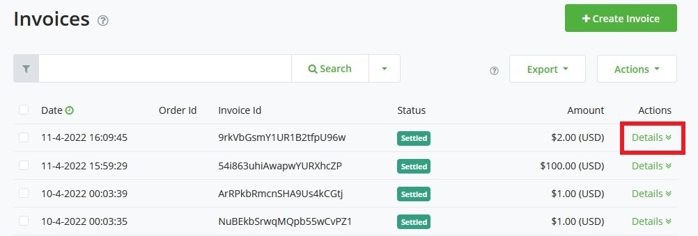
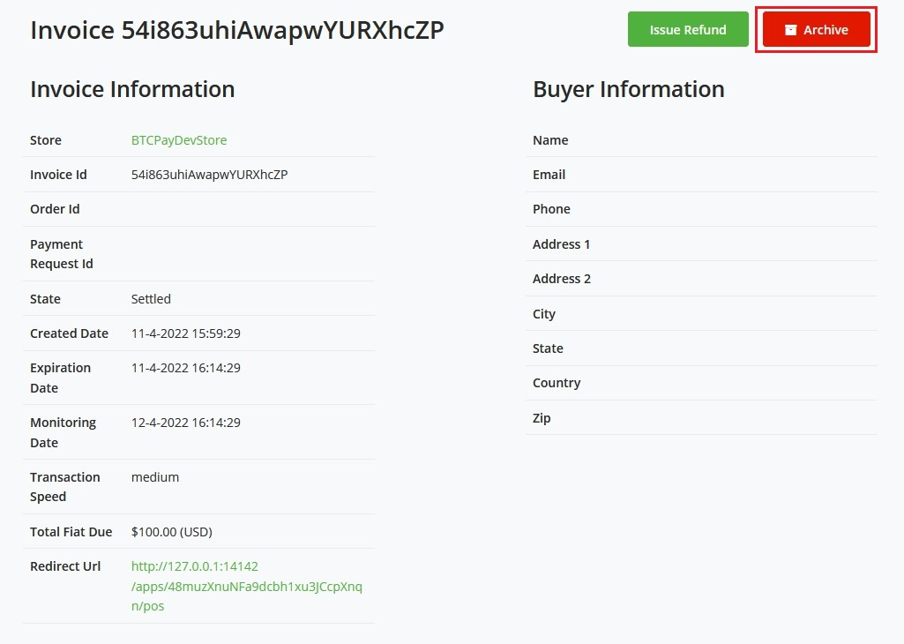
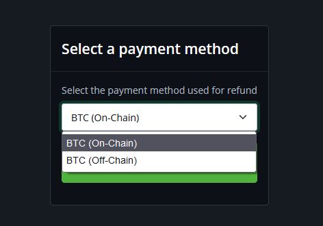
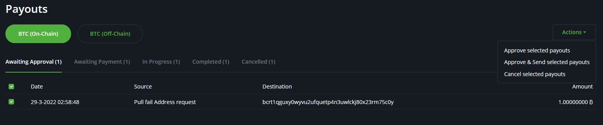
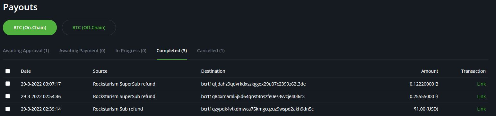

# Refunds

:::tip
If you are looking for information about requesting a refund from a merchant, please refer to this [FAQ](./FAQ/General.md#what-if-i-have-a-problem-with-a-paid-invoice)
:::

**Refunds** are one of the applications built on top of the [Pull Payments](./PullPayments.md) feature.

On this page, we will walk you through the process of issuing a refund.
There are a short few steps to create the refund for the customer.

## Create a refund

1. To refund an invoice, go in the `Invoices` page and click `Details` on the invoice.

2. Click `Issue a refund`

3. Select refund's payment method

4. Select the `amount` you want to refund

5. Share the link of this page with your customer

## Processing refund

Once a customer clicks on the link you've provided adds their refund bitcoin address and claims the invoice, the next step is to process a refund.

1. Go to the `Payouts` tab in your sidebar.

2. Select the Payouts you want to process, go to actions and select `Approve and send`

3. Sign and broadcast the transactions.

4. The payout has now been signed and is in progress, awaiting confirmation on the blockchain. This is reflected to the claimant in their view.

5. After the transaction has been confirmed on the blockchain, the status of the payout will be `completed`.

Customer's view after the refund has been successfully processed.

