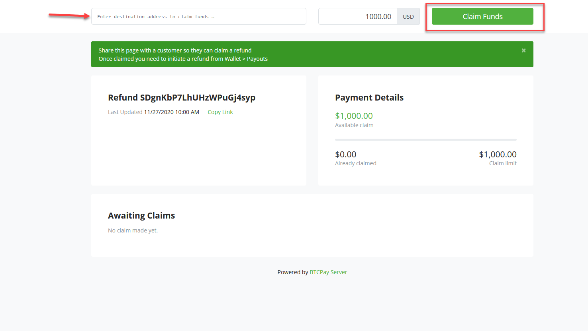

# Refunds

Refunds are one of the applications built on top of the [Pull Payments](./PullPayments.md) feature.

Up until now, merchants had to manually issue refunds.
The process required a lot of back and forth between a sender and a receiver. The merchant had to ask for a refund address, calculate the preferred rate, manually add that to the wallet and broadcast the transaction.

A merchant just needs to go to the invoice, click Issue refund , select the appropriate rate and share a link with a customer.

The customer will then input their address and claim a refund. Once a customer claims a refund, the merchant will get a notification and can authorize it in a click.
Future versions of BTCPay Server will enable instant payouts as an option, without the need for merchant approval.

## Create a refund

1. After an invoice has been confirmed, go in the Invoices page and click `Details` on the invoice.

2. Click `Issue a refund`

3. Select the way you want to issue the refund

4. Share the pull payment link with the customer

