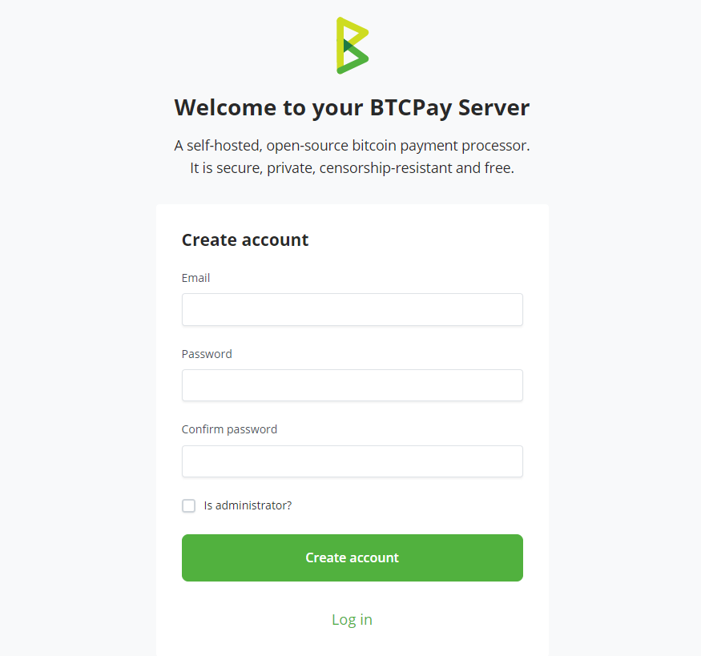

# (1) Register account

This page relates to registering an account on a BTCPay Server instance of your own, or using a third-party host.

To register a demo account, visit the [official demo](https://mainnet.demo.btcpayserver.org/login).

To deploy an instance of your own, see [choosing a deployment method](/Deployment/README.md).

A non-exhaustive list of third-party hosts can be found in the BTCPay Server [directory](https://directory.btcpayserver.org/filter/hosts).

## Account Registration

The first step in setting up your BTCPay Server is creating a user account. The **first created account** on a newly-deployed BTCPay Server is automatically - **admin**.

To register, visit your BTCPay Server URL and fill in the account registration form on the right. Input your password, password confirmation, e-mail and click "Register". You will automatically be logged in. If you're using a [third-party host](/Deployment/ThirdPartyHosting.md), you may be asked to verify your e-mail address to confirm the registration.

Once your account is successfully created, you'll be redirected to a new page where you can set up your store. Here, you'll need to provide a store name, select the default currency, and choose a currency rate provider.

Congratulations! You've completed the first step: creating your account and store on BTCPay Server.

Next Step: - [Connecting a Wallet](./WalletSetup.md).

If you need to manage multiple stores on your server instance, refer to [Creating a store](./CreateStore.md) for detailed instructions.

### Configuring e-mail

It's recommended that server admins [configure SMTP settings](./FAQ/ServerSettings.md#how-to-configure-smtp-settings-in-btcpay). E-mail setup enables easier password reset for the instance users in case of forgotten credentials.

To allow other users to access your server, you need to enable registration in Server Settings > Policies.

### Two-factor authentication

For further enhancing security and protecting your account, it's recommended to enable two-factor authentication (both 2FA and U2F are supported). To enable 2FA or U2F, click on the user settings icon in the header menu.

