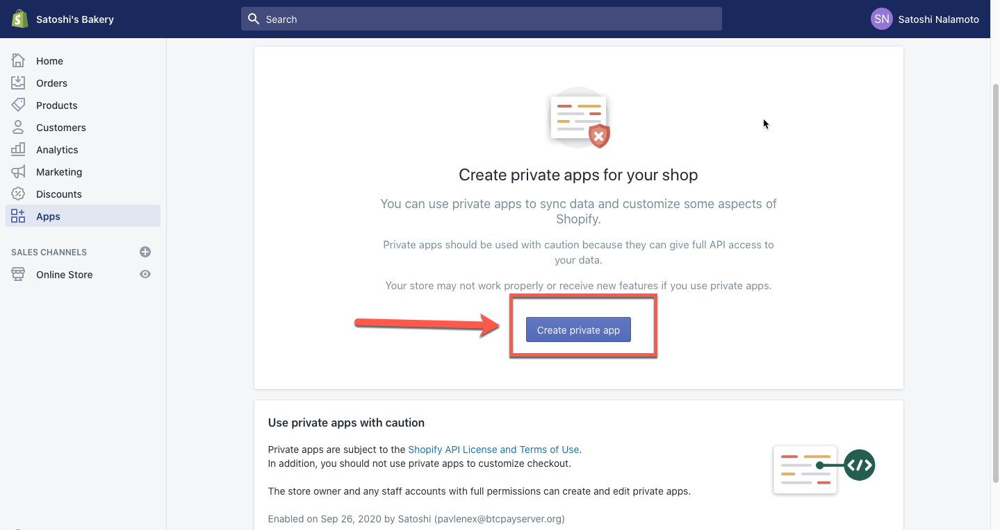
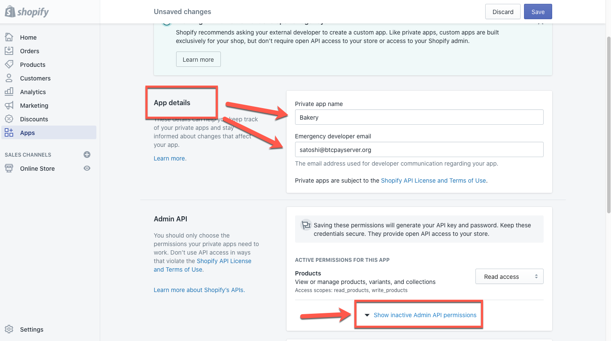
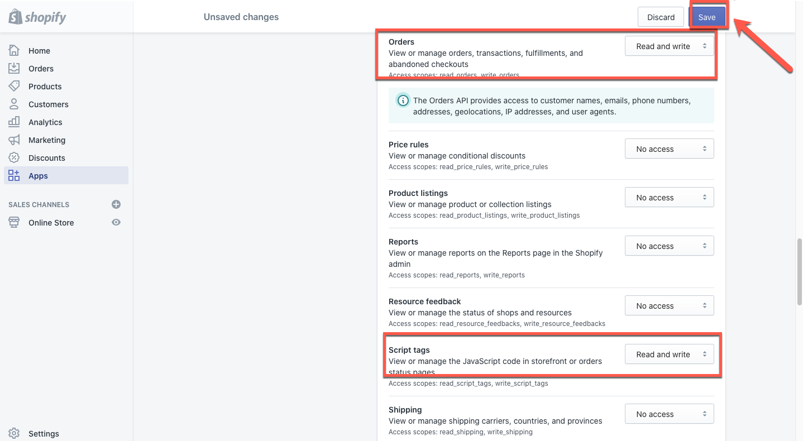
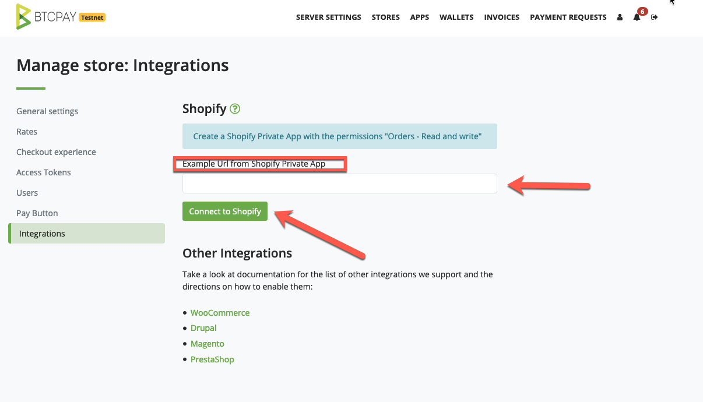
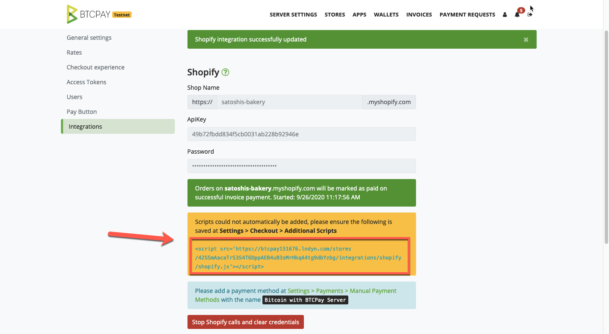
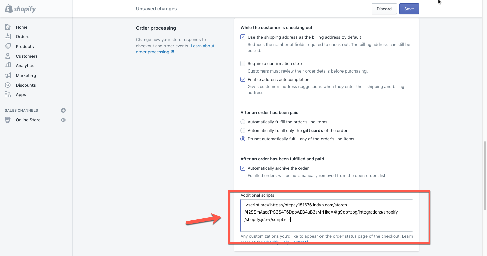

# BTCPay Server and Shopify Integration

The following document guides you through setting up BTCPay Server with [Shopify](https://www.shopify.com/).

## Prerequisites:

- Shopify account
- [BTCPay Server](Deployment.md) self-hosted or run by a [third-party host](ThirdPartyHosting.md) v1.0.5.6 or later.
- [Created BTCPay Server store](CreateStore.md) with [wallet set up](WalletSetup.md)

## Setting up BTCPay Server with Shopify

1. In your Shopify, go to Apps > Manage Private apps (at the bottom of the page) and `Create a private app`. If private apps are disabled, enable private apps development.
2. Fill in required  details (name and email) and click on the `Show inactive Admin API permissions`
3. Give `Read and write` permission tp `Orders` and `Save`

4. Copy the `Example URL` from the Admin API section.
5. In your BTCPay Server go to Store > Settings > `Integrations`
6. Paste the `Example URL` from Shopify and click `Connect to Shopify`

7. On the BTCPay Server Integration page, copy the script shown in the yellow box. Go back to Shopify Settings > Checkout > Order processing > `Additional Scripts` and paste the script (including the opening and closing tag `</script>` ).

7. Finally, in Shopify Settings > Payment Providers > Manual Payment Methods add a `Custom payment methods` named  `Bitcoin with BTCPay Server` and `Activate` it.

:::tip
Custom Payment method name **must** contain at least one of the following words: `bitcoin`, `btcpayserver`, `btcpay server` or `btc` to work.
:::

