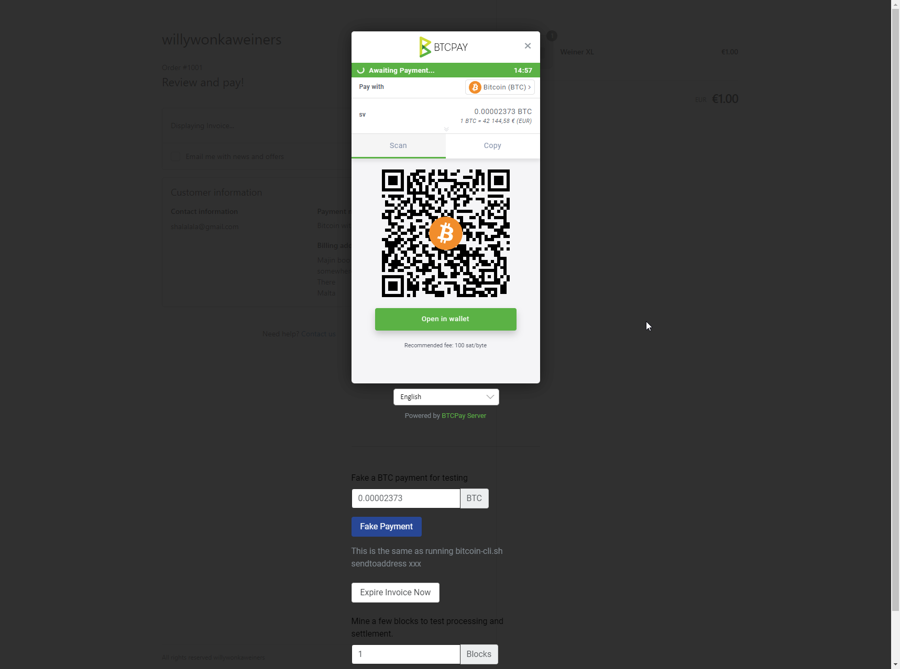

# Ultimate Guide: Accept Bitcoin in Shopify with BTCPay Server

Introducing BTCPay Server for Shopify – the innovative, open-source payment gateway that enables you accept bitcoin payments directly on your website or stores from customers with no fee.

Our integration with Shopify allows you connect your self-hosted BTCPay Server with your [Shopify store](https://www.shopify.com/), enabling you accept Bitcoin payments swiftly and securely.

Boost your payment option today with Bitcoin using our step-by-step BTCPay Server setup guide.

## What BTCPay offers:

- **Zero fees**: Enjoy a payment gateway with no fees. Yes, You saw that right. Zero fees!
- **Direct payment, No middlemen or KYC**: Say goodbye to intermediaries and tedious paperwork, and get your money directly in your wallet
- **Fully automated system**: BTCPay takes care of payments, invoice management and refunds automatically.
- **Display Bitcoin QR code at checkout**: Enhance customer experience with an easy and secure payment option.
- **Self-hosted infrastructure**: Maintain full control over your payment gateway.
- **Lightning Network integrated**: Instant, fast and low cost payments and payouts
- **Easy CSV exports**
- **Versatile plugin system**: Extend functionality according to your needs
- **Point-of-sale integration** – Accept payments in your physical shops
- **Multilingual ready**: Serve a global audience right out of the box.
- **Top-notch privacy and security**: Protect your and your customers’ data.
- **Community-driven support**: Get responsive assistance from our dedicated community ([Mattermost](http://chat.btcpayserver.org/) or [Telegram](https://t.me/btcpayserver)).

## Prerequisites:

Before diving into the setup process, ensure you have the following:

- Shopify account
- BTCPay Server] - [self-hosted](Deployment.md) or run by a [third-party host](/Deployment/ThirdPartyHosting.md) v1.4.8 or later.
- [Created BTCPay Server store](CreateStore.md) with [wallet set up](WalletSetup.md)

:::warning
Shopify might give false flags on deprecated API calls. The most likely answer we could find, due to a change by Shopify to specific fields of the `Order` resource and is assumed to get used in BTCPay Server. Find more details [here](https://github.com/btcpayserver/btcpayserver/issues/4510)
:::

## Setting up BTCPay Server with Shopify

1. In Shopify, click on Apps in the leftbar 
2. On the modal popped up, select "App and sales channel settings"
1. From the page displayed,  click on `Develop apps for your store` button.
2. If prompted, click on `Allow custom app development`
3. `Create an app` and name it
4. On the app page, in `Overview` tab, click on the `Configure Admin API scopes`
5. In the filter admin access scopes type in `Orders`
6. In `Orders` enable `read_orders` and `write_orders` and then click `Save`
7. Click on the `Install App` in the top right corner and when pop-up window appears click `Install`
8. Reveal `Admin API access token` and `copy` it.
9. In your BTCPay Server, go to `Store > Settings > Integrations > Shopify`. and click `Setup` button.
10. In second field, `API Secret Key` the paste the `Admin API access token`
11. In the first field, `API key` paste the `API key` from Shopify.
12. In Shopify's `Store Settings > Checkout > Order status page > Additional Scripts` paste the script provided by BTCPay Server on Shopify Integration page (including the opening and closing tag `</script>`.
13. In Shopify's `Store Settings > Payments > Manual payment methods` add `manual payment method` then click `create custom payment method`
14. In `Custom payment method name` fill in `Bitcoin with BTCPay Server`, optionally you can fill in other fields, but it's not required. Note that the name should exactly `Bitcoin with BTCPay Server`
15. Hit `Activate` and you've set up Shopify and BTCPay Server successfully.

:::tip
Custom Payment method name **must** contain at least one of the following words: `bitcoin`, `btcpayserver`, `btcpay server` or `btc` to work.
:::

Below are step by step visuals describing the process outlined above.

