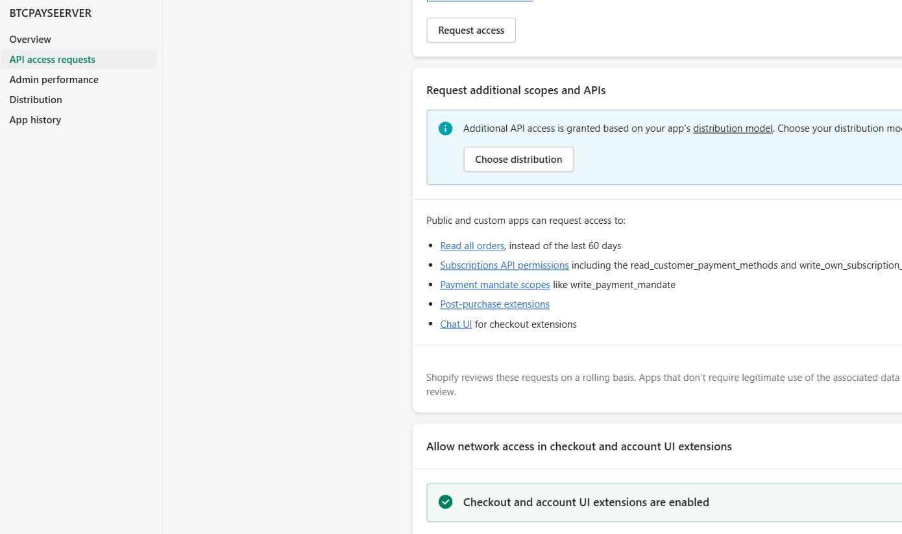
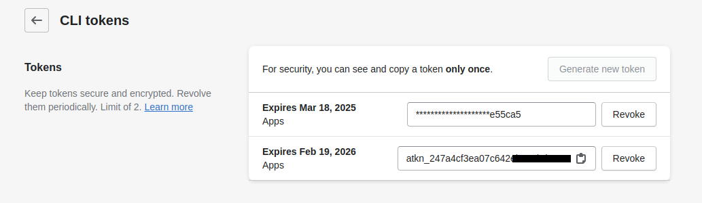
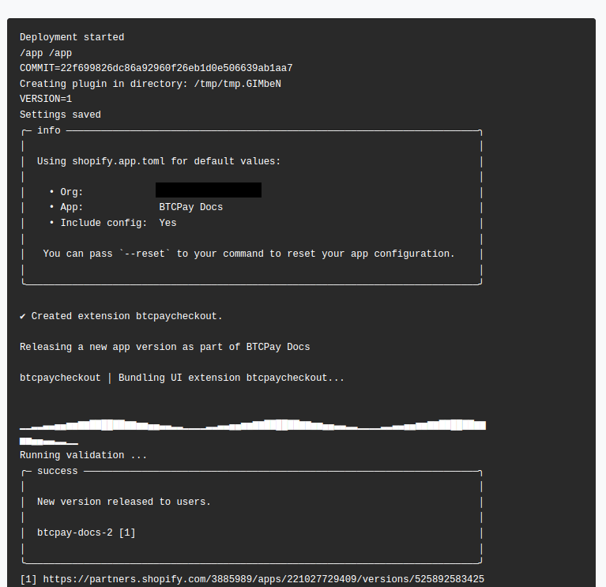
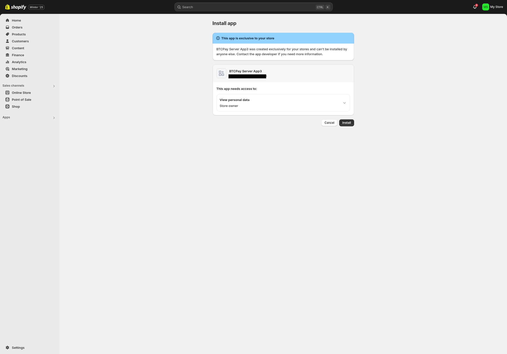
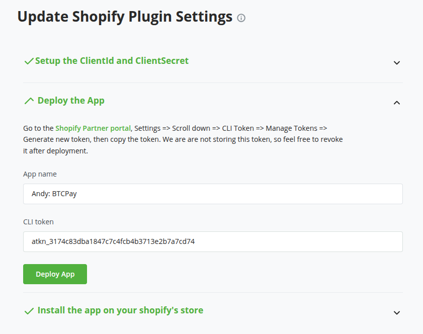

# Accept Bitcoin in Shopify with BTCPay Server

Introducing BTCPay Server for Shopify – open-source payment gateway that enables you accept bitcoin payments directly on your website or stores from customers with no fee.

Our integration with Shopify allows you to connect your self-hosted BTCPay Server with your [Shopify store](https://www.shopify.com/), enabling you accept Bitcoin payments swiftly and securely.


## What BTCPay offers:

- **Zero fees**: Enjoy a payment gateway with no fees. Yes, You saw that right. Zero fees!
- **Direct payment, No middlemen or KYC**: Say goodbye to intermediaries and tedious paperwork, and get your money directly in your wallet
- **Fully automated system**: BTCPay takes care of payments, invoice management and refunds automatically.
- **Display Bitcoin QR code at checkout**: Enhance customer experience with an easy and secure payment option.
- **Self-hosted infrastructure**: Maintain full control over your payment gateway.
- **Lightning Network integrated**: Instant, fast and low cost payments and payouts
- **Easy CSV exports**
- **Versatile plugin system**: Extend functionality according to your needs
- **Point-of-sale integration** – Accept payments in your physical shops
- **Multilingual ready**: Serve a global audience right out of the box.
- **Community-driven support**: Get responsive assistance from our dedicated community ([Mattermost](http://chat.btcpayserver.org/) or [Telegram](https://t.me/btcpayserver)).

:::warning
This is more simplified version of the previous Shopify V2 documentation (available from 30th December 2024 until 23rd February 2025) that required you to deploy the shopify app on a separate VPS. Now the app is deployed directly on your BTCPay Server and the BTCPay Shopify plugin has been changed. Everybody should switch to this setup as it is the only one we will maintain in the future.
:::

## Prerequisites:

Before diving into the setup process, ensure you have the following:

- [Shopify](https://www.shopify.com/) account and store setup
- An active Shopify subscription plan (at least Basic Shopify plan)
- [A Shopify partner account](https://www.shopify.com/partners) (it's free to register)
- BTCPay Server - [self-hosted](Deployment.md) or run by a [third-party host](/Deployment/ThirdPartyHosting.md) * v2.0.6 or later.
- [Created BTCPay Server store](CreateStore.md) with [wallet set up](WalletSetup.md)

* Please note that if you are on a 3rd-party host, they need to have activated the shopify fragment and enabled the Shopify v2 plugin for you. Otherwise it won't be available in your BTCPay Server.

## Set up a Shopify app

First we will create a new app in the Shopify partner portal. Make sure you are registered as a [Shopify partner](https://www.shopify.com/partners) (it's free to register).

1. On Shopify Partner [dashboard](https://partners.shopify.com), click on `Apps` > `All Apps` > `Create App` > `Create app manually`. Enter the name you want to call the app (e.g. BTCPay Server) and click `Create`.
2. Once created displays your "Client ID" and "Client secret", which we need in a minute. Please note them down or come back to this page later.
   
3. While in your just created app page, select API access on the left menu, scroll down to `Allow network access in checkout and account UI extensions` and grant network access. You should see the following screen once network access is granted 
   

:::tip
In case you encounter an error: "Could not grant checkout ui extension scope 'read_checkout_external_data'" while granting network access, this error occurs when you have not setup your first and last name in partner's account profile. To resolve this, update your profile with the required information, then attempt to grant network access again.
:::

4. Click on the shopify partner logo on the to return to partners dashboard
5. At the bottom of the page, click on "Settings"   
   
6. Scroll down to the bottom section of "CLI Token" and click on "Manage tokens"
   
7. On top right click on "Generate new token"
   
8. In the modal popup keep the default and click on "Generate token"
   
9. Copy the token and note it next to client ID and client secret from above. This token is only shown once.
   


## Deploy the Shopify-BTCPay-app on your BTCPay Server

:::tip
For the instructions below to work you need to be the admin of your own BTCPay Server instance. If you are on a 3rd-party host then their admin needs to have activated the shopify fragment and enabled the Shopify v2 plugin for you, otherwise it won't be available to you.
:::

### Deploy the Shopify fragment

1. Log into your BTCPay Server via SSH
2. Run the following commands:

```bash
# if you are not root user, switch to root
sudo su -

# go to the BTCPay Server docker directory
cd $BTCPAY_BASE_DIRECTORY
cd btcpayserver-docker

# make sure you have latest btcpayserver-docker commits
git pull

# add the shopify fragment to your BTCPay Server
export BTCPAYGEN_ADDITIONAL_FRAGMENTS="$BTCPAYGEN_ADDITIONAL_FRAGMENTS;opt-add-shopify"

# run the setup script
. ./btcpay-setup.sh -i
```

The setup script fetches the [BTCPay Shopify app](https://github.com/btcpayserver/shopify-app) and deploys it to a docker container. If you want to be sure it worked you can check with:

```bash
docker ps | grep shopify
```

We can now proceed with installing the BTCPay Server Shopify plugin.

### Install BTCPay Server Shopify plugin v2

1. On your BTCPay Server, click on "Manage Plugins" in the sidebar, find and install the "BTCPay Server Shopify plugin v2" by btcpayserver.

2. After that, scroll to the top and click on the "Restart now" link to restart BTCPay.


BTCPay Server will restart which can take a few minutes. 

### Configure BTCPay Server Shopify plugin
1. Make sure your store is selected at the top, then on the left sidebar click on `Shopify v2`
2. In the first of 3 sections you will need to enter the `Client ID`, `Client Secret` from [Shopify app setup](#set-up-a-shopify-app) above. Click on "Save"
   
3. In the next section "Deploy the app" you need to enter the `App name`, best to use the same as on [Shopify app setup](#setup-a-shopify-app). In the field `CLI token` enter the also previously noted "CLI Token" from the app setup.
   
4. Click on "Deploy App"
   You will now see some console output and that the app will be deployed to shopify. If everything goes well the section will close and the last section will open.
   
5. In the last section "Install the app on your Shopify store" there is nothing to do, it will just check if the app is installed on the store. We will do that in the next steps below.
   


## Install BTCPay-Shopify app on your Shopify store

Now it's time to install your Shopify app to the Shopify store (which will link your store to your BTCPay Server).

1. On your [partner account](https://partners.shopify.com/) app overview, select the app you just created, click on `Choose distribution` and select `Custom distribution`. Confirm the selection.
    :::tip
    Please note that selecting custom distribution means that you can only use the app one Shopify store. This is irreversible. You can deploy multiple apps though if you have more than one store.
    :::
    
    

2. On the next screen enter the Shopify store URL that you want to link the application to. This is typically the internal store url you see on configuring the store, e.g. `your-store.myshopify.com`.  
   
   Make sure to uncheck "Allow multi-store install for one Plus organization"   
   
3. Click on `Generate link` and you will see a link generated. Copy that link and put it into your browser to start the installation.
   
4. You will see your app listed and you can now install it by clicking on `Install`. (If you are not logged in you need to log in first)
   
:::tip
Even though the app lists access to customer and store owner data it does not access any of that data. The app only uses the checkout ID and order ID to update the order status. At no time any personal customer or admin data is transmitted to your BTCPay Server.
:::
5. Once installed, you will see the app page with the message "Shopify plugin successfully configured"
   
6. (Optional) You can click on the link at the bottom line "You can navigate to your plugin's settings page by clicking here." to double-check that the app is properly connected to your BTCPay Server. (The last section has now also a green checkmark)
   

## Customize the "Thank you" page

1. On your shopify dashboard, click on `Settings`, which is located on the bottom of the left nav panel, select `Checkout` and then `Customize`.   
   
   
2. In the editor change the selected page to the "Thank you" page.   
      
   
3. Click on the `Apps` icon on the left panel
   
4. Click on the (+) sign on the listed "BTCPay Checkout" app and then on the "Thank you" page listed.
   
5. You will now see the extension got added to your "Thank you" page. **Important**: Click "Save" in the top right corner.
   
6. To double-check all is working, click on the left arrow `<` next to "BTCPay Checkout" and verify it is listed in the "Order details section".
   
   

## Set up a custom payment method in Shopify

One last step is to set up a custom payment method in Shopify to display the Bitcoin payment option to your customers.

1. Go back to your dashboard, click on `Settings` >> `Payments` on the left sidebar, scroll down to "Manual payment methods", click on `(+) Manual payment method` and select `Create custom payment method` on the dropdown.
   
2. In `Custom payment method name` fill in something like `Pay with Bitcoin (BTCPay Server)` (also see TIP box below), optionally you can fill in other fields, but it's not required.
   However, you would need to inform your customers that payment with Bitcoin comes on the next screen after checkout on the "Thank you" page. Ideally you would inform your customers in the `Additional details` field.
   The payment option can have a slight delay before it shows on the "Thank you" page, we suggest to communicate that to the customers. Suggested text: `Please note that the Bitcoin payment button "Complete payment" will be displayed on the "Thank you"-page. Please click on it to complete the payment.`
   :::tip
   "Custom Payment method name" **must** contain at least one of the following words (case-insensitive): `bitcoin`, `btcpayserver`, `btcpay server` or `btc` to work.
   :::
3. Hit `Activate` and you've set up Shopify and BTCPay Server payment method successfully.
   

Congratulations! You have successfully installed the BTCPay-Shopify app and set up the payment method on your Shopify store. You are ready to go. See the demo checkout flow below.


## Demo Checkout flow after everything is set up

Customer select the payment option on the checkout page:


Customer gets redirected to the "Thank you"-page where the payment button is shown:


Customer clicks on "Complete payment" and gets redirected to BTCPay payment page:


Customer pays the invoice and clicks on return to merchant:


Customer gets redirected to Shopify order status page:


---

In your BTCPay Server store you can see the paid invoice:


When you click on it you can see the payment details:


## FAQ

- Can I use Shopify V1 and Shopify V2 together? No, Shopify V1 and Shopify V2 should not be used together. Using both versions simultaneously can lead to unexpected behavior, such as duplicate order record on Shopify. We recommend that you disable Shopify V1 and stick to only Shopify V2

- What happens when an invoice is Invalid? The sum of confirmed payments up to the expiration is reflected on Shopify

- What if I mark an invoice as invalid in my BTCPay Server? BTCPay does nothing, so the Shopify order stays pending. 

- What happens when an invoice is settled manually on BTCPay Server? The Shopify order is marked as fully paid in Shopify.

- What happens if the customer didn't pay? When the BTCPay invoice expires, the Shopify order is voided, and stock is returned.

- What happens if the customer did pay, but with insufficient fees for confirmation in a reasonable time? The BTCPay invoice becomes Invalid, and the Shopify order remains Payment Pending.

- What if the customer paid partially? The BTCPay invoice expires. The Shopify order stays Payment Pending or is marked Partially Paid based on confirmed payments at expiration.

- How to avoid partial payments? Partial payments often happen when customers pay from exchanges that deduct fees. You can set a small [underpayment tolerance](https://docs.btcpayserver.org/FAQ/Stores/#consider-the-invoice-paid-even-if-the-paid-amount-is-less-than-expected) in your store's settings to avoid this.

- How can I reshare an invoice link if the customer didn’t complete the payment? BTCPay Server stores the invoice link in Shopify order metafields when BTCPay is the selected payment method. 

Retrieve metafields using Shopify’s API:
```pwsh
https://{SHOPNAME}.myshopify.com/admin/api/{VERSION}/orders/{ORDER-ID}/metafields.json
```
More details:
1. [Shopify GraphQL API - Order Metafields](https://shopify.dev/docs/api/admin-graphql/latest/objects/Order#fields-metafields)
2. [Shopify REST API - Order Metafields](https://shopify.dev/docs/api/admin-rest/2025-01/resources/metafield#get-orders-order-id-metafields). 


## Troubleshooting

### How to update BTCPay Shopify app?

When you see or hear that the [BTCPay Shopify app](https://github.com/btcpayserver/shopify-app) has been updated, you can push the new version to your store by following these steps:

First we need to get a new CLI token (in case you don't have it anymore, or it expired) from the [Shopify partner portal](https://partners.shopify.com).

#### Get a new CLI token
1. Log into the Shopify Partner Portal
2. At the bottom of the page, click on "Settings"   
   
3. Scroll down to the bottom section of "CLI Token" and click on "Manage tokens"
   
4. On top right click on "Generate new token"
   
5. In the modal popup keep the default and click on "Generate token"
   
6. Copy the CLI token. This token is only shown once.
   

#### SSH into your BTCPay Server

We now log into our BTCPay Server and run the update script so all the latest docker images (including BTCPay Shopify app) are downloaded.

```bash
# if you are not root user, switch to root
sudo su -

# go to the BTCPay Server docker directory
cd $BTCPAY_BASE_DIRECTORY
cd btcpayserver-docker

# run the update script
./btcpay-update.sh
```

#### Update the BTCPay Shopify app

1. Log into your BTCPay Server
2. Select your store that is connected with Shopify
3. On the left sidebar click on `Shopify v2`
4. Expand the second section "Deploy the app"
5. Paste the CLI token and click on "Deploy App"

6. You will see some console output and the section will close if all went well


Congratulations, you have now updated the BTCPay Shopify app.

### I can't create a new app in the Shopify partner portal
Check if you profile on the top right says "null null". This means you did not enter your first and last name in the profile. You need to fill out those fields and it should work.
1. Click on your profile on the top right
2. Select "Your profile"
3. Enter "First name" and "Last name"
4. Return to shopify partners and it should work now

## Support and community

Feel free to join our support channel over at [Mattermost](https://chat.btcpayserver.org/) or [Telegram](https://t.me/btcpayserver) if you need help or have any further questions.
