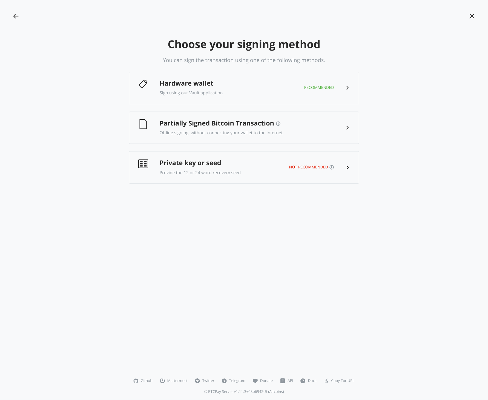
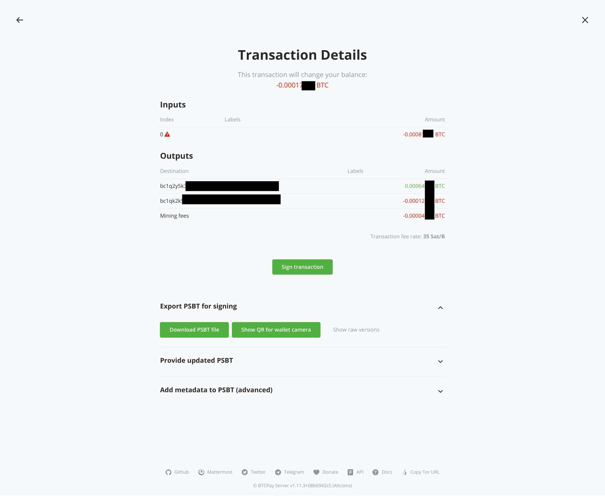
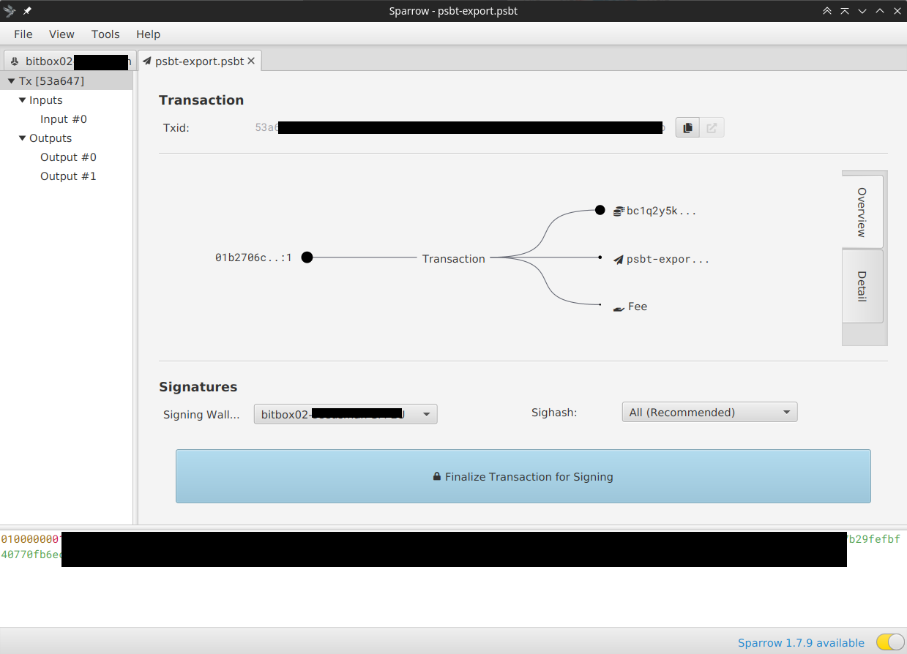
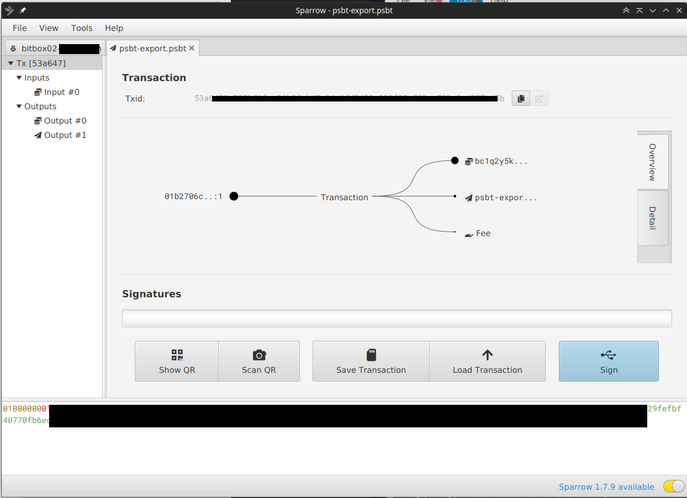
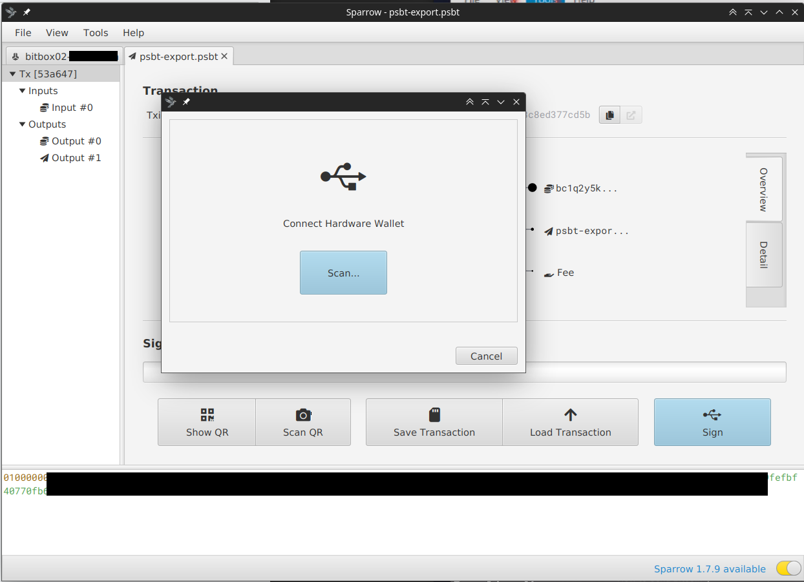
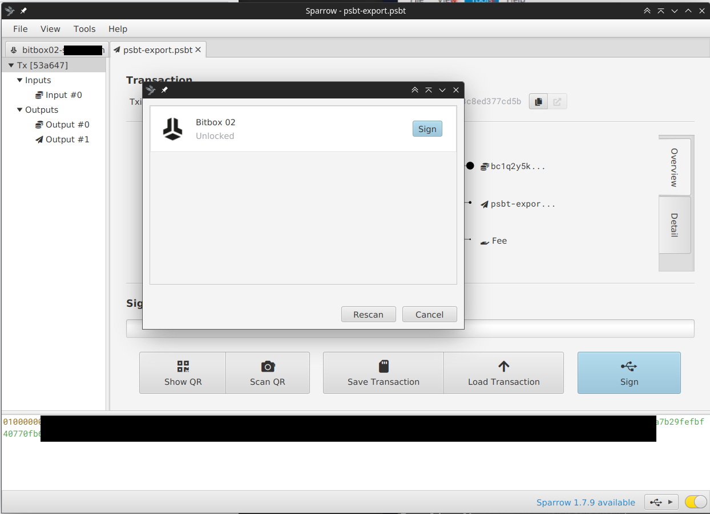

# Creating a PSBT with BTCPay Server and Sparrow wallet

This guide explains how you can create a partially signed bitcoin transaction (PSBT) on BTCPay Server and sign and broadcast it with [Sparrow wallet](https://www.sparrowwallet.com/). We use [BitBox02](https://bitbox.swiss/) hardware wallet in this example, but it will work with any other supported hardware wallet. This can be useful if you have an airgapped setup or persons creating the transaction and signing it are different people.

[[toc]]

## 1. Creating a transaction (on BTCPay Server):

* Log into your BTCPay Server and select the store you want to send from
* Under "Wallets" select "Bitcoin"
* Click on button **[Send]**

### On send screen:

* Enter the destination bitcoin address
* Enter the amount
* Optional: Change fee rate (get the current fee rate on [mempool.space](https://mempool.space) depending on how fast you want the transaction to be confirmed)
* **Important**: click on "Advanced Settings" so it expands and check "**Always include non-witness UTXO if available**" (this is needed so hardware wallets like BitBox02 can sign the transaction)
* Optional: on "Allow fee increase (RBF)", set to "Yes" (this is useful if you select a too low fee you can bump the fee so your transaction is not stuck and get’s confirmed)
* Click **[Sign transaction]** button

### On choosing signing method screen:

* Select "Partially Signed Bitcoin Transaction"

### On PSBT screen:

* Open the accordion of  "Export PSBT for signing" click on button **[Download PSBT file]**
* Store the file on hard-drive (you can use it to sign the PSBT yourself, or you can send it to somebody doing the signing on Sparrow wallet, see below); e.g. psbt-export.psbt

## 2. Signing and sending the PSBT (on Sparrow wallet)

* Open your Sparrow wallet app and corresponding wallet holding the data for the xPub used in your store
* Next, import the PSBT file you created on BTCPay Server
* In menu: File -> Open Transaction -> File...
* Select the file you stored (or got sent from accounting) e.g. psbt-export.psbt

### On showing the imported PSBT transaction:

* Make sure under headline "Signatures:" the "signing wallet" matches the wallet you want to sent from
* Click on **[Finalize Transaction for Signing]**

### Signing the transaction:

* Click on **[Sign]**

### Connect Hardware wallet popup:

* Plug-in your hardware wallet (BitBox02 in our case)
* Enter your hardware wallet pin (for BitBox02 it shows on screen open BitBox app but you do not need to, wait until you can enter the pin)
* After BitBox02 unlocked, click **[Scan...]**, your hardware wallet will show up

### Wallet connected successfully:

* Click **[Sign]**
* A summary of the transaction will be shown on the BitBox02 device, you need to confirm it there

### Broadcasting the transaction:

* After signing was successful you need to broadcast the transaction to the Bitcoin network
* Click **[Broadcast Transaction]**

:::tip
Alternatively, instead of broadcasting the transaction from Sparrow wallet (e.g. if you have an airgapped setup) you could also copy and paste the signed transaction PSBT from the textbox and upload it to your BTCPay Server and let it broadcast the transaction to the network.
:::

**Congrats, done!**

