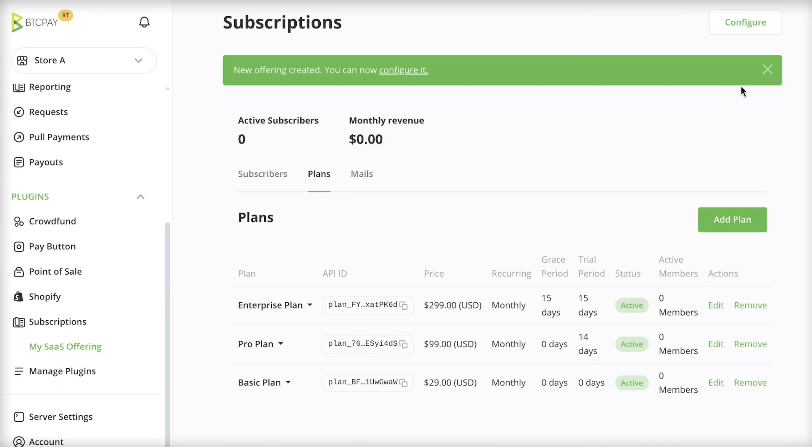
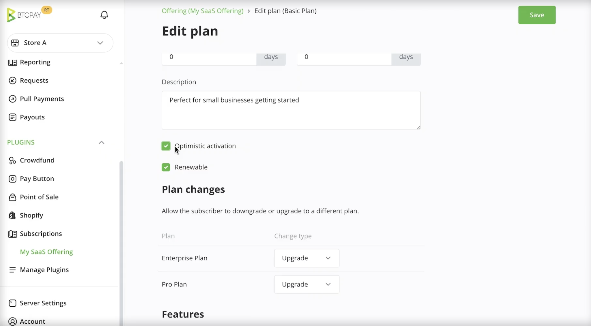
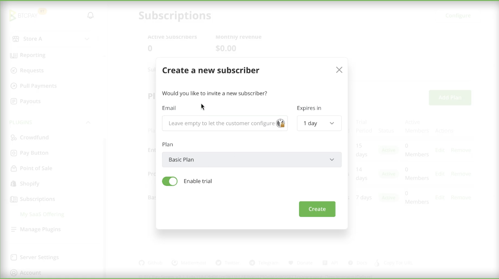
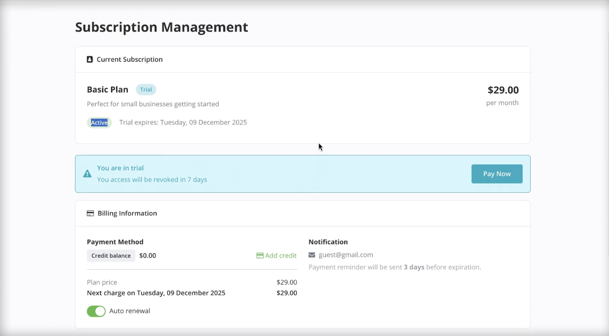

# Subscriptions

Subscriptions allow you to manage recurring payments for services you provide, such as newsletters, SaaS products, memberships, or recurring donations.

Because Bitcoin does not provide a unified way to automatically charge customers on a schedule, and because BTCPay Server supports multiple payment methods, subscriptions cannot rely on a single “auto debit” mechanism. Instead, BTCPay Server provides a unified subscription system that supports recurring payments in two ways:

1. **Manual recurring payments**, where the customer pays each billing period after receiving a reminder.  
2. **Automatic recurring payments**, using a **credit balance model** where customers prepay and renewals are deducted automatically.

Both approaches use the same subscription and plan configuration, enabling merchants to offer predictable recurring billing while giving customers flexibility in how they choose to pay and manage their subscriptions.

## **How it works**

Subscriptions are built from a small set of core components that work together:

* **Offering**: represents what you are selling, such as newsletter access, SaaS access, or a recurring donation.  
* **Plan**: a tier under an offering, for example Basic, Pro, or Enterprise. A plan defines pricing, billing interval, renewal behavior, and access rules  
* **Subscriber**: a specific customer enrolled in a plan. Merchants can manage subscribers by suspending access, adding credits, applying manual charges, or marking them as test users.  
* **Customer portal**: a public facing page where subscribers can manage their subscription, top up credits, upgrade or downgrade plans, and view billing and transaction history.  
* **Plan Checkout:** A customer-facing page used to start or renew subscription  
* **Emails (optional)**: rule based emails such as payment reminders and subscription state notifications, available when server email is configured.

### 1. Creating an offering

An **offering** represents the service or product you sell on a recurring basis. It is the top level container for one or more subscription plans. It groups related plans under a single product and defines shared metadata, such as:

* The name shown to customers  
* An optional success redirect URL after checkout  
* A set of features that can be assigned to individual plans

To create your first offering:

1. To create an offering, in the sidebar click on **Subscriptions**.   
2. Name your offering “My Product”  
3. Click the Create button in the top right corner.

Once an offering is created, you add one or more plans to it to define pricing, billing intervals, and subscription behavior.

### 2. Creating a plan

A **plan** defines how a subscription behaves. It controls pricing, billing frequency, access rules, and how subscribers move through the subscription lifecycle.

Plans allow you to segment your users, for example into Basic, Pro, or Enterprise tiers, while giving you fine grained control over billing and access. Each offering can contain multiple plans.

To create a plan:

1. Click on the **Subscriptions** > **Offering**  
2. Go to **Plans** tab  
3. Click **Add Plan** button

### Plan configuration

When creating or editing a plan, you can configure the following options:

#### Price and currency

Defines how much the plan costs per billing period and which currency is used.

#### Recurring interval

Defines how often the plan renews. Supported intervals include:

* Daily  
* Weekly  
* Monthly  
* Lifetime

A lifetime plan is paid once and does not renew.

#### Trial period

The trial period grants subscribers free access to the plan for a defined number of days.

During the trial:

* No payment is required  
* The subscriber is treated as active  
* Billing starts only after the trial ends

#### Grace period

The grace period defines how long a subscriber keeps access after a plan expires.

If the subscriber does not have sufficient funds at renewal time:

* The subscription enters the grace period  
* Access may continue during this time  
* The subscriber can pay or top up without immediate loss of access

Once the grace period ends, the subscription expires and access is revoked.

#### Optimistic activation

Optimistic activation allows on-chain payments to activate the subscription immediately, before confirmations are completed.

This improves user experience but introduces risk:

* If the payment later fails or is cancelled, the subscription is deactivated  
* Manual intervention may be required

This option should be enabled only if you understand the tradeoffs.

#### Renewable

Plans can be marked as non renewable.

This is useful for:

* Introductory or promotional plans  
* Fixed duration access  
* One time onboarding plans

Once a non renewable plan expires, it cannot be renewed.

#### Upgrades and downgrades

You can control whether subscribers are allowed to upgrade or downgrade between plans.

This allows you to:

* Define allowed plan transitions  
* Prevent unsupported downgrades  
* Guide users through predefined upgrade paths

#### Features

Plans can define **features** that describe what access or capabilities a subscriber receives.

BTCPay Server stores these values but does not enforce them. Your application or service is responsible for interpreting and applying features.

Examples include usage limits, enabled modules, or support tiers.

### 3. Creating a subscriber

A **subscriber** represents a customer enrolled in one of your subscription plans. Subscribers are created through a plan checkout, which allows the customer to complete payment and start their subscription.

To create a subscriber:

1. Open your **Offering**.  
2. Navigate to the **Subscribers** tab.  
3. Click **Create** in the top right corner.  
4. Select the plan you want the subscriber to enroll in.  
5. Optionally enter the subscriber’s email address.  
   * If left empty, the customer will be prompted to provide it during checkout.  
6. If the plan includes a trial period, choose whether to enable it.  
7. Click **Create**.

BTCPay Server generates a **plan checkout page**. The subscriber is created only after the checkout is completed.

You can share the checkout link with the customer or integrate it into your application. 

### 4. Plan Checkout page

A **plan checkout** is the payment page used to start or renew a subscription.  
It can be created through the UI or programmatically through the API. When a plan checkout is created, the subscriber is created only after the checkout is completed.

### 5.Subscription management through customer portal

Each subscriber has access to a **subscription management portal**, a public facing page where customers can manage their subscription without merchant involvement.

The customer portal allows subscribers to:

* View their current plan and subscription status  
* See upcoming renewals and expiration dates  
* Top up their credit balance  
* Pay for upcoming billing periods  
* Upgrade or downgrade their plan, if allowed  
* View billing history and transaction details

The portal provides a place for customers to manage recurring payments and understand their subscription state.

Access to the portal is typically provided by your application or service, for example through a **Manage subscription** or **Billing** link. The link can be shared directly with the subscriber or generated programmatically.

### 6.Subscriber management

BTCPay Server provides tools for merchants to manage subscribers and handle exceptional cases without modifying plans.

From the subscriber detail view, you can perform the following actions.

#### Suspend and unsuspend subscribers

You can suspend a subscriber to temporarily disable access to the service.

* Suspension immediately blocks access, regardless of subscription state  
* You can optionally provide a suspension reason (The reason can be displayed to the subscriber in the customer portal)  
* Suspended subscriptions can be unsuspended at any time.

#### Add credits

You can manually add credits to a subscriber’s balance.

This is useful for:

* Customer support gestures  
* Service credits  
* Manual balance adjustments

Added credits are immediately available for renewals.

#### Apply manual charges

You can manually charge a subscriber for additional usage or one off fees.

Manual charges deduct from the subscriber’s credit balance and appear in the subscription history.

#### Test subscribers

Subscribers can be marked as test subscribers.

Test subscribers behave like regular subscribers but are intended for development and testing, allowing you to validate integrations without affecting production data.

### 7. Automated emails

BTCPay Server can send automated emails to subscribers based on subscription events, if server email is configured.

Email rules allow you to notify subscribers about important changes and upcoming actions without manual intervention.

#### Email rules

You can define email rules that trigger on events such as:

* Upcoming subscription expiration  
* Trial ending  
* Subscription state changes  
* Payment required notifications

Rules are evaluated automatically and emails are sent when the configured conditions are met.

Email templates support variables, allowing you to include subscription specific information such as:

* Plan name  
* Expiration date  
* Subscriber details

This allows you to create highly customized messages that match your service and communication style.

A common use case is sending a payment reminder to a subscriber **3 days before plan expiration**, giving them time to top up credits or pay for the next billing period.

### 8. Subscription API access

Subscriptions can be managed programmatically using the BTCPay Server **Greenfield API**.

If your BTCPay Server instance is running **v2.3.0 or later**, you can explore and interact with the subscription endpoints in two ways:

* Public documentation:  
  [https://docs.btcpayserver.org/API/Greenfield/v1/](https://docs.btcpayserver.org/API/Greenfield/v1/)  
* Your own instance documentation:  
  Visit `/docs` on your BTCPay Server instance (for example `https://yourbtcpayserver.com/docs`)