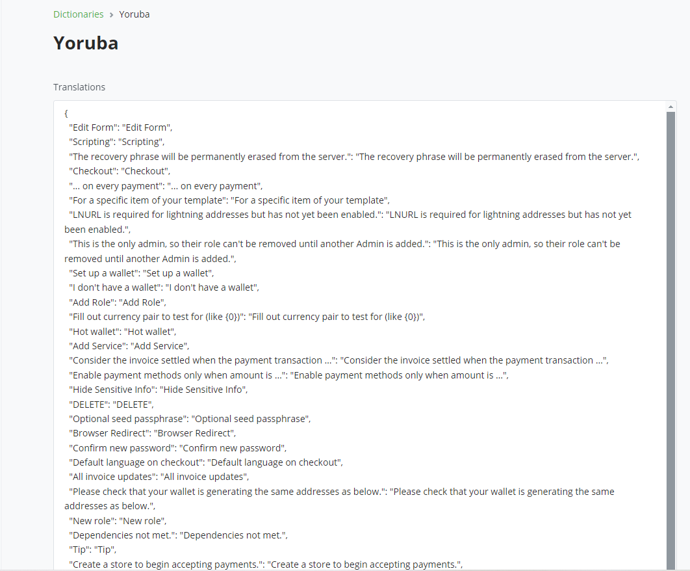
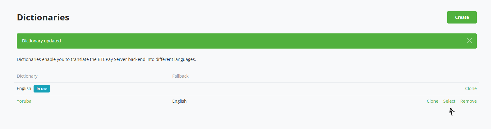

# Using BTCPay Translation Feature to Localize Your BTCPay Server instance

Since version 2.0 BTCPay Server includes a translation feature that allows administrators to set up a default language for users accessing their instance.

With this feature, you can replace the default English text across the entire back-office with your chosen language.

Here’s how you can create and manage translations to make the BTCPay server easier to use.

## Translating BTCPay Server

1. Log in to your BTCPay Server instance.
2. Navigate to Translation on **Server Settings** >> **Translations**.

3. Click **Create** button to generate a new language dictionary.

4. Enter the dictionary name you want to save the language collection with and then click **Create** button to create the dictionary. 

In the image above, you can see a dictionary of words that can be translated on your BTCPay Server.

The dictionary is usually organized as pairs of `"key": "value"`, where:

**Key:** The original English text or phrase in your BTCPay instance.

**Value:** The translated text you want to display.

For each English term, enter its equivalent in your chosen language in the corresponding text. Be sure to review for accuracy and clarity.

For example, lets translate "Add Role" into Yoruba. Since I created a dictionary for Yoruba, I’ll provide the translation in Yoruba.

Replace the text and click the **Save** button. A confirmation message will appear indicating that your translations have been successfully saved.  Next, click the **Select** button for the new dictionary to set it as the default for the system.

Now let's test the translation. Go to **Roles** under **Server Settings**, and if we check the button at the top right of the view, we can see that the text has been translated from "Add Roles" to "Fi ipa kun".

You can also search for other places in the BTCPay application where "Add Role" appears, and confirm that it has been successfully translated to your chosen language.

With one translation done, go ahead and translate other texts in the dictionary. All instances of English text will be replaced with your translated versions, and now you can enjoy your new localized experience.

:::tip
All translation strings are in a single text box, easy to copy over. Feel free to leverage this by pasting them into translation AI tools like ChatGPT, giving yourself a good starting point. We strongly recommend that you manually review all strings afterwards, ensuring contextual accuracy, which is sometimes lost when depending on AI.
:::

## Tips for Effective Translations

- **Consistency is Key:** Ensure that similar terms are translated consistently throughout.
- **Context matters:** Keep context in mind when translating phrases to maintain meaning.
- **Review regularly:** Regularly update translations as new features are added.