# Joomla VirtueMart integration

This document explains how to **integrate BTCPay Server into your Joomla VirtueMart store**.
Watch the video below to go along the document |

[](https://youtu.be/k7XfybLAky0)

## Requirements

Please ensure that you meet the following requirements before installing this plugin.

- PHP version 7.4 or newer
- The curl, gd, intl, json, and mbstring PHP extensions are available
- A VirtueMart 3 / 4 store ([Download and installation instructions](https://www.virtuemart.net/downloads))
- You have a BTCPay Server version 1.3.0 or later, either [self-hosted](/Deployment/README.md) or [hosted by a third-party](/Deployment/ThirdPartyHosting.md)
- [You've a registered account on the instance](./RegisterAccount.md)
- [You've a BTCPay store on the instance](./CreateStore.md)
- [You've a wallet connected to your store](./WalletSetup.md)

## 1. Install BTCPay Plugin

There are three ways to **download BTCPay for VirtueMart plugin**:

- Via the Admin Dashboard (recommended, see below)
- [Joomla Extension Directory (JED)](https://extensions.joomla.org/extension/vm-payment-btcpay-for-virtuemart/)
- [GitHub Repository](https://github.com/btcpayserver/joomla-virtuemart/releases)

### 1.1 Install plugin from Joomla Admin Dashboard (recommended)

1. Menu: Extensions > Manage > Install
2. On "Install from Web" tab search for "btcpay"
3. Click on BTCPay for VirtueMart and [Install] button
4. Continue with step 1.3


### 1.2 Download and install plugin from JED or GitHub

1. Download the latest BTCPay plugin from [Github](https://github.com/btcpayserver/joomla-virtuemart/releases) or [JED](https://extensions.joomla.org/extension/vm-payment-btcpay-for-virtuemart/)
2. Menu: Extensions -> Manage -> Install
3. On tab "Upload Package File" upload the `btcpayvm.zip`

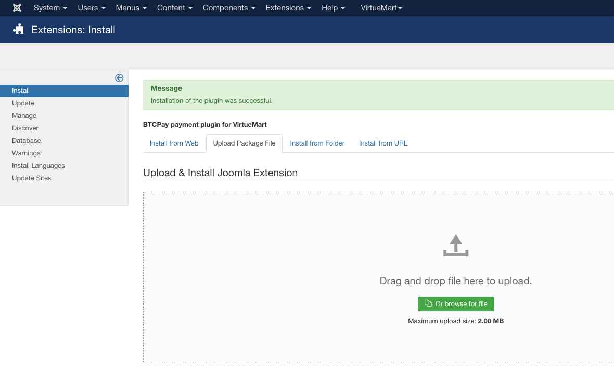

### 1.3 Enable the plugin

1. Menu: Extensions -> Plugins
2. Search for "btcpay"
3. On "Status" column click the red circle to enable the plugin

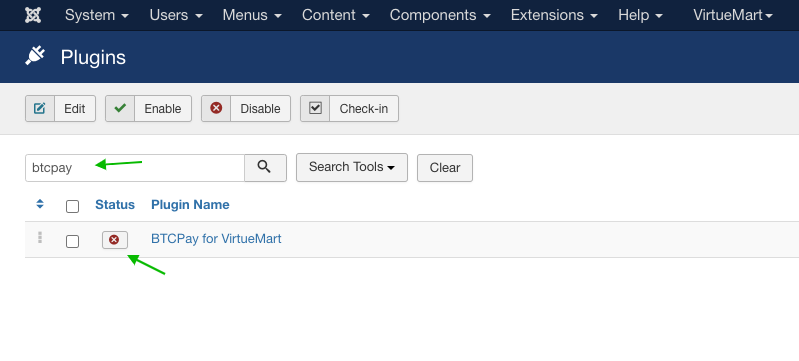

## 2. Connecting VirtueMart and BTCPay Server

BTCPay for Virtuemart plugin is a **bridge between your BTCPay Server (payment processor) and your e-commerce store**.
No matter if you're using a self-hosted or third-party solution, the connection process is identical.

### 2.1 Add BTCPay payment gateway in VirtueMart

1. Menu: VirtueMart -> Payment Methods
2. Click button **[New]**
   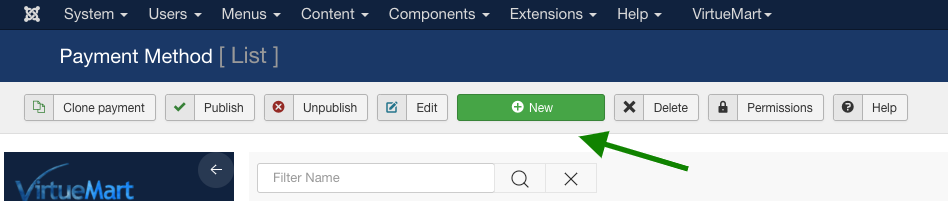
3. Configure the payment method according to your needs. Make sure on "Payment Method" dropdown you have "BTCPay for VirtueMart" selected and the payment method is published 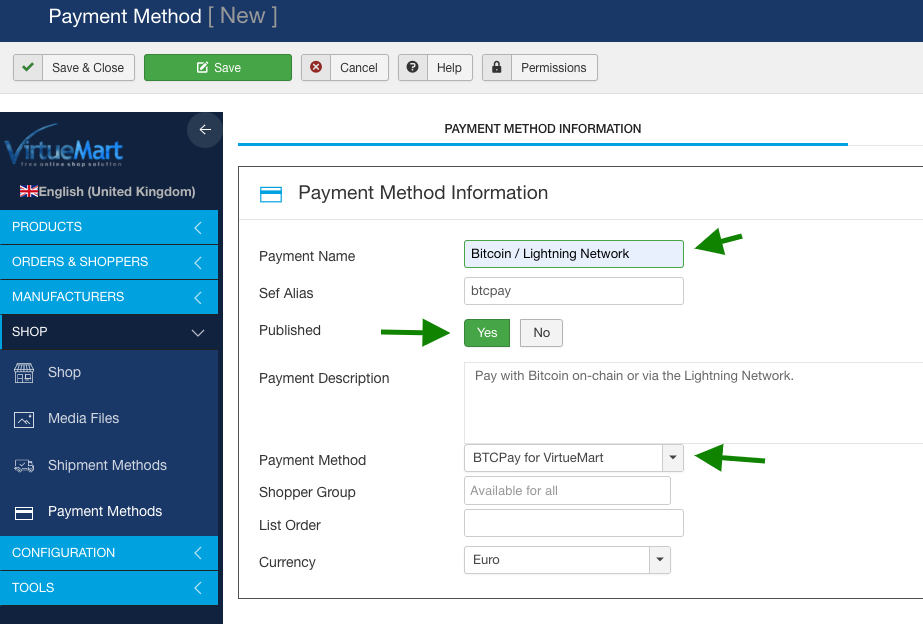
4. Hit the **[Save]** button (the plugin table will get created)

Now you can switch to the "Configuration" tab where we can connect to our BTCPay Server instance. First we need to create an API key.

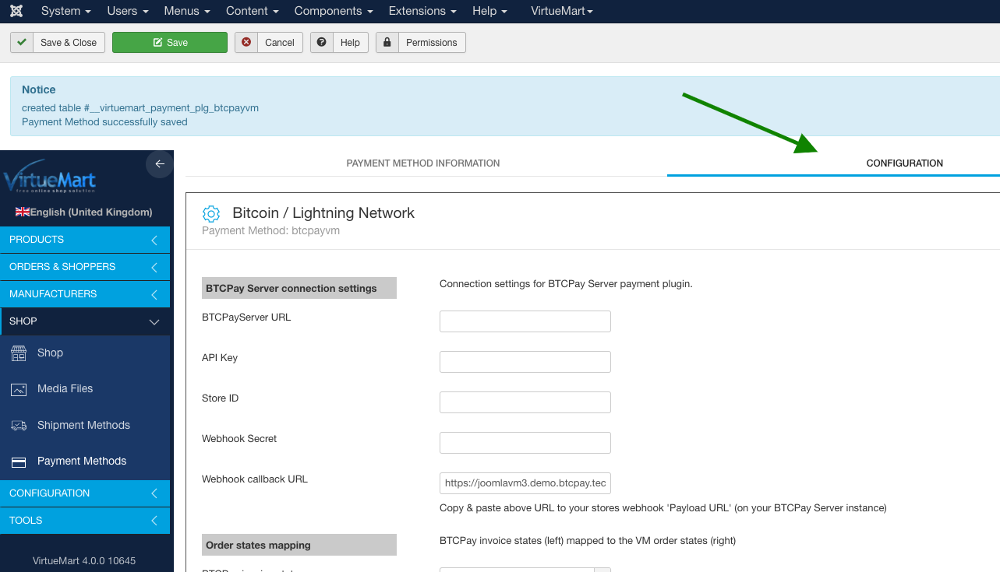

### 2.2 Create an API key and configure permissions

On BTCPay Server instance:

1. Click on _[Account]_
2. Click on _[Manage Account]_
   
3. Go to the tab _"API Keys"_
4. Click _[Generate Key]_ to select permissions.
   
5. Add a label. **Important:** click on the _"Select specific stores"_ link for the following permissions: `View invoices`, `Create invoice`, `Modify invoices`, `Modify stores webhooks`, `View your stores` and select the specific store you created for your VirtueMart site. It should look like when everything is set:
   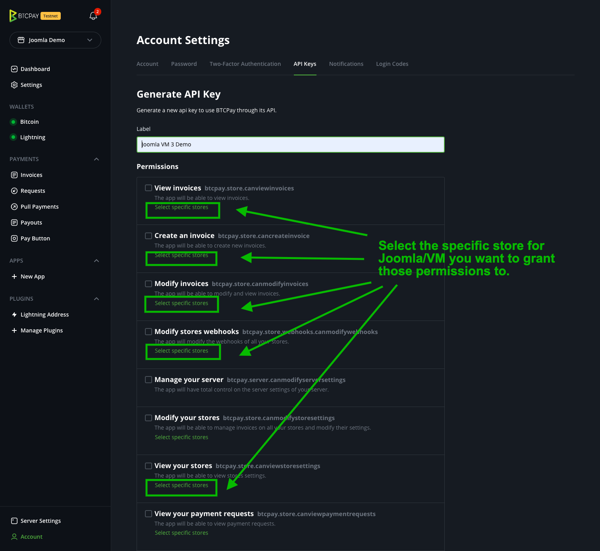
6. Click on _[Generate API Key]_
   
7. Copy the generated API Key to your _VirtueMart BTCPay Payment Method Settings_ form
   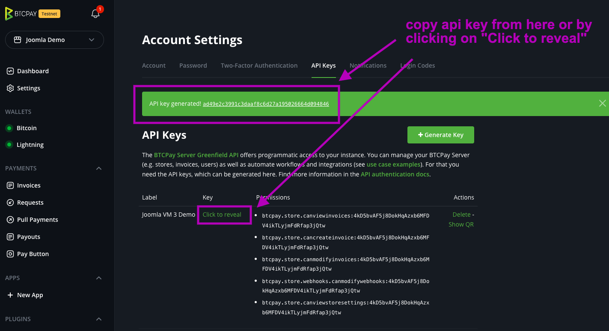
8. Go to Settings and copy the store ID to your _VirtueMart BTCPay Payment Method Settings_ form
   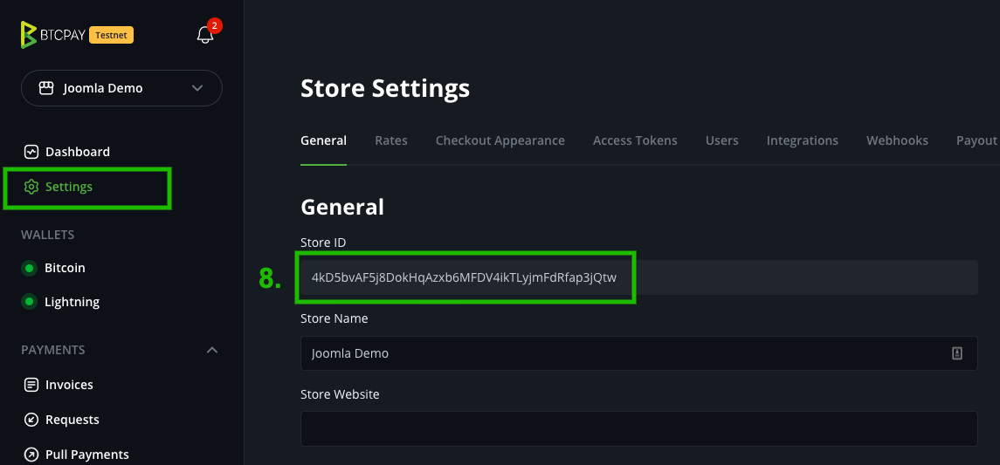
9. On the _VirtueMart BTCPay Payment Method Settings_ form make sure **BTPCay Server URL**, **API Key** and **Store ID** are set and click **[Save]**
   

### 2.3 Create a webhook on BTCPay Server

Setting up a webhook is important that your gets updates on invoice status changes from BTCPay Server.

1. On BTCPay Server instance go to your store settings, tab **[Webhooks]**, click **[Create Webhook]**
   
2. From _VirtueMart BTCPay Payment Method Settings_ copy the **Webhook callback URL** to webhook settings **Payload URL**.
   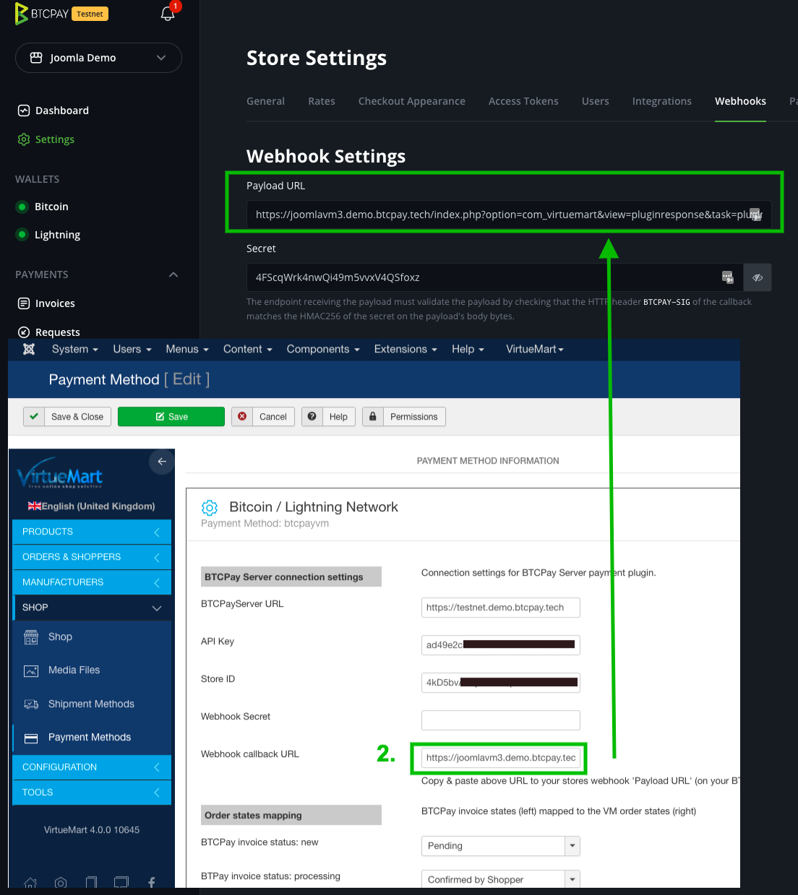
3. On webhook settings click on the eye to reveal webhook secret. Copy that secret to your _VirtueMart BTCPay Payment Method Settings_ form **Webhook Secret** input and **[Save]** the VirtueMart configuration again.
   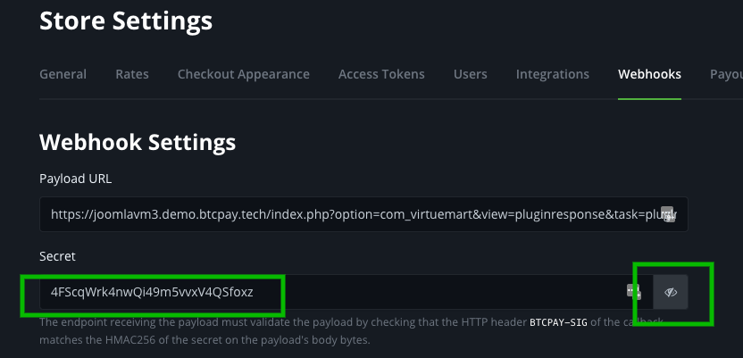
   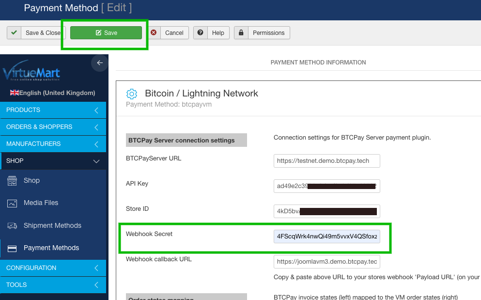

4. Back on webhook settings, enable **Automatic redelivery** and click **[Add webhook]** to save the webhook.
   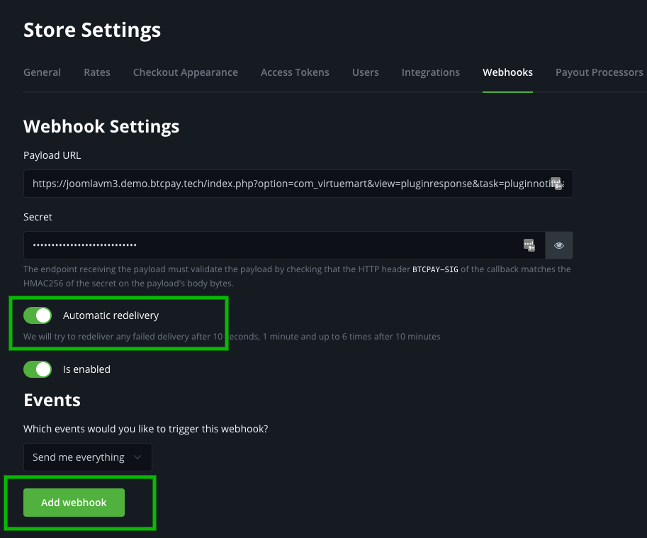

## 3. Test the checkout

Everything is ready to go now. Do a small test purchase and make sure the order status gets updated according to the BTCPay invoice status. On BTCPay Server invoice details you can see if the webhook events were fired successfully.

## Customizing VirtueMart BTCPay payment method settings

Your VirtueMart BTCPay payment method settings can be found in menu: VirtueMart -> Payment Methods. Click on the payment method of type "btcpayvm" you created.

### Section: BTCPay Server connection settings

This is the most important part of the configuration. The data entered here will connect your VirtueMart shop with your counterparty store configured on BTCPay Server.

**BTCPay Server URL**

URL to your BTCPay Server instance, including protocol e.g. `https://btcpay.yourdomain.com`.

**API Key**

Your BTCPay API Key as mentioned [here](#22-create-an-api-key-and-configure-permissions).

**Store ID**

The store ID of your BTCPay Server store. Can be found on the store settings page. See 8. [here](#22-create-an-api-key-and-configure-permissions)

**Webhook Secret**

The wehbook secret which was generated on webhook createion, see [here](#23-create-a-webhook-on-btcpay-server)

**Webhook callback URL**

This field is auto-generated by the plugin and helps you when creating the webhook on BTCPay Server. It contains the needed payment method id and parameters to allow processing of callbacks.

### Section: Order states mapping

You can adjust the mapping of BTCPay Server invoice status to VirtueMart order states. On the left are the invoice states and on the right the order states. The defaults here should be good to go - but if you need, you can overwrite them.

VirtueMart order statuses are explained [here](https://docs.virtuemart.net/manual/configuration-menu/order-statuses.html)

BTCPay server invoice statuses are explained [here](https://docs.btcpayserver.org/Invoices/#invoice-statuses)

### Section: Restrictions

These are VirtueMart provided restrictions you know from other payment plugins. You can restrict the amount or countries when the payment method will be available.

### Section Discounts and fees

These are VirtueMart provided settings. You can set a fee, cashback and apply tax rules or set a custom logo for the payment method.

## Troubleshooting

### Error on checkout "There was an error processing the payment on BTCPay Server. Please try again and contact us if the problem persists."

This means something went wrong with creating the invoice on BTCPay Server. It could be either wrong api key, store id or another communication error. You can find the error logs of the plugin in the following directory: `administrator/logs` there you will have one or more files called `btcpayvm.X.log.php` where `X` is a number e.g. `btcpayvm.0.log.php` you will find timestamped errors there that should give you a hint what the problem is.

**Example**:

> 2022-05-24 21:10:50 ERROR Error during POST to https://btcpay.example.com/api/v1/stores/4kD5bvAF5j8DokHqAzxb6MFDV4ikabcdefghijklm/invoices. Got response (401): {&quot;code&quot;:&quot;unauthenticated&quot;,&quot;message&quot;:&quot;Authentication is required for accessing this endpoint&quot;}

- This means there is some authentication error. Likely your api key does not have permission create invoices for that store. Make sure you gave the api key the right permissions and you give it to the right store and also entered that in VirtueMart payment configuration form.

- Another reason could be that you use a legacy api key. The legacy api keys are located in store settings -> Access Tokens. But you need to create an account api key which is located in Account -> Manage Account -> tab "API Keys". See section [2.2 Create an API key and configure permissions](#22-create-an-api-key-and-configure-permissions).

## The order states do not update although the invoice has been paid

Please check the details of your invoice if there were any errors on sending the webhook request. Some hosting providers, firewall setups or Joomla security plugins may block POST requests to your site which lead to a http status of "403 forbidden".

You can check and verify yourself if there is something blocking requests to your site in one of these two ways:

**1. Copy webhook callback URL**
go to your _VirtueMart BTCPay Payment Method Settings_ and copy the "Webhook callback URL". e.g. `https://EXAMPLE.COM/index.php?option=com_virtuemart&view=pluginresponse&task=pluginnotification&pm=2`

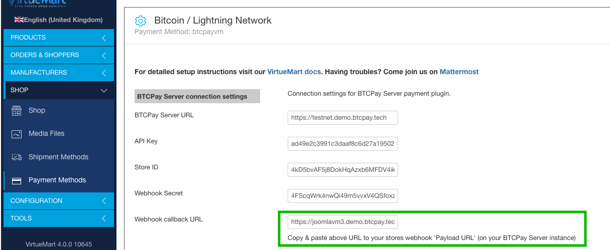

**2.1 Check using a command line (Linux or MacOS):**

```
curl -vX POST -H "Content-Type: application/json" \
    -d '{"data": "test"}' WEBHOOK_CALLBACK_URL
```

(replace `WEBHOOK_CALLBACK_URL` with the one copied above)

Result:

```
.... snip ....
* upload completely sent off: 16 out of 16 bytes
< HTTP/1.1 403 Forbidden
< access-control-allow-origin: *
< Content-Type: application/json; charset=UTF-8
< X-Cloud-Trace-Context: 4f07d5b2e5c2f05949d04421a8e2dd6a
< Date: Thu, 17 Feb 2022 10:06:50 GMT
< Server: Google Frontend
< Content-Length: 26
```

If you see that line "HTTP/1.1 403 Forbidden" or "HTTP/2 403" then something is blocking data sent to your VirtueMart site. You should ask your hosting provider or make sure no firewall or plugin is blocking the requests.

**2.2 Check using an online service (if you do not have a command line available:**

- Go to [https://reqbin.com/post-online](https://reqbin.com/post-online)
- 1. Enter your callback url (copied from step 1 above): `https://EXAMPLE.COM/index.php?option=com_virtuemart&view=pluginresponse&task=pluginnotification&pm=2`
     (replace this URL with the webhook callback url from step 1)
- Make sure "POST" is selected
- 2. Click [Send]


If you see "**Status 403 (Forbidden)**" then POST requests to your site are blocked for some reason. You should ask your hosting provider or make sure no firewall or plugin is blocking the requests. If you see any other status code (200, 500, ...) a firewall problem seems to not apply, you probably need to further investigate.

## I have troubles with using the plugin or some other related questions

Feel free to join our support channel over at [https://chat.btcpayserver.org/](https://chat.btcpayserver.org/) if you need help or have any further questions.
