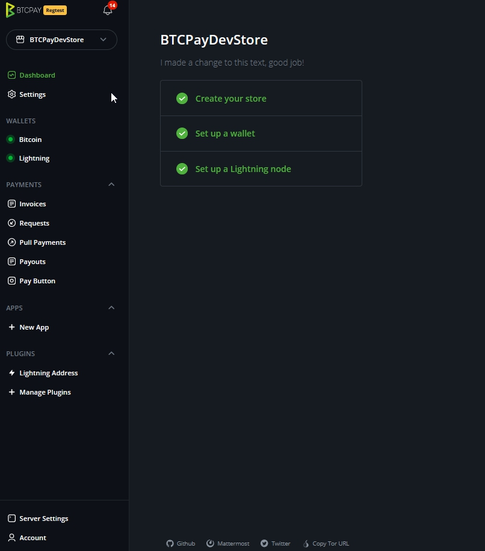
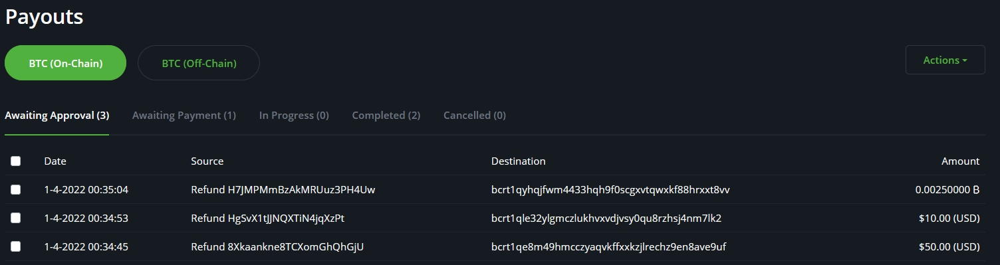

# BTCPay Server Walkthrough

This page walks you through the **BTCPay user interface** and shows how to navigate through the different options.

Watch the video below for an interactive overview of the features.

After you've created an account on the BTCPay Server instance hosted by yourself or a third party, you'll be greeted by your store's new home or, as we call it, your `dashboard`.

All the settings in the left menu are meant for the Current Store you selected at the top.

- [Notifications](Walkthrough.md#notifications)
- [Dashboard](Dashboard.md)
- [Settings](Walkthrough.md#store) **store settings**
- [Wallets](Walkthrough.md#wallets)
  - Bitcoin
  - Lightning
- [Payments](Walkthrough.md#payments)
  - Invoices
  - Requests
  - Pull Payments
  - Payouts
  - Pay Button
- [Apps](Walkthrough.md#apps)
  - New App
- [Plugins](Walkthrough.md#plugins)
  - Manage Plugins
- [Server Settings](Walkthrough.md#server-settings)
- [Account](Walkthrough.md#account)

## Store

Inside BTCPay, you can **create and manage an unlimited number of stores**. Each store has its own wallet, can create apps (Point of Sale or Payment Buttons and Crowdfunds) or be paired with external e-commerce software through one of the integrations available. Admin does not have control over the private keys of the other user's stores. For more information, check [Stores FAQ](./FAQ/Stores.md)

- Store settings - Configure global payment settings and customize the payment experience for your customers.
- Rates - Set the source for cryptocurrency to fiat [exchange rates for your store](./FAQ/Stores.md#how-to-change-the-exchange-rate-provider-for-invoices).
- Checkout experience - [Customize the appearance](./FAQ/ServerSettings.md#how-to-modify-the-checkout-page) of the checkout page, choose default coin, etc.
- Access Tokens - Tokens for [pairing the store to an integration](./WhatsNext.md#connecting-your-btcpay-store-to-your-e-commerce-platform)
- Users - Enable other users with a registered BTCPay account to access your store as either guest or owner.
- Pay Button - [Create a payment button](./WhatsNext.md#creating-the-pay-button) you can easily embed into your website.

## Notifications

Notifications inform the user that **an event has occurred on the BTCPay Server instance**.
Such event could be a received or failed payment, an overpaid or underpaid invoice, a new BTCPay version and more.

By clicking on the icon, you can access the `Notifications` page, where you can view past notifications and optionally delete them.
Learn more about all BTCPay notifications [here](./Notifications.md).

## Dashboard

In dashboard you will see the stores wallet balance, a overview of invoices and quickly see your crowdfunds top perks.
There's 5 main tiles in the Dashboard.

- A quick view on the wallet balance
- Transaction and payout activity
- Recent Transactions
- Recent Invoices
- Current running Crowdfunds

Continue to read more about [Dashboard](Dashboard.md)

## Wallets

### Bitcoin

Depending how many different payment methods you've setup, inside the wallets tab you'll see a wallet for each of the payment methods. Bitcoin on-chain wallet allows you to manage received funds. BTCPay's wallet is feature-rich and has privacy features built-in. Furthermore it has a full hardware wallet integration, so you can manage your funds with compatible hardware wallet directly from your BTCPay. Check [wallet page](Wallet.md) for more information.

Elements of the internal BTCPay Wallet are:

- Transaction - This shows your entire transaction history.
- Send - Used for sending funds out of your wallet (has to be signed and confirmed on a compatible hardware wallet).
- Receive - Used to generate a new address manually.
- Rescan - Enables you to import old wallets into BTCPay more easily and solves the gap limit issue most external wallets have.
- Pull Payments - Used to create and manage Pull Payments. For more information on this feature, check [Pull Payments](PullPayments.md).
- Payouts - Used to manage Pull Payment requests.
- PSBT - Used to sign multi-signature transactions through the PSBT standard.
- Settings - Used to view and adjust additional settings for your wallet.

### Lightning

Additionally, we recommend adding a lightning wallet. There are two options, connect an [internal](./LightningNetwork/#connecting-your-internal-lightning-node-in-btcpay) or connect an external [Lightning node](./LightningNetwork.md).
Once completed, the Lightning wallet function becomes active.

For more information, check [Wallet](./Wallet.md) or [Wallet FAQ](./FAQ/Wallet.md)

## Payments

### Invoices

All of the **invoices** for your user account will be displayed here. You can filter the invoices by the status, order, item, store or date. You can also create invoices manually. Invoices are sorted by date from new to old. You can open an individual invoice for more information. Use the export button to save a file (.json or .csv).

For more information, check [Invoices](Invoices.md)

### Payment Requests

Each store can have an unlimited number of **payment requests** displayed here. Payment requests are dynamic invoices that can be shared by URL and paid at any time using current BTC exchange rates. Here you can edit and view your payment requests. You can see invoice details for your payment requests and clone previously created payment requests.

For more information, check [Payment Requests](PaymentRequests.md)

### Pull Payments

The feature of [pull payments](PullPayments.md) is one we see fit for options like
A subscription service, refunds, time-based billing for freelancers, patronage, or a a withdrawal service.

For a detailed description of the concept, please visit the [Pull Payments](PullPayments.md)

### Payouts

The `payouts` view gives an overview of the current pull payments and their status.
If, for example, a refund has been issued and the claimant has accepted, this will show in Payouts.
Here you will find the options to Approve and directly send the requested amount of the refund.
When there are multiple instances of Pull payments, these can be selected and batched for sending out at once.
In a future version, we expect this to have scheduling options.

### Pay Button

You can easily embed a donation or a payment button into an HTML of your website.
When the customer or a visitor clicks on the button, BTCPay displays a checkout page and an invoice for them.

For more information, check [Create a payment button](./Apps.md#payment-button)

## Apps

Each store has access to different apps. **Applications built on top of BTCPay** extend the [use case](./UseCase.md) of the software and cater to other types of users. Here, you can create a new app, connect it to the store, and customize it. A good example is the Point of Sale app, which you can use to receive payments in physical stores or even donations.

For more information, check [Apps](./Apps.md) or [Apps FAQ](./FAQ/Apps.md)

## Plugins

Manage your store-used plugins right from this view.
The available plugins for the user will show in the side menu.

For more information, check [Integrations](./CustomIntegration.md)
or one of the pre build plugins like :

- [WooCommerce](WooCommerce.md)
- [Shopify](Shopify.md)
- [Magento](Magento.md)
- [Prestashop](PrestaShop.md)
- [Drupal](Drupal.md)
- [Zapier](./Zapier/README.md)

## Server settings

**Server settings** is something only a server admin can access. If you're using someone else's server, you won't see Server Settings. Inside the settings, you can perform tasks such as controlling users, rates, updating the server, etc. For more information, check [Server Settings FAQ](./FAQ/ServerSettings.md)

- Users - Add, remove or manage users of your BTCPay Server.
- Email server - If you want users to verify their e-mail address when registering set up the SMTP settings.
- Policies - Enable or disable user registration, e-mail verification, search engine indexing, display apps on website root.
- Services - gRPC, REST, and RTL are used for connecting your LN node, SSH keys, and uploaded file storage setup.
- Theme - Customize the front-end appearance of your BTCPay Server.
- Maintenance - Update your BTCPay to the latest version and clean your BTCPay by deleting unused docker images.
- Logs - Displays most recent logs of the BTCPay Server.
- Files - After enabling this feature in Services, upload external files and access them via URL.

## Account

Manage your BTCPay Server account.
Change anything related to your user-account.
Setup Two-Factor Authentication and manage API keys.

## Join The BTCPay Community

If you have questions, try searching our [FAQ Section](./FAQ/readme.md) or join the [BTCPay Community](./Community.md) and share questions and ideas for improvement.

If you are a developer, take a look at the [Local Development](../Development/LocalDevelopment.md) guide and help us with any [open issues](https://github.com/btcpayserver/btcpayserver/issues) on Github. If you would like to contribute to BTCPay in other ways, check out the [Contribution Guide](./Contribute.md) for ideas.
