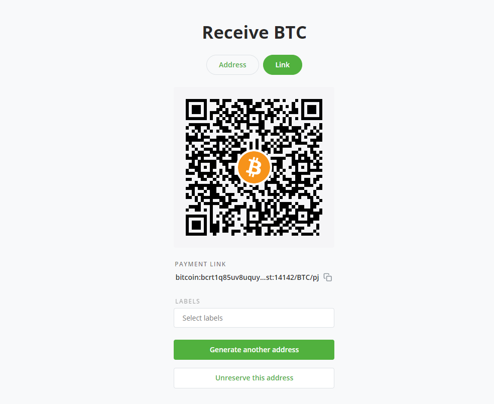
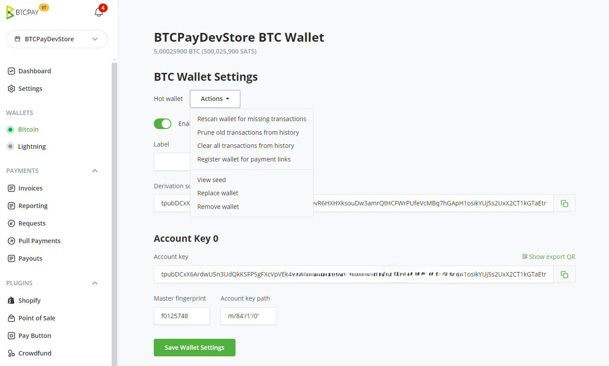
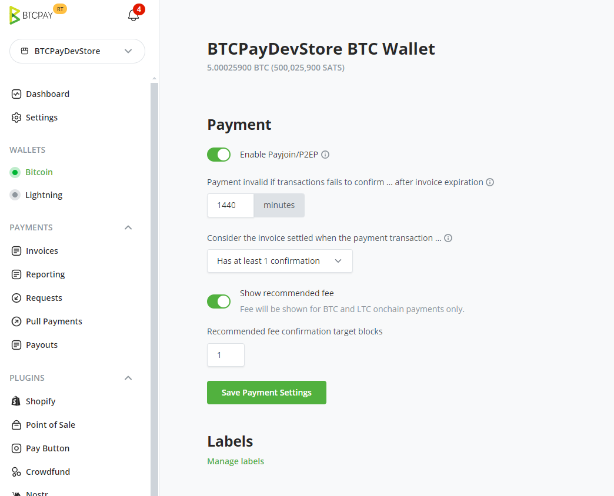
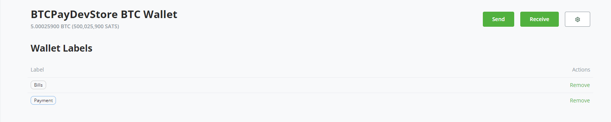

# BTCPay Server Wallet

BTCPay Server has a built in, **full-node reliant wallet** that allows for easy funds management.

Each [store](./CreateStore.md)'s configured cryptocurrency has a separate wallet displayed under Wallets in the menu bar.

## Wallet features

The wallet contains the following features:

1. Transactions
2. Send
3. Receive
4. Rescan
5. Pull payments
6. Payouts 
7. PSBT
8. Settings

### Transactions

An overview of the incoming (green), outgoing (red) and unconfirmed (grayed out) **transactions** displayed together with timestamps and balances, sorted by date. You can click on the transaction ID to view the transaction details on the block explorer.

#### Transaction Labels

The table below lists the various **transaction labels used by BTCPay**.

| Transaction Type | Description                                          |
| ---------------- | ---------------------------------------------------- |
| app              | Payment was received through an app created invoice  |
| invoice          | Payment was received through an invoice              |
| payjoin          | Not paid, invoice timer still has not expired        |
| payjoin-exposed  | UTXO was exposed through an invoice payjoin proposal |
| payment-request  | Payment was received through a payment request       |
| payout           | Payment was sent through a payout or refund          |

You can also create your own [custom transaction labels and comments](./FAQ/Wallet.md#how-to-add-custom-labels-and-comments-to-transactions).

### Send

The Send function allows **spending of the funds from the BTCPay wallet**.

#### Advanced Settings

Certain wallet features are available for advanced users. Toggle the `Advanced Settings` within the `Send` tab to preview them.

##### Don't create UTXO change

This option is available in the `Advanced mode` of the `Send` page.

It is a privacy enhancing feature which is useful when you're sending funds to another wallet of yours or to an exchange. It makes sure that no change UTXO is created by **rounding up** the amount sent.

By default this feature is disabled, so if your wallet has a UTXO of `1.1 BTC` and you input an amount equal to `1.0 BTC`, the resulting transaction will have two outputs `0.1 BTC` of change, and `1.0 BTC` to your destination.

Blockchain analysis will understand that those `0.1 BTC` of change belong to the same entity which controlled `1.1 BTC` before, and can track the future purchase you make under the same pattern.

By enabling this feature, BTCPay Server wallet will round up the amount sent to `1.1 BTC` such that no change output is sent back to you.

Warning: Despite the fact, in this example, that you entered `1.0` in the amount field, the amount that will really be sent to your destination will be `1.1 BTC`.

##### Other features

###### Camera QR scan

Scan option in wallet (camera icon in send screen) lets you **use your device’s camera to scan a QR code containing an address or BIP21 payment link**. It auto-populates the sending information so that you don’t have to manually copy-paste an address and amount.

###### Paste BIP21 address

This option **decodes a BIP21 payment link**. It's useful when you're trying to pay a [Payjoin](./Payjoin.md) invoice.

#### Signing a transaction (spending)

To spend the funds, you are required to **sign** the transaction. Transactions can be signed with:

- Hardware Wallet
- Wallet supporting PSBT
- HD private key or recovery seed
- Hot Wallet

##### Signing with HD Private Key or mnemonic seed

If you set up an [existing wallet with your BTCPay Server](./WalletSetup.md#use-an-existing-wallet), you can spend the funds by inputting your private key into an appropriate field. Make sure to set a proper `AccountKeyPath` in Wallet > Settings otherwise you won't be able to spend.

##### Signing with a wallet supporting PSBT

PSBT (**Partially Signed Bitcoin Transactions**) is an interchange format for Bitcoin transactions that are not fully signed yet.
PSBT is supported in BTCPay Server and can be signed with compatible hardware and software wallets.

The construction of a fully signed Bitcoin transaction goes through the following steps:

- A PSBT gets constructed with certain inputs and outputs, but no signatures
- The exported PSBT can be imported by a wallet that supports this format
- The transaction data can be inspected and signed using the wallet
- The signed PSBT file gets exported from the wallet and imported with BTCPay Server
- BTCPay Server produces the final Bitcoin transaction
- You verify the result and broadcast it to the network

Tutorials:
- [Sign a PSBT transaction with ColdCard Hardware Wallet](./ColdCardWallet.md#spending-from-btcpay-server-wallet-with-coldcard-psbt) (completely offline/air-gapped)
- [Create and sign a PSBT transaction with Sparrow wallet](./Sign-PSBT-with-sparrow-wallet.md)

##### Signing with a hardware wallet

BTCPay Server has built-in hardware wallet support allowing you to **use your hardware wallet with BTCPay**, without leaking information to third-party apps or servers.

[Check instructions](HardwareWalletIntegration.md) on how to set up and sign with a [compatible hardware wallet](https://github.com/bitcoin-core/HWI#device-support).

##### Signing with a hot wallet

If you [created a new wallet](./CreateWallet.md) when setting up your store and enabled it as a [hot wallet](./CreateWallet.md#hot-wallet), since version 1.2.0, we've added an option that when a [hot wallet](./CreateWallet.md#hot-wallet) is created, it'll automatically use the seed stored on a server to sign.

:::danger
Using the hot wallet feature comes with security implications; please be sure to read and understand them over at the [Hot Wallet documentation](./CreateWallet.md#security-implications)
:::

### Receive

The Receive tab **generates an unused address which can be used to receive payments**. The same can be achieved by generating an invoice (Invoices > Create new invoice).

### Pull Payments

This feature gives you the ability to **create a Pull Payment**, so that an outside individual may request to `pull` funds from your wallet.

For more information, see [Pull Payments](./PullPayments.md).

### Payouts

This section lets you manage Pull Payments and gives you the ability to **accept or decline payouts requested by outside individuals**.

For more information, see [Payouts](./PullPayments.md#approve-and-pay-a-payout).

### Settings

In the top right corner of your `wallet` you will find the `wallet settings`.
In the wallet settings tab you can adjust certain settings. If you've configured your wallet by [creating a new wallet](./CreateWallet.md) or using an existing wallet via the [hardware wallet integration](./HardwareWalletIntegration.md) these settings will be pre-configured.
Here, you have the options to perform several actions on your wallet, such Rescanning wallet for missing transactions, prunning old transactions, view wallet phrase, remove wallet among features.

If you manually added the extended public key from an external wallet, you'd need to adjust `AccountKeyPath` that you can find in your external wallet, for example `m/84'/0'/0'` to be able to spend from the BTCPay Wallet.

In `wallet settings` you will also find the `speed policy` for the specific store.
There are 2 main settings under `Payment`, [Payment invalid if transaction fails to confirm in ... after invoice creation](./FAQ/Stores.md#payment-invalid-if-transactions-fails-to-confirm--minutes-after-invoice-expiration) and [Consider the invoice confirmed when the payment transaction...](./FAQ/Stores/#consider-the-invoice-confirmed-when-the-payment-transaction). The latter lets you set the number of confirmations required to be recognized as settled.

### Re-scan

The Rescan relies on Bitcoin Core 0.17.0's `scantxoutset` to **scan the current state of the blockchain** (called UTXO Set) for coins belonging to the configured derivation scheme.

Wallet re-scan solves two critical problems for BTCPay users:

1. [Gap limit](./FAQ/Wallet.md#missing-payments-in-my-software-or-hardware-wallet)
2. Importing a previously used wallet

**Gap limit**: Most wallets typically have the address gap limit set to 20. This means that if a merchant receives 21 or more consecutive unpaid invoices, those wallets show the incorrect balance and some transactions may not be visible.

**Wallet import**: When users add a derivation scheme of a wallet that had transactions in the past (previously used wallet), BTCPay won't be able to show the balance and transactions from the past.

Re-scan is a feature that solves both of these problems. Once the scan is complete, BTCPay Server will show the correct balance, along with the past transactions of the wallet.

Wallet re-scan requires access to the full node which means that this function is only available for server owners.

Users who use a third-party host should use a newly generated xpub key and also use an external wallet like Electrum which allows them to increase the gap limit.

### Labels

At the bottom of your wallet settings, you can manage your `custom transaction label`.

Clicking on the link would take you to a page where you can view all custom labels associated to all transaction. You can remove any or all custom labels given the required 
permission.

