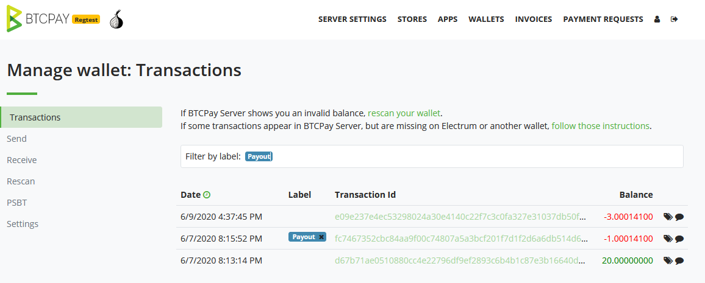

# BTCPay Server Wallet

BTCPay Server has a built in, **full-node reliant wallet** that allows for easy funds management.

Each [store](./CreateStore.md)'s configured cryptocurrency has a separate wallet displayed on the wallets page. A wallet can be accessed by clicking **Wallets** from the top menu. To access a particular wallet, click **Manage**.

## Wallet features

The wallet contains the following features:

1. Transactions
2. Send
3. Receive
4. Rescan
5. Pull payments
6. Payouts
7. PSBT
8. Settings

### Transactions

An overview of the incoming (green), outgoing (red) and unconfirmed (grayed out) **transactions** displayed together with timestamps and balances, sorted by date. You can click on the transaction ID to view the transaction details on the block explorer.

#### Transaction Labels

The table below lists the various **transaction labels used by BTCPay**.  

| Transaction Type  | Description                                                  |
| ----------------- | ------------------------------------------------------------ |
| app               | Payment was received through an app created invoice          |
| invoice           | Payment was received through an invoice                      |
| payjoin           | Not paid, invoice timer still has not expired                | 
| payjoin-exposed   | UTXO was exposed through an invoice payjoin proposal         |
| payment-request   | Payment was received through a payment request               |
| payout            | Payment was sent through a payout or refund                  |

You can also create your own [custom transaction labels and comments](./FAQ/FAQ-Wallet.md#how-to-add-custom-labels-and-comments-to-transactions).

### Send

The Send function allows **spending of the funds from the BTCPay wallet**.

#### Signing a transaction (spending)

To spend the funds, you are required to **sign** the transaction. Transactions can be signed with:

- HD Private key or mnemonic seed
- Wallet supporting PSBT
- Hardware Wallet
- Hot Wallet

##### Signing with HD Private Key or mnemonic seed

If you set up an [existing wallet with your BTCPay Server](./WalletSetup.md#use-an-existing-wallet), you can spend the funds by inputting your private key into an appropriate field. Make sure to set a proper `AccountKeyPath` in Wallet > Settings otherwise you won't be able to spend.

##### Signing with a wallet supporting PSBT

PSBT (**Partially Signed Bitcoin transactions**) are supported and can be signed with PSBT compatible wallets.

Check this tutorial on how to [sign a transaction with ColdCard Hardware Wallet](./ColdCardWallet.md#spending-from-btcpay-server-wallet-with-coldcard-psbt) completely air-gaped.

##### Signing with a hardware wallet

BTCPay Server has built-in hardware wallet support allowing you to **use your hardware wallet with BTCPay**, without leaking information to third-party apps or servers.

[Check instructions](HardwareWalletIntegration.md) on how to set up and sign with a [compatible hardware wallet](https://github.com/bitcoin-core/HWI#device-support).

##### Signing with a hot wallet

If you [created a new wallet](./CreateWallet.md) when setting up your store and enabled it as a [hot wallet](./CreateWallet.md#hot-wallet), you can sign a transaction with a **private key stored on your server**.

:::danger
Using the hot wallet feature comes with its own security implications, please be sure to read and understand them over at the [Hot Wallet documentation](./CreateWallet.md#hot-wallet)
:::

#### Advanced Settings

Certain wallet features are available for advanced users. Toggle the `Advanced Settings` within the `Send` tab to preview them.

##### Don't create UTXO change

This option is available in the `Advanced mode` of the `Send` page.

It is a privacy enhancing feature which is useful when you're sending funds to another wallet of yours or to an exchange. It makes sure that no change UTXO is created by **rounding up** the amount sent.

By default this feature is disabled, so if your wallet has a UTXO of `1.1 BTC` and you input an amount equal to `1.0 BTC`, the resulting transaction will have two outputs `0.1 BTC` of change, and `1.0 BTC` to your destination.

Blockchain analysis will understand that those `0.1 BTC` of change belong to the same entity which controlled `1.1 BTC` before, and can track the future purchase you make under the same pattern.

By enabling this feature, BTCPay Server wallet will round up the amount sent to `1.1 BTC` such that no change output is sent back to you.

Warning: Despite the fact, in this example, that you entered `1.0` in the amount field, the amount that will really be sent to your destination will be `1.1 BTC`.

##### RBF (Replace-By-Fee)

Replace-By-Fee (RBF) is a Bitcoin protocol feature that allows you to replace a previously broadcast transaction (while unconfirmed). This allows randomizing your wallet's transaction fingerprint, or simply for replacing it with a higher fee rate to move the transaction higher in the queue of confirmation (mining) priority. This will effectively replace the original transaction as the higher fee rate will be prioritized and once confirmed, invalidating the original one (double spend). 

Press the `Advanced Settings` button to view the RBF options:

- Option 1 (Enabled by Default): Allow the transaction to be replaced automatically for randomization of transaction fingerprint (increased privacy)
- Option 2: Yes, Allow the transaction to be replaced explicitly (not replaced by default)
- Option 3: No, Do not allow the transaction to be replaced (ignore replacement)

##### Coin Selection

Coin selection is an advanced **privacy-enhancing feature** that allows you to **specifically select coins** that you would like to spend when crafting a transaction. For example, paying with coins that are fresh from a coinjoin mix.

To make the selection easier, coin-selection works natively with the wallet labels feature. This allows you to label any incoming funds for smoother UTXO management and spending.

##### Other features

###### Camera QR scan

Scan option in wallet (camera icon in send screen) lets you **use your device’s camera to scan a QR code containing an address or BIP21 payment link**. It auto-populates the sending information so that you don’t have to manually copy-paste an address and amount.

###### Paste BIP21 address

This option **decodes a BIP21 payment link**. It's useful when you're trying to pay a [Payjoin](./Payjoin.md) invoice.

### Receive

The Receive tab **generates an unused address which can be used to receive payments**. The same can be achieved by generating an invoice (Invoices > Create new invoice).

### Pull Payments

This feature gives you the ability to **create a Pull Payment**, so that an outside individual may request to `pull` funds from your wallet.

For more information, see [Pull Payments](./PullPayments.md).

### Payouts

This section lets you manage Pull Payments and gives you the ability to **accept or decline payouts requested by outside individuals**.

For more information, see [Payouts](./PullPayments.md#approve-and-pay-a-payout).

### Re-scan

The Rescan relies on Bitcoin Core 0.17.0's `scantxoutset` to **scan the current state of the blockchain** (called UTXO Set) for coins belonging to the configured derivation scheme.

Wallet re-scan solves two critical problems for BTCPay users:

1. [Gap limit](./FAQ/FAQ-Wallet.md#missing-payments-in-my-software-or-hardware-wallet)
2. Importing a previously used wallet

**Gap limit**: Most wallets typically have the address gap limit set to 20. This means that if a merchant receives 21 or more consecutive unpaid invoices, those wallets show the incorrect balance and some transactions may not be visible.

**Wallet import**: When users add a derivation scheme of a wallet that had transactions in the past (previously used wallet), BTCPay won't be able to show the balance and transactions from the past.

Re-scan is a feature that solves both of these problems. Once the scan is complete, BTCPay Server will show the correct balance, along with the past transactions of the wallet.

Wallet re-scan requires access to the full node which means that this function is only available for server owners.

Users who use a third-party host should use a newly generated xpub key and also use an external wallet like Electrum which allows them to increase the gap limit.

### PSBT

In the **Partially Signed Bitcoin Transactions** (PSBT) tab, you can upload and decode any PSBT. For example, a signed PSBT from your external wallet can be broadcast via BTCPay Wallet. See [more information on PSBT](./ColdCardWallet.md#spending-from-btcpay-server-wallet-with-coldcard-psbt).

### Settings

In the wallet settings tab you can adjust certain settings. If you've configured your wallet by [creating a new wallet](./CreateWallet.md) or using an existing wallet via the [hardware wallet integration](./HardwareWalletIntegration.md) these settings will be pre-configured.

If you manually added the extended public key from an external wallet, you'd need to adjust `AccountKeyPath` that you can find in your external wallet, for example `m/84'/0'/0'` to be able to spend from the BTCPay Wallet.
