# Connecting Wasabi Wallet to BTCPay Server

This document shows how to **connect [Wasabi Wallet](https://wasabiwallet.io/) to BTCPay Server**.

1. Create a Store in BTCPay Server
2. [Download Wasabi Wallet](https://wasabiwallet.io/#download)
3. [Install Wasabi Wallet](https://docs.wasabiwallet.io/using-wasabi/InstallPackage.html)

## Wasabi Wallet Setup

After installation, open the Wasabi Wallet by clicking on the icon on your desktop.

## Quick Setup

1. Create a new wallet in Wasabi
2. In Wasabi, copy the **Extended Account Public Key** at `Wallet Info`.
3. In BTCPay Server, Store > Settings > Wallet > Setup > Connect an existing wallet > Enter extended public key
4. In Wasabi, generate a new address at `Receive`.
5. Confirm that the addresses in Wasabi and BTCPay Server match.

## Step by Step

At the first launch of Wasabi, the `Add wallet` dialog will be opened automatically.
Select `Create new wallet` to generate a new wallet.

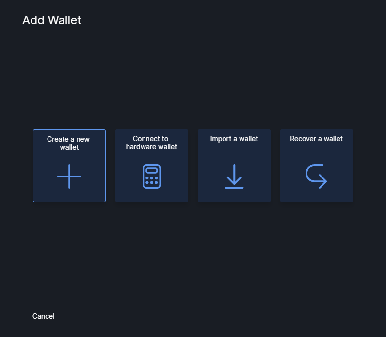

Give your wallet a name, for example `BTCPay Server Wallet`.

Write down the Recovery Words in the correct order.

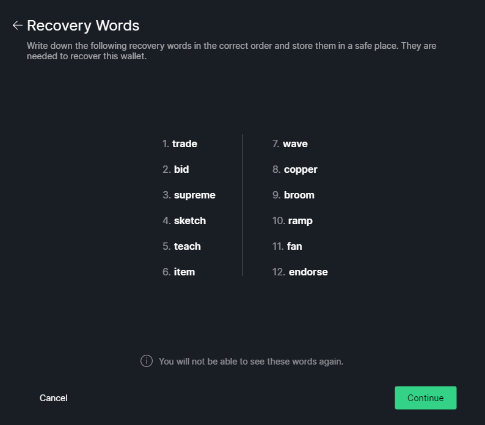

Confirm 3 of the 12 recovery words.
This is a quick test to make sure that you have written them down.

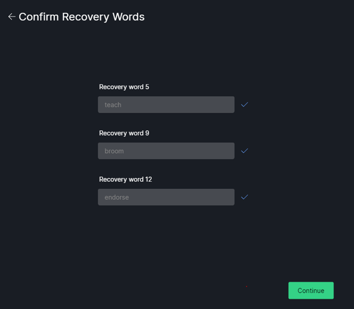

Add a password.
The password is used as a passphrase and it cannot be changed later on.

:::danger Both The Recovery words AND the password are needed to recover this wallet
Make sure to have a backup of the recovery words and the password.
:::

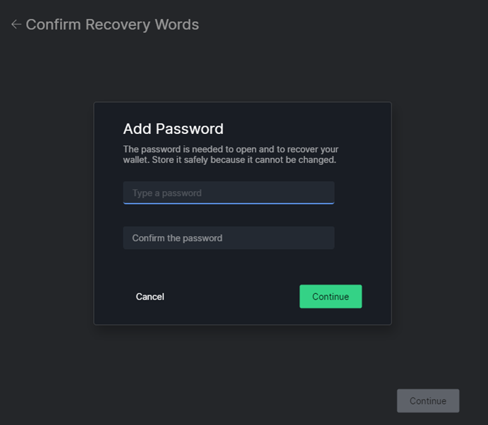

**IMPORTANT NOTE:** Write down your recovery words in the order you see them on the screen. Write them down a piece of paper and store them somewhere secure. Take your time and triple-check each word. Do not store your seed in a digital format (photograph, text document). Whoever has access to your seed and your password can access your funds. Make sure you have a proper backup of the Recovery Words and the Password.

Select a Coinjoin Strategy.
Wasabi automatically coinjoins all your funds.
If you don't want to coinjoin your funds, you can disable coinjoin later by disabling `Automatically start coinjoin` in the Coinjoin Settings.
For more info about coinjoins and the related settings, please refer to the [Wasabi Documentation](https://docs.wasabiwallet.io/).

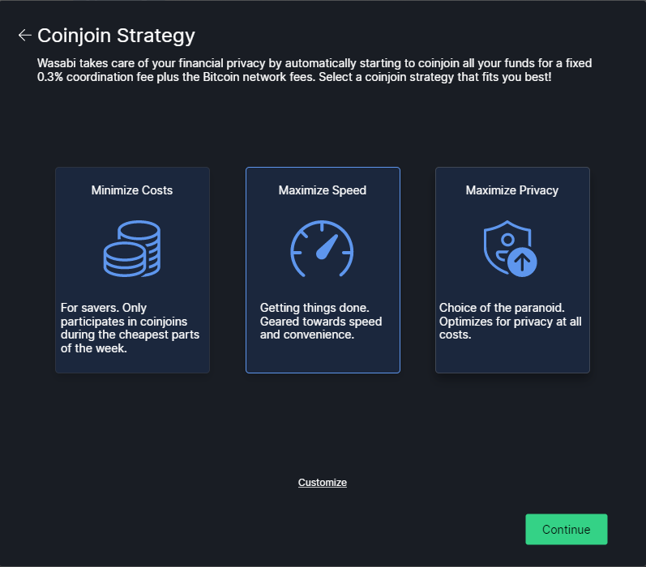

The wallet has been successfully created!

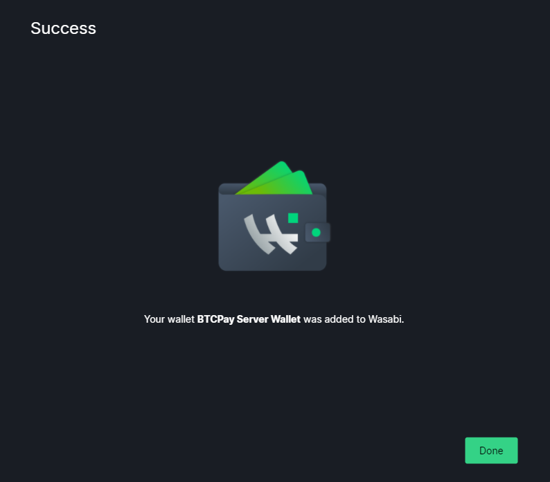

Open the new wallet by entering the password.

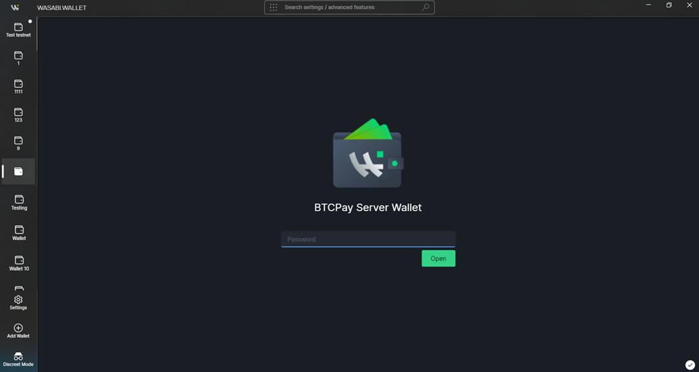

The wallet will load (it might take some time).
After the loading is done and the wallet is opened, click on the 3 dots at the top right corner to go to `Wallet Info` .

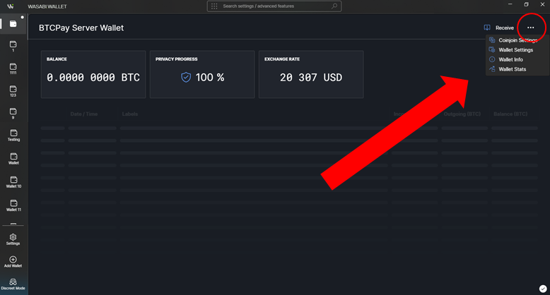

Select and **copy** the `Extended Account Public Key`. This is the **public** key from which BTCPay will derive addresses. This cannot be used to derive private keys and spend the bitcoin.

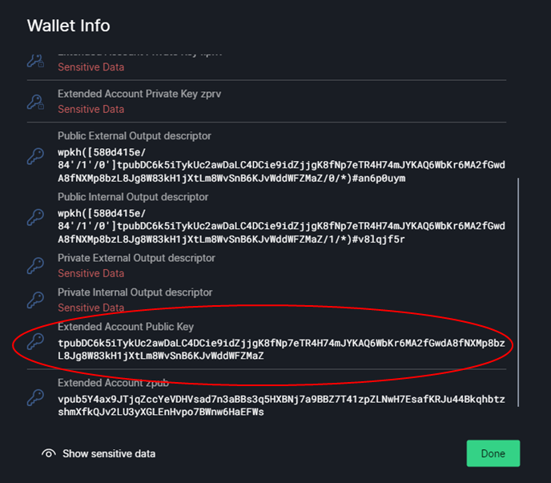

## Setup store wallet

1. Assuming you created a store and are now in the Dashboard. Click on `Set up a wallet`

2. As you did the above steps in wasabi, Click `Connect an existing wallet`

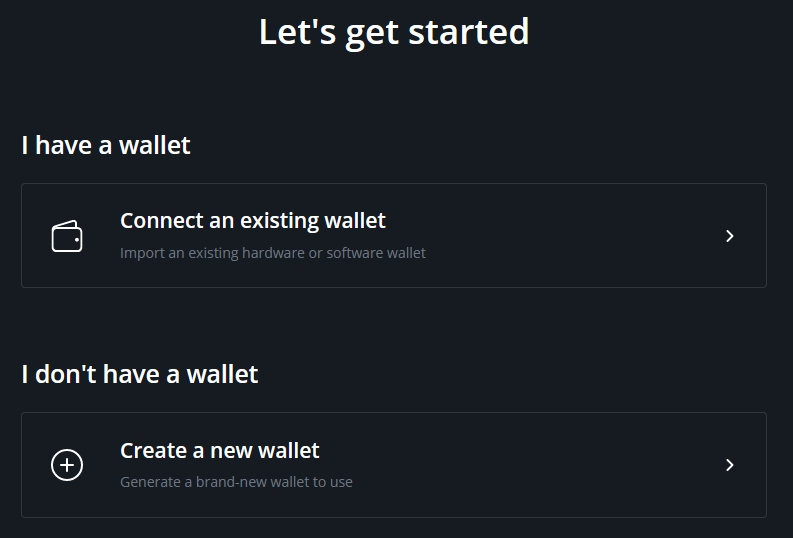

3. Choose `Enter extended public key`

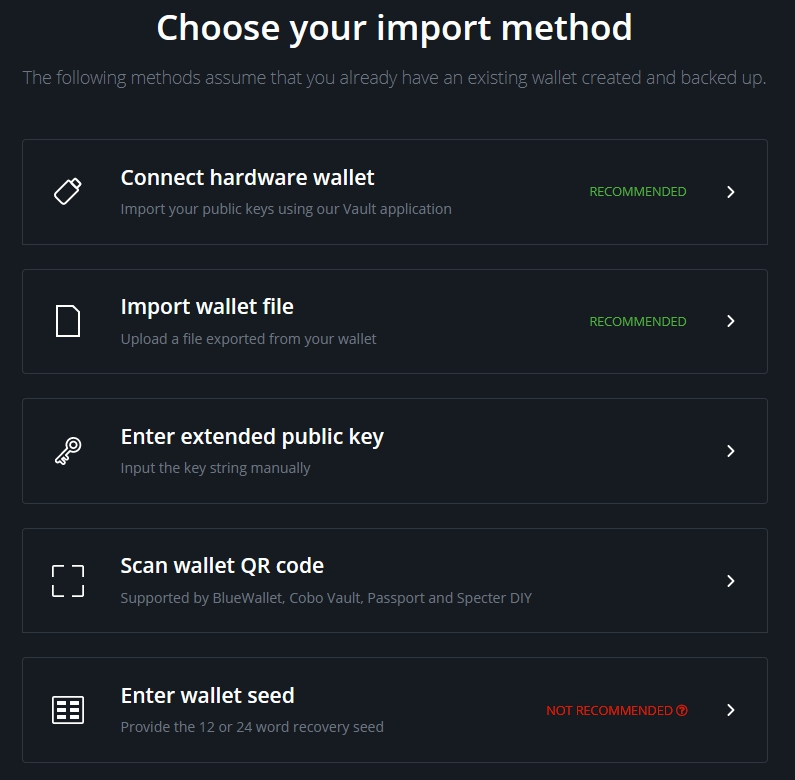

4. Paste the `Extended Account Public Key` into derivation scheme field as it is, without adding anything else and click `Continue`

5. Return to the Wasabi Wallet. Click the `Receive` button and generate a new address.

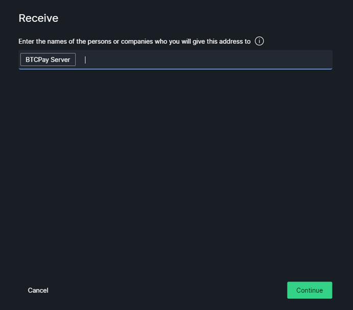

6. Compare the address you see in Wasabi Wallet to addresses shown in BTCPay Server. Find a match, `continue`.

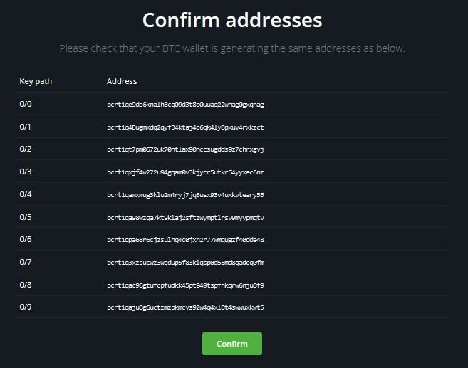

7. When you found a match, your wallet is now connected to the store.

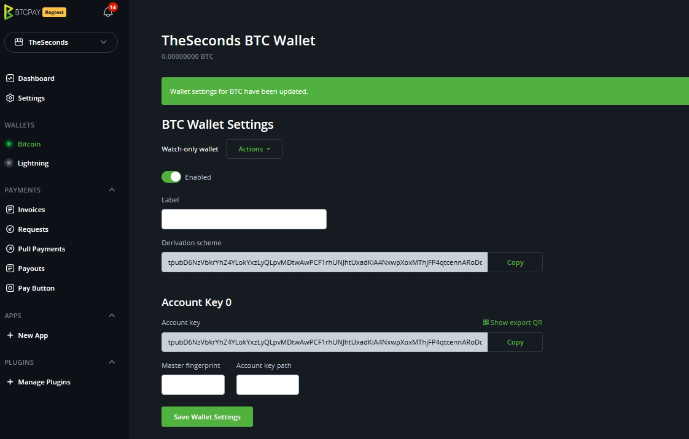

### Connecting Wasabi to BTCPay Server Full Node (If you're self-hosting BTCPay)

After the wallets are connected, it is highly recommended to **connect Wasabi Wallet to your full node in BTCPay**. The process is easy but can only be done if you self-host BTCPay and are logged in as `Admin`. Tor has to be enabled in BTCPay (it is enabled by default). This process enhances privacy even further.

In BTCPay, go Server Settings > Services > **Full node P2P > See Information**.
On the BTCP-P2P page, click on the `Show Confidential QR Code`. Bellow the QR Code, there's a link `See QR Code information by clicking here`, so click on the link to reveal your string. Copy the string but remove `bitcoin-p2p://` part.

In Wasabi, go to the Bitcoin tab at `Settings` and paste the endpoint in `Bitcoin P2P Endpoint`.

Restart Wasabi to apply the changes.

### Configuring the Gap Limit in Wasabi

At the search bar on top, click on `Wallet Folder`. Shortly the `json` file will be shown in a sub-folder. Open that file with a text editor like notepad.
Find the line `"MinGapLimit": 21,` and change it to `"MinGapLimit": 100,` and save the file.

There's no good answer to how much you should set the gap limit to. Most merchants set 100-200. If you're a big merchant with high transaction volume, you can try with even a higher gap limit.

For more details about the [Gap Limit, check the FAQ](./FAQ/Wallet.md#missing-payments-in-my-software-or-hardware-wallet).

**Wasabi Wallet and BTCPay Server are now connected**. Any payments received to your BTCPay will be visible in Wasabi, where you can further spend or mix them.
